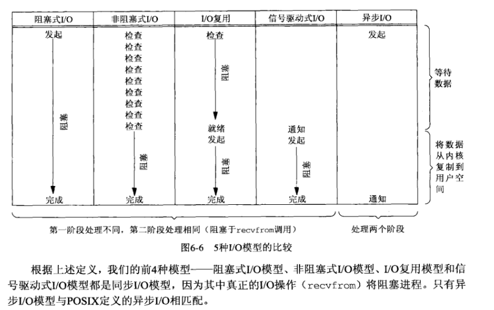
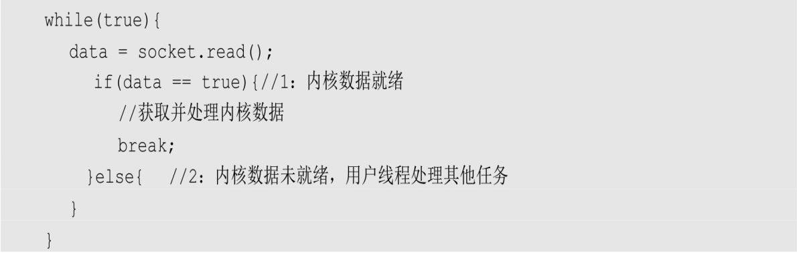
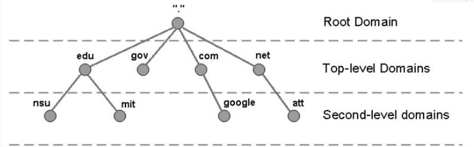
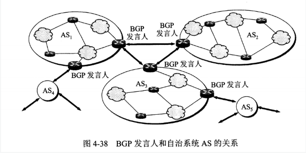
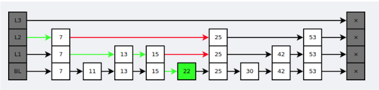
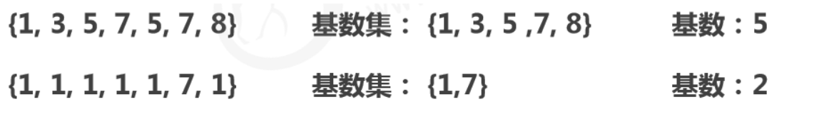

作者：冠状病毒biss
链接：https://www.nowcoder.com/discuss/447742?type=5&channel=666&source_id=discuss_terminal_discuss_jinghua
来源：牛客网


## Java 基础 40

### 语言特性

#### Q1：Java 语言的优点？

① 平台无关性，摆脱硬件束缚，"一次编写，到处运行"。

② 相对安全的内存管理和访问机制，避免大部分内存泄漏和指针越界。

③ 热点代码检测和运行时编译及优化，使程序随运行时间增长获得更高性能。

④ 完善的应用程序接口，支持第三方类库。

------

#### Q2：Java 如何实现平台无关？

**JVM：** Java 编译器可生成与计算机体系结构无关的字节码指令，字节码文件不仅可以轻易地在任何机器上解释执行，还可以动态地转换成本地机器代码，转换是由 JVM 实现的，JVM 是平台相关的，屏蔽了不同操作系统的差异。

**语言规范：** 基本数据类型大小有明确规定，例如 int 永远为 32 位，而 C/C++ 中可能是 16 位、32 位，也可能是编译器开发商指定的其他大小。Java 中数值类型有固定字节数，二进制数据以固定格式存储和传输，字符串采用标准的 Unicode 格式存储。

------

#### Q3：JDK 和 JRE 的区别？

**JDK：** Java Development Kit，开发工具包。提供了编译运行 Java 程序的各种工具，包括编译器、JRE 及常用类库，是 JAVA 核心。

**JRE：** Java Runtime Environment，运行时环境，运行 Java 程序的必要环境，包括 JVM、核心类库、核心配置工具。

------

#### Q4：Java 按值调用还是引用调用？

**按值调用**指方法接收调用者提供的值，**按引用调用**指方法接收调用者提供的变量地址。

Java 总是按值调用，方法得到的是所有参数值的副本，传递对象时实际上方法接收的是对象引用的副本。方法不能修改基本数据类型的参数，如果传递了一个 int 值 ，改变值不会影响实参，因为改变的是值的一个副本。

可以改变对象参数的状态，但不能让对象参数引用一个新的对象。如果传递了一个 int 数组，改变数组的内容会影响实参，而改变这个参数的引用并不会让实参引用新的数组对象。

------

#### Q5：浅拷贝和深拷贝的区别？

**浅拷贝：** 只复制当前对象的基本数据类型及引用变量，没有复制引用变量指向的实际对象。修改克隆对象可能影响原对象，不安全。

**深拷贝：** 完全拷贝基本数据类型和引用数据类型，安全。

------

#### Q6：什么是反射？

在**运行状态中**，对于任意一个类都能知道它的所有属性和方法，对于任意一个对象都能调用它的任意方法和属性，这种**动态获取信息及调用对象方法的功能称为反射**。缺点是破坏了封装性以及泛型约束。反射是框架的核心，Spring 大量使用反射。

------

#### Q7：Class 类的作用？如何获取一个 Class 对象？

在程序运行期间，Java 运行时系统为所有对象维护一个运行时类型标识，这个信息会跟踪每个对象所属的类，虚拟机利用运行时类型信息选择要执行的正确方法，保存这些信息的类就是 Class，这是一个泛型类。

获取 Class 对象：①  `类名.class` 。②对象的 `getClass`方法。③ `Class.forName(类的全限定名)`。

------

#### Q8：什么是注解？什么是元注解？

**注解**是一种标记，使类或接口附加额外信息，帮助编译器和 JVM 完成一些特定功能，例如 `@Override` 标识一个方法是重写方法。

**元注解**是自定义注解的注解，例如：

`@Target`：约束作用位置，值是 ElementType 枚举常量，包括 METHOD 方法、VARIABLE 变量、TYPE 类/接口、PARAMETER 方法参数、CONSTRUCTORS 构造方法和 LOACL_VARIABLE 局部变量等。

`@Rentention`：约束生命周期，值是 RetentionPolicy 枚举常量，包括 SOURCE 源码、CLASS 字节码和 RUNTIME 运行时。

`@Documented`：表明这个注解应该被 javadoc 记录。

------

#### Q9：什么是泛型，有什么作用？

**泛型**本质是**参数化类型**，解决不确定对象具体类型的问题。java泛型是通过擦除实现的，**类定义中的类型参数如T会被替换为Object**，在程序运行的过程中，不知道泛型的实际参数类型，比如Pair<Integer>，运行中只知道Pair，而不知道Integer。

泛型的好处：① 类型安全，放置什么出来就是什么，不存在 ClassCastException。② 提升可读性，编码阶段就显式知道泛型集合、泛型方法等处理的对象类型。③ 代码重用，合并了同类型的处理代码。

#### Q10：泛型擦除是什么？

泛型**用于编译阶段**，编译后的字节码文件不包含泛型类型信息，因为虚拟机没有泛型类型对象，所有对象都属于普通类。例如定义 List<Object> 或 List<String> ，在编译后都会变成 List 。

**定义一个泛型类型**，会自动提供一个对应原始类型，类型变量会被擦除。如果没有限定类型就会替换为
Object，如果有限定类型就会替换为第一个限定类型，例如 <T extends A & B> 会使用 A 类型替换
T。

------

#### Q11：JDK8 新特性有哪些？

**lambda 表达式：**允许把函数作为参数传递到方法，简化匿名内部类代码。

**函数式接口：**使用 `@FunctionalInterface` 标识，有且仅有一个抽象方法，可被隐式转换为 lambda 表达式。

**方法引用：**可以引用已有类或对象的方法和构造方法，进一步简化 lambda 表达式。

**接口：**接口可以定义 `default` 修饰的默认方法，降低了接口升级的复杂性，还可以定义静态方法。

**注解：**引入重复注解机制，相同注解在同地方可以声明多次。注解作用范围也进行了扩展，可作用于局部变量、泛型、方法异常等。

**类型推测：**加强了类型推测机制，使代码更加简洁。

**Optional 类：**处理空指针异常，提高代码可读性。

**Stream 类：**引入函数式编程风格，提供了很多功能，使代码更加简洁。方法包括 `forEach` 遍历、`count` 统计个数、`filter` 按条件过滤、`limit` 取前 n 个元素、`skip` 跳过前 n 个元素、`map` 映射加工、`concat` 合并 stream 流等。

**日期：**增强了日期和时间 API，新的 java.time 包主要包含了处理日期、时间、日期/时间、时区、时刻和时钟等操作。

**JavaScript：**提供了一个新的 JavaScript 引擎，允许在 JVM上运行特定 JavaScript 应用。

------

#### Q12：异常有哪些分类？

所有异常都是 Throwable 的子类，分为 Error 和 Exception。

**Error** 是 Java 运行时系统的内部错误和资源耗尽错误，例如 StackOverFlowError 和 OutOfMemoryError，这种异常程序无法处理。

**Exception** 分为受检异常和非受检异常，受检异常需要在代码中显式处理，否则会编译出错，非受检异常是运行时异常，继承自 RuntimeException。

**受检异常**：① 无能为力型，如字段超长导致的 SQLException。② 力所能及型，如未授权异常 UnAuthorizedException，程序可跳转权限申请页面。常见受检异常还有 FileNotFoundException、ClassNotFoundException、IOException等。

**非受检异常**：① 可预测异常，例如 IndexOutOfBoundsException、NullPointerException、ClassCastException 等，这类异常应该提前处理。② 需捕捉异常，例如进行 RPC 调用时的远程服务超时，这类异常客户端必须显式处理。③ 可透出异常，指框架或系统产生的且会自行处理的异常，例如 Spring 的 NoSuchRequestHandingMethodException，Spring 会自动完成异常处理，将异常自动映射到合适的状态码。

------

### 数据类型 5

#### Q1：Java 有哪些基本数据类型？

| 数据类型 | 内存大小                               | 默认值   | 取值范围                    |
| -------- | -------------------------------------- | -------- | --------------------------- |
| byte     | 1 B                                    | (byte)0  | -128 ~ 127                  |
| short    | 2 B                                    | (short)0 | -2^15^ ~ 2^15^-1            |
| int      | 4 B                                    | 0        | -2^31^ ~ 2^31^-1            |
| long     | 8 B                                    | 0L       | -2^63^ ~ 2^63^-1            |
| float    | 4 B                                    | 0.0F     | ±3.4E+38（有效位数 6~7 位） |
| double   | 8 B                                    | 0.0D     | ±1.7E+308（有效位数 15 位） |
| char     | 英文 1B，中文 UTF-8 占 3B，GBK 占 2B。 | '\u0000' | '\u0000' ~ '\uFFFF'         |
| boolean  | 单个变量 4B / 数组 1B                  | false    | true、false                 |

JVM 没有 boolean 赋值的专用字节码指令，`boolean f = false` 就是使用 ICONST_0 即常数 0 赋值。单个 boolean 变量用 int 代替，boolean 数组会编码成 byte 数组。

------

#### Q2：自动装箱/拆箱是什么？

每个基本数据类型都对应一个包装类，除了 int 和 char 对应 Integer 和 Character 外，其余基本数据类型的包装类都是首字母大写即可。

**自动装箱：** 将基本数据类型包装为一个包装类对象，例如向一个泛型为 Integer 的集合添加 int 元素。

**自动拆箱：** 将一个包装类对象转换为一个基本数据类型，例如将一个包装类对象赋值给一个基本数据类型的变量。

比较两个包装类数值要用 `equals` ，而不能用 `==` 。

------

#### Q3：String 是不可变类为什么值可以修改？

String 类和其存储数据的成员变量 value 字节数组都是 final 修饰的。对一个 String 对象的任何修改实际上**都是创建一个新 String 对象，再引用该对象。**只是修改 String 变量引用的对象，没有修改原 String 对象的内容。

------

#### Q4：字符串拼接的方式有哪些？

① 直接用 `+` ，底层用 StringBuilder 实现。只适用小数量，如果在循环中使用 `+` 拼接，相当于不断创建新的 StringBuilder 对象再转换成 String 对象，效率极差。

② 使用 String 的 concat 方法，该方法中使用 `Arrays.copyOf` 创建一个新的字符数组 buf 并将当前字符串 value 数组的值拷贝到 buf 中，buf 长度 = 当前字符串长度 + 拼接字符串长度。之后调用 `getChars` 方法使用 `System.arraycopy` 将拼接字符串的值也拷贝到 buf 数组，最后用 buf 作为构造参数 new 一个新的 String 对象返回。效率稍高于直接使用 `+`。

③ 使用 StringBuilder 或 StringBuffer，两者的 `append` 方法都继承自 AbstractStringBuilder，该方法首先使用 `Arrays.copyOf`  确定新的字符数组容量，再调用 `getChars` 方法使用 `System.arraycopy` 将新的值追加到数组中。StringBuilder 是 JDK5 引入的，效率高但线程不安全。StringBuffer 使用 synchronized 保证线程安全。

------

#### Q5：String a = "a" + new String("b")  创建了几个对象？

常量和常量拼接仍是常量，结果在常量池，只要有变量参与拼接结果就是变量，存在堆。

使用字面量时只创建一个常量池中的常量，使用 new 时如果常量池中没有该值就会在常量池中新创建，再在堆中创建一个对象引用常量池中常量。因此 `String a = "a" + new String("b")` 会创建四个对象，常量池中的 a 和 b，堆中的 b 和堆中的 ab。

------

### 关键字

#### final

**1. 数据** 

声明数据为常量，可以是编译时常量，也可以是在运行时被初始化后不能被改变的常量。

- 对于基本类型，final 使数值不变；
- 对于引用类型，final 使引用不变，也就不能引用其它对象，**但是被引用的对象本身是可以修改的。**

```java
final int x = 1;
// x = 2;  // cannot assign value to final variable 'x'
final A y = new A();
y.a = 1;
```

**2. 方法** 

声明方法不能被子类重写。

private 方法隐式地被指定为 final，如果在子类中定义的方法和基类中的一个 private 方法签名相同，此时子类的方法不是重写基类方法，而是在子类中定义了一个新的方法。

**3. 类** 

声明类不允许被继承。

#### static

**1. 静态变量** 

- 静态变量：又称为类变量，也就是说这个变量属于类的，类所有的实例都共享静态变量，可以直接通过类名来访问它。静态变量在内存中只存在一份。
- 实例变量：每创建一个实例就会产生一个实例变量，它与该实例同生共死。

```java
public class A {

    private int x;         // 实例变量
    private static int y;  // 静态变量

    public static void main(String[] args) {
        // int x = A.x;  // Non-static field 'x' cannot be referenced from a static context
        A a = new A();
        int x = a.x;
        int y = A.y;
    }
}
```

**2. 静态方法** 

静态方法在类加载的时候就存在了，它不依赖于任何实例。所以静态方法必须有实现，也就是说它不能是抽象方法。

```java
public abstract class A {
    public static void func1(){
    }
    // public abstract static void func2();  // Illegal combination of modifiers: 'abstract' and 'static'
}
```

只能访问所属类的静态字段和静态方法，方法中不能有 this 和 super 关键字。

```java
public class A {

    private static int x;
    private int y;

    public static void func1(){
        int a = x;
        // int b = y;  // Non-static field 'y' cannot be referenced from a static context
        // int b = this.y;     // 'A.this' cannot be referenced from a static context
    }
}
```

**3. 静态语句块** 

静态语句块在类初始化时运行一次。

```java
public class A {
    static {
        System.out.println("123");
    }

    public static void main(String[] args) {
        A a1 = new A();
        A a2 = new A();
    }
}
```

```html
123
```

#### 乐观锁悲观锁

**乐观锁**

乐观锁采用乐观的思想处理数据，在每次读取数据时都认为别人不会修改该数据，所以不会上锁，但在更新时会判断在此期间别人有没有更新该数据，通常采用在写时先读出当前版本号然后加锁的方法。具体过程为：比较当前版本号与上一次的版本号，如果版本号一致，则更新，如果版本号不一致，则重复进行读、比较、写操作。

Java中的乐观锁大部分是通过CAS（Compare And Swap，比较和交换）操作实现的，CAS是一种原子更新操作，在对数据操作之前首先会比较当前值跟传入的值是否一样，如果一样则更新，否则不执行更新操作，直接返
回失败状态。

 **悲观锁**

悲观锁采用悲观思想处理数据，在每次读取数据时都认为别人会修改数据，所以每次在读写数据时都会上锁，这样别人想读写这个数据时就会阻塞、等待直到拿到锁。

Java中的悲观锁大部分基于AQS（Abstract Queued Synchronized，抽象的队列同步器）架构实现。AQS定义了一套多线程访问共享资源的同步框架 ， 许 多 同 步 类 的 实 现 都 依 赖 于 它 ， 例 如 常 用 的 Synchronized 、
ReentrantLock、Semaphore、CountDownLatch等。该框架下的锁会先尝试以 CAS 乐 观 锁 去 获 取 锁 ， 如 果 获 取 不 到 ， 则 会 转 为 悲 观 锁 （ 如ReentrantLock）。

### 面向对象 10

#### Q1：谈一谈你对面向对象的理解

面向过程让计算机有步骤地顺序做一件事，是过程化思维，使用面向过程语言开发大型项目，软件复用和维护存在很大问题，模块之间耦合严重。面向对象相对面向过程更适合解决规模较大的问题，可以拆解问题复杂度，对现实事物进行抽象并映射为开发对象，更接近人的思维。

面向过程代码松散，强调流程化解决问题。面向对象代码强调高内聚、低耦合，先抽象模型定义共性行为，再解决实际问题。

------

#### Q2：面向对象的三大特性？

**封装**是对象功能内聚的表现形式，在抽象基础上决定信息是否公开及公开等级，核心问题是以什么方式暴漏哪些信息。主要任务是对属性、数据、敏感行为实现隐藏，对属性的访问和修改必须通过公共接口实现。封装使对象关系变得简单，降低了代码耦合度，方便维护。

迪米特原则就是对封装的要求，即 A 模块使用 B 模块的某接口行为，对 B 模块中除此行为外的其他信息知道得应尽可能少。不直接对 public 属性进行读取和修改而使用 getter/setter 方法是因为假设想在修改属性时进行权限控制、日志记录等操作，在直接访问属性的情况下无法实现。如果将 public 的属性和行为修改为 private 一般依赖模块都会报错，因此不知道使用哪种权限时应优先使用 private。

**继承**用来扩展一个类，子类可继承父类的部分属性和行为使模块具有复用性。继承是"is-a"关系，可使用里氏替换原则判断是否满足"is-a"关系，即任何父类出现的地方子类都可以出现。如果父类引用直接使用子类引用来代替且可以正确编译并执行，输出结果符合子类场景预期，那么说明两个类符合里氏替换原则。

**多态**以封装和继承为基础，根据运行时对象实际类型使同一行为具有不同表现形式。**多态指在编译层面无法确定最终调用的方法体，在运行期由 JVM 动态绑定**，调用合适的重写方法。由于重载属于静态绑定，本质上重载结果是完全不同的方法，因此**多态一般专指重写。**

------

#### Q3：重载和重写的区别？

**重载**指方法名称相同，但参数类型个数不同，**是行为水平方向不同实现**。对编译器来说，方法名称和参数列表组成了一个唯一键，称为方法签名，JVM 通过方法签名决定调用哪种重载方法。不管继承关系如何复杂，**重载在编译时可以根据规则知道调用哪种目标方法，因此属于静态绑定。**

JVM 在重载方法中选择合适方法的顺序：① 精确匹配。② 基本数据类型自动转换成更大表示范围。③ 自动拆箱与装箱。④ 子类向上转型。⑤ 可变参数。

**重写**指子类实现接口或继承父类时，保持方法签名完全相同，实现不同方法体，**是行为垂直方向不同实现。**

**元空间有一个方法表保存方法信息，如果子类重写了父类的方法，则方法表中的方法引用会指向子类实现。**父类引用执行子类方法时无法调用子类存在而父类不存在的方法。

重写方法访问权限不能变小，返回类型和抛出的异常类型不能变大，必须加 `@Override` 。

------

#### Q4：类之间有哪些关系？

| 类关系 | 描述                           | 权力强侧 | 举例                             |
| ------ | ------------------------------ | -------- | -------------------------------- |
| 继承   | 父子类之间的关系：is-a         | 父类     | 小狗继承于动物                   |
| 实现   | 接口和实现类之间的关系：can-do | 接口     | 小狗实现了狗叫接口               |
| 组合   | 比聚合更强的关系：contains-a   | 整体     | 头是身体的一部分                 |
| 聚合   | 暂时组装的关系：has-a          | 组装方   | 小狗和绳子是暂时的聚合关系       |
| 依赖   | 一个类用到另一个：depends-a    | 被依赖方 | 人养小狗，人依赖于小狗           |
| 关联   | 平等的使用关系：links-a        | 平等     | 人使用卡消费，卡可以提取人的信息 |

------

#### Q5：Object 类有哪些方法？

**equals：**检测对象是否相等，默认使用 `==` 比较对象引用，可以重写 equals 方法自定义比较规则。equals 方法规范：自反性、对称性、传递性、一致性、对于任何非空引用 x，`x.equals(null)`  返回 false。

**hashCode：**散列码是由对象导出的一个整型值，没有规律，每个对象都有默认散列码，值由对象存储地址得出。字符串散列码由内容导出，值可能相同。为了在集合中正确使用，一般需要同时重写 equals 和 hashCode，要求 equals 相同 hashCode 必须相同，hashCode 相同 equals 未必相同，因此 hashCode 是对象相等的必要不充分条件。

**toString**：打印对象时默认的方法，如果没有重写打印的是表示对象值的一个字符串。

**clone：**clone 方法声明为 protected，类只能通过该方法克隆它自己的对象，如果希望其他类也能调用该方法必须定义该方法为 public。如果一个对象的类没有实现 Cloneable 接口，该对象调用 clone 方法抛出一个 CloneNotSupport 异常。默认的 clone 方法是浅拷贝，一般重写 clone 方法需要实现 Cloneable 接口并指定访问修饰符为 public。

**finalize：**确定一个对象死亡至少要经过两次标记，如果对象在可达性分析后发现没有与 GC Roots 连接的引用链会被第一次标记，随后进行一次筛选，条件是对象是否有必要执行 finalize 方法。假如对象没有重写该方法或方法已被虚拟机调用，都视为没有必要执行。如果有必要执行，对象会被放置在 F-Queue 队列，由一条低调度优先级的 Finalizer 线程去执行。虚拟机会触发该方法但不保证会结束，这是为了防止某个对象的 finalize 方法执行缓慢或发生死循环。只要对象在 finalize 方法中重新与引用链上的对象建立关联就会在第二次标记时被移出回收集合。由于运行代价高昂且无法保证调用顺序，在 JDK 9 被标记为过时方法，并不适合释放资源。

**getClass：**返回包含对象信息的类对象。

**wait / notify / notifyAll：**阻塞或唤醒持有该对象锁的线程。

------

#### Q6：内部类的作用是什么，有哪些分类？

内部类可对同一包中其他类隐藏，内部类方法可以访问定义这个内部类的作用域中的数据，包括 private 数据。

内部类是一个编译器现象，与虚拟机无关。编译器会把内部类转换成常规的类文件，用 $ 分隔外部类名与内部类名，其中匿名内部类使用数字编号，虚拟机对此一无所知。

**静态内部类：** 属于外部类，只加载一次。作用域仅在包内，可通过 `外部类名.内部类名` 直接访问，类内只能访问外部类所有静态属性和方法。HashMap 的 Node 节点，ReentrantLock 中的 Sync 类，ArrayList 的 SubList 都是静态内部类。内部类中还可以定义内部类，如 ThreadLoacl 静态内部类 ThreadLoaclMap 中定义了内部类 Entry。

**成员内部类：** 属于外部类的每个对象，随对象一起加载。不可以定义静态成员和方法，可访问外部类的所有内容。

**局部内部类：** 定义在方法内，不能声明访问修饰符，只能定义实例成员变量和实例方法，作用范围仅在声明类的代码块中。

**匿名内部类：** 只用一次的没有名字的类，可以简化代码，创建的对象类型相当于 new 的类的子类类型。用于实现事件监听和其他回调。

------

#### Q7：访问权限控制符有哪些？

| 访问权限控制符 | 本类 | 包内 | 包外子类 | 任何地方 |
| -------------- | ---- | ---- | -------- | -------- |
| public         | √    | √    | √        | √        |
| protected      | √    | √    | √        | ×        |
| 无             | √    | √    | ×        | ×        |
| private        | √    | ×    | ×        | ×        |

------

#### Q8：接口和抽象类的异同？

接口和抽象类对实体类进行更高层次的抽象，仅定义公共行为和特征。

| 语法维度 | 抽象类                 | 接口                                                         |
| -------- | ---------------------- | ------------------------------------------------------------ |
| 成员变量 | 无特殊要求             | 默认 public static final 常量                                |
| 构造方法 | 有构造方法，不能实例化 | 没有构造方法，不能实例化                                     |
| 方法     | 抽象类可以没有抽象方法 | 默认 public abstract，JDK8 支持默认/静态方法，JDK9 支持私有方法。 |
| 继承     | 单继承                 | 多继承                                                       |

抽象类是 is-a 关系，接口是 can-do 关系。与接口相比，抽象类通常是对同类事物相对具体的抽象。

抽象类是模板式设计，包含一组具体特征，例如汽车的底盘、控制电路等是抽象出来的共同特征，但内饰、显示屏、座椅可以根据不同级别配置存在不同实现。

接口是契约式设计，是开放的，定义了方法名、参数、返回值、抛出的异常类型，谁都可以实现它，但必须遵守约定。例如所有车辆都必须实现刹车这种强制规范。

接口是顶级类，抽象类在接口下面的第二层，对接口进行组合，然后实现部分接口。当纠结定义接口和抽象类时，推荐定义为接口，遵循接口隔离原则，按维度划分成多个接口，再利用抽象类去实现，方便扩展和重构。

#### Q9：接口和抽象类应该怎么选择？

抽象类体现 is-a 关系，接口体现 can-do 关系。与接口相比，抽象类通常是对同类事物相对具体的抽象。

**抽象类是模板式设计**，包含一组具体特征，例如某汽车，底盘、控制电路等是抽象出来的共同特征，但内饰、显示屏、座椅材质可以根据不同级别配置存在不同实现。

接口是契约式设计，是开放的，定义了方法名、参数、返回值、抛出的异常类型，谁都可以实现它，但必须遵守接口的约定。例如所有车辆都必须实现刹车这种强制规范。

接口是顶级类，抽象类在接口下面的第二层，对接口进行了组合，然后实现部分接口。当纠结定义接口和抽象类时，推荐定义为接口，遵循接口隔离原则，按维度划分成多个接口，再利用抽象类去实现这些，方便后续的扩展和重构。

例如 Plane 和 Bird 都有 fly 方法，应把 fly 定义为接口，而不是抽象类的抽象方法再继承，因为除了 fly 行为外 Plane 和 Bird 间很难再找到其他共同特征。

------

#### Q10：子类初始化的顺序

① 父类静态代码块和静态变量。② 子类静态代码块和静态变量。③ 父类普通代码块和普通变量。④ 父类构造方法。⑤ 子类普通代码块和普通变量。⑥ 子类构造方法。

------

### 集合 7

#### Q1：说一说 ArrayList

**ArrayList** 是容量可变的非线程安全列表，使用数组实现，集合扩容时会创建更大的数组，把原有数组复制到新数组。支持对元素的快速随机访问，但插入与删除速度很慢。ArrayList 实现了 RandomAcess 标记接口，**如果一个类实现了该接口，那么表示使用索引遍历比迭代器更快。**

**elementData**是 ArrayList 的数据域（是一个数组），被 transient 修饰，序列化时会调用 writeObject 写入流，反序列化时调用 readObject 重新赋值到新对象的 elementData。原因是 elementData 容量通常大于实际存储元素的数量，所以只需发送真正有实际值的数组元素。

**size** 是当前实际大小，elementData 大小大于等于 size。

**modCount **记录了 ArrayList 结构性变化的次数，继承自 AbstractList。所有涉及结构变化的方法都会增加该值。expectedModCount 是迭代器初始化时记录的 modCount 值，每次访问新元素时都会检查 modCount 和 expectedModCount 是否相等，不相等就会抛出异常。这种机制叫做 fail-fast，所有集合类都有这种机制。


注意：关于迭代器，有一种常见的 误用，就是在迭代的中间调用容器的删除方法。比如，要删除一个整数ArrayList中所有小于100的数

```java
public void remove(ArrayList<Integer> list) {
    for(Integer a: list) {
        if(a <= 100) {
            list.remove
        }
    }
}
```

运行时会抛出异常，因为迭代器内部会维护些索引位置相关的数据，要求在迭代过程中，容器不能发生结构性变化，否则这些索引位置就失效了，所谓结构性变化就是添加、插入和删除元素，只是修改元素内容不算结构性变化。可以使用迭代器的remove方法。

------

#### Q2：说一说 LinkedList

**LinkedList** 本质是双向链表，**与 ArrayList 相比插入和删除速度更快，但随机访问元素很慢**。除继承 AbstractList 外还实现了 Deque 接口，这个接口具有队列和栈的性质。成员变量被 transient 修饰，原理和 ArrayList 类似。

包含三个重要的成员：size、first 和 last。size 是双向链表中节点的个数，first 和 last 分别指向首尾节点的引用。

优点：可以将零散的内存单元通过附加引用的方式关联起来，形成按链路顺序查找的线性结构，内存利用率较高。

------

#### Q3：Set 有什么特点，有哪些实现？

**Set** 不允许元素重复且无序，常用实现有 HashSet、LinkedHashSet 和 TreeSet。

**HashSet** 通过 HashMap 实现，HashMap 的 Key 即 HashSet 存储的元素，所有 Key 都使用相同的 Value ，一个名为 PRESENT 的 **Object 类型常量**。使用 Key 保证元素唯一性，但不保证有序性。由于 HashSet 是 HashMap 实现的，因此线程不安全。

HashSet 判断元素是否相同时，对于包装类型直接按值比较。对于引用类型先比较 hashCode 是否相同，不同则代表不是同一个对象，相同则继续比较 equals，都相同才是同一个对象。

**LinkedHashSet** 继承自 HashSet，通过 LinkedHashMap 实现，**使用双向链表维护元素插入顺序。**

**TreeSet** 通过 TreeMap 实现的，添加元素到集合时按照比较规则将其插入合适的位置，保证插入后的集合仍然有序。

------

#### Q4：TreeMap 有什么特点？

TreeMap 基于红黑树实现，增删改查的平均和最差时间复杂度均为 O(log(n)) ，最大特点是 Key 有序。Key 必须实现 Comparable 接口或提供的 Comparator 比较器，所以 Key 不允许为 null。

HashMap 依靠 `hashCode` 和 `equals` 去重，而 TreeMap 依靠 Comparable 或 Comparator。 TreeMap 排序时，如果比较器不为空就会优先使用比较器的 `compare` 方法，否则使用 Key 实现的 Comparable 的 `compareTo` 方法，两者都不满足会抛出异常。

TreeMap 通过 `put` 和 `deleteEntry` 实现增加和删除树节点。插入新节点的规则有三个：① 需要调整的新节点总是红色的。② 如果插入新节点的父节点是黑色的，不需要调整。③ 如果插入新节点的父节点是红色的，由于红黑树不能出现相邻红色，进入循环判断，通过重新着色或左右旋转来调整。

TreeMap 的插入操作就是按照 Key 的对比往下遍历，大于节点值向右查找，小于向左查找，先按照二叉查找树的特性操作，后续会重新着色和旋转，保持红黑树的特性。

------

#### Q5：HashMap 有什么特点？

JDK8 前底层使用数组加链表，JDK8 改为数组加链表/红黑树，节点从 Entry 变为 Node。主要成员变量包括 table 数组、元素数量 size、加载因子 loadFactor。

table 数组记录 HashMap 的数据，每个下标对应一条链表，所有哈希冲突的数据都会被存放到同一条链表，Node/Entry 节点包含四个成员变量：**key、value、next 指针和 hash 值。**

数据以键值对的形式存在，**键对应的 hash 值用来计算数组下标**，如果两个元素 key 的 hash 值一样，就会发生哈希冲突，被放到同一个链表上，为使查询效率尽可能高，键的 hash 值要尽可能分散。

默认初始化容量为 16，扩容容量必须是 2 的幂次方、最大容量为 1<< 30 、默认加载因子为 0.75。

------

#### Q6：HashMap 相关方法的源码？

**JDK8 之前**

**hash：计算元素 key 的散列值**

① 处理 String 类型时，调用 `stringHash32` 方法获取 hash 值。

② 处理其他类型数据时，提供一个相对于 HashMap 实例唯一不变的随机值 hashSeed 作为计算初始量。执行异或和无符号右移使 hash 值更加离散，减小哈希冲突概率。

**indexFor：计算元素下标**

将 hash 值和数组长度-1 进行与操作，保证结果不会超过 table 数组范围。

**get：获取元素的 value 值**

key 为 null，调用 `getForNullKey` 方法：

- size=0 表示链表为空，返回 null。
- size!=0 说明存在链表，遍历 table[0] 链表，如果找到了 key=null 的节点则返回其 value，否则返回 null。

key 不为 null，调用 `getEntry` 方法：

- size=0 表示链表为空，返回 null 值。
- size!=0，首先计算 key 的 hash 值，然后遍历该链表的所有节点，如果节点的 key 和 hash 值都和要查找的元素相同则返回其 Entry 节点。 如果找到了对应的 Entry 节点，调用 `getValue` 方法获取其 value 并返回，否则返回 null。

**put：添加元素**

key 为 null，直接存入 table[0]。

key 不为 null，计算 key 的 hash 值，调用 `indexFor` 计算元素下标 i，遍历 table[i] 链表：

- key 已存在，更新 value 然后返回旧 value。
- key 不存在，将 modCount 加 1，调用 `addEntry` 方法增加一个节点并返回 null。

 ```java
void addEntry(int hash, K key, V value, int bucketIndex) {
    if((size >= threshold) && (null != table[bucketIndex])) {
        resize(2 * table.length);
        hash = (null != key) ?hash(key) : 0;
        bucketIndex = indexFor(hash, table.length);
    }
    createEntry(hash, key, value, bucketIndex);
}
 ```


**resize：扩容数组**

分配一个容量为原来两倍的Entry数组，调用transfer方法将原来的键值对移植过来，然后更新内部的table变量，以及threshold的值。

```java
void resize(int newCapacity)  {
    Entry[] oldTable = table;
    int oldCapacity = oldTable.length;
    Entry[] newTable = new Entry(new Capacity);
    tansfer(new Table,initHashSeedAsNeeded(new Capacity));
    table = new table;
    threshold = (int) Math.min(newCapacity * loadFactor,MAXIMUM_CAPACITY + 1);
}
```


**transfer：转移元素**

① 遍历旧数组的所有元素，调用 `rehash` 方法判断是否需要哈希重构，如果需要就重新计算元素 key 的 hash 值。

② 调用 `indexFor` 方法计算元素存放的下标 i，利用**头插法将旧数组的元素转移到新数组**。

```java
void transfer(Entry[] newTable, boolean rehash) {
    int newCapacity = newTable.length;
    for(Entry<K,V> e : table) {
        while(null != e) {
            Entry<K,V> next =e.next;
            if(rehash) {
                e.hash = null == e.key ?  0 : hash(e.key);
            }
            int i = indexFor(e.hash, new Capacity);
            e.next = newTable[i];
            newTable[i] = e;
            e = next;
        }
    }
}
```


**JDK8**

Java8对HashMap的实现进行了优化，在哈希冲突比较严重的情况下，即大量元素映射到同一个链表的情况下（具体是至少8个元素，且总的键值对个数至少是64），java8会将该链表转化为红黑树，以提高查询的效率。

**hash：计算元素 key 的散列值**

如果 key 为 null 返回 0，否则就将 key 的 `hashCode` 方法返回值高低16位异或，让尽可能多的位参与运算，让结果的 0 和 1 分布更加均匀，降低哈希冲突概率。

**put：添加元素**

调用 `putVal` 方法添加元素：

- 如果 table 为空或不存在元素就进行扩容，否则计算元素下标位置，不存在就调用 `newNode` 创建一个节点。
- 如果存在元素且是链表类型，如果首节点和待插入元素相同，直接更新节点 value。
- 如果首节点是 TreeNode 类型，调用 `putTreeVal` 方法增加一个树节点，每一次都比较插入节点和当前节点的大小，待插入节点小就往左子树查找，否则往右子树查找，找到空位后执行两个方法：`balanceInsert` 方法，插入节点并调整平衡、`moveRootToFront` 方法，由于调整平衡后根节点可能变化，需要重置根节点。
- 如果都不满足，遍历链表，根据 hash 和 key 判断是否重复，决定更新 value 还是新增节点。如果遍历到了链表末尾则添加节点，如果达到建树阈值 7，还需要调用 `treeifyBin` 把链表重构为红黑树。
- 存放元素后将 modCount 加 1，如果 `++size > threshold` ，调用 `resize` 扩容。

**get ：获取元素的 value 值**

调用 `getNode` 方法获取 Node 节点：

- 如果数组不为空且存在元素，先比较第一个节点和要查找元素，如果相同则直接返回。

- 如果第二个节点是 TreeNode 类型则调用 `getTreeNode` 方法进行查找。
- 都不满足，遍历链表根据 hash 和 key 查找，如果没有找到就返回 null。

- 如果节点不是 null 就返回其 value，否则返回 null。 

**resize：扩容数组**

重新规划长度和阈值，如果长度发生了变化，部分数据节点也要重新排列。

**重新规划长度**

① 如果当前容量 `oldCap > 0` 且达到最大容量，将阈值设为 Integer 最大值，return 终止扩容。

② 如果未达到最大容量，当 `oldCap << 1` 不超过最大容量就扩大为 2 倍。

③ 如果都不满足且当前扩容阈值 `oldThr > 0`，使用当前扩容阈值作为新容量。

④ 否则将新容量置为默认初始容量 16，新扩容阈值置为 12。

**重新排列数据节点**

① 如果节点为 null 不进行处理。

② 如果节点不为 null 且没有next节点，那么通过节点的 hash 值和 `新容量-1` 进行与运算计算下标存入新的 table 数组。

③ 如果节点为 TreeNode 类型，调用 `split` 方法处理，如果节点数 hc 达到6 会调用 `untreeify` 方法转回链表。

④ 如果是链表节点，需要将链表拆分为 hash 值超出旧容量的链表和未超出容量的链表。对于`hash & oldCap == 0` 的部分不需要做处理，否则需要放到新的下标位置上，新下标 = 旧下标 + 旧容量。

------

#### Q7：HashMap 为什么线程不安全？

JDK7 存在死循环和数据丢失问题。

**数据丢失：**

- **并发赋值被覆盖：** 在 `createEntry` 方法中，新添加的元素直接**放在头部**，使元素之后可以被更快访问，但如果两个线程同时执行到此处，会导致其中一个线程的**赋值被覆盖**。
- **已遍历区间新增元素丢失：** 当某个线程在 `transfer` 方法迁移时，其他线程新增的元素可能落在已遍历过的哈希槽上。遍历完成后，table 数组引用指向了 newTable，新增元素丢失。
- **新表被覆盖：** 如果 `resize` 完成，执行了 `table = newTable`，则后续元素就可以在新表上进行插入。但如果多线程同时 `resize` ，每个线程都会 new 一个数组，这是线程内的局部对象，线程之间不可见。迁移完成后`resize` 的线程会赋值给 table 线程共享变量，可能会覆盖其他线程的操作，在新表中插入的对象都会被丢弃。

**死循环：** 扩容时 `resize` 调用 `transfer` 使用头插法迁移元素，虽然 newTable 是局部变量，但原先 table 中的 Entry 链表是共享的，问题根源是 Entry 的 next 指针并发修改，某线程还没有将 table 设为 newTable 时用完了 CPU 时间片，导致数据丢失或死循环。

JDK8 在 `resize` 方法中完成扩容，并改用尾插法，不会产生死循环，但并发下仍可能丢失数据。可用 ConcurrentHashMap 或 `Collections.synchronizedMap` 包装成同步集合。

------

### IO 流 6

#### IO多路复用背景

首先，要从你常用的IO操作谈起，比如read和write，通常IO操作都是**阻塞I/O**的，也就是说当你调用read时，如果没有数据收到，那么线程或者进程就会被挂起，直到收到数据。


这样，当服务器需要处理1000个连接的的时候，而且只有很少连接忙碌的，那么会需要1000个线程或进程来处理1000个连接，而1000个线程大部分是被阻塞起来的。由于CPU的核数或超线程数一般都不大，比如4,8,16,32,64,128，比如4个核要跑1000个线程，那么每个线程的时间槽非常短，而线程切换非常频繁。这样是有问题的：

1. 线程是有内存开销的，1个线程可能需要512K（或2M）存放栈，那么1000个线程就要512M（或2G）内存。
2. 线程的切换，或者说上下文切换是有CPU开销的，当大量时间花在上下文切换的时候，分配给真正的操作的CPU就要少很多。

于是，我们需要引入IO多路复用的概念。**多路复用是指使用一个线程来检查多个文件描述符（Socket）的就绪状态**，比如调用select和poll函数，传入多个文件描述符，如果有一个文件描述符就绪，则返回，否则阻塞直到超时。得到就绪状态后进行真正的操作可以在同一个线程里执行，也可以启动线程执行（比如使用线程池）。

这样在处理1000个连接时，只需要1个线程监控就绪状态，对就绪的每个连接开一个线程处理就可以了，这样需要的线程数大大减少，减少了内存开销和上下文切换的CPU开销。

与多进程和多线程技术相比，I/O多路复用技术的最大优势是系统开销小，系统不必创建进程/线程，也不必维护这些进程/线程，从而大大减小了系统的开销。

目前支持I/O多路复用的系统调用有 select，pselect，poll，epoll，I/O多路复用就是通过一种机制，一个进程可以监视多个描述符，一旦某个描述符就绪（一般是读就绪或者写就绪），能够通知程序进行相应的读写操作。但select，pselect，poll，epoll本质上都是同步I/O，**因为他们都需要在读写事件就绪后自己负责进行读写，也就是说这个读写过程是阻塞的，而异步I/O则无需自己负责进行读写，异步I/O的实现会负责把数据从内核拷贝到用户空间。**

#### select

**基本原理：**

select 函数监视的文件描述符分3类，分别是writefds、readfds、和exceptfds。调用后select函数会阻塞，直到有描述符就绪（有数据 可读、可写、或者有except），或者超时（timeout指定等待时间，如果立即返回设为null即可），函数返回。当select函数返回后，可以通过遍历fdset，来找到就绪的描述符。

**基本流程，如图所示：**


select目前几乎在所有的平台上支持，其**良好跨平台支持**也是它的一个优点。select的一个缺点在于单个进程能够监视的文件描述符的数量存在最大限制，在Linux上一般为1024，可以通过修改宏定义甚至重新编译内核的方式提升这一限制，但是这样也会造成效率的降低。

select本质上是通过设置或者检查存放fd标志位的数据结构来进行下一步处理。这样所带来的缺点是：

1. **select最大的缺陷就是单个进程所打开的FD是有一定限制的，它由FD_SETSIZE设置，默认值是1024。**

一般来说这个数目和系统内存关系很大，具体数目可以cat /proc/sys/fs/file-max察看。32位机默认是1024个。64位机默认是2048.

2. 对socket进行扫描时是线性扫描，即采用轮询的方法，效率较低。

当套接字比较多的时候，每次select()都要通过遍历FD_SETSIZE个Socket来完成调度，不管哪个Socket是活跃的，都遍历一遍。这会浪费很多CPU时间。如果能给套接字注册某个回调函数，当他们活跃时，自动完成相关操作，那就避免了轮询，这正是epoll与kqueue做的。

3. 需要维护一个用来存放大量fd的数据结构，这样会使得用户空间和内核空间在传递该结构时复制开销大。

#### poll

**基本原理：**

poll本质上和select没有区别，**它将用户传入的数组拷贝到内核空间**，然后查询每个fd对应的设备状态，如果设备就绪则在设备等待队列中加入一项并继续遍历，如果遍历完所有fd后没有发现就绪设备，则挂起当前进程，直到设备就绪或者主动超时，被唤醒后它又要再次遍历fd。这个过程经历了多次无谓的遍历。

**它没有最大连接数的限制，原因是它是基于链表来存储的，但是同样有一个缺点：**

  1. 大量的fd的数组被整体复制于用户态和内核地址空间之间，而不管这样的复制是不是有意义。
  2. poll还有一个特点是“水平触发”，如果报告了fd后，没有被处理，那么下次poll时会再次报告该fd。

**注意：**

 从上面看，select和poll都需要在返回后，通过遍历文件描述符来获取已经就绪的socket。事实上，同时连接的大量客户端在一时刻可能只有很少的处于就绪状态，因此随着监视的描述符数量的增长，其效率也会线性下降。

#### epoll

  epoll是在2.6内核中提出的，是之前的select和poll的增强版本。相对于select和poll来说，**epoll更加灵活，没有描述符限制。epoll使用一个文件描述符管理多个描述符**，将用户关系的文件描述符的事件存放到内核的一个事件表中，这样在用户空间和内核空间的copy只需一次。

**基本原理：**

 epoll支持水平触发和边缘触发，最大的特点在于边缘触发，它只告诉进程哪些fd刚刚变为就绪态，并且只会通知一次。还有一个特点是，epoll使用“事件”的就绪通知方式，通过epoll_ctl注册fd，一旦该fd就绪，内核就会采用类似callback的回调机制来激活该fd，epoll_wait便可以收到通知。

**epoll的优点：**

  1. 没有最大并发连接的限制，能打开的FD的上限远大于1024（1G的内存上能监听约10万个端口）。
  2. 效率提升，不是轮询的方式，不会随着FD数目的增加效率下降。只有活跃可用的FD才会调用callback函数。即Epoll最大的优点就在于它只管你“活跃”的连接，而跟连接总数无关，因此在实际的网络环境中，Epoll的效率就会远远高于select和poll。
  3. 内存拷贝，利用mmap()文件映射内存加速与内核空间的消息传递；即epoll使用mmap减少复制开销。

**epoll对文件描述符的操作有两种模式：LT（level trigger）和ET（edge trigger）。LT模式是默认模式，LT模式与ET模式的区别如下：**

水平触发模式：当epoll_wait检测到描述符事件发生并将此事件通知应用程序，应用程序**可以不立即处理该事件**。下次调用epoll_wait时，会再次响应应用程序并通知此事件。

 边缘触发模式：当epoll_wait检测到描述符事件发生并将此事件通知应用程序，**应用程序必须立即处理该事件。如果不处理，下次调用epoll_wait时，不会再次响应应用程序并通知此事件。**

1. **水平触发模式**

 LT(level triggered)是缺省的工作方式，并且同时支持block和no-block socket。在这种做法中，内核告诉你一个文件描述符是否就绪了，然后你可以对这个就绪的fd进行IO操作。**如果你不作任何操作，内核还是会继续通知你**。

1. **边缘触发模式**

 ET(edge-triggered)是高速工作方式，只支持no-block socket。在这种模式下，当描述符从未就绪变为就绪时，内核通过epoll告诉你。然后它会假设你知道文件描述符已经就绪，并且不会再为那个文件描述符发送更多的就绪通知，直到你做了某些操作导致那个文件描述符不再为就绪状态了(比如，你在发送，接收或者接收请求，或者发送接收的数据少于一定量时导致了一个EWOULDBLOCK 错误）。但是请注意，如果一直不对这个fd作IO操作(从而导致它再次变成未就绪)，内核不会发送更多的通知(only once)。

 ET模式在很大程度上减少了epoll事件被重复触发的次数，因此效率要比LT模式高。epoll工作在ET模式的时候，必须使用非阻塞套接口，以避免由于一个文件句柄的阻塞读/阻塞写操作把处理多个文件描述符的任务饿死。

**注意：**

 如果没有大量的idle-connection或者dead-connection，epoll的效率并不会比select/poll高很多，但是当遇到大量的idle-connection，就会发现epoll的效率大大高于select/poll。

 select、poll、epoll区别

1. **支持一个进程所能打开的最大连接数**


2. **FD剧增后带来的IO效率问题**


3. **消息传递方式**


**综上，在选择select，poll，epoll时要根据具体的使用场合以及这三种方式的自身特点：**

  1. 表面上看epoll的性能最好，但是在连接数少并且连接都十分活跃的情况下，select和poll的性能可能比epoll好，毕竟epoll的通知机制需要很多函数回调。
  2. select低效是因为每次它都需要轮询。但低效也是相对的，视情况而定，也可通过良好的设计改善。

I/O 与 NIO 最重要的区别是数据打包和传输的方式，I/O 以流的方式处理数据，而 **NIO 以块的方式处理数据。**

#### NIO

**面向流的 I/O 一次处理一个字节数据**：一个输入流产生一个字节数据，一个输出流消费一个字节数据。为流式数据创建过滤器非常容易，链接几个过滤器，以便每个过滤器只负责复杂处理机制的一部分。不利的一面是，面向流的 I/O 通常相当慢。

**面向块的 I/O 一次处理一个数据块**，按块处理数据比按流处理数据要快得多。但是面向块的 I/O 缺少一些面向流的 I/O 所具有的优雅性和简单性。

I/O 包和 NIO 已经很好地集成了，java.io.\* 已经以 NIO 为基础重新实现了，所以现在它可以利用 NIO 的一些特性。例如，java.io.\* 包中的一些类包含以块的形式读写数据的方法，这使得即使在面向流的系统中，处理速度也会更快。

1. **通道**

通道 Channel 是对原 I/O 包中的流的模拟，可以通过它读取和写入数据。

通道与流的不同之处在于，流只能在一个方向上移动(一个流必须是 InputStream 或者 OutputStream 的子类)，而通道是双向的，可以用于读、写或者同时用于读写。

2. **缓冲区**

发送给一个通道的所有**数据都必须首先放到缓冲区中**，同样地，从通道中读取的任何数据都要先读到缓冲区中。也就是说，**不会直接对通道进行读写数据，而是要先经过缓冲区。**

缓冲区实质上是一个数组，但它不仅仅是一个数组。缓冲区提供了对数据的结构化访问，而且还可以跟踪系统的读/写进程。

3. **选择器**

NIO 常常被叫做**非阻塞 IO**，主要是因为 NIO 在网络通信中的非阻塞特性被广泛使用。

NIO 实现了 IO 多路复用中的 Reactor 模型，**一个线程 Thread 使用一个选择器 Selector 通过轮询的方式去监听多个通道 Channel 上的事件，从而让一个线程就可以处理多个事件。**

通过配置监听的通道 Channel 为非阻塞，那么当 Channel 上的 IO 事件还未到达时，就不会进入阻塞状态一直等待，而是继续轮询其它 Channel，找到 IO 事件已经到达的 Channel 执行。

因为创建和切换线程的开销很大，因此使用一个线程来处理多个事件而不是一个线程处理一个事件，对于 IO 密集型的应用具有很好地性能。


#### Q1：同步/异步/阻塞/非阻塞 IO 的区别？

**阻塞**
我们把recvfrom函数视为系统调用。
进程调用recvfrom，其系统调用直到数据报到达且被复制到应用进程的缓存区中或者发生错误才返回。最常见的错误是系统调用被信号中断。我们说进程在从调用recvfrom开始到它返回的整段时间内是被阻塞的。recvfrom成功返回后，应用进程开始处理数据报。

**非阻塞I/O模型**
进程把一个套接字设置成非阻塞是在通知内核：当所请求的I/O操作非得把本进程投入睡眠时才能完成，不要把本进程投入睡眠，而是返回一个错误。当一个应用进程像这样对一个非阻塞描述符循环调用recvfrom时，我们称之为轮询。应用进程持续轮询内核，以查看某个操作是否就绪。这么做往往耗费大量cpu时间。

**异步IO**
告知内核启动某个操作，并让内核在整个操作（包括将数据从内核复制到我们自己的缓存区）完成后**通知**我们。
同步IO操作：导致请求进程阻塞，直到IO操作完成；
异步IO操作：不导致请求进程阻塞。



------

#### Q2：什么是 BIO？

**BIO** 是同步阻塞式 IO，JDK1.4 之前的 IO 模型。服务器实现模式为一个连接请求对应一个线程，**服务器需要为每一个客户端请求创建一个线程**，如果这个连接不做任何事会造成不必要的线程开销。可以通过线程池改善，这种 IO 称为伪异步 IO。适用连接数目少且服务器资源多的场景。

------

#### Q4：什么是 AIO？

AIO 是 JDK7 引入的**异步非阻塞 IO**。服务器实现模式为**一个有效请求对应一个线程**，客户端的 IO 请求都是由操作系统先完成 IO 操作后再通知服务器应用来直接使用准备好的数据。适用连接数目多且连接时间长的场景。

异步是指服务端线程接收到客户端管道后就交给底层处理IO通信，自己可以做其他事情，非阻塞是指客户端有数据才会处理，处理好再通知服务器。

实现方式包括通过 Future 的 `get` 方法进行阻塞式调用以及实现 CompletionHandler 接口，重写请求成功的回调方法 `completed` 和请求失败回调方法 `failed`。

------

#### 网络编程模型

**阻塞I/O模型**

阻塞I/O模型是常见的I/O模型，在读写数据时客户端会发生阻塞。阻塞I/O模型的工作流程为：在用户线程发出I/O请求之后，内核会检查数据否就绪，此时用户线程一直阻塞等待内存数据就绪；在内存数据就绪后，内核将数据复制到用户线程中，并返回I/O执行结果到用户线程，此时用户线程将解除阻塞状态并开始处理数据。典型的阻塞I/O模型的例子为data = socket.read()，**如果内核数据没有就绪，Socket线程就会一直阻塞在read()中等待内核数据就绪**。
 **非阻塞I/O模型**
非阻塞I/O模型指用户线程在发起一个I/O操作后，**无须阻塞便可以马上得到内核返回的一个结果。**如果内核返回的结果为false，则表示内核数据还没准备好，需要稍后再发起I/O操作。一旦内核中的数据准备好了，并且再次收到用户线程的请求，内核就会立刻将数据复制到用户线程中并将复制的结果通知用户线程。

在非阻塞I/O模型中，用户线程需要不断询问内核数据是否就绪，在内存数据还未就绪时，用户线程可以处理其他任务，在内核数据就绪后可立即获取数据并进行相应的操作。典型的非阻塞I/O模型一般如下：




**多路复用I/O模型**

多路复用I/O模型是多线程并发编程用得较多的模型，Java NIO就是基于 多 路 复 用 I/O 模 型 实 现 的 。 在 多 路 复 用 I/O 模 型 中 会 有 一 个 被 称 为Selector的线程不断轮询多个Socket的状态，只有在Socket有读写事件时，才会通知用户线程进行I/O读写操作。
因为在多路复用I/O模型中**只需一个线程就可以管理多个Socket**（阻塞I/O模型和非阻塞 1/O模型需要为每个Socket都建立一个单独的线程处理该Socket上的数据），并且在真正有Socket读写事件时才会使用操作系统的I/O资源，大大节约了系统资源。

Java NIO在用户的每个线程中都通过selector.select()查询当前通道是否有事件到达，如果没有，则用户线程会一直阻塞。**而多路复用I/O模型通过一个线程管理多个Socket通道**，在Socket有读写事件触发时才会通知用户线程进行I/O读写操作。因此，多路复用I/O模型在连接数众多且消息体不大的情况下有很大的优势。尤其在物联网领域比如车载设备实时位置、智能家电状态等定时上报状态且字节数较少的情况下优势更加明显，一般一个经过优化后的16核32GB服务器能承载约10万台设备连接。


非阻塞I/O模型在每个用户线程中都进行Socket状态检查，而在多路复用I/O模型中是在系统内核中进行Socket状态检查的，这也是多路复用I/O模型比非阻塞I/O模型效率高的原因。多路复用I/O模型通过在一个Selector线程上以轮询方式检测在多个Socket上是否有事件到达，并逐个进行事件处理和响应。因此，对于多路复用I/O模型来说，在事件响应体（消息体）很大时，Selector线程就会成为性能瓶颈，导致后续的事件迟迟得不到处理，影响下一轮的事件轮询。
在实际应用中，在多路复用方法体内一般不建议做复杂逻辑运算，只做数据的接收和转发，将具体的业务操作转发给后面的业务线程处理

**异步I/O模型**
在异步I/O模型中，用户线程会发起一个asynchronous read操作到内核，内核在接收到synchronous read请求后会立刻返回一个状态，来说明请求是否成功发起，在此过程中用户线程不会发生任何阻塞。接着，内核会等待数据准备完成并将数据复制到用户线程中，在数据复制完成后内核会发送一个信号到用户线程，通知用户线asynchronous读操作已完成。

在异步I/O模型中，用户线程不需要关心整个I/O操作是如何进行的，只需发起一个请求，在接收到内核返回的成功或失败信号时说明I/O操作已经完成，直接使用数据即可。
在异步I/O模型中，I/O操作的两个阶段（请求的发起、数据的读取）都是在内核中自动完成的，最终发送一个信号告知用户线程I/O操作已经完成，用户直接使用内存写好的数据即可，不需要再次调用I/O函数进行具体的读写操作，因此在整个过程中用户线程不会发生阻塞。在信号驱动模型中，用户线程接收到信号便表示数据已经就绪，需要用户线程调用I/O函数进行实际的I/O读写操作，将数据读取到用户线程；而在异步I/O模型中，用户线程接收到信号便表示I/O操作已经完成（数据已经被复制到用户线程），用户可以开始使用该数据了。
异步I/O需要操作系统的底层支持，在Java 7中提供了AsynchronousI/O操作。

Java NIO
Java NIO的实现主要涉及三大核心内容：Selector（选择器）、Channel（通道）和Buffer（缓冲区）。Selector用于监听多个Channel的事件，比如连接打开或数据到达，因此，一个线程可以实现对多个数据Channel的管理。传统I/O基于**数据流**进行I/O读写操作；而Java NIO基于**Channel和Buffer**进行I/O读写操作，并且数据总是被从Channel读取到Buffer中，或者从Buffer写入Channel中。

Java NIO和传统I/O的最大区别如下：

（1）I/O是面向流的，NIO是面向缓冲区的：在面向流的操作中，数据只能在一个流中连续进行读写，数据没有缓冲，因此字节流无法前后移动。而在NIO中每次都是将数据从一个Channel读取到一个Buffer中，再从Buffer写入Channel中，因此可以方便地在缓冲区中进行数据的前后移动等操作。该功能在应用层主要用于数据的粘包、拆包等操作，在网络不可靠的环境下尤为重要。

（2）传统I/O的流操作是阻塞模式的，NIO的流操作是非阻塞模式的。在传统I/O下，用户线程在调用read()或write()进行I/O读写操作时，该线程将一直被阻塞，直到数据被读取或数据完全写入。NIO通过Selector监听
Channel上事件的变化，在Channel上有数据发生变化时通知该线程进行读写操作。对于读请求而言，在通道上有可用的数据时，线程将进行Buffer的读操作，在没有数据时，线程可以执行其他业务逻辑操作。对于写操作而言，在使用一个线程执行写操作将一些数据写入某通道时，只需将Channel上的数据异步写入Buffer即可，Buffer上的数据会被异步写入目标Channel上，用户线程不需要等待整个数据完全被写入目标Channel就可以继续执行其他业务逻辑。
非阻塞I/O模型中的Selector线程通常将I/O的空闲时间用于执行其他通道上的I/O操作，所以一个Selector线程可以管理多个输入和输出通道，

#### Q5：java.io 包下有哪些流？

主要分为字符流和字节流，字符流一般用于文本文件，字节流一般用于图像或其他文件。

字符流包括了字符输入流 Reader 和字符输出流 Writer，字节流包括了字节输入流 InputStream 和字节输出流 OutputStream。字符流和字节流都有对应的缓冲流，字节流也可以包装为字符流，缓冲流带有一个 8KB 的缓冲数组，可以提高流的读写效率。除了缓冲流外还有过滤流 FilterReader、字符数组流 CharArrayReader、字节数组流 ByteArrayInputStream、文件流 FileInputStream 等。

------

#### Q6：序列化和反序列化是什么？

Java 对象 JVM 退出时会全部销毁，如果需要将对象及状态持久化，就要通过序列化实现，将内存中的对象保存在二进制流中，需要时再将二进制流反序列化为对象。对象序列化保存的是对象的状态，因此属于类属性的静态变量不会被序列化。

常见的序列化有三种：

- **Java 原生序列化**

  实现 `Serializabale` 标记接口，Java 序列化保留了对象类的元数据（如类、成员变量、继承类信息）以及对象数据，兼容性最好，但不支持跨语言，性能一般。序列化和反序列化必须保持序列化 ID 的一致，一般使用 `private static final long serialVersionUID` 定义序列化 ID，如果不设置编译器会根据类的内部实现自动生成该值。如果是兼容升级不应该修改序列化 ID，防止出错，如果是不兼容升级则需要修改。

- **Hessian 序列化**

  Hessian 序列化是一种支持动态类型、跨语言、基于对象传输的网络协议。Java 对象序列化的二进制流可以被其它语言反序列化。Hessian 协议的特性：① 自描述序列化类型，不依赖外部描述文件，用一个字节表示常用基础类型，极大缩短二进制流。② 语言无关，支持脚本语言。③ 协议简单，比 Java 原生序列化高效。Hessian 会把复杂对象所有属性存储在一个 Map 中序列化，当父类和子类存在同名成员变量时会先序列化子类再序列化父类，因此子类值会被父类覆盖。

- **JSON 序列化**

  JSON 序列化就是将数据对象转换为 JSON 字符串，在序列化过程中抛弃了类型信息，所以反序列化时只有提供类型信息才能准确进行。相比前两种方式可读性更好，方便调试。

序列化通常会使用网络传输对象，而对象中往往有敏感数据，容易遭受攻击，Jackson 和 fastjson 等都出现过反序列化漏洞，因此不需要进行序列化的敏感属性传输时应加上 transient 关键字。transient 的作用就是把变量生命周期仅限于内存而不会写到磁盘里持久化，变量会被设为对应数据类型的零值。

------


## 计算机网络

### 网络协议分层

学习计算机网络时我们一般采用折中的办法，也就是中和 OSI 和 TCP/IP 的优点，采用一种只有五层协议的体系结构，这样既简洁又能将概念阐述清楚。


#### 应用层

**应用层(application-layer）的任务是通过应用进程间的交互来完成特定网络应用。**应用层协议定义的是应用进程间的通信和交互的规则。对于不同的网络应用需要不同的应用层协议。在互联网中应用层协议很多，如**域名系统DNS**，支持万维网应用的 **HTTP协议**，支持电子邮件的 **SMTP协议**等等。我们把应用层交互的**数据单元称为报文。**

------

**域名解析系统DNS**

域名系统(Domain Name System缩写 DNS，Domain Name被译为域名)是因特网的一项核心服务，它作为可以将**域名和IP地址相互映射的一个分布式数据库**，能够使人更方便的访问互联网，而不用去记住能够被机器直接读取的IP数串。（百度百科）例如：一个公司的 Web 网站可看作是它在网上的门户，而域名就相当于其门牌地址，通常域名都使用该公司的名称或简称。例如上面提到的微软公司的域名，类似的还有：IBM 公司的域名是 [www.ibm.com、Oracle](http://www.ibm.xn--comoracle-xj3h/) 公司的域名是 [www.oracle.com、Cisco公司的域名是](http://www.oracle.xn--comcisco-hm3g8360a63fhh376bwz2c1gzc/) [www.cisco.com](http://www.cisco.com/) 等。


DNS 是一个分布式数据库**，**提供了主机名和 IP 地址之间相互转换的服务。这里的分布式数据库是指，每个站点只保留它自己的那部分数据。

域名具有层次结构，从上到下依次为：根域名、顶级域名、二级域名。




**主机向本地域名服务器的查询一般都采用递归查询**，递归查询指如果**主机**所询问的本地域名服务器不知道被查询域名的 IP 地址，那么**本地域名服务器就以 DNS 客户的身份向其他根域名服务器继续发出查询请求报文**。递归查询的结果是要查询的 IP 地址，或者是报错，表示无法查询到所需的 IP 地址。

**本地域名服务器向根域名服务器查询通常采用迭代查询**，迭代查询指当根域名服务器收到本地域名服务器发出的迭代查询请求报文时，要么**给出所要查询的 IP 地址**，要么告诉它该**向哪一个域名服务器进行查询**。本地域名服务器也可以采用递归查询，**这取决于最初的查询请求报文设置的查询方式**。

------

##### DHCP（动态主机设置协议）

DHCP是一个局域网的网络协议，使用UDP协议工作，主要有两个用途：

- 用于内部网络或网络服务供应商自动分配IP地址给用户
- 用于内部网络管理员作为对所有电脑作中央管理的手段

**动态主机设置协议（DHCP）是一种使网络管理员能够集中管理和自动分配IP网络地址的通信协议**。在IP网络中，每个连接Internet的设备都需要分配唯一的IP地址。DHCP使网络管理员能从中心结点监控和分配IP地址。当某台计算机移到网络中的其它位置时，能自动收到新的IP地址。

DHCP使用了 **租约** 的概念，或称为计算机IP地址的有效期。租用时间是不定的，主要取决于用户在某地连接Internet需要多久，这对于教育行业和其它用户频繁改变的环境是很实用的。通过较短的租期，DHCP能够在一个计算机比可用IP地址多的环境中动态地重新配置网络。DHCP支持为计算机分配静态地址，如需要永久性IP地址的Web服务器。

**文件传送协议 FTP**

FTP 通过TCP 保证可靠运输，使用两个端口，控制端口 21 和数据端口 20，分别进行控制连接和数据连接。

**电子邮件协议**

从用户代理把邮件传送到服务器，以及在服务器之间的**传送使用 SMTP 协议**。

用户代理从服务器读取邮件时使用 POP3 或 IMAP 协议

------

#### 运输层

运输层(transport layer)的主要任务就是负责向**两台主机进程之间的通信提供通用的数据传输服务**。应用进程利用该服务**传送应用层报文**。“通用的”是指并不针对某一个特定的网络应用，而是多种应用可以使用同一个运输层服务。由于一台主机可同时运行多个进程，因此运输层有**复用和分用**的功能。所谓复用就是指多个应用层进程可同时使用下面运输层的服务，分用和复用相反，是运输层把收到的信息分别交付上面应用层中的相应进程。

**运输层主要使用以下两种协议:**

1. **传输控制协议 TCP**（Transmission Control Protocol）--提供**面向连接**的，**可靠的**数据传输服务。

2. **用户数据协议 UDP**（User Datagram Protocol）--提供**无连接**的，尽最大努力的数据传输服务（**不保证数据传输的可靠性**）。

#### 网络层

网络层任务：

① 为分组交换网上的主机提供通信服务，在发送数据时把运输层数据报封装成分组传送。② 选择合适路由，使源主机的分组通过路由器找到目的主机。

网络层协议包括：

- **网际协议 IP**

  一般指 IPv4，与 IP 配套使用的还有 ARP、ICMP 和 IGMP。

  IP 数据报分为首部和数据两部分。首部前 20 字节是固定的，包含源地址、目的地址、总长度等，生存时间限制了 IP 数据报在网络中能经过的最大路由数，防止其兜圈子。

  要解决 IP 地址耗尽的问题，根本方法是采用具有更大地址空间的 IPv6（128 位）。

- **地址解析协议 ARP** 

  由于 IP 使用了 ARP，因此把 ARP 归到网络层，但 ARP 的作用是通过一个高速缓存，存储本地局域网的各主机和路由器的 IP 地址到硬件地址的映射表，以从**网络层的 IP 解析出数据链路层的硬件地址**，因此也可以把 ARP 划归在数据链路层。

  与 ARP 对应的是 RARP 逆地址解析协议，作用是通过硬件地址找到 IP 地址，被 DHCP 协议取代。

- **路由选择协议**

  内部网关协议：

  - RIP：分布式的距离向量协议，适用于小型网络，按固定时间间隔与相邻路由器交换路由表信息。

  - OSPF：分布式的链路状态协议，适用于大型网络，只在链路状态变化时才向本自治系统中的所有路由器发送相邻路由器的信息。

  外部网关协议：

  - BGP-4：针对不同自治系统之间的路由器，目标是寻找一条能够到达目的网络且不兜圈子的路由。

- **网际控制报文协议 ICMP**

  ICMP 报文包括差错报文和询问报文，ICMP 报文作为 IP 数据报的数据，加上首部后组成 IP 数据报发送出去。ICMP 允许主机或路由器报告差错情况，提供有关异常情况的信息。ICMP 的重要应用是分组探测 PING，测试主机间的连通性。

- **网际组管理协议 IGMP**

  IGMP 的作用是让连接在本地局域网上的多播路由器知道本局域网上是否有主机的某个进程参加或退出了某个多播组。

------

##### 子网掩码的作用

内网中192.168.1.199的前三组是网络号，后一组是主机号，子网掩码就是255.255.255.0

**首先要说明的是**：不是某个IP的网络号和主机号决定子网掩码是什么，而是**子网掩码决定了某个IP地址的网络号与主机号是什么**，IP地址是要搭配子网掩码使用的。例如上面的子网掩码决定了192.168.1.199的前三段192.168.1是网络号，最后一段199是主机号。

我们再来理解子网掩码的作用，先举个例子，市面上的两个厂家都生产电子秤，每个厂家都坚称他们的秤最准，那你是怎么知道他们的秤到底准不准？很简单，你去找一个 1KG 的国际千克原器，各放到他们的秤上测量，如果秤的测量值是1KG，那这把秤就是准的，子网掩码的作用就相当于这个大家公认的国际千克原器，**是我们测量两个IP是否属于同一个网段的一个工具**（应该说是让你知道某个IP地址的网络号与主机号分别是什么） 。

**如果让你判断一个IP地址：192.168.1.199的网络号和主机号分别是什么？**

请问你怎么判断？你凭什么说192.168.1是网络号？199是主机号？有什么根据吗？

但是如果我给你一个IP地址是以下（带子网掩码）形式的：

IP：192.168.1.199

子网掩码：255.255.255.0

那么根据大家公认的规则，你就可以得出这个IP的网络号和主机号了，怎么算呢？

子网掩码的长度和IP地址一样也是一串32位的二进制数字，只不过为人类的可读性和记忆性的方便，通常使用十进制数字来表示，例如把上面的IP地址和子网掩码都转换成相应的二进制就是下面这样的：

IP 地址：192.168.1.199 **‐＞**11000000.10101000.00000001.11000111

子网掩码：255.255.255.0 **‐＞**11111111.11111111.11111111.00000000

十进制的显示形式是给人看的，二进制的显示形式是给计算机看的。。。

**子网掩码的左边是网络位，用二进制数字“1”表示，1的数目等于网络位的长度；右边是主机位，用二进制数字“0”表示，0的数目等于主机位的长度。**

例如上面的子网掩码255.255.255.0的 “1”的个数是左边24位，则对应IP地址左边的位数也是24位;

IP 地址：192.168.1.199 **‐＞11000000.10101000.00000001**.11000111

子网掩码：255.255.255.0 **‐＞11111111.11111111.11111111**.00000000

则这个IP地址的网络号就是11000000.10101000.00000001 ，转换成十进制就是 192.168.1，网掩码255.255.255.0的 “0”的个数是右边8位，则这个IP地址的主机号就是11000111，转换成十进制就是199.

------


##### 地址解析协议ARP

基本功能为透过**目标设备的IP地址，查询目标设备的MAC地址**，以保证通信的顺利进行。在每台安装有TCP/IP协议的**电脑或路由器里都有一个ARP缓存表，表里的IP地址与MAC地址是一对应的。**

当发送数据时，**主机A会在自己的ARP缓存表中寻找是否有目标IP地址**。如果找到就知道目标MAC地址为（00-BB-00-62-C2-02），直接把目标MAC地址写入帧里面发送就可；如果在ARP缓存表中没有找到相对应的IP地址，主机A就会在**网络上**发送一个 **广播（ARP request）**，目标MAC地址是“FF.FF.FF.FF.FF.FF”，这表示向同一网段内的所有主机发出这样的询问：“192.168.38.11的MAC地址是什么？”网络上其他主机并不响应ARP询问，只有主机B接收到这个帧时，才向主机A做出这样的回应（ARP response）：“192.168.38.11的MAC地址是（00-BB-00-62-C2-02）”。这样，主机A就知道主机B的MAC地址，它就可以向主机B发送信息。同时它还更新自己的ARP缓存表，下次再向主机B发送信息时，直接从ARP缓存表里查找就可。**ARP缓存表采用老化机制**，在一段时间内如果表中的某一行没有使用，就会被删除，这样可以大大减少ARP缓存表的长度，加快查询速度。

> 当发送主机和目的主机不在同一个局域网中时，即便知道目的主机的MAC地址，两者也不能直接通信，必须经过路由转发才可以。所以此时，发送主机通过ARP协议获得的将不是目的主机的真实MAC地址，而是一台可以通往局域网外的路由器的MAC地址。于是此后发送主机发往目的主机的所有帧，都将发往该路由器，通过它向外发送。这种情况称为ARP代理（ARP Proxy）。

------


##### 网际控制报文协议 ICMP

ICMP 是为了**更有效地转发 IP 数据报和提高交付成功的机会**。它封装在 IP 数据报中，但是不属于高层协议。

1. **Ping**

Ping 是 ICMP 的一个重要应用，**主要用来测试两台主机之间的连通性。**

Ping 的原理是通过向目的主机发送 ICMP Echo 请求报文，目的主机收到之后会发送 Echo 回答报文。Ping 会根据时间和成功响应的次数估算出数据包往返时间以及丢包率。

2. **Traceroute**

Traceroute 是 ICMP 的另一个应用**，用来跟踪一个分组从源点到终点的路径。**

Traceroute 发送的 IP 数据报封装的是无法交付的 UDP 用户数据报，并由目的主机发送终点不可达差错报告报文。

------


##### 路由选择协议

- 路由选择协议都是自适应的，能随着网络通信量和拓扑结构的变化而自适应地进行调整。

  互联网可以划分为许多较小的自治系统 AS，一个 AS 可以使用一种和别的 AS 不同的路由选择协议。

  可以把路由选择协议划分为两大类：

  - 自治系统内部的路由选择：RIP 和 OSPF
  - 自治系统间的路由选择：BGP

1. 内部网关协议 RIP

RIP 是一种基于距离向量的路由选择协议。距离是指跳数，直接相连的路由器跳数为 1。跳数最多为 15，超过 15 表示不可达。

RIP 按固定的时间间隔仅和相邻路由器交换自己的路由表，经过若干次交换之后，所有路由器最终会知道到达本自治系统中任何一个网络的最短距离和下一跳路由器地址。

距离向量算法：

- 对地址为 X 的相邻路由器发来的 RIP 报文，先修改报文中的所有项目，把下一跳字段中的地址改为 X，并把所有的距离字段加 1；
- 对修改后的 RIP 报文中的每一个项目，进行以下步骤：
 - 若原来的路由表中没有目的网络 N，则把该项目添加到路由表中；
 - 否则：若下一跳路由器地址是 X，则把收到的项目替换原来路由表中的项目；否则：若收到的项目中的距离 d 小于路由表中的距离，则进行更新（例如原始路由表项为 Net2, 5, P，新表项为 Net2, 4, X，则更新）；否则什么也不做。
- 若 3 分钟还没有收到相邻路由器的更新路由表，则把该相邻路由器标为不可达，即把距离置为 16。

RIP 协议实现简单，开销小。但是 RIP 能使用的最大距离为 15，限制了网络的规模。并且当网络出现故障时，要经过比较长的时间才能将此消息传送到所有路由器。

2. 内部网关协议 OSPF

开放最短路径优先 OSPF，是为了克服 RIP 的缺点而开发出来的。

开放表示 OSPF 不受某一家厂商控制，而是公开发表的；最短路径优先表示使用了 Dijkstra 提出的最短路径算法 SPF。

OSPF 具有以下特点：

- 向本自治系统中的所有路由器发送信息，这种方法是洪泛法。
- 发送的信息就是与相邻路由器的链路状态，链路状态包括与哪些路由器相连以及链路的度量，度量用费用、距离、时延、带宽等来表示。
- 只有当链路状态发生变化时，路由器才会发送信息。

所有路由器都具有全网的拓扑结构图，并且是一致的。相比于 RIP，OSPF 的更新过程收敛的很快。

3. 外部网关协议 BGP

BGP（Border Gateway Protocol，边界网关协议）

AS 之间的路由选择很困难，主要是由于：

- 互联网规模很大；
- 各个 AS 内部使用不同的路由选择协议，无法准确定义路径的度量；
- AS 之间的路由选择必须考虑有关的策略，比如有些 AS 不愿意让其它 AS 经过。

BGP 只能寻找一条比较好的路由，而不是最佳路由。

每个 AS 都必须配置 BGP 发言人，通过在两个相邻 BGP 发言人之间建立 TCP 连接来交换路由信息。




------


##### NAT（地址转换协议）

NAT(Network Address Transform)。用网内部的主机使用本地 IP 地址又想和互联网上的主机通信时，可以使用 NAT 来将本地 IP 转换为全球 IP。

#### [数据链路层](https://snailclimb.gitee.io/javaguide-interview/#/./docs/c-1计算机网络?id=数据链路层)

**数据链路层(data link layer)通常简称为链路层。两台主机之间的数据传输，总是在一段一段的链路上传送的，这就需要使用专门的链路层的协议。** 在两个相邻节点之间传送数据时，**数据链路层将网络层交下来的 IP 数据报组装成帧**，在两个相邻节点间的链路上传送**帧**。每一帧包括数据和必要的控制信息（如同步信息，地址信息，差错控制等）。

在接收数据时，控制信息使接收端能够知道一个帧从哪个比特开始和到哪个比特结束。这样，数据链路层在收到一个帧后，就可从中提出数据部分，上交给网络层。 控制信息还使接收端能够检测到所收到的帧中有误差错。如果发现差错，数据链路层就简单地丢弃这个出了差错的帧，以避免继续在网络中传送下去白白浪费网络资源。如果需要改正数据在链路层传输时出现差错（这就是说，数据链路层不仅要检错，而且还要纠错），那么就要采用可靠性传输协议来纠正出现的差错。这种方法会使链路层的协议复杂些。

链路层协议包括：

- **点对点协议 PPP** 

  在通信质量较差的年代使用高级数据链路控制 HDLC 作为数据链路层协议，目前使用最广泛的协议是 PPP。PPP 的特点是简单、只检测差错而不纠正、不使用序号也不进行流量控制、同时支持多种网络层协议。

- **CSMA/CD 协议**

  以太网采用具有冲突检测的载波监听多点接入协议，特点是：发送前先监听、边发送边监听，一旦发现总线上出现了碰撞就立即停止发送，然后按退避算法等待一段随机时间后再次发送。

------

##### 路由器和交换机的比较

工作层次不同：
交换机主要工作在数据链路层（第二层）
路由器工作在网络层（第三层）。
**转发依据不同：**
交换机转发所依据的对象是：MAC地址。（物理地址）
路由转发所依据的对象是：IP地址。（网络地址）
**主要功能不同：**
交换机主要用于组建局域网，而路由主要功能是将由交换机组好的局域网相互连接起来，或者接入Internet。
**交换机能做的，路由都能做。**
交换机不能分割广播域，路由可以。
路由还可以提供防火墙的功能。
路由配置比交换机复杂。
**价格不同**

交换机是看门大爷，路由是邮差。

#### 物理层

在物理层上所传送的数据单位是比特。 **物理层(physical layer)的作用是实现相邻计算机节点之间比特流的透明传送，尽可能屏蔽掉具体传输介质和物理设备的差异。** 使其上面的数据链路层不必考虑网络的具体传输介质是什么。“透明传送比特流”表示经实际电路传送后的比特流没有发生变化，对传送的比特流来说，这个电路好像是看不见的。

在互联网使用的各种协中最重要和最著名的就是 TCP/IP 两个协议。现在人们经常提到的TCP/IP并不一定单指TCP和IP这两个具体的协议，而往往表示互联网所使用的整个TCP/IP协议族。

### TCP⭐

#### TCP特点

**TCP 是面向连接的**，一个应用进程在向另一个进程发送数据前必须先建立连接，发送某些预备报文段。

**TCP 提供全双工服务**，允许通信双方的应用进程在任何时候发送数据。TCP 连接的两端都有发送缓存和接收缓存：发送时，应用程序把数据传送给 TCP 缓存后就可以做自己的事，TCP 在合适的时候发送；接收时，TCP 把收到的数据放入缓存，应用程序在合适的时候读取。

**TCP 连接是点对点的**，只能是单个发送方和单个接收方之间的连接。

**TCP 提供可靠的交付服务**，通过 TCP 传送的数据无差错、不丢失、不重复，按序到达。

**TCP 是面向字节流的**，流是指流入进程或从进程流出的字节序列。虽然应用程序和 TCP 的交互是每次一个数据块，但 TCP 把数据块仅看成一连串无结构的字节流。TCP 不保证接收方的数据块和发送方的数据块具有对应大小的关系，但接收方的字节流必须和发送方的字节流完全一样。应用程序必须有能力识别收到的字节流，把它还原成应用层数据。

---

#### TCP 报文结构

TCP 报文段分为首部和数据两部分。首部的前 20 个字节固定，后面有 4n 字节根据需要增加。

| 字段             | 大小 | 说明                                                         |
| ---------------- | ---- | ------------------------------------------------------------ |
| 源端口和目的端口 | 2B   | 分别写入源端口号和目的端口号，TCP 的分用功能是通过端口实现的。 |
| 序号             | 4B   | 本报文段所发数据第一个字节的序号，使用 mod 2^32^ 计算。      |
| 确认号           | 4B   | 期望收到对方下一个报文段第一个字节的序号，确认号为 N 代表到 N-1 为止都已收到。 |
| 数据偏移         | 4B   | 指出了报文的数据起始处到报文起始处的距离。实际上指的是首部的长度 |
| 标志             | 6b   | URG：紧急，URG=1 时表示存在紧急数据，不再排队等待发送，需要和紧急指针配合使用。 |
|                  |      | ACK：确认，ACK=1 时表示成功接收了报文段。                    |
|                  |      | SYN：同步，在建立连接时用来同步序号，SYN=1 表示一个连接请求或连接响应报文。 |
|                  |      | FIN：终止，用来释放连接，当 FIN=1 时表示发送方已发送完毕，并要求释放连接。 |
|                  |      | PSH：推送，PSH=1 时接收方不再等待整个缓存填满再交付数据，而是尽快交付数据。 |
|                  |      | RST：复位，当 RST=1 时表示 TCP 连接出现了严重错误，必须释放再重新建立连接。 |
| 接收窗口         | 2B   | 限制发送方的发送窗口，因为接收方的缓存有限。                 |
| 检验和           | 2B   | 检验包括首部和数据两部分，如果接收方检测到差错会丢弃 TCP 报文。 |

UDP 首部格式

首部字段只有 8 个字节，包括**源端口、目的端口、长度、检验和**。12 字节的伪首部是为了计算检验和临时添加的。

#### TCP,UDP 协议的区别


UDP 在**传送数据之前不需要先建立连接**，远地主机在收到 UDP 报文后，不需要给出任何确认。虽然 **UDP 不提供可靠交付**，但在某些情况下 UDP 确是一种最有效的工作方式（**一般用于即时通信**），比如： QQ 语音、 QQ 视频 、直播等等

TCP 提供面向连接的服务。在传送数据之前必须先建立连接，数据传送结束后要释放连接。 TCP 不提供广播或多播服务。由于 TCP 要提供可靠的，面向连接的传输服务（TCP的可靠体现在TCP在传递数据之前，会有三次握手来建立连接，而且在数据传递时，有确认、窗口、重传、拥塞控制机制，在数据传完后，还会断开连接用来节约系统资源），这一难以避免增加了许多开销，如确认，流量控制，计时器以及连接管理等。这不仅使协议数据单元的首部增大很多，还要占用许多处理机资源。TCP 一般用于文件传输、发送和接收邮件、远程登录等场景。

#### TCP连接状态

- CLOSED：初始状态。
- LISTEN：服务器处于监听状态。
- SYN_SEND：客户端socket执行CONNECT连接，发送SYN包，进入此状态。
- SYN_RECV：服务端收到SYN包并发送服务端SYN包，进入此状态。
- ESTABLISH：表示连接建立。客户端发送了最后一个ACK包后进入此状态，服务端接收到ACK包后进入此状态。
- FIN_WAIT_1：终止连接的一方（通常是客户机）发送了FIN报文后进入。等待对方FIN。
- CLOSE_WAIT：（假设服务器）接收到客户机FIN包之后等待关闭的阶段。在接收到对方的FIN包之后，自然是需要立即回复ACK包的，表示已经知道断开请求。但是本方是否立即断开连接（发送FIN包）取决于是否还有数据需要发送给客户端，若有，则在发送FIN包之前均为此状态。
- FIN_WAIT_2：此时是半连接状态，即有一方要求关闭连接，等待另一方关闭。客户端接收到服务器的ACK包，但并没有立即接收到服务端的FIN包，进入FIN_WAIT_2状态。
- LAST_ACK：服务端发动最后的FIN包，等待最后的客户端ACK响应，进入此状态。
- TIME_WAIT：客户端收到服务端的FIN包，并立即发出ACK包做最后的确认，在此之后的2MSL时间称为TIME_WAIT状态。

#### 为什么会发生 TCP 粘包、拆包

1. 应用程序写入的数据大于套接字缓冲区大小，这将会发生拆包。
2. 进行 MSS （最大报文长度）大小的 TCP 分段，当 TCP 报文长度-TCP 头部长度>MSS 的时候将发生拆包。
3. 应用程序写入数据小于套接字缓冲区大小，网卡将应用多次写入的数据发送到网络上，这将会发生粘包。
4. 接收方法不及时读取套接字缓冲区数据，这将发生粘包。

>udp不会放发生有边界保护协议

如何处理粘包、拆包？

1. 发送端给每个数据包添加包首部，首部中应该至少包含数据包的长度

2. 发送端将每个数据包封装为固定长度（不够的可以通过补0填充）

3. 可以在数据包之间设置边界，如添加特殊符号

4. 更为复杂的协议，例如楼主最近接触比较多的车联网协议 808,809 协议。

   

#### 滑动窗口

滑动窗口以字节为单位。发送端有一个发送窗口，窗口中的序号是允许发送的序号，窗口的后沿是已发送且确认的序号，窗口的前沿是不允许发送的序号。窗口的后沿可能不动（没有收到新的确认），也有可能前移（收到了新的确认），但不会后移（不可能撤销已经确认的数据）。窗口的前沿一般是向前的，可能不动（没有收到新的请求或对方的接收窗口变小），也可能收缩（TCP 强烈不建议这么做，因为发送端在收到通知前可能已经发送了很多数据，将产生错误）。

发送缓存存放应用程序传给 TCP 准备发送的数据和已发送但还未确认的数据；接收缓存存放按序到达但尚未被应用程序读取的数据和未按序到达的数据。

发送窗口根据接收窗口设置，但并不总是一样大，还要根据网络的拥塞情况调整。

接收方必须有累积确认功能，既可以在合适的时候确认，也可以在发送数据时捎带确认，但不能过分推迟，一般不超过 0.5 秒。

---

#### 流量控制

如果应用程序读取的速度较慢，而发送方发送得太快，就会使接收缓存溢出，TCP 通过流量控制解决该问题。

TCP 通过接收窗口实现流量控制，接收窗口告诉发送方自己可用的缓存空间，发送方的发送窗口不能超过接收方的接收窗口。

当接收窗口=0 时就不再允许发送方发送数据，但可能存在一种情况：在发送零窗口报文不久后，接收方的接收缓存又有了存储空间，因此发送报文说明新的接收窗口，但该报文在传输中丢失。发送方会一直等待接收方的非零窗口通知，而接收方也一直在等待发送方发送数据，形成死锁。为解决该问题，TCP 为每个连接设有**持续计时器**，只要 TCP 连接的一方收到对方的零窗口通知，就启动该计时器，到期后发送一个**零窗口探测报文**，避免死锁。

有一种问题叫**糊涂窗口综合症**，当接收方处理数据很慢时，应用进程间传送的有效数据很小， 极端情况下有效数据只有 1B 但传输开销却有 40B（IP 首部及TCP 首部各占 20B) ，导致通信效率极低。为解决该问题，可以等到接收方有足够空间容纳一个最长报文段，或接收缓存已有一半空间再发送；发送方也不要发送太小的报文，而是把数据积累成足够大的报文，或达到接收方缓存一半时才发送。

#### 拥塞控制

在某段时间，若对网络中某一资源的需求超过了该资源所能提供的可用部分，网络的性能就要变坏。这种情况就叫拥塞。拥塞控制就是为了防止过多的数据注入到网络中，这样就可以使网络中的路由器或链路不致过载。拥塞控制所要做的都有一个前提，就是网络能够承受现有的网络负荷。拥塞控制是一个全局性的过程，涉及到所有的主机，所有的路由器，以及与降低网络传输性能有关的所有因素。相反，流量控制往往是点对点通信量的控制，是个端到端的问题。流量控制所要做到的就是抑制发送端发送数据的速率，以便使接收端来得及接收。

1. 慢开始(慢启动)与拥塞避免

发送的最初执行慢开始，令 cwnd = 1，发送方只能发送 1 个报文段；当收到确认后，将 cwnd 加倍，因此之后发送方能够发送的报文段数量为：2、4、8 ...

注意到**慢开始每个轮次都将 cwnd 加倍**，这样会让 cwnd 增长速度非常快，从而使得发送方发送的速度增长速度过快，网络拥塞的可能性也就更高。设置一个**慢开始门限 ssthresh，当 cwnd >= ssthresh 时，进入拥塞避免**，每个轮次只将 cwnd 加 1。

如果出现了**超时，则令 ssthresh = cwnd / 2，然后重新执行慢开始**cwnd=1    。

2. 快重传与快恢复

在接收方，要求每次接收到报文段都应该对最后一个已收到的有序报文段进行确认。例如已经接收到 M<sub>1</sub> 和 M<sub>2</sub>，此时收到 M<sub>4</sub>，应当发送对 M<sub>2</sub> 的确认。

**在发送方，如果收到三个重复确认，那么可以知道下一个报文段丢失，此时执行快重传，立即重传下一个报文段**。例如收到三个 M<sub>2</sub>，则 M<sub>3</sub> 丢失，立即重传 M<sub>3</sub>。

**在这种情况下，只是丢失个别报文段，而不是网络拥塞。因此执行快恢复，令 ssthresh = cwnd / 2 ，cwnd = ssthresh，注意到此时直接进入拥塞避免。**

慢开始和快恢复的快慢指的是 cwnd 的设定值，而不是 cwnd 的增长速率。**慢开始 cwnd 设定为 1，而快恢复 cwnd 设定为 ssthresh。**

------

#### 自动重传请求 ARQ

ARQ 包括停止等待协议、回退 N 步协议和选择重传协议，后两种结合了窗口机制，属于连续 ARQ 协议。

**停止等待协议**

每发送完一个分组就停止发送，等待对方确认，在收到确认后再发送下一个分组。包括三种情况：

- **无差错**

  A 发送分组 M~1~，发送完后暂停并等待 B 的确认；B 收到 M~1~ 后向 A 发送确认；A 收到确认后再发送下一个分组 M~2~。

- **出现差错**

  B 收到 M~1~ 后检测到了差错，或者 M~1~ 在传输过程中丢失，这两种情况下 B 都不会发送确认信息，解决方法是：A 只要超过一段时间没有收到确认，就进行超时重传，每发送完一个分组就设置**超时计时器**，如果在计时器到期前收到确认就撤销计时。

  注意：① 发送完分组后必须暂时保留副本，收到确认再清除。② 分组和确认分组都必须进行编号。③ 超时时间应当比分组传输的往返时间稍长，过短会产生不必要的重传，过长会降低通信效率。

- **确认丢失和确认迟到** 

  B 发送的确认丢失，A 会超时重传，B 会丢弃重传分组并重新确认；B 发送的确认迟到，A 收到重复确认后将其丢弃。

  通常 A 最终总是可以收到对所有发出分组的确认，如果 A 不断重传分组但总收不到确认，就说明通信线路质量太差，不能通信。

停止等待协议的优点是简单，缺点是信道利用率低。为了提高传输效率，发送方可以连续发送多个分组，不必每发送完一个分组就停下来等待确认，使信道上一直有数据传送。但流水线传输可能会遇到差错，解决方法包括回退 N 步和选择重传。

----

**回退 N 步协议**

回退 N 步即 GBN 协议，允许发送方发送多个分组而不需要等待确认。GBN 中发送方已发送但还未确认的序号和允许发送但还未发送的序号可以被看作一个长度为 N 的窗口，随协议运行该窗口向前滑动，因此 GBN 也被称为滑动窗口协议。

GBN 采用**累积确认**的方式，对按序到达的最后一个分组发送确认，如果超时，发送方会重传所有已发送但还未确认的分组。例如发送了序号为 1~5 的五个分组，除了第三个全部收到了，那么确认序号就是 2，发送方将重传 3~5 的分组。

在 GBN 中，接收方丢弃所有失序分组，因为接收方必须按序交付数据。这种做法的优点是缓存简单，不需要缓存任何失序分组；缺点是对失序分组的重传可能出错而导致更多重传。

---

**选择重传协议**

GBN 中单个分组的差错就能引起大量分组重传，随着信道差错率的增加，流水线会被不必要重传的分组所充斥。

选择重传即 SR 协议，让发送方仅重传那些它怀疑接收出错的分组，避免不必要的重传。接收方将确认一个正确接收的分组而不管其是否按序，失序分组将被缓存直到收到所有丢失分组，此时将分组按序交付上层。

#### TCP 三次握手

假设 A 为客户端，B 为服务器端。

首先 B 处于 LISTEN（监听）状态，等待客户的连接请求。

- **A 向 B 发送连接请求报文，SYN=1，ACK=0，选择一个初始的序号 x。**

- **B 收到连接请求报文，如果同意建立连接，则向 A 发送连接确认报文，SYN=1，ACK=1，确认号为 x+1，同时也选择一个初始的序号 y。**

- **A 收到 B 的连接确认报文后，还要向 B 发出确认，确认号为 y+1，序号为 x+1。**

B 收到 A 的确认后，连接建立。

**三次握手的原因：**

- 从信息对等的角度看，双方只有确定 4 类信息才能建立连接，即 A 和 B 分别确认自己和对方的发送和接收能力正常。在第二次握手后，B 还不能确定自己的发送能力和 A 的接收能力，只有在第三次握手后才能确认。

- 报文的生存时间往往会超过 TCP 请求的超时时间，A 的某个超时连接请求可能会在双方释放连接后到达 B，B 会误以为是 A 创建了新的连接请求，然后发送确认报文创建连接。由于 A 的状态不是 SYN_SENT，将直接丢弃 B 的确认数据。如果是两次握手，连接建立，服务器资源被白白浪费；如果是三次握手，B 由于长时间没有收到确认，最终超时导致连接失败，不会出现脏连接。

第三次握手是为了**防止失效的连接请求到达服务器，让服务器错误打开连接**。

客户端发送的连接请求如果在网络中滞留，那么就会隔很长一段时间才能收到服务器端发回的连接确认。客户端等待一个超时重传时间之后，就会重新请求连接。但是这个滞留的连接请求最后还是会到达服务器，**如果不进行三次握手，那么服务器就会打开两个连接**。如果有第三次握手，客户端会忽略服务器之后发送的对滞留连接请求的连接确认，不进行第三次握手，因此就不会再次打开连接。

为什么要传回 SYN？

SYN 是 TCP/IP 建立连接时使用的握手信号。在客户机和服务器之间建立正常的 TCP 网络连接时，客户机首先发出一个 SYN 消息，服务器使用 SYN-ACK 应答表示接收到了这个消息，最后客户机再以 ACK(Acknowledgement[汉译：确认字符 ,在数据通信传输中，接收站发给发送站的一种传输控制字符。它表示确认发来的数据已经接受无误。）消息响应。这样在客户机和服务器之间才能建立起可靠的TCP连接，数据才可以在客户机和服务器之间传递。

接收端传回发送端所发送的 SYN 是为了告诉发送端，我接收到的信息确实就是你所发送的信号了。

传了 SYN,为啥还要传 ACK？

双方通信无误必须是两者互相发送信息都无误。传了 SYN，证明发送方到接收方的通道没有问题，但是**接收方到发送方的通道还需要 ACK 信号来进行验证。**

------

#### 内核对 TCP 的处理

Socket 是一个由 （**源IP、源Port、目标IP、目标Port、协议**） 组成的五元组，唯一标示一个 socket 连接。

TCP 建立连接的整体流程：

1. 服务器端在**调用 `listen` 之后，内核会建立两个队列，`SYN`队列和`ACCEPT`队列**，其中`ACCPET`队列的长度由`backlog`指定。

2. 服务器端在**调用 `accpet` 之后**，将阻塞，**等待 `ACCPT` 队列有元素。**

3. 客户端在**调用 `connect` 之后，将开始发起 `SYN` 请求**，请求与服务器建立连接，**此时称为第一次握手。**

   

4. 服务器端在接受到 `SYN` 请求之后，把请求方放入 `SYN` 队列中，并给客户端回复一个确认帧 `ACK` ，此帧还会携带一个请求与客户端建立连接的请求标志，也就是 `SYN` ，**这称为第二次握手**

   

5. 客户端收到 `SYN+ACK` 帧后， `connect` 返回，并发送确认建立连接帧 `ACK` 给服务器端。**这称为第三次握手**

   

6. 服务器端收到 `ACK` 帧后，会**把请求方从 `SYN` 队列中移出，放至 `ACCEPT` 队列中**，而 `accept` 函数也等到了自己的资源，从阻塞中唤醒，从 `ACCEPT` 队列中取出请求方，重新建立一个新的 `sockfd` ，并返回。

------

#### 四次挥手

- A 发送连接释放报文，FIN=1。

- B 收到之后发出确认，此时 TCP 属于半关闭状态，B 能向 A 发送数据但是 A 不能向 B 发送数据。

- 当 B 不再需要连接时，发送连接释放报文，FIN=1。

- A 收到后发出确认，进入 TIME-WAIT 状态，等待 2 MSL（最大报文存活时间）后释放连接。

- B 收到 A 的确认后释放连接。

**四次挥手的原因** 

TCP 是全双工通信，两个方向的连接需要单独断开。

客户端发送了 FIN 连接释放报文之后，服务器收到了这个报文，就进入了 **CLOSE-WAIT 状态**。**这个状态是为了让服务器端发送还未传送完毕的数据**，传送完毕之后，服务器会发送 FIN 连接释放报文。

**等待2MSL的原因**

客户端接收到服务器端的 FIN 报文后进入此状态，此时并不是直接进入 CLOSED 状态，还需要等待一个时间计时器设置的时间 2MSL。这么做有两个理由：

- **确保最后一个确认报文能够到达**。如果 B 没收到 A 发送来的确认报文，**那么就会重新发送连接释放请求报文**，A 等待一段时间就是为了处理这种情况的发生。
- 等待一段时间是为了让**本连接持续时间内所产生的所有报文都从网络中消失**，使得**下一个新的连接不会出现旧的连接请求报文**。

------

#### TCP 协议如何保证可靠传输

1. 应用数据被分割成 TCP 认为最适合发送的数据块。
2. TCP 给发送的每一个包进行编号，接收方对数据包进行排序，把有序数据传送给应用层。
3. **校验和：** TCP 将保持它首部和数据的检验和。这是一个端到端的检验和，目的是检测数据在传输过程中的任何变化。如果收到段的检验和有差错，TCP 将丢弃这个报文段和不确认收到此报文段。
4. TCP 的接收端会丢弃重复的数据。
5. **流量控制：** TCP 连接的每一方都有固定大小的缓冲空间，TCP的接收端只允许发送端发送接收端缓冲区能接纳的数据。当接收方来不及处理发送方的数据，能提示发送方降低发送的速率，防止包丢失。TCP 使用的流量控制协议是可变大小的滑动窗口协议。 （TCP 利用滑动窗口实现流量控制）
6. **拥塞控制：** 当网络拥塞时，减少数据的发送。
7. **ARQ协议：** 也是为了实现可靠传输的，它的基本原理就是每**发完一个分组就停止发送，等待对方确认**。在收到确认后再发下一个分组。
8. **超时重传：** 当 TCP 发出一个段后，它启动一个定时器，等待目的端确认收到这个报文段。如果不能及时收到一个确认，将重发这个报文段。

------

#### 如何查看TCP的连接数？为什么一台机器有连接数的限制？ 

输入命令netstat -an可以查看所有的网络连接情况 ，输入下面的命令，我们就可以看到80端口的连接数量了

netstat -nat|grep -i "80"|wc -l

一个tcp连接需要：1，socket文件描述符；2，IP地址；3，端口；4，内存

原因：

建立连接需要消耗资源，详情查看：

https://blog.csdn.net/qj4522/article/details/84892762

https://blog.csdn.net/solstice/article/details/6579232

1、内存资源

tcp连接归根结底需要双方接收和发送数据，那么就需要一个读缓冲区和写缓冲区，这两个buffer在linux下最小为4096字节，可通过cat /proc/sys/net/ipv4/tcp_rmem和cat /proc/sys/net/ipv4/tcp_wmem来查看。**所以，一个tcp连接最小占用内存为4096+4096 = 8k**，那么对于一个8G内存的机器，在不考虑其他限制下，最多支持的并发量为：8*1024*1024/8 约等于100万。此数字为纯理论上限数值，在实际中，由于linux kernel对一些资源的限制，加上程序的业务处理，所以，8G内存是很难达到100万连接的，当然，我们也可以通过增加内存的方式增加并发量

2、CPU资源

### HTTP

#### 概况

HTTP 超文本传输协议，由客户程序和服务器程序实现，客户程序和服务器程序通过交换 HTTP 报文进行会话。HTTP 定义了这些报文的结构以及报文交换的方式，当用户请求一个 Web 页面时，浏览器向服务器发出对该页面中所包含对象的 HTTP 请求报文，服务器接收请求并返回包含这些对象的 HTTP 响应报文。

HTTP 使用 TCP 作为运输协议，HTTP 客户首先发起一个与服务器的 TCP 连接，一旦连接建立，浏览器和服务器进程就可以通过套接字访问 TCP。客户向它的套接字接口发送请求报文，服务器从它的套接字接口接收请求报文。

HTTP 是一种无状态的协议，服务器不存储任何关于该客户的状态信息。假如某个客户在短时间内连续两次请求同一个对象，服务器并不会因为刚刚为该客户做出了响应就不再响应，而是重新进行响应。

#### HTTP 请求报文头部

- `User-Agent`：http客服端程序的信息
- `Accept`：客户端可识别的响应内容类型列表;
- `Accept-Language`：客户端可接受的自然语言;
- `Accept-Encoding`：客户端可接受的编码压缩格式;
- `Accept-Charset`：可接受的应答的字符集;
- `Host`：请求的主机名，允许多个域名同处一个IP 地址，即虚拟主机;（必选）
- `Connection`：连接方式(close 或 `keep-alive`);
- `Cookie`：存储于客户端扩展字段，向同一域名的服务端发送属于该域的cookie;
- `请求包体`：在`POST`方法中使用。
- `Referer`：包含一个URL，用户从该URL代表的页面出发访问当前请求的页面。
- `If-Modified-Since`：文档的最后改动时间

#### HTTP 响应头

- `Allow` 服务器支持哪些请求方法（如GET、POST等）。
- `Content-Encoding` 文档的编码（Encode）方法。
- `Content-Length` 表示内容长度。只有当浏览器使用持久HTTP连接时才需要这个数据。
- `Content-Type` 表示后面的文档属于什么MIME类型。
- `Date` 当前的GMT时间。你可以用setDateHeader来设置这个头以避免转换时间格式的麻烦。
- `Expires` 应该在什么时候认为文档已经过期，从而不再缓存它。
- `Last-Modified` 文档的最后改动时间。
- `Refresh` 表示浏览器应该在多少时间之后刷新文档，以秒计。
- `Server` 服务器名字。
- `Set-Cookie` 设置和页面关联的Cookie。
- `ETag`：被请求变量的实体值。ETag是一个可以与Web资源关联的记号（MD5值）。
- `Cache-Control`：这个字段用于指定所有缓存机制在整个请求/响应链中必须服从的指令。

> max-age：表示当访问此网页后的 x 秒内再次访问不会去服务器；no-cache，实际上Cache-Control: no-cache是会被缓存的，只不过每次在向客户端（浏览器）提供响应数据时，缓存都要向服务器评估缓存响应的有效性；no-store，这个才是响应不被缓存的意思；

> `Last-Modified`与`If-Modified-Since`都是用来记录页面的最后修改时间。当客户端访问页面时，服务器会将页面最后修改时间通过 Last-Modified 标识由服务器发往客户端，客户端记录修改时间，再次请求本地存在的cache页面时，客户端会通过 If-Modified-Since 头将先前服务器端发过来的最后修改时间戳发送回去，服务器端通过这个时间戳判断客户端的页面是否是最新的，如果不是最新的，则返回新的内容，如果是最新的，则返回 304。

#### 状态码


1. XX 信息

-  **100 Continue** ：表明到目前为止都很正常，客户端可以继续发送请求或者忽略这个响应。

2. XX 成功

-  **200 OK** 

-  **204 No Content** ：请求已经成功处理，但是返回的响应报文不包含实体的主体部分。一般在只需要从客户端往服务器发送信息，而不需要返回数据时使用。

-  **206 Partial Content** ：表示客户端进行了范围请求，响应报文包含由 Content-Range 指定范围的实体内容。

3. XX 重定向

-  **301 Moved Permanently** ：永久性重定向，请求对象已被永久转移，新的 URL 定义在响应报文的首部行，客户端将自动获取。

-  **302 Found** ：临时性重定向，与301类似，但资源只是临时被移动，客户端继续使用原有 URL。

-  **303 See Other** ：和302有着相同的功能，但是303 明确要求客户端**应该采用 GET 方法获取资源。**

-  注：虽然 HTTP 协议规定 301、302 状态下重定向时不允许把 POST 方法改成 GET 方法，但是大多数浏览器都会在 301、302 和 303 状态下的重定向把 POST 方法改成 GET 方法。

-  **304 Not Modified** ：如果**请求报文首部包含一些条件**，例如：If-Match，If-Modified-Since，If-None-Match，If-Range，If-Unmodified-Since，如果不满足条件，则服务器会返回 304 状态码。

-  **307 Temporary Redirect** ：临时重定向，与 302 的含义类似，但是 307 要求浏览器不会把重定向请求的 POST 方法改成 GET 方法。

4. XX 客户端错误

-  **400 Bad Request** ：请求报文中存在语法错误。

-  **401 Unauthorized** ：该状态码表示发送的请求需要有认证信息（BASIC 认证、DIGEST 认证）。如果之前已进行过一次请求，则表示用户认证失败。

-  **403 Forbidden** ：请求被拒绝。 

-  **404 Not Found** 

5. XX 服务器错误

- **500 Internal Server Error** ：服务器正在执行请求时发生错误。

- **503 Service Unavailable** ：服务器暂时处于超负载或正在进行停机维护，现在无法处理请求。

  

#### get 和 post 的区别？

**作用**

GET 用于获取资源，而 POST 用于传输实体主体。可以将 GET 数据缓存在浏览器、代理或服务端。反复 GET 不应该对访问有副作用，没有副作用被称为幂等。 

**参数**

GET 和 POST 的请求都能使用额外的参数，但是 **GET 的参数是以查询字符串出现在 URL 中**，而 **POST 的参数存储在实体主体中**。不能因为 POST 参数存储在实体主体中就认为它的安全性更高，因为照样可以通过一些抓包工具（Fiddler）查看。

**安全**

安全的 HTTP 方法不会改变服务器状态，也就是说它只是可读的。

**GET 方法是安全的，而 POST 却不是**，因为 POST 的目的是传送实体主体内容，这个内容可能是用户上传的表单数据，上传成功之后，服务器可能把这个数据存储到数据库中，因此状态也就发生了改变。

安全的方法除了 GET 之外还有：HEAD、OPTIONS。

不安全的方法除了 POST 之外还有 PUT、DELETE。

**幂等性**

幂等的 HTTP 方法，**同样的请求被执行一次与连续执行多次的效果是一样的，服务器的状态也是一样的**。换句话说就是，**幂等方法不应该具有副作用**（统计用途除外）。

所有的安全方法也都是幂等的。

在正确实现的条件下，GET，HEAD，PUT 和 DELETE 等方法都是幂等的，而 POST 方法不是。

**可缓存**

如果要对响应进行缓存，需要满足以下条件：

- 请求报文的 HTTP 方法本身是可缓存的，包括 GET 和 HEAD，但是 PUT 和 DELETE 不可缓存，**POST 在多数情况下不可缓存的。**
- 响应报文的状态码是可缓存的，包括：200, 203, 204, 206, 300, 301, 404, 405, 410, 414, and 501。
- 响应报文的 Cache-Control 首部字段没有指定不进行缓存。

**post和put比较**
首先了解一下幂等性：幂等性可以简单的理解为同一操作执行一次，以及后续的多次执行，对系统状态的影响是一致的。
而对于上述我们所讲的方法中，GET，PUT，DELETE都是幂等操作，而POST不是。PUT请求的幂等性可以这样理解，将A修改为B，它第一次请求值变为了B，再进行多次此操作，最终的结果还是B，与一次执行的结果是一样的，所以PUT是幂等操作。 POST不是幂等操作，因为一次请求添加一份新资源，二次请求则添加了两份新资源，多次请求会产生不同的结果，因此POST不是幂等操作。

**PUT**

传输文件

由于自身不带验证机制，任何人都可以上传文件，因此存在安全性问题，一般不使用该方法。

#### HTTP长连接,短连接

1. **短连接与长连接**

当浏览器访问一个包含多张图片的 HTML 页面时，除了请求访问的 HTML 页面资源，还会请求图片资源。如果每进行一次 HTTP 通信就要新建一个 TCP 连接，那么开销会很大。

**长连接只需要建立一次 TCP 连接就能进行多次 HTTP 通信。**

- 从 HTTP/1.1 开始默认是长连接的，如果要断开连接，需要由客户端或者服务器端提出断开，使用 `Connection : close`；
- 在 HTTP/1.1 之前默认是短连接的，如果需要使用长连接，则使用 `Connection : Keep-Alive`。

2. 流水线

默认情况下，HTTP 请求是按顺序发出的，下一个请求只有在当前请求收到响应之后才会被发出。由于受到网络延迟和带宽的限制，在下一个请求被发送到服务器之前，可能需要等待很长时间。

流水线是在**同一条长连接上连续发出请求，而不用等待响应返回**，这样可以减少延迟。

------

#### HTTP的缓存等机制

1. 优点

- 缓解服务器压力；
- 降低客户端获取资源的延迟：缓存通常位于内存中，读取缓存的速度更快。并且缓存服务器在地理位置上也有可能比源服务器来得近，例如浏览器缓存。

2. 实现方法

- 让代理服务器进行缓存；
- 让客户端浏览器进行缓存。

3. Cache-Control

HTTP/1.1 通过 Cache-Control 首部字段来控制缓存。

禁止进行缓存

no-store 指令规定不能对请求或响应的任何一部分进行缓存。

1. 对于强制缓存，**服务器通知浏览器一个缓存时间**，在缓存时间内，下次请求，直接用缓存，不在时间内，执行协商缓存策略。
2.  对于协商缓存，将缓存信息中的Etag和Last-Modified通过请求发送给服务器，由服务器校验，返回304状态码时，浏览器直接使用缓存。       

------

#### HTTP是不保存状态的协议,如何保存用户状态?

HTTP 的无状态性简化了服务器设计，提高了性能，使其可以同时处理大量 TCP 连接。但无状态也导致服务器不能识别用户，为解决该问题 HTTP 使用 cookie 客户端会话技术对用户进行追踪。

**cookie工作流程**

① 当客户通过浏览器第一次访问站点时，该站点将产生一个唯一识别码，并以此作为索引，在后端数据库中产生一个表项。

② 服务器用一个包含 `Set-cookie` 首部的 HTTP 响应报文对浏览器进行响应，浏览器收到后将其添加到自己管理的 cookie 文件。

③ 在下次访问该站点时，请求报文的首部行会包括这个识别码，尽管浏览器不知道客户是谁，但可以确定是同一个客户。

**Session **

**主要作用就是通过服务端记录用户的状态**。典型的场景是购物车，当你要添加商品到购物车的时候，系统不知道是哪个用户操作的，因为 HTTP 协议是无状态的。服务端给特定的用户创建特定的 Session 之后就可以标识这个用户并且跟踪这个用户了（一般情况下，服务器会在一定时间内保存这个 Session，过了时间限制，就会销毁这个Session）。

在服务端保存 Session 的方法很多，最常用的就是内存和数据库(比如是使用内存数据库redis保存)。既然 Session 存放在服务器端，那么我们如何实现 Session 跟踪呢？大部分情况下，我们都是通过在 Cookie 中附加一个 Session ID 来方式来跟踪。

**cookie 和 session 的区别**

Cookie 和 Session都是用来跟踪浏览器用户身份的会话方式，但是两者的应用场景不太一样。**Cookie 一般用来保存用户信息** 比如①我们在 Cookie 中保存已经登录过得用户信息，下次访问网站的时候页面可以自动帮你登录的一些基本信息给填了；②一般的网站都会有保持登录也就是说下次你再访问网站的时候就不需要重新登录了，这是因为用户登录的时候我们可以存放了一个 Token 在 Cookie 中，下次登录的时候只需要根据 Token 值来查找用户即可(为了安全考虑，重新登录一般要将 Token 重写)；③登录一次网站后访问网站其他页面不需要重新登录。**Session 的主要作用就是通过服务端记录用户的状态。** 典型的场景是购物车，当你要添加商品到购物车的时候，系统不知道是哪个用户操作的，因为 HTTP 协议是无状态的。**服务端给特定的用户创建特定的 Session** 之后就可以标识这个用户并且跟踪这个用户了。

① cookie 只能存储 ASCII 码，而 session 可以存储任何类型的数据。

② session 存储在服务器，而 cookie 存储在客户浏览器中，容易被恶意查看。。

③ session 的运行依赖 session id，而 session id 存在 cookie 中，叫做 JSESSIONID。如果浏览器禁用了 cookie ，同时 session 也会失效（可以通过其它方式实现，比如在 url 中传递 session_id）。

③ 对于大型网站，如果用户所有的信息都存储在 Session 中，那么开销是非常大的，因此不建议将所有的用户信息都存储到 Session 

**Cookie 被禁用怎么办?**

最常用的就是利用 **URL 重写把 Session ID 直接附加在URL路径的后面**。

------


#### HTTP 1.0和HTTP 1.1、HTTP2.0的主要区别是什么

HTTP1.0最早在网页中使用是在1996年，那个时候只是使用一些较为简单的网页上和网络请求上，而HTTP1.1则在1999年才开始广泛应用于现在的各大浏览器网络请求中，同时HTTP1.1也是当前使用最为广泛的HTTP协议。 主要区别主要体现在：

1. **长连接** : **在HTTP/1.0中，默认使用的是短连接**，也就是说每次请求都要重新建立一次连接。HTTP 是基于TCP/IP协议的,每一次建立或者断开连接都需要三次握手四次挥手的开销，如果每次请求都要这样的话，开销会比较大。因此最好能维持一个长连接，可以用个长连接来发多个请求。**HTTP 1.1起，默认使用长连接** ,默认开启Connection： keep-alive。 **HTTP/1.1的持续连接有非流水线方式和流水线方式** 。流水线方式是客户在收到HTTP的响应报文之前就能接着发送新的请求报文。与之相对应的非流水线方式是客户在收到前一个响应后才能发送下一个请求。

2. **错误状态响应码** :在HTTP1.1中新增了24个错误状态响应码，如409（Conflict）表示请求的资源与资源的当前状态发生冲突；410（Gone）表示服务器上的某个资源被永久性的删除。

3. **缓存处理** :在HTTP1.0中主要使用header里的If-Modified-Since,Expires来做为缓存判断的标准，**HTTP1.1则引入了更多的缓存控制策略**例如Entity tag，If-Unmodified-Since, If-Match, If-None-Match等更多可供选择的缓存头来控制缓存策略。

4. **带宽优化及网络连接的使用** :HTTP1.0中，存在一些浪费带宽的现象，例如客户端只是需要某个对象的一部分，而服务器却将整个对象送过来了，并且不支持断点续传功能，HTTP1.1则在请求头引入了range头域，**它允许只请求资源的某个部分**，即返回码是206（Partial Content），这样就方便了开发者自由的选择以便于充分利用带宽和连接。

#### HTTP/2.0

二进制分帧层

HTTP/2.0 将**报文分成 HEADERS 帧和 DATA 帧，**它们都是二进制格式的。

服务端推送

HTTP/2.0 在客户端请求一个资源时，**会把相关的资源一起发送给客户端，`客户端就不需要再次发起请求了`**。例如客户端请求 page.html 页面，服务端就把 script.js 和 style.css 等与之相关的资源一起发给客户端。

首部压缩

HTTP/1.1 的首部带有大量信息，而且每次都要重复发送。

**HTTP/2.0 要求客户端和服务器同时维护和更新一个包含之前见过的首部字段表，从而避免了重复传输**。

不仅如此，HTTP/2.0 也使用 Huffman 编码对首部字段进行压缩。

------

#### 在浏览器中输入url地址 ->> 显示主页的过程

打开一个网页，整个过程会使用哪些协议

图解（图片来源：《图解HTTP》）：


总体来说分为以下几个过程:

1. DNS解析（先检查浏览器的 DNS 缓存，没有则检查本地 hosts 文件的缓存，如果仍然没有会向本地 DNS 服务器发送请求，最终本地 DNS 服务器得到域名和 IP 地址的映射关系，把结果返回给用户并进行缓存。）
2. TCP连接
3. 发送HTTP请求
4. 服务器处理请求并返回HTTP报文
5. 浏览器解析渲染页面（首先查看响应报文的状态码，根据不同的状态码做不同处理。之后解析 HTML、CSS、JS 等文件，构建 DOM 树，渲染树，重绘。最后将像素发送 GPU 进行渲染，将渲染结果返回给用户并进行缓存。）
6. 连接结束

具体可以参考下面这篇文章：

- https://segmentfault.com/a/1190000006879700 

详细：

①先检查输入的URL是否合法，然后查询浏览器的缓存，如果有则直接显示。

②通过DNS域名解析服务解析IP地址，先从浏览器缓存查询、然后是操作系统和hosts文件的缓存，如果没有查询本地服务器的缓存。

③通过TCP的三次握手机制建立连接，建立连接后向服务器发送HTTP请求，请求数据包。

④服务器收到浏览器的请求后，进行处理并响应。

⑤浏览器收到服务器数据后，如果可以就存入缓存。

⑥浏览器发送请求内嵌在HTML中的资源，例如css、js、图片和视频等，如果是未知类型会弹出对话框。

⑦浏览器渲染页面并呈现给用户。  

------

**HTTPS和HTTP的区别**

HTTP + 加密 + 认证 + 完整性保护 = HTTPS

　　1、https协议需要到ca申请证书，一般免费证书较少，因而需要一定费用。

　　2、http是超文本传输协议，信息是明文传输，https则是具有安全性的ssl加密传输协议。

　　3、http和https使用的是完全不同的连接方式，用的端口也不一样，前者是80，后者是443。

　　4、http的连接很简单，是无状态的；HTTPS协议是由SSL+HTTP协议构建的可进行加密传输、身份认证的网络协议，比http协议安全。

注:  HTTPS **采用混合的加密机制**，使用非对称密钥加密用于传输对称密钥来保证**传输过程**的安全性，之后使用对称密钥加密进行通信来保证通信过程的效率。

HTTP 也提供了 MD5 报文摘要功能，但不是安全的。HTTPS 的报文摘要功能之所以安全，是因为它结合了**加密和认证**这两个操作

------

#### HTTPS通信流程

​     加密算法主要有对称加密和非对称加密，对称加密的运算速度快，但安全性不高。非对称密钥加密，加密和解密使用不同的密钥。公开密钥所有人都可以获得，通信发送方获得接收方的公开密钥之后，就可以使用公开密钥进行加密，接收方收到通信内容后使用私有密钥解密。 

非对称密钥除了用来加密还可以用来进行签名。因为私有密钥无法被其他人获取，因此通信发送方使用其私有密钥进行签名，通信接收方使用发送方的公开密钥对签名进行解密，就能判断这个签名是否正确。非对称加密的运算速度慢，但是更安全。HTTPS采用混合的加密机制，使用非对称密钥加密用于传输对称密钥来保证传输过程的安全性，之后使用对称密钥加密进行通信来保证通信过程的效率。

客户端在使用HTTPS方式与Web服务器通信时有以下几个步骤

　　（1）客户使用https的URL访问Web服务器，要求与Web服务器建立SSL连接。

　　（2）Web服务器收到客户端请求后，会将网站的**证书信息**（证书中包含公钥）传送一          份给客户端。

　　（3）客户端的浏览器与Web服务器开始协商SSL连接的安全等级，也就是信息加密的等级 。

　　（4）客户端的浏览器根据**双方同意的安全等级，建立会话密钥**，然后利用网站的**公钥         将会话密钥加密**，并传送给网站。

　　（5）Web服务器利用自己的**私钥解密出会话密钥**。

　　（6）Web服务器利用会话密钥加密与客户端之间的通信。


### 网络安全

#### 网络攻击

**被动攻击**指攻击者从网络上窃听他人的通信内容，只是分析协议数据单元 PDU 而不干扰信息流。

**主动攻击**包括：

- **篡改**

  攻击者篡改网络上传输的报文、中断报文的传送、或者把完全伪造的报文发给接收端。

- **恶意程序**

  ① 计算机病毒，修改其他程序来把自身的变种复制进去。② 计算机蠕虫，通过网络通信把自己从一个节点发往另一个节点，并自动启动。③ 特洛伊木马，它执行的功能并非声称的功能，而是恶意程序。④ 逻辑炸弹，当运行环境满足某种条件时就会执行某种功能。⑤ 后门入侵，利用系统漏洞通过网络入侵。

- **拒绝服务DoS**

  DoS 攻击使网络、主机不能由合法用户使用，电子邮件服务器、DNS 服务器和机构都可能成为攻击目标。

  DoS 包括：① 弱点攻击，向目标主机上运行的易受攻击的应用程序或操作系统发送精细制作的报文。② 带宽洪泛，攻击者向目标主机发送大量分组，使其接入链路变得阻塞导致分组无法到达服务器。③ 连接洪泛，在目标主机创建大量 TCP 连接，主机因这些伪造的连接而陷入阻塞。

- **ARP欺骗**

  攻击者向以太网交换机发送大量伪造的源 MAC 地址，以太网交换机把虚假的 MAC 地址填入到交换表中，导致交换机无法正常工作。

对于被动攻击可以采用数据加密技术，对于主动攻击则需要将加密技术与鉴别技术相结合。

安全的计算机网络特性：

- **机密性**

  仅有通信双方能理解传输内容，报文必须加密使截获者无法理解。

- **报文完整性**

  通信内容在传输过程中需要确保未被篡改。

- **端点鉴别**

  通信双方都能证实另一方的身份。

- **运行安全性**

  几乎所有机构都与互联网相连，需要通过访问控制确保安全性，防火墙位于机构和公共网络之间，控制通过网络的分组；入侵检测系统执行分组检查任务，检测可疑活动。

----

#### 密码技术⭐

密码技术使发送方可以伪装数据，入侵者不能从截获到的数据中获得有效信息。

**对称密钥密码体制**

使用相同的加密密钥和解密密钥，运算速度快，但安全性差。使用对称密钥时，在通信信道上可以进行**一对一的双向保密通信**，每一方既可以用该密钥加密明文，也可以解密密文。这种保密通信仅限于持有此密钥的双方。

**公开密钥密码体制**

使用公钥进行加密，私钥进行解密，公钥是任何人都可以得知的，而私钥是通信双方独有的。运算速度慢，但是安全性好。最常见的公钥加密算法是 RSA，它使用两个大素数 p 和 q 生成密钥，pq 的值越大破解难度越大，但耗时也越长。使用公开密钥时，在通信信道上是**多对一的单向保密通信**，可以同时有很多客户利用公钥对报文加密后发送给服务器，服务器利用其私钥可以对收到的密文一一解密，但如果是反方向则行不通，例如网购时很多客户都向同一网站发送各自的信用卡信息。

----

#### 数字签名⭐

**作用**

报文鉴别：接收者可以确认报文发送方的身份。

报文完整性：接收者可以确信报文内容没有被篡改过。

不可否认：发送者事后不能抵赖对报文的签名。

**实现原理**

用私钥对报文进行 D 运算得到密文，接收方会利用发送方的公钥进行 E 运算还原出明文。

- 报文鉴别：除了发送方外没有人持有其私钥，无法产生发送方才能产生的密文。

- 报文完整性：如果其他人篡改过密文，解密出的明文就会不可读。

- 不可否认：如果发送方抵赖发送过报文，接收方可以把初始报文和密文发送给公证的第三者，第三者通过公钥进行验证。

**公钥认证**

攻击者可能会发送使用自己私钥加密的密文和自己的公钥来伪造发送方的身份，该问题通过 CA 解决，发送方在发送数据时也会发送 CA 签署的证书，接收方会利用 CA 的公钥核实发送方证书的合法性并提取发送方的公钥。

CA 即认证中心，将公钥与特定的实体绑定， 职责是使识别和发行证书合法化。CA 认证一个实体的真实身份，生成一个将其身份和实体的公钥绑定起来的证书，证书包含了这个公钥和公钥所有者全局唯一的身份标识信息（例如一个人名或一个 IP）。

----

#### 报文鉴别

报文鉴别就是鉴别收到的报文确实是期望的发送方发送的，而不是别人伪造的。

数字签名可以实现报文鉴别，但缺点是对较长报文进行签名时需要长时间的运算。有一种相对简单的报文鉴别方式，即密码散列函数，要找到两个不同的报文，它们具有相同的密码散列函数输出，在计算上是不可行的。

**使用散列函数进行报文鉴别**

通信双方共享一个密钥 k ，发送方生成报文 m，用 k 级联 m 生成 m+k，并使用 SHA-1 或 MD5 这样的散列函数计算 m+k 的散列值 h，这个散列值就被称为报文鉴别码 MAC。发送方会利用 MAC 生成扩展报文并发送给接收方。接收方收到后，由于知道共享密钥 k，因此可以计算出 MAC，如果和 h 相等就可以得出一切正常的结论。

----

#### 端点鉴别

端点鉴别主要通过鉴别协议 ap 实现，鉴别协议通常在两个通信实体运行其他协议之前运行，仅当鉴别完成后各方才继续下面的工作。

**ap1.0**：发送方直接发送报文说明身份，攻击者可以任意伪造。

**ap2.0**：接收方验证 IP 数据报的源地址和发送方常用地址是否匹配来进行鉴别。存在 IP 欺骗的可能性，攻击者可以伪造源 IP 地址。

**ap3.0**：接收方会要求发送方提供口令进行验证，但依旧不安全，因为攻击者能通过嗅探获得口令并不断重放。

**ap4.0**：重放攻击主要是由于接收方并不知道此时发送方是否活跃，ap4.0 通过不重数防止重放攻击。接收方会向发送方发送一个不重数，发送方将其加密后发回给接收方，接收方通过验证这个数字来判断发送方是否活跃。

----

#### 安全协议

**网络层**

IPsec 是能够为两个网络实体提供通信安全的协议族，没有限定用户必须使用的加密算法，许多机构都使用 IPsec 保证 VPN 的安全性。

IPsec 有两个主要协议：鉴别首部 AH 和封装安全有效载荷 ESP。AH 提供源鉴别和数据完整性服务，而 ESP 除了这两种服务外还提供机密性服务，因此使用比 AH 广泛。使用 AH 或 ESP 的 IP 数据报称为 IP 安全数据报，IP 安全数据报有两种工作方式：① 运输方式，在整个运输层报文段的前后分别加上控制信息，再加上 IP 首部。② 隧道方式，在原始 IP 数据报的前后分别加上控制信息，这种方式使用较多。

**运输层**

运输层的安全协议主要是 SSL 和 TLS ，TLS 是 SSL3.0 的修改版本。SSL 主要作用在端系统的 HTTP 和运输层之间，在 TCP 上建立起一个安全通道，为 TCP 传输数据提供安全保障。

SSL 提供的安全服务包括：**服务器鉴别**，允许用户证实服务器的身份，支持 SSL 的客户端通过验证来自服务器的证书鉴别服务器的身份并取得服务器的公钥；**客户鉴别**，SSL 可选的安全服务，允许服务器验证用户的身份；**加密的 SSL 会话**，对客户和服务器发送的所有报文进行加密，检测报文是否被篡改。

----

#### 防火墙和入侵检测

在计算机网络中，当通信流量进出网络时要执行安全检查、记录、丢弃或转发，这些工作由防火墙和入侵检测系统完成。

**防火墙**

防火墙严格控制进出网络的分组，禁止任何不必要通信，从外部到内部和从内部到外部的所有流量都必须经过防火墙。 

防火墙分为三种：① 基于**分组过滤**，分组过滤器独立地检查每个数据报，然后基于特定规则决定该数据报应当通过还是丢弃，过滤因素包括 IP 地址、TCP 或 UDP 的端口等。②  基于**状态过滤**，利用一张连接表跟踪 TCP 连接，通过跟踪信息决定。③ **应用程序网关**，一个应用程序特定的服务器，所有数据都必须通过它。

**入侵检测系统 IDS**

防火墙不能阻止所有入侵，入侵检测系统作为第二道防线，对网络分组进行深度分析与检测从而发现异常行为。

- 基于特征的 IDS 

  维护一个攻击特征数据库，每个特征是一个与入侵活动关联的规则集，基于特征的 IDS 嗅探通过它的每个分组，将分组中的数据与数据库中的特征进行比较，如果匹配将产生一个警告，缺点是无法应对新型攻击。

- 基于异常的 IDS 

  观察正常运行的网络流量，学习正常流量的统计特性和规律，当检测到网络中流量的某种统计规律不符合正常情况时则认为可能发生了入侵行为，区分正常流量和统计异常流量非常困难 ，大多数 IDS 都是基于特征的。

#### 跨站攻击

CSRF（Cross-site request forgery，跨站请求伪造）伪造请求，冒充用户在站内的正常操作，比如爬虫。

防范的方法

- 关键操作只接受POST请求

- 验证码

- 检测 Referer

- Token

  - Token 要足够随机——只有这样才算不可预测

  - Token 是一次性的，即每次请求成功后要更新Token——这样可以增加攻击难度，增加预测难度

  - Token 要注意保密性——敏感操作使用 post，防止 Token 出现在 URL 中


> 备注
>
> Token的定义：Token是服务端生成的一串字符串，以作客户端进行请求的一个令牌，当第一次登录后，服务器生成一个Token便将此Token返回给客户端，以后客户端只需带上这个Token前来请求数据即可，无需再次带上用户名和密码。
>
> 使用Token的目的：Token的目的是为了减轻服务器的压力，减少频繁的查询数据库，使服务器更加健壮
> 链接：https://www.jianshu.com/p/24825a2683e6

#### DoS 攻击

DoS 攻击（Denial of Service attack） 是一种让运行中的服务呈停止状态的攻击。 有时也叫做服务停止攻击或拒绝服务攻击。 DoS 攻击的对象不仅限于 Web 网站， 还包括网络设备及服务器等。
主要有以下两种 DoS 攻击方式。

- 集中利用访问请求造成资源过载， 资源用尽的同时， 实际服务也就呈停止状态。
- 通过攻击安全漏洞使服务停止。
  其中， 集中利用访问请求的 DoS 攻击， 单纯来讲就是发送大量的合法请求。 服务器很难分辨何为正常请求， 何为攻击请求， 因此很难防止 DoS 攻击

#### 怎么知道连接是恶意的呢？可能是正常连接？

1. 验证码（最简单有效的防护），采用点触验证，滑动验证或第三方验证码服务，普通验证码很容易被破解
2. 频率，限制同设备，同IP等发送次数，单点时间范围可请求时长
3. 归属地，检测IP所在地是否与手机号归属地匹配；IP所在地是否是为常在地
4. 可疑用户，对于可疑用户要求其主动发短信（或其他主动行为）来验证身份
5. 黑名单，对于黑名单用户，限制其操作，API接口直接返回success，1可以避免浪费资源，2混淆黑户判断
6. 签名，API接口启用签名策略，签名可以保障请求URL的完整安全，签名匹配再继续下一步操作
7. token，对于重要的API接口，生成token值，做验证
8. https，启用https，https 需要秘钥交换，可以在一定程度上鉴别是否伪造IP
9. 代码混淆，发布前端代码混淆过的包
10. 风控，大量肉鸡来袭时只能受着，同样攻击者也会暴露意图，分析意图提取算法，分析判断是否为恶意 如果是则断掉；异常账号及时锁定；或从产品角度做出调整，及时止损。
11. 数据安全，数据安全方面做策略，攻击者得不到有效数据，提高攻击者成本
12. 恶意IP库，https://threatbook.cn/，过滤恶意IP

tips：

- 鉴别IP真伪（自己识别代理IP和机房IP成本略高，可以考虑第三方saas服务。由肉鸡发起的请求没辙，只能想其他方法）
- 手机号真伪（做空号检测，同样丢给供应商来处理，达不到100%准确率，效率感人，并且不是实时的，可以考虑选择有防攻击的运营商）
- 安全问题是长期的和攻击者斗智斗勇的问题，没有一劳永逸的解决方案，不断交锋，不断成长


#### SYN攻击是什么 

syn攻击是SYN是TCP/IP建立连接时使用的握手信号。在客户机和服务器之间建立正常的TCP网络连接时，客户机首先发出一个SYN消息，服务器使用SYN-ACK应答表示接收到了这个消息，最后客户机再以ACK消息响应。这样在客户机和服务器之间才能建立起可靠的TCP连接，数据才可以在客户机和服务器之间传递。TCP连接的第一个包，非常小的一种数据包。SYN 攻击包括大量此类的包，**由于这些包看上去来自实际不存在的站点**，因此无法有效进行处理。每个机器的欺骗包都要花几秒钟进行尝试方可放弃提供正常响应。在黑客攻击事件中，SYN攻击是最常见又最容易被利用的一种攻击手法。
**SYN攻击属于DoS攻击的一种，它利用TCP协议缺陷，通过发送大量的半连接请求，耗费CPU和内存资源**。SYN攻击除了能影响主机外，还可以危害路由器、防火墙等网络系统，事实上SYN攻击并不管目标是什么系统，只要这些系统打开TCP服务就可以实施。服务器接收到连接请求（syn= j），将此信息加入未连接队列，并发送请求包给客户（syn=k,ack=j+1），此时进入SYN_RECV状态。当服务器未收到客户端的确认包时，重发请求包，一直到超时，才将此条目从未连接队列删除。配合IP欺骗，SYN攻击能达到很好的效果，**通常，客户端在短时间内伪造大量不存在的IP地址，向服务器不断地发送syn包，服务器回复确认包，并等待客户的确认，由于源地址是不存在的，服务器需要不断的重发直至超时，这些伪造的SYN包将长时间占用未连接队列，正常的SYN请求被丢弃，目标系统运行缓慢，严重者引起网络堵塞甚至系统瘫痪。**
防御手段有主要有两大类，一类是通过防火墙、路由器等过滤网关防护，另一类是通过加固TCP/IP协议栈防范.但必须清楚的是，SYN攻击100%能用防火墙完全阻止，不会设置防火墙者例外。

### CDN⭐

CDN 内容分发网络，指基于部署在各地的服务器，通过中心平台的负载均衡、内容分发，使用户就近获取所需内容，降低网络延迟。

关键技术：

- 内容发布：借助缓存、组播等技术，将内容发布到网络上距离用户最近的中心机房。
- 内容路由：通过内容路由器中的重定向机制，在多个中心机房的服务器上负载均衡用户的请求。
- 内容交换：根据内容可用性、服务器可用性及用户背景，在缓存服务器上利用应用层交换、流分裂等技术，平衡负载流量。
- 性能管理：通过监控系统，获取网络信息，测量内容发布的端到端性能（延时、包丢失、平均带宽等），保证网络处于最佳状态。

特点：

- 缓存加速：将用户经常访问的数据缓存在本地，提升响应速度。
- 镜像服务：消除不同运营商之间的网络差异，实现跨运营商的网络加速。
- 远程加速：利用负载均衡为用户选择高质量服务器，加快访问速度。
- 带宽优化：自动生产服务器的远程镜像缓存，分担流量，降低原站点负载。

## 操作系统

### 一 操作系统基础

#### 什么是操作系统？

1. **操作系统（Operating System，简称 OS）是管理计算机硬件与软件资源的程序，是计算机系统的内核与基石；**
2. **操作系统本质上是运行在计算机上的软件程序 ；**
3. **操作系统为用户提供一个与系统交互的操作界面 ；**
4. **操作系统分内核与外壳（我们可以把外壳理解成围绕着内核的应用程序，而内核就是能操作硬件的程序）。**

> 内核负责管理系统的进程、内存、设备驱动程序、文件和网络系统等等，决定着系统的性能和稳定性。是连接应用程序和硬件的桥梁。 内核就是操作系统背后黑盒的核心。

#### 什么是系统调用呢？

介绍系统调用之前，我们先来了解一下用户态和系统态。

根据进程访问资源的特点，我们可以把进程在系统上的运行分为两个级别：

1. 用户态(user mode) : 用户态运行的进程或可以直接读取用户程序的数据。
2. 系统态(kernel mode):可以简单的理解系统态运行的进程或程序几乎可以访问计算机的任何资源，不受限制。

说了用户态和系统态之后，那么什么是系统调用呢？

我们运行的程序基本都是运行在用户态，如果我们调用操作系统提供的系统态级别的子功能咋办呢？那就需要系统调用了！

也就是说在我们运行的用户程序中，**凡是与系统态级别的资源有关的操作**（如文件管理、进程控制、内存管理等)，都必须通过系统调用方式向操作系统提出服务请求，并由操作系统代为完成。

这些系统调用按功能大致可分为如下几类：

- 设备管理。完成设备的请求或释放，以及设备启动等功能。
- 文件管理。完成文件的读、写、创建及删除等功能。
- 进程控制。完成进程的创建、撤销、阻塞及唤醒等功能。
- 进程通信。完成进程之间的消息传递或信号传递等功能。
- 内存管理。完成内存的分配、回收以及获取作业占用内存区大小及地址等功能。

### 进程

进程是程序的一次执行过程，是系统进行资源分配和调度的一个独立单位，目的是为了更好地描述和控制程序的并发执行。

| 结构           | 说明                                                         |
| -------------- | ------------------------------------------------------------ |
| 进程控制块 PCB | 进程存在的唯一标识，包括进程描述信息、控制信息、资源分配信息等。 |
| 程序段         | 能被进程调度到 CPU 执行的代码。                              |
| 数据段         | 进程对应的程序加工处理的原始数据。                           |

----

#### 进程特征

| 特征   | 说明                                                         |
| ------ | ------------------------------------------------------------ |
| 动态性 | 进程最基本的特征，进程是程序的一次执行，具有一定的生命周期。 |
| 并发性 | 多个进程可以同时存在于内存中，在一段时间内同时运行。         |
| 独立性 | 进程是一个能独立运行、独立接受调度的单位。                   |
| 异步性 | 进程按不可预知的速度推进。                                   |

---

#### 进程状态

| 状态   | 说明                                                         |
| ------ | :----------------------------------------------------------- |
| 创建态 | 进程正在被创建，尚未转到就绪态。                             |
| 就绪态 | 进程已处于准备运行的状态，获得了除处理机外的一切资源。       |
| 运行态 | 进程正在处理机上运行。                                       |
| 阻塞态 | 进程正在等待某一事件而暂停运行，如等待某资源可用或等待 IO 流完成。 |
| 结束态 | 进程正常结束或中断退出。                                     |

---

#### 进程控制

**进程的创建**

过程：

- 为新进程分配一个唯一的进程标识号，并申请一个空白的 PCB，若申请失败则创建失败。

- 为新进程的程序和数据分配内存空间，若资源不足会进入阻塞态。

- 初始化 PCB，主要包括标志信息、处理机状态信息、以及设置进程优先级等。

- 若进程就绪队列未满，就将新进程插入就绪队列，等待被调度运行。

---

**进程的终止**

进程终止包括：正常结束，表示进程已经完成并准备退出；异常结束，表示进程在运行时发生异常，程序无法继续运行，例如非法指令，IO 故障等；外界干预，指进程因为外界请求而终止，例如操作系统干预等。

过程：

- 根据被终止进程的标识符，检索 PCB，读出该进程的状态。
- 若被终止的进程处于执行状态，终止执行，将处理机资源分配给其他进程。
- 若进程还有子进程，将所有子进程终止。
- 将该进程的全部资源归还给父进程或操作系统，并将 PCB 从队列删除。

---

**进程的阻塞与唤醒**

正在执行的进程由于等待的事件未发生，由系统执行阻塞原语，由运行态变为阻塞态。

阻塞过程：

- 找到将要被阻塞进程的 PCB。
- 如果进程为运行态，保护现场并转为阻塞态，停止运行。
- 把 PCB 插入相应事件的等待队列，当被阻塞进程期待的事件发生时，由相关进程调用唤醒原语，将进程唤醒。

唤醒过程：

- 在该事件的等待队列中找到进程对应的 PCB。
- 将其从等待队列中移除，设置状态为就绪态。
- 将 PCB 插入就绪队列，等待调度程序调度。

---

**进程切换**

进程切换是指处理机从一个进程的运行转到另一个进程上运行。

进程切换过程：

- 保存处理机上下文，包括程序计数器和其他寄存器。
- 更新 PCB 信息，并把 PCB 移入相应的阻塞队列。
- 选择另一个进程执行并更新其 PCB。
- 更新内存管理的数据结构，恢复处理机上下文。

---

#### 进程通信⭐

**管道通信**

Linux 里的 `|` 就是一个管道，功能是将前一个命令的输出作为后一个命令的输入。

管道通信中存储空间是内核缓冲区，只允许一边写、另一边读，只要缓冲区有数据，进程就能读出。写进程会先将缓冲区写满才让读进程读，当缓冲区还有数据时，写进程不会往缓冲区写数据。因此管道是半双工通信，效率低，不适合进程间频繁交换数据。

**消息队列**

消息队列是保存在内核中的消息链表，消息的发送方和接收方要约定好消息体的数据类型，每个消息体都是固定大小的存储块，不像管道是无格式的字节流。如果进程从消息队列中读取了消息体，内核就会把这个消息体删除。消息队列的通信效率高于管道，进程发送消息时，把数据放在消息队列后就可以正常返回。

消息队列不适合较大数据的传输，因为内核中每个消息体都有最大长度限制。此外，消息队列通信存在数据拷贝开销，进程写数据到消息队列时，会发生从用户态拷贝数据到内核态的过程，读取数据时，会发生从内核态拷贝数据到用户态的过程。

**共享内存**

共享内存解决了消息队列中用户态与内核态间的数据拷贝问题，将虚拟地址空间映射到相同的物理内存，当某个进程写数据时，另一个进程马上就能看到，不需要拷贝，提高通信效率。

1. **管道/匿名管道(Pipes)** ：用于具有亲缘关系的父子进程间或者兄弟进程之间的通信。
2. **有名管道(Names Pipes)** : 匿名管道由于没有名字，只能用于亲缘关系的进程间通信。为了克服这个缺点，提出了有名管道。有名管道严格遵循**先进先出(first in first out)**。有名管道以磁盘文件的方式存在，可以实现本机任意两个进程通信。
3. **信号(Signal)** ：信号是一种比较复杂的通信方式，用于通知接收进程某个事件已经发生；
4. **消息队列(Message Queuing)** ：消息队列是消息的链表,具有特定的格式,存放在内存中并由消息队列标识符标识。管道和消息队列的通信数据都是先进先出的原则。与管道（无名管道：只存在于内存中的文件；命名管道：存在于实际的磁盘介质或者文件系统）**不同的是消息队列存放在内核中**，只有在内核重启(即，操作系统重启)或者显示地删除一个消息队列时，该消息队列才会被真正的删除。消息队列可以实现消息的随机查询,消息不一定要以先进先出的次序读取,也可以按消息的类型读取.比 FIFO 更有优势。**消息队列克服了信号承载信息量少，管道只能承载无格式字 节流以及缓冲区大小受限等缺。**
5. **信号量(Semaphores)** ：信号量是一个计数器，用于多进程对共享数据的访问，信号量的意图在于进程间同步。这种通信方式主要用于解决与同步相关的问题并避免竞争条件。
6. **共享内存(Shared memory)** ：使得多个进程可以访问同一块内存空间，不同进程可以及时看到对方进程中对共享内存中数据的更新。这种方式需要依靠某种同步操作，如互斥锁和信号量等。可以说这是最有用的进程间通信方式。
7. **套接字(Sockets)** : 此方法主要用于在客户端和服务器之间通过网络进行通信。套接字是支持 TCP/IP 的网络通信的基本操作单元，可以看做是不同主机之间的进程进行双向通信的端点，简单的说就是通信的两方的一种约定，用套接字中的相关函数来完成通信过程。

### 线程

线程是进程中的一个实体，是操作系统独立调度和分配的基本单位，由线程 ID、程序计数器、寄存器集合和堆栈组成。引入线程是为了减少程序并发执行的开销，进一步提高操作系统的并发性能。

#### 线程和进程的区别⭐

**调度：**进程是分配资源的基本单位，而线程是独立调度的基本单位。

**资源：**进程拥有系统资源，而线程只有一点运行必需的资源。如果线程也是分配资源的单位，切换就需要较大开销，引入没有意义。

**开销：**进程切换涉及当前 CPU 环境的保存和设置，但线程切换只需要保存和设置少量的寄存器容量。

**地址空间：**进程的地址空间互相独立，同一进程的线程共享进程资源，进程内的线程对其他进程不可见。

**通信：**进程通信需要同步和互斥手段的辅助，保证数据一致性。线程可以直接读写进程数据段（全局变量）来进行通信。

---

#### 线程实现

**内核级线程 1:1 实现**

内核通过操纵调度器对线程进行调度，并将线程的任务映射到处理器上。程序一般不会直接使用内核线程，而是使用内核线程的一种高级接口，轻量级进程，即通常意义上的线程。

优点：当一个线程被阻塞时，允许其他线程继续执行。

缺点：代价相对较高，需要在用户态和内核态来回切换。

---

**用户级线程 1:N 实现**

从广义上讲，一个线程只要不是内核线程，就可以认为是用户线程。狭义上的用户线程指的完全建立在用户空间的线程库上，系统内核不能感知到用户线程的存在及其是如何实现的。

优点：由于线程管理在用户空间进行，不需要切换到内核态，开销小，支持大规模并发。

缺点：一个线程在使用内核服务时被阻塞，整个进程都会被阻塞。

---

**混合方式 N:M 实现**

混合模式下既存在用户线程，也存在轻量级进程。用户线程完全建立在用户空间中，因此开销依然很小，可以支持大规模并发。轻量级进程作为用户线程和内核线程之间的桥梁，使用内核提供的线程调度功能及处理器映射，降低整个进程阻塞的风险。

#### 协程

协程（Coroutines）**是一种比线程更加轻量级的存在**，正如一个进程可以拥有多个线程一样，一个线程可以拥有多个协程。

协程**不是被操作系统内核所管理**的，而是**完全由程序所控制**，也就是在**用户态执行**。这样带来的好处是性能大幅度的提升，因为不会像线程切换那样消耗资源。

协程不是进程也不是线程，**而是一个特殊的函数**，这个函数可以在某个地方挂起，并且可以重新在挂起处外继续运行。所以说，协程与进程、线程相比并不是一个维度的概念。

一个进程可以包含多个线程，一个线程也可以包含多个协程。简单来说，一个线程内可以由多个这样的特殊函数在运行，但是有一点必须明确的是，**一个线程的多个协程的运行是串行的**。如果是多核CPU，多个进程或一个进程内的多个线程是可以并行运行的，但是一个线程内协程却绝对是串行的，无论CPU有多少个核。毕竟协程虽然是一个特殊的函数，但仍然是一个函数。一个线程内可以运行多个函数，但这些函数都是串行运行的。当一个协程运行时，其它协程必须挂起。

进程、线程、协程的对比

- 协程既不是进程也不是线程，**协程仅仅是一个特殊的函数，协程它进程和进程不是一个维度的**。
- 一个进程可以包含多个线程，一个线程可以包含多个协程。
- 一个线程内的多个协程虽然可以切换，但是多个协程是串行执行的，只能在一个线程内运行，没法利用CPU多核能力。
- 协程与进程一样，切换是存在上下文切换问题的。

#### 线程间的同步的方式有哪些？

线程同步是两个或多个共享关键资源的线程的并发执行。应该同步线程以避免关键的资源使用冲突。操作系统一般有下面三种线程同步的方式：

1. **互斥量(Mutex)**：采用互斥对象机制，只有拥有互斥对象的线程才有访问公共资源的权限。因为互斥对象只有一个，所以可以保证公共资源不会被多个线程同时访问。比如 Java 中的 synchronized 关键词和各种 Lock 都是这种机制。
2. **信号量(Semaphores)** ：它允许同一时刻多个线程访问同一资源，但是需要控制同一时刻访问此资源的最大线程数量
3. **事件(Event)** :Wait/Notify：**通过通知操作的方式来保持多线程同步**，还可以方便的实现多线程优先级的比较操

#### 操作系统中进程的调度算法有哪些吗?

为了确定首先执行哪个进程以及最后执行哪个进程以实现最大 CPU 利用率，计算机科学家已经定义了一些算法，它们是：

- **先到先服务(FCFS)调度算法** : 从就绪队列中选择一个最先进入该队列的进程为之分配资源，使它立即执行并一直执行到完成或发生某事件而被阻塞放弃占用 CPU 时再重新调度。
- **短作业优先(SJF)的调度算法** : 从就绪队列中选出一个估计运行时间最短的进程为之分配资源，使它立即执行并一直执行到完成或发生某事件而被阻塞放弃占用 CPU 时再重新调度。
- **时间片轮转调度算法** : 时间片轮转调度是一种最古老，最简单，最公平且使用最广的算法，又称 RR(Round robin)调度。每个进程被分配一个时间段，称作它的时间片，即该进程允许运行的时间。
- **多级反馈队列调度算法** ：前面介绍的几种进程调度的算法都有一定的局限性。如**短进程优先的调度算法，仅照顾了短进程而忽略了长进程** 。多级反馈队列调度算法既能使高优先级的作业得到响应又能使短作业（进程）迅速完成。，因而它是目前**被公认的一种较好的进程调度算法**，UNIX 操作系统采取的便是这种调度算法。
- **优先级调度** ： 为每个流程分配优先级，首先执行具有最高优先级的进程，依此类推。具有相同优先级的进程以 FCFS 方式执行。可以根据内存要求，时间要求或任何其他资源要求来确定优先级。

### 死锁⭐

死锁就是指多个进程因为互相竞争资源而造成的一种互相等待的僵局，若无外力作用，这些进程都无法继续向前推进。

#### 死锁的原因

不可剥夺资源数量的不足，如打印机，对可剥夺资源的竞争不会造成死锁。

进程请求和释放资源的顺序不当，例如进程 P1 和 P2 分别占用资源 R1 和 R2，而此时 P1 和 P2 又分别申请资源 R2 和 R1。

信号量的使用不当，进程间彼此互相等待对方发来的消息，也会使进程无法推进。

#### 必要条件

互斥条件：进程对资源的占有具有排它性，如果进程请求的资源已被占用，请求就会被阻塞。

不可剥夺条件：进程获得的资源没有使用完成前，不能被其它进程强行获取，只能由占有它的进程主动释放。

请求和保持条件：进程已经保持了至少一个资源，但又提出了新的资源请求，而该资源已被其它进程占有，此时请求被阻塞，但进程也不会释放自己已经占有的资源。

循环等待条件：存在一个进程资源的循环等待链，链中每个进程已经占有的资源同时是其他进程请求的资源。

---

#### 死锁处理

**预防**

- 破坏互斥条件

  允许系统资源共享，但有的资源不可能同时访问，如打印机等临界资源。

- 破坏不可剥夺条件

  允许剥夺其他进程已占有的资源，但释放已获得的资源可能会造成前一段工作的失效。

- 破坏请求和保持条件

  采用预先资源分配法，在进程运行前一次性分配它需要的所有资源，缺点是有些资源可能仅在运行初期或快结束时才使用。

- 破坏循环等待条件

  采用顺序资源分配法， 给系统资源编号，规定每个进程必须按编号递增的顺序请求资源。

---

**避免**

同样属于事先预防，但并不是事先采取某种限制措施，而是动态地根据情况处理。

- 系统安全状态

  不安全状态可能会导致死锁，如果一次分配不会导致系统进入不安全状态，则将资源分配给进程，否则就让进程等待。

  安全状态是指系统能按照某种进程推进顺序为每个进程分配资源，直到满足每个进程对资源的需求。

- 银行家算法

  把操作系统视为银行家，资源视为资金，进程向操作系统申请资源相当于用户向银行家贷款。操作系统按照规则为进程分配资源，当进程首次申请资源时，要测试系统现存资源能否满足其最大需求量，可以则按申请量分配，否则推迟分配。

  当进程在执行中继续申请资源时，先测试该进程已占有的资源数与申请的资源数之和是否超过该进程对资源的最大需求量，如果超过则拒绝分配，否则再测试系统现存的资源能否满足该进程尚需的最大资源量，如果满足则按申请量分配，否则推迟分配。

---

**检测**

系统死锁可用资源分配图描述，圆圈表示进程，框表示资源。从进程到资源的有向边是请求边，从资源到进程的边是分配边。

简化资源分配图可以检测系统状态是否为死锁状态。在资源分配图中，找出既不阻塞也不孤立的进程，消去它的所有请求边和分配边，使之成为孤立的点。如果系统状态不可被完全简化，那么代表死锁。

---

**解除**

- 资源剥夺法

  挂起某些死锁进程，抢占其资源，分配给其它死锁进程。

- 撤销进程法

  强制撤销部分甚至全部死锁进程，可以按进程优先级和撤销代价进行。

- 进程回退法

  让一个或多个进程回退到足以避免死锁的地步，要求系统保持进程的历史信息，设置还原点。

###  操作系统内存管理基础

####  操作系统的内存管理主要是做什么？

操作系统的内存管理主要负责**内存的分配与回收**（malloc 函数：申请内存，free 函数：释放内存），另外地址转换也就是将逻辑地址转换成相应的物理地址等功能也是操作系统内存管理做的事情。

#### 操作系统的内存管理机制了解吗？内存管理有哪几种方式?

简单分为**连续分配管理方式**和**非连续分配管理方式**这两种。连续分配管理方式是指为一个用户程序分配一个连续的内存空间，常见的如 **块式管理** 。同样地，非连续分配管理方式允许一个程序使用的内存分布在离散或者说不相邻的内存中，常见的如**页式管理** 和 **段式管理**。

1. **块式管理** ： 远古时代的计算机操系统的内存管理方式。将内存分为几个固定大小的块，每个块中只包含一个进程。如果程序运行需要内存的话，操作系统就分配给它一块，如果程序运行只需要很小的空间的话，分配的这块内存很大一部分几乎被浪费了。这些在每个块中未被利用的空间，我们称之为碎片。

2. **页式管理** ：把主存分为大小相等且固定的一页一页的形式，页较小，相对相比于块式管理的划分力度更大，提高了内存利用率，减少了碎片。页式管理通过页表对应逻辑地址和物理地址。

3. **段式管理** ： 页式管理虽然提高了内存利用率，但是页式管理其中的页实际并无任何实际意义。 段式管理把主存分为一段段的，每一段的空间又要比一页的空间小很多 。但是，**最重要的是段是有实际意义的，每个段定义了一组逻辑信息**，例如,有主程序段 MAIN、子程序段 X、数据段 D 及栈段 S 等。 段式管理通过段表对应逻辑地址和物理地址。

4. **段页式管理机制** 。段页式管理机制结合了段式管理和页式管理的优点。简单来说段页式管理机制就是把主存先分成若干段，每个段又分成若干页，也就是说 **段页式管理机制** 中段与段之间以及段的内部的都是离散的。

#### 快表和多级页表，这两个东西分别解决了页表管理中很重要的两个问题。你给我简单介绍一下吧！

在分页内存管理中，很重要的两点是：

1. 虚拟地址到物理地址的转换要快。
2. 解决虚拟地址空间大，页表也会很大的问题。

**快表**

为了解决虚拟地址到物理地址的转换速度，操作系统在 **页表方案** 基础之上引入了 **快表** 来加速虚拟地址到物理地址的转换。我们可以把块表理解为一种特殊的高速缓冲存储器（Cache），其中的内容是页表的一部分或者全部内容。作为页表的 Cache，它的作用与页表相似，但是提高了访问速率。由于采用页表做地址转换，读写内存数据时 CPU 要访问两次主存。有了快表，有时只要访问一次高速缓冲存储器，一次主存，这样可加速查找并提高指令执行速度。

使用快表之后的地址转换流程是这样的：

1. 根据虚拟地址中的页号查快表；
2. 如果该页在快表中，直接从快表中读取相应的物理地址；
3. 如果该页不在快表中，就访问内存中的页表，再从页表中得到物理地址，同时将页表中的该映射表项添加到快表中；
4. 当快表填满后，又要登记新页时，就按照一定的淘汰策略淘汰掉快表中的一个页。

看完了之后你会发现快表和我们平时经常在我们开发的系统使用的缓存（比如 Redis）很像，的确是这样的，操作系统中的很多思想、很多经典的算法，你都可以在我们日常开发使用的各种工具或者框架中找到它们的影子。

**多级页表**

引入多级页表的主要目的是为了避免把全部页表一直放在内存中占用过多空间，特别是那些根本就不需要的页表就不需要保留在内存中。多级页表属于时间换空间的典型场景，具体可以查看下面这篇文章

- 多级页表如何节约内存：https://www.polarxiong.com/archives/多级页表如何节约内存.html

**总结**

为了提高内存的空间性能，提出了多级页表的概念；但是提到空间性能是以浪费时间性能为基础的，因此为了补充损失的时间性能，提出了快表（即 TLB）的概念。 不论是快表还是多级页表实际上都利用到了程序的局部性原理，局部性原理在后面的虚拟内存这部分会介绍到。

------

####  页机制和分段机制有哪些共同点和区别呢？

1. 共同点

   - 分页机制和分段机制都是为了提高内存利用率，较少内存碎片。

- 页和段都是**离散存储**的，所以两者都是离散分配内存的方式。但是，每个页和段中的内存是连续的。

2. 区别

   - 页的大小是固定的，由操作系统决定；而**段的大小不固定**，取决于我们当前运行的程序。

- 分页仅仅是为了满足操作系统内存管理的需求，而段是逻辑信息的单位，在程序中可以体现为代码段，数据段，能够更好满足用户的需要。

------

####  逻辑(虚拟)地址和物理地址

我们编程一般只有可能和逻辑地址打交道，比如在 C 语言中，指针里面存储的数值就可以理解成为内存里的一个地址，这个地址也就是我们说的逻辑地址，逻辑地址由操作系统决定。物理地址指的是真实物理内存中地址，更具体一点来说就是内存地址寄存器中的地址。物理地址是内存单元真正的地址。

#### CPU 寻址了解吗?为什么需要虚拟地址空间?

> 这部分内容参考了 Microsoft 官网的介绍，地址：https://msdn.microsoft.com/zh-cn/library/windows/hardware/hh439648(v=vs.85).aspx

现代处理器使用的是一种称为 **虚拟寻址(Virtual Addressing)** 的寻址方式。**使用虚拟寻址，CPU 需要将虚拟地址翻译成物理地址，这样才能访问到真实的物理内存。** 实际上完成虚拟地址转换为物理地址转换的硬件是 CPU 中含有一个被称为 **内存管理单元（Memory Management Unit, MMU）** 的硬件。如下图所示：


------

**为什么要有虚拟地址空间呢？**

先从没有虚拟地址空间的时候说起吧！没有虚拟地址空间的时候，**程序都是直接访问和操作的都是物理内存** 。但是这样有什么问题呢？

1. 用户程序可以访问任意内存，寻址内存的每个字节，这样就很容易（有意或者无意）破坏操作系统，造成操作系统崩溃。
2. 想要同时运行多个程序特别困难，比如你想同时运行一个微信和一个 QQ 音乐都不行。为什么呢？举个简单的例子：微信在运行的时候给内存地址 1xxx 赋值后，QQ 音乐也同样给内存地址 1xxx 赋值，那么 QQ 音乐对内存的赋值就会覆盖微信之前所赋的值，这就造成了微信这个程序就会崩溃。

**总结来说：如果直接把物理地址暴露出来的话会带来严重问题，比如可能对操作系统造成伤害以及给同时运行多个程序造成困难。**

通过虚拟地址访问内存有以下优势：

- 程序可以使用一系列相邻的虚拟地址来访问物理内存中不相邻的大内存缓冲区。
- 程序可以使用一系列虚拟地址来访问大于可用物理内存的内存缓冲区。当物理内存的供应量变小时，内存管理器会将物理内存页（通常大小为 4 KB）保存到磁盘文件。数据或代码页会根据需要在物理内存与磁盘之间移动。
- 不同进程使用的虚拟地址彼此隔离。一个进程中的代码无法更改正在由另一进程或操作系统使用的物理内存。

### [四 虚拟内存](https://snailclimb.gitee.io/javaguide-interview/#/./docs/c-4操作系统?id=四-虚拟内存)

#### 什么是虚拟内存(Virtual Memory)?

这个在我们平时使用电脑特别是 Windows 系统的时候太常见了。很多时候我们使用点开了很多占内存的软件，这些软件占用的内存可能已经远远超出了我们电脑本身具有的物理内存。**为什么可以这样呢？** 正是因为 **虚拟内存** 的存在，通过**虚拟内存**可以让程序可以拥有超过系统物理内存大小的可用内存空间。另外，**虚拟内存为每个进程提供了一个一致的、私有的地址空间，它让每个进程产生了一种自己在独享主存的错觉（每个进程拥有一片连续完整的内存空间）**。这样会更加有效地管理内存并减少出错。

**虚拟内存**是计算机系统内存管理的一种技术，我们可以手动设置自己电脑的虚拟内存。不要单纯认为虚拟内存只是“使用硬盘空间来扩展内存“的技术。**虚拟内存的重要意义是它定义了一个连续的虚拟地址空间**，并且**把内存扩展到硬盘空间**。推荐阅读：[《虚拟内存的那点事儿》](https://juejin.im/post/59f8691b51882534af254317)

维基百科中有几句话是这样介绍虚拟内存的。

> **虚拟内存** 使得应用程序认为它拥有连续的可用的内存（一个连续完整的地址空间），而实际上，它通常是被分隔成多个物理内存碎片，还有部分暂时存储在外部磁盘存储器上，在需要时进行数据交换。与没有使用虚拟内存技术的系统相比，使用这种技术的系统使得大型程序的编写变得更容易，对真正的物理内存（例如 RAM）的使用也更有效率。目前，大多数操作系统都使用了虚拟内存，如 Windows 家族的“虚拟内存”；Linux 的“交换空间”等。From:https://zh.wikipedia.org/wiki/虚拟内存

#### 局部性原理

局部性原理是虚拟内存技术的基础，正是因为程序运行具有局部性原理，才可以只装入部分程序到内存就开始运行。

> 以下内容摘自《计算机操作系统教程》 第 4 章存储器管理。

早在 1968 年的时候，就有人指出我们的程序在执行的时候往往呈现局部性规律，也就是说在某个较短的时间段内，程序执行局限于某一小部分，程序访问的存储空间也局限于某个区域。

局部性原理表现在以下两个方面：

1. **时间局部性** ：如果程序中的某条指令一旦执行，不久以后该指令可能再次执行；如果某数据被访问过，不久以后该数据可能再次被访问。产生时间局部性的典型原因，是由于在程序中存在着大量的循环操作。
2. **空间局部性** ：一旦程序访问了某个存储单元，在不久之后，其附近的存储单元也将被访问，即程序在一段时间内所访问的地址，可能集中在一定的范围之内，这是因为指令通常是顺序存放、顺序执行的，数据也一般是以向量、数组、表等形式簇聚存储的。

时间局部性是通过将近来使用的指令和数据保存到高速缓存存储器中，并使用高速缓存的层次结构实现。空间局部性通常是使用较大的高速缓存，并将预取机制集成到高速缓存控制逻辑中实现。虚拟内存技术实际上就是建立了 “内存一外存”的两级存储器的结构，利用局部性原理实现髙速缓存。

#### 虚拟存储器

基于局部性原理，**在程序装入时，可以将程序的一部分装入内存，而将其他部分留在外存**，就可以启动程序执行。由于外存往往比内存大很多，所以我们运行的软件的内存大小实际上是可以比计算机系统实际的内存大小大的。在程序执行过程中，当所访问的信息不在内存时，由操作系统将所需要的部分调入内存，然后继续执行程序。另一方面，操作系统将内存中暂时不使用的内容换到外存上，从而腾出空间存放将要调入内存的信息。这样，计算机好像为用户提供了一个比实际内存大的多的存储器——**虚拟存储器**。

实际上，我觉得虚拟内存同样是一种时间换空间的策略，你用 CPU 的计算时间，页的调入调出花费的时间，换来了一个虚拟的更大的空间来支持程序的运行。不得不感叹，程序世界几乎不是时间换空间就是空间换时间。

#### 虚拟内存的技术实现？

虚拟内存的实现需要建立在离散分配的内存管理方式的基础上。**虚拟内存的实现**有以下三种方式：

1. **请求分页存储管理** ：建立在分页管理之上，为了支持虚拟存储器功能而增加了请求调页功能和页面置换功能。请求分页是目前最常用的一种实现虚拟存储器的方法。请求分页存储管理系统中，在作业开始运行之前，仅装入当前要执行的部分段即可运行。假如在作业运行的过程中发现要访问的页面不在内存，则由处理器通知操作系统按照对应的页面置换算法将相应的页面调入到主存，同时操作系统也可以将暂时不用的页面置换到外存中。
2. **请求分段存储管理** ：建立在分段存储管理之上，增加了请求调段功能、分段置换功能。请求分段储存管理方式就如同请求分页储存管理方式一样，在作业开始运行之前，仅装入当前要执行的部分段即可运行；在执行过程中，可使用请求调入中断动态装入要访问但又不在内存的程序段；当内存空间已满，而又需要装入新的段时，根据置换功能适当调出某个段，以便腾出空间而装入新的段。
3. **请求段页式存储管理**

**这里多说一下？很多人容易搞混请求分页与分页存储管理，两者有何不同呢？**

请求分页存储管理建立在分页管理之上。他们的根本区别是**是否将程序全部所需的全部地址空间都装入主存**，这也是请求分页存储管理可以提供虚拟内存的原因，我们在上面已经分析过了。

它们之间的根本区别在于是否将一作业的全部地址空间同时装入主存。请求分页存储管理不要求将作业全部地址空间同时装入主存。基于这一点，请求分页存储管理可以提供虚存，而分页存储管理却不能提供虚存。

不管是上面那种实现方式，我们一般都需要：

1. 一定容量的内存和外存：在载入程序的时候，只需要将程序的一部分装入内存，而将其他部分留在外存，然后程序就可以执行了；
2. **缺页中断**：如果**需执行的指令或访问的数据尚未在内存**（称为缺页或缺段），则由处理器通知操作系统将相应的页面或段**调入到内存**，然后继续执行程序；
3. **虚拟地址空间** ：逻辑地址到物理地址的变换。

------

####  页面置换算法的作用?常见的页面置换算法有哪些?

地址映射过程中，若在页面中发现所要访问的页面不在内存中，则发生缺页中断 。

> **缺页中断** 就是要访问的**页**不在主存，需要操作系统将其调入主存后再进行访问。 在这个时候，被内存映射的文件实际上成了一个分页交换文件。

当发生缺页中断时，如果当前内存中并没有空闲的页面，操作系统就必须在内存选择一个页面将其移出内存，以便为即将调入的页面让出空间。用来选择淘汰哪一页的规则叫做页面置换算法，我们可以把页面置换算法看成是淘汰页面的规则。

- **OPT 页面置换算法（最佳页面置换算法）** ：最佳(Optimal, OPT)置换算法所选择的被淘汰页面将是以后永不使用的，或者是在最长时间内不再被访问的页面,这样可以保证获得最低的缺页率。但由于人们目前无法预知进程在内存下的若千页面中哪个是未来最长时间内不再被访问的，因而该算法无法实现。一般作为衡量其他置换算法的方法。
- **FIFO（First In First Out） 页面置换算法（先进先出页面置换算法）** : 总是淘汰最先进入内存的页面，即选择在内存中驻留时间最久的页面进行淘汰。
- **LRU （Least Currently Used）页面置换算法（最近最久未使用页面置换算法）** ：LRU算法赋予每个页面一个访问字段，用来记录一个页面自上次被访问以来所经历的时间 T，当须淘汰一个页面时，选择现有页面中其 T 值最大的，即最近最久未使用的页面予以淘汰。
- **LFU （Least Frequently Used）页面置换算法（最少使用页面置换算法）** : 该置换算法选择在之前时期使用最少的页面作为淘汰页。
### 文件管理
#### 4.1、文件系统基础

##### 1、文件的概念

文件是操作系统中一个重要的概念。在系统运行时，计算机以进程为基本单位进行资源的调度和分配；而在用户进行的输入、输出中，则以文件为基本单位。大多数应用程序的输入都是通过文件来实现的，其输出也都保存在文件中，以便信息的长期存储及将来的访问。当用户将文件用于应用程序的输入、输出时，还希望可以访问文件、修改文件和保存文件等，实现对文件的维护管理，这就需要系统提供一个文件管理系统，操作系统的问价那系统就是实现用户的这些管理要求。

从用户的角度看，文件系统时操作系统的重要部分之一。用户关心的是如何命名、分类和查找文件，如何保证文件数据的安全性以及对文件可以进行哪些操作等。而对其中的细节，如文件如何存储在辅存上、如何管理晚间辅存区域等关心甚少。

文件系统提供了与二级存储相关的资源的映像，让用户能在不了解文件的各种属性、、文件存储介质的特性以及文件在存储介质上的具体位置等情况下，方便快捷的使用文件。

用户通过文件系统建立文件，提供应用程序的输入输出，对资源进行管理。首先了解文件的结构，我们通过自底向上的方式来定义。

1）数据项。

数据项是文件系统中最低级的数据组织形式，可分为以下两种类型：

基本数据项：用于描述一个对象的某种属性的一个值，如姓名、日期或证件号码等，是数据中可命名的最小逻辑数据单位，即原子数据。

组合数据项：有多个基本数据项组成。

2）记录。

记录是一组相关的数据项集合，用于描述一个对象在某方面的属性，如一个考生报名记录包括考生姓名、出生日期、报考学校代号、身份证号等一系列域。

3）文件。

文件是指由穿件这所定义的一组相关信息的集合，可分为有结构文件和无结构文件两种。在有结构文件中，文件由一组相似记录组成，如报考某学校的所有考生的报考信息记录；而无结构文件则被看成是一个字符流，比如一个二进制文件或字符文件。

虽然上面给出了结构化的表述，但实际上关于文件并无严格定义。通常在操作系统中将程序和数据组成文件。文件可以是数字、字母或二进制代码，基本访问单元可以是字节、行货记录。文件可以长期存储于硬盘或其他二级存储器，运行可控制的进程间共享访问，能够被组织成复杂的结构。

文件有一定的属性，这根据系统的不同而有所不同，但是通常都包括如下属性：

名称：文件名唯一，以容易读取的形势保存。

标示符：表示文件系统内文件的唯一标签，通常为数字，它是对人不可读的一种内部名称。

类型：被支持不同类型的文件系统所使用。

位置：指向设备和设备上文件的指针。

大小：文件当前大小（用字节、字或块表示），也可包含文件允许的最大值。

保护：对文件进行保护的访问控制信息。

时间、日期和用户标识：文件创建、上次修改和上次访问的相关信息，用于保护、安全和跟踪文件的使用。

所有文件的信息都保存在目录结构中，而目录结构也保存在外存上。文件信息当需要时再调入内存。通常，目录条目包括文件名称及其唯一标示符，而标示符定位其他属性的信息。

文件属于抽象数据类型。为了恰当的定义文件，就需要考虑有关文件的操作。操作系统提供系统调用，他对文件进行创建、写、读、定位和截断。

创建文件：创建文件有两个必要步骤。仪式在文件系统中为文件找到空间；而是在目录中为新文件创建条目。此目录条目记录文件名称、在文件系统中的位置以及其他可能的信息。

写文件：为了写文件，执行一个系统调用，指明文件名称和要写入文件的内容。对于给定文件名称，系统搜索目录以查找文件位置。系统必须为该文件维护一个写位置的指针。每当发生写操作，便更新写指针。

读文件：为了读文件，执行一个系统调用，指明文件名称和要读入文件块的内存位置。同样，需要搜索目录以找到相关目录项，系统维护一个读位置的指针。每当发生读操作时，更新读指针。一个进程通常只对一个文件读或写，所以当前操作位置可作为每个进程当前文件位置指针。由于读和写操作都是用同一指针，节省了空间也降低了系统复杂度。

文件重定位：（文件寻址）按某条件搜索目录，将当前文件位置设为给定值，并且不会读写文件。

删除文件：搜索到给定名称的文件并释放空间，找到相关目录并予以删除。

阶段文件：允许文件所有属性不变，并删除文件内容，即将其长度设为0并释放其空间。

这六个基本操作可以组成执行其他文件操作。例如，一个文件的复制，可以创建新文件；从旧文件读出并写入到新文件。

因为许多文件操作都涉及为给定文件搜索相关目录条目，许多系统要求在首次使用文件时，有系统调用open。操作系统维护一个包含所有打开文件信息的表（打开文件表，open-file table）。当需要一个文件操作时，可通过该表的一个索引指定文件，就省略了搜索环节。当文件不再使用时，进程可以关闭它，操作系统从打开文件表中删除这一个条目。

大部分操作系统要求在文件使用之前就被显式的打开。操作open会根据文件名搜索目录，并将目录条目复制到打开文件表。如果调用open请求（创建、只读、读写、添加等）得到允许你，进程就可以打开文件，而open通常返回一个指向打开文件表中的一个条目的指针。通过使用该指针（而非文件名）进行所有IO操作，以简化步骤并节省资源。

整个系统表包含进程相关信息，如文件在磁盘的位置、访问日期和大小。一个进程打开一个文件，系统打开文件表就会为打开的文件增加一个条目，并指向整个系统表的相应条目。通常，系统打开文件表的每个文件时，还用一个文件打开计数器（open count），记录多少进程打开了该文件。每个关闭操作close则使count递减，当打开计数器为0时，便是该文件不再被使用。系统将收回分配给该文件的内存空间等资源，若文件被修改过，则将文件写会外存，并肩系统打开文件表中的相应条目删除，最后释放文件的文件控制块（file control block，FCB）。

每个打开文件都有如下关联信息：

l 文件指针：系统跟踪上次读写位置作为当前文件位置指针。，这种指针对打开文件的某个进程来说是唯一的，因此必须与磁盘文件属性分开保存。

l 文件打开计数：文件关闭时，操作系统必须重用其打开文件表条目，否则表内空间会不够用。因为多个进程可能打开同一个文件，所以系统在删除打开文件条目之前，必须等待最后一个进程关闭文件。该计数器跟踪打开或关闭的数量，当计数为0时，系统关闭文件，删除该条目。

l 文件磁盘位置：绝大多数文件操作都要求系统修改文件数据，该信息在内存中以免为每个操作都从磁盘中读取。

l 访问权限：每个进程打开文件都需要有一个访问模式（创建、只读、读写、添加等）。该信息保存在进程的打开文件表中一边操作系统能允许或拒绝之后的IO请求。

##### 2、文件的逻辑结构

文件的逻辑结构是从用户观点出发看到的文件的组织形式。文件的物理结构是从省市县观点出发，又称为文件的存储结构，是指文件在外存上的存储组织形式。文件的逻辑结构与存储介质特征无关，但文件的物理结构与存储介质的特性有很大关系。

按逻辑结构，文件有无结构文件和有结构文件两种类型：

无机构稳健是最简单的文件组织形式。无结构文件将数据按顺序组织成记录并积累保存，它是有序相关信息项的集合，以字节（byte）为单位。由于无结构文件没有机构，因为对记录的访问只能通过穷举搜索的方式，股这种文件形势对大多数应用不适用，但字符流的无结构文件管理简单，用户可以方便地对其进行操作。所以，那些对基本信息单位操作不多的文件比较适于采用字符流的无结构方式，如源程序文件、目标代码文件等。

有结构文件按记录的组织形式可以分为：

1）顺序文件。

记录是定长的且按关键字顺序排列。可以顺序存储或以链表形势存储，在访问时需要顺序搜索文件。顺序文件有以下两种结构：

第一种是串结构，各记录之间的顺序与关键字无关。通常的办法是由时间来决定，即按存入时间的先后排列，最先存入的记录作为第一个记录，其次存入的为第二个记录，以此类推。

第二种是顺序结构，指文件中所有记录按关键字顺序排列。

在对记录进行批量操作时，即每次要读或写一大批记录，对顺序文件的效率是所有逻辑文件中最高的；此外，也只有顺序文件才能存储在磁带上，并能有效的工作。但顺序文件对查找、修改、增加或删除单个记录的操作比较困难。

2）索引文件

对于可变长记录的文件只能顺序查找，系统开销较大，为此可以建立一张索引表以加快检索速度，索引表本身是顺序文件。在记录很多或是访问要求高的文件中，需要引入索引以提供有效的访问，实际中，通过索引可以成百上千倍的提高访问速度。

3）索引顺序表

索引顺序表是顺序和索引两种组织形势的结合。索引顺序文件将顺序文件中所有记录分为若干个组，为顺序文件建立一张索引表，在索引表中为每组中的第一个记录建立一个索引项，其中含有该记录的关键字值和指向该记录的指针。

4）直接文件或散列文件（哈希文件，Hash File）

给定记录的键值或通过Hash函数转换的键值直接决定记录的物理地址。这种映射接哦股不同于顺序文件或索引文件，没有顺序的特性。散列文件有很高的存取速度，但是会引起冲突，即不同关键字的散列函数值相同。

##### 3、目录结构

与文件管理系统和文件集合相关联的是文件目录，它包含有文件的信息，包括属性、位置和所有权等，这些信息都由操作系统进行管理。首先我们来看目录管理的基本要求 ：从用户的角度看，目录在用户所需要的文件名和文件之间提供一种映射，所以目录管理要实现“按名存取”；目录存取的效率直接影响到系统的性能，所以要提高对目录的检索速度；在共享系统中，目录还需要提供用于控制访问文件的信息。此外，文件允许重名也是用户的合理和必然要求，目录管理通过树形结构来解决和实现。

同进程管理一样，为实现目录管理，操作系统中引入了文件控制块的数据结构。

1）文件控制块。

文件控制块（FCB）是用来存放控制文件需要的各种信息的数据结构，以实现“按名存取”。FCB的有序集合称为文件目录，一个FCB就是一个文件目录项。为了创建一个新文件，系统将分配一个FCB并存放在文件目录中，称为目录项。

FCB主要包含以下信息：

l 基本信息，如文件名、文件的物理位置、文件的逻辑结构、文件的物理结构等。

l 存取控制信息，如文件的存取权限等。

l 使用信息，如文件建立时间、修改时间等。

2）索引节点

在检索目录文件的过程中，只用到了文件名，仅当找到一个目录项（查找文件名与目录项中文件名匹配）时，才需要从该目录项中独处该文件的物理地址。也就是说，在检索目录时，文件的其他描述信息不会用到，也不许调入内存，因此，有的系统（如UNIX）采用了文件名和文件描述信息分开的方法，文件描述信息单独形成一个称为索引节点的数据结构，简称为i节点。在文件目录中的每个目录项仅由文件名和指向该文件所对应的i节点的指针构成。

一个FCB的大小时64B，盘块大小是1KB，则在每个盘块中可以存放16个FCB。而在UNIX系统中一个目录仅占16B，其中14B是文件名，2B是i节点指针。在1KB的盘块中可存放64个目录项。这样可是查找文件时平均启动磁盘次数减少到原来的1/4，大大节省了系统开销。

存放在磁盘上的索引节点成为磁盘索引节点，UNIX中每个文件都有一个唯一的磁盘索引节点，主要包括以下几个方面：

文件主标示符，拥有该文件的个人或小组的标示符。

文件类型，包括普通文件、目录文件或特别文件。

文件存取权限，各类用户对该文件的存取权限。

文件物理地址，每个索引节点中含有13个地址项，即iaddr（0）~iaddr（12），他们以直接或间接方式给出数据文件所在盘块的编号。

文件长度，以字节为单位。

文件链接计数，文本文件系统中所有指向该文件的文件名的指针计数。

文件存取时间，本文件最近被进程存取的时间、最近被修改的时间以索引节点最近被修改的时间。

文件被打开时，磁盘索引节点复制到内存的索引节点中，以便于使用。在内存索引节点中有增加了以下内容：

索引节点编号，用于标示内存索引节点。

状态，指示i节点是否上锁或被修改。

访问计数，每当有一进程要访问此i节点时，计数加1，访问结束减1.

逻辑设备号，文件所属文件系统的逻辑设备号。

连接指针，设置分别指向空闲链表和散列队列的指针。

在理解一个文件系统的需求前，我们首先来了考虑在目录这个层次上所需要执行的操作，这有助于后面文件系统的整体理解。

搜索：当用户使用一个文件时，需要搜索目录，已找到该文件的对应目录项。

创建文件：当创建一个新文件时，需要在目录中增加一个目录项。

删除文件：当删除一个文件时，需要在目录中删除相应的目录项。

显示目录：用户可以请求显示目录的内容，如显示该用户目录中的所有文件及属性。

修改目录：某些文件属性保存在目录中，因而这些属性的变化需要改变相应的目录项。

操作时，考虑一下集中目录结构：

1）单级目录结构。

整个文件系统只建立一张目录表，每个文件占一个目录项。

当访问一个文件时，先按文件名在该目录中查找到相应的FCB，经合法性检查后执行相应的操作。当建立一个新文件时，必须先检索所有目录项以确保没有“重名”的现象，然后在该目录中增设一项，把FCB的全部信息保存在该项中。当删除一个文件时，先从该目录中找到该文件的目录项，回收该文件所占用的存储空间，然后再清除该目录项。

单级目录结构实现了按名存取，但是存在查找速度慢、文件不允许重名、不便于文件共享等缺点，而且对于多用户的操作系统显然是不适用的。

2）二级目录结构

单机目录很容易造成文件名称的混淆，可以考虑采用二级方案，将文件目录分成主文件目录MFD和用户文件目录UFD两级。

主文件目录项纪录用户名及相应用户文件所在的存储位置。用户文件目录项记录该用户文件的FCB信息。当某用户与对其文件进行访问时，只需要搜索该用户对应的UFD，这即解决了不同用户文件的重名问题，也在一定程度上保证了文件的安全。

两级目录结构可以解决多用户之间的文件重名问题，文件系统可以在目录上实现访问限制，但是两级结构对于用户结构内部结构没有任何帮助。用户如果需要在某个任务上进行合作和访问那其他文件时便会产生很多问题。

3）多级目录结构

也成为树形目录结构。将两级目录结构的层析加以推广，就形成了多级目录结构，及树形目录结构。

用户要访问某个文件时用文件的路径名标识文件，文件路径名是一个字符串，由从根目录出发到所找文件的通路商的所有目录名与数据文件名用分隔符/连接起来而成。从根目录出发的路径称为绝对路径。当层次较多时，每次从根目录查询浪费时间，于是加入了当前目录，进程对各文件的访问都是相对于当前目录进行的。当用户要访问某个文件时，使用相对路径标识文件，相对路径由从当前目录出发到所找文件通路商所有目录名与数据文件名用分隔符/链接而成。

通常，每个用户都有自己的当前目录，登陆后自动进入该用户的当前目录。操作系统提供一条专门的系统调用，供用户随时改变当前目录。

树形目录结构可以很方便的对文件进行分类，层次结构清晰，也能够更有效地进行文件的管理和保护。但是，在属性目录中查找一个文件，需要按路径名主机访问中间节点，这就增加了磁盘访问次数，无疑将影响查询速度。

4）五环图目录结构

树形目录结构可便于实现文件分类，但不便于实现文件共享，为此在树形目录结构的基础上增加了一些指向同一节点的有向边，使整个目录成为一个有向无环图。

引入五环图目录结构是为了实现文件共享。

当某用户要求删除一个共享节点时，若系统只是简单地将它删除，当另一共享用户需要访问时，却无法找到这个文件而发生错误。。为此可以为每个共享节点设置一个共享计数器，每当途中增加对该节点的共享链时，计数器加1；每当某用户提出删除该节点时，计数器减1。仅当共享计数器为0时，才真正删除该节点，否则仅删除请求用户的共享链。

共享文件或目录不同于文件复制。如果有两个复制文件，每个程序员看到的是复制文件而不是原件；但如果一个文件被修改，那么另一个程序员的复制不会有改变。对于共享文件，只存在一个真正文件，任何改变都会为其他用户所见。

无环图目录结构方便实现了文件的共享，但是的系统的管理变得更加复杂。

##### 4、文件共享

文件共享十多个用户进程共享同一份文件，系统中只需保留该文件的一份副本。如果系统不能提供共享功能，那么每个需要该文件的用户都要有各自的副本，会造成对存储空间的极大浪费。

随着计算机技术的发展，文件共享的范围已由单机系统发展到多机系统，进而通过网络扩展到全球。这些文件的分享是通过分布式文件系统、远程文件系统、分布式信息系统实现的。这些系统允许多个客户通过c/s模型共享网络中的服务器文件。

现代常用的两种文件共享方法有：

在树形结构的目录中，当有两个或多个用户要共享一个子目录或文件时，必须将共享文件或子目录连接到两个或多个用户的目录中，才能方便的找到该文件。

在这种哦你共享方式中引用索引节点，即诸如文件的物理地址及其他的文件属性等信息，不再放在目录项中，而是放在索引节点中。在文件目录中只设置文件名及指向相应索引节点的指针。在索引节点中还应有一个连接技术count，用于表示连接到本索引节点上的用户目录项的数目。当count=2时，表示有两个用户目录项连接到本文件上，或者说是有两个用户共享此文件。

当用户A创建一个新文件时，他便是该文件的所有者，此时将count置1.当有用户B要共享此文件时，在用户B的目录中增加一个目录项，并设置一个指针指向该文件的索引节点，此时文件主仍然是用户A，count=2.如果用户A不再需要此文件，不能讲问价那直接删除。因为，若删除了该文件，也必然删除了该文件的索引节点，这样便会使用户B的指针悬空，而用户B则可能正在此文件上执行写操作，此时将因此半途而废。因而用户A不能拿删除此文件，只是将该文件count减1，然后删除自己目录中的相应目录项。用户B仍可以使用该文件。当count=0时，表示没有用户使用该文件，系统将负责删除该文件。

为使用户B能共享用户A的一个文件F，可以有系统创建一个link类型的新文件，也取名为F，并将文件F写入B的目录中，以实现用户B的目录与文件F的连接。在新文件中只包含被连接文件F的路径名。这样的连接方法被称为符号链接。

新文件中的路径名则被看作是符号链。当用户B要访问被链接的文件F且正要读LINK类新文件时，操作系统根据新文件中的路径名去读该文件，从而实现了用户B对文件F的共享。

在利用符号链方式实现文件共享时，只有文件的拥有者才拥有指向其索引节点的指针。而共享该文件的其他用户则只有该文件的路径名，并不拥有指向其索引节点的指针。这样，也就不会发生在文件主删除一个共享文件后留下一个悬空指针的情况。当文件的拥有者把一个共享文件删除后，其他用户通过符号链去访问它时，会出现访问失败，于是再将符号链删除，此时不会产生任何影响。此处我们要注意一个问题：当一个文件删除，而在使用其符号链接之前，另一个具有同样名称的文件被创建了。

在符号链的共享方式中，当其他用户读共享文件时，需要根据文件路径名逐个得查找目录，直至找到该文件的索引节点。因此，每次访问时，都可能要多次的读盘，使得访问文件的开销变大并增加了启动磁盘的频率。此外，符号链的索引结点也要耗费一定的磁盘空间。符号链方式有一个很大的优点，即网络共享只需提供该文件所在机器的网络地址以及该机器中的文件路径即可。

上述两种连接方式都存在一个共同的问题，即每个共享文件都有几个文件名。换言之，每增加一条链接，就增加一个文件名。这实质上就是每个用户都是用自己的路径名去访问共享文件。当我们试图去遍历整个文件系统时，将会多次遍历到该共享文件。

硬链接和软链接都是文件系统中的静态共享方法，在文件系统中还存在着另外的共享需求，及两个进程同时对同一个文件进行操作。这样的共享可以称为动态共享。

##### 5、文件保护

为了防止文件共享可能会导致文件被破坏或未经核准的用户修改文件，文件系统必须控制用户对文件的存取，即解决对文件的读、写、执行的许可问题。为此，必须在文件系统中建立相应的文件保护机制。

文件保护通过口令保护、加密保护和访问控制等方式实现。其中，口令保护和加密保护是为了方式用户文件被他人存取或盗取，而访问控制则用于控制用户对文件的访问方式。

对文件的保护可以从限制对文件的访问类型中出发。可加以控制的访问类型主要有以下几种：

读：从文件中读。

写：向文件中写。

执行：将文件装入内存并执行。

添加：将信息添加到文件结尾部分。

删除：删除文件，释放空间。

列表清单：列出文件名和文件属性。

西外还可以对文件的重命名、复制、编辑等加以控制。这些该层的功能可以通过系统程序调用低层系统调用来实现。保护壳一直在底层提供。例如，复制文件可利用一系列的请求来完成。这样，具有读访问用户同时也具有复制和打印的权限了。

解决访问控制最常用的方法是根据用户身份进行控制。而实现基于身份访问的最为普通的方法是为每个文件和目录增加一个访问控制列表（Access-Control List，ACL），以规定每个用户名及其所允许访问的类型。

这种方法的优点是可以使用复杂的访问方法。其缺点是长度无法预期并且可能导致复杂的空间管理，使用精简的访问列表可以解决这个问题。

精简的访问列表采用拥有者、组合其他三种用户类型。

1）拥有者：创建文件的用户。

2）组：一组需要共享文件且具有类似访问的用户。

3）其他：系统内的所有其他用户。

这样只需用三个域列出访问表中这三类用户的访问权相即可。文件拥有者在创建文件时，说明创建者用户名及所在的组名，系统在创建文件时也将文件主的名字、所属组名列在该文件的FCB中。用户访问该文件时，按照拥有着所拥有的权限访问。UNIX操作系统即采用此种方法。

口令和密码是另外两种访问控制方法。

口令指用户在建立一个文件时提供一个口令，系统为其建立FCB时附上相应的口令，同时告诉允许共享该文件的其他用户。用户请求访问时必须提供相应的口令。这种方法时间和空间的开销不多，缺点是口令直接存在系统内部，不够安全。

密码纸用户对文件进行加密，文件被访问时需要使用密钥。这种方法保密性强，节省了存储空间，不过编码和译码要花费一定时间。

口令和密码都是仿制用户文件被他人存取或盗取，并没有控制用户对文件的访问类型。

注意两个问题：

1）现代操作系统常用的文件保护方法，是将访问控制列表与用户、组和其他成员访问控制方案一起组合使用。

2）对于多级目录结构而言，不仅需要保护单个文件，而且还需要保护子目录内的文件，即需要提供目录保护机制。目录操作与文件操作并不相同，因此需要不同的保护机制。

#### 4.2、文件系统实现

##### 1、文件系统层次结构

现代操作系统有多种文件系统类型，因此文件系统的层次结构也不尽相同。

文件系统为用户提供与文件及目录有关的调用，如新建、打开、读写、关闭、删除文件，建立、删除目录等。此层由若干程序模块组成，每一模块对应一条系统调用，用户发出系统调用时，控制即转入相应的模块。

文件目录系统的主要功能是管理文件目录，其任务有管理活跃文件目录表、管理读写状态信息表、管理用户进程的打开文件表、管理与组织在存储设备上的文件目录结构、调用下一级存取控制模块。

实现文件保护主要由该级软件完成，它把用户的访问要求与FCB中指示的访问控制权限进行比较，以确认访问的合法性。

逻辑文件系统与文件信息缓冲区的主要功能是根据文件的逻辑结构将用户要读写的逻辑记录转换成文件的逻辑结构内的相应块号。

物理文件系统的主要功能是把逻辑记录所在的相对块号转换成实际的物理地址。

分配模块的主要功能是管理辅存空间，即2负责分配辅存空闲空间和回收辅存空间。

设备管理程序模块的主要功能是分配设备、分配设备读写缓冲区、磁盘调度、启动设备、处理设备中断、释放设备读写缓冲区、释放设备等。

##### 2、目录实现

在读文件前，必须先打开文件。打开文件时，操作系统利用路径名吵到相应目录项，目录项中提供了查找文件磁盘块所需要的信息，目录实现的基本方法有线性列表和哈希表两种方法。

最简单的目录实现方法是使用存储文件名和数据块指针的线性表。创建新文件时，必须首先搜索目录表以确定没有同名的文件存在，然后在目录表后增加一个目录项。删除文件则根据给定的文件名搜索目录表，接着释放分配给他的空间。若要重用目录项，有许多方法：可以将目录项标记为不再使用，或者将它加到空闲目录项表上，还可以将目录表中最后一个目录项复制到空闲位置，不过由于线性表的特殊性，运行比较费时。

哈希表根据文件名得到一个值，并返回一个指向线性列表中元素的指针。这种方法的有点事查找非常迅速，插入和删除也较简单，不过需要一些预备措施来避免冲突。最大的困难是哈希表长度固定以及哈希函数对表长的依赖性。

目录查询必须通过在磁盘上反复搜索完成，需要不断的进行IO操作，开销较大。所以如前面所述，为了减少IO操作，把当前使用的文件目录复制到内存，以后要使用该文件时只要在内存中操作，从而见底了磁盘操作次数。

##### 3、文件实现

文件分配对应于文件的物理结构，是指如何为文件分配磁盘块。常用的磁盘空间分配方式有三种：连续分配、链接分配和索引分配。有的系统对三种方式都支持，但是更普遍的是一个系统只提供一种方法支持。

1）连续分配。

连续分配方法要求每个文件在磁盘上占有一组连续的块。磁盘地址定义了磁盘上的一个线性排序。这种排序使作业访问磁盘时需要的寻道数和寻道时间最小。

文件的连续分配可以用第一块的磁盘地址和连续块的数量来定义。如果文件有n块长并从位置b开始，那么该文件将占有b，b+1，b+2……b+n-1.一个文件的目录条目包括开始块的地址和该文件所分配区域的长度。

连续分配支持顺序访问和直接访问。其优点是实现简单、存取速度快。缺点在于，文件长度不宜动态增加，因为一个文件末尾后的盘块可能已经分配给其他文件，一旦需要增加，就需要大量移动盘块。此外，反复增删文件后会产生外部碎片（与内存管理分配方式中的碎片相似），并且很难确定一个文件需要的空间大小，因而只适用于长度固定的文件。

2）链接分配

链接分配解决了连续分配的碎片和文件大小问题。采用链接分配，每个文件对应一个磁盘块的链表；磁盘块分布在磁盘的任何地方，除最后一个盘块外，每个盘块都有指向下一个盘块的指针，这些指针对用户是透明的。目录包括文件第一块的指针和最后一块的指针。

创建新文件时，目录中增加一个新条目。链接分配中每个目录项都有一个指向文件首块的指针。该指针初始化为nil以表示空文件，大小字段为0.写文件会通过空闲空间管理系统找到空闲块，将该块链接到文件的尾部，以便于写入。读文件则通过块到块的指针读块。

链接分配方式没有外部碎片，空闲空间列表上的任何块都可以用来满足请求。创建文件时并不需要说明文件大小。只要有空闲块文件就可以增大，也无需合并磁盘空间。

链接分配的缺点在于无法直接访问盘块，只能通过指针顺序访问文件，以及盘块指针消耗了一定的存储空间。链接分配方式的稳定性也是一个问题。

系统在运行过程中由于软件或者硬件错误导致链表中的指针丢失或损坏，会导致文件数据的丢失。

3）索引分配

连接分配解决了连续分配的外部碎片和文件大小管理的问题。但是，链接分配不能有效支持直接访问（FAT除外）。索引分配解决了这个问题，他把每个文件的所有的盘块号都集中在一起构成索引块。

每个文件都有其索引块，这是一个磁盘块地址的数组。索引块的第i个条目指向文件的第i个块。目录条目包括索引块的地址。要读第i块，通过索引块的第i个条目的指针来查找和读入所需的块。

创建文件时，索引块的所有指针都设为空。当首次写入第i块时，先从空闲空间中取得一个块，再将其地址写到索引块的第i个条目。索引分配支持直接访问，且没有外部碎片问题。其缺点是由于索引块的分配，增加了系统存储空间的开销。索引块的大小是一个重要的问题，每个文件必须有一个索引块，因此索引块应尽可能小，但索引块太小就无法支持大文件。可以采用以下机制来处理这个问题。

链接方案：一个索引块通常为一个磁盘块，因此，他本身能直接读写。为了处理大文件，可以将多个索引块链接起来。

多层索引：多层索引使第一层索引块指向第二层的索引块，第二层的索引块再指向文件块。这种方法根据最大文件的大小的要求，可以继续到第三层或第四层。例如，4096B的块，能在索引块中存入1024个4B的指针。两层索引允许1048576个数据块，即允许最大文件为4G。

混合索引：将多种索引分配方式相结合的分配方式。例如，系统即采用直接地址，又采用单级索引分配方式或两级索引分配方式。

此外，访问文件需要两次访问外存——手想要读取索引块的内容，然后在访问具体的磁盘块，因而降低了文件的存取速度。为了解决这一问题，通常将文件的索引块读入内存的缓冲区，以加快文件的访问速度。

1）文件存储管理空间的划分与初始化。

一般来说，一个文件存储在一个文件卷中。文件卷可以是物理盘的一部分，也可以是整个物理盘，支持超大型文件的文件卷也可以是有多个物理盘组成。

在一个文件卷中，文件数据信息的空间（文件区）和存放文件控制信息FCB的空间（目录区）是分离的。由于存在很多种类的文件表示和存放格式，所以现代操作系统中一般都有很多不同的文件管理模块，通过他们可以访问不同格式的逻辑卷中的文件。逻辑卷在提供文件服务前，必须由对应的文件程序进行初始化，划分好目录区和文件区，建立空闲空间管理表格及存放逻辑卷信息的超级块。

2）文件存储器空间管理

文件存储设备分成许多大小相同的物理块，并以块为单位交换信息，因此，文件存储设备的管理实质上是对空闲块的组织和管理，它包括空闲块的组织，分配与回收等问题。

l 空闲表法。

空闲表法属于连续分配方式，它与内存的动态分配方式类似，为每个文件分配一块连续的存储空间。系统为外存上的所有空闲区建立一张空闲盘块表，每个空闲区对应一个空闲表项，其中包括表项序号、该空闲区第一个盘块号、该区的空闲盘块数等信息。再将所有空闲区按其起始盘块号递增的次序排列。

空闲盘区的分配与内存的动态分配类似，同样是采用首次适应算法、循环首次适应算法等。例如，在系统为某新创建的文件分配空闲盘块时，先顺序的检索空闲盘块表的各表项，直至找到第一个其大小能满足要求的空闲区，再将该盘区分配给用户（进程），同时修改空闲盘块表。

系统在对用户所释放的存储空间进行回收时，也采取类似于内存回收的方法，即要考虑回收区是否与空闲表中插入点的前区和后区相邻接，对相邻接者应予以合并。

l 空闲链表法

将所有空闲盘区拉成一条空闲链，根据构成连所有的基本元素不同，可以把链表分成两种形式：空闲盘块链和空闲盘区链。

空闲盘块链是将磁盘上所有空闲空间，以盘块为单位拉成一条链。当用户因创建文件而请求分配存储空间时，系统从链首开始，一次摘下适当数目的空闲盘块分配给用户。当用户因删除文件而释放存储空间时，系统将回收的盘块一次拆入空闲盘块链的末尾。这种方法的优点是分配和回收一个盘块很简单，但在为一个文件分配盘块时，可能要重复多次操作。

空闲盘区链是将磁盘上所有空闲盘区（每个盘区可包含若干个盘块）拉成一条链。在每个盘区上除含有用于指示下一个空闲盘区的指针外，还应有能指明本盘区大小（盘块数）的信息。分配盘区的方法与内存的动态分区分配类似，通常采用首次适应算法。在回收盘区时，同样也要将回收区域相邻接的空闲盘区相合并。

l 位视图法。

位视图是利用二进制的以为来表示磁盘中的一个盘块的使用情况，磁盘上所有的盘块都有一个二进制位与之对应，当其直为0时，表示对应的盘块空闲；当其值为1时，表示对应的盘块已分配。

盘块的分配：

1顺序扫描位视图，从中找出一个或一组其值为0的二进制位。

2将所找到的一个或一组二进制位，转换成与之对应的盘块号。假定找到的其值为0的二进制位，位于位视图的第i行，第j列，则其相应的盘块号硬干下式计算：b=n（i-1）+j

3修改位视图，令map【i，j】=1

盘块的回收：

1将回收盘块的盘块号转换成位视图中的行号和列号

2修改位视图，令map【i，j】=0

l 成组链接法。

空闲表法和空闲链表法都不适用于大型文件系统，因为这回事空闲表或空闲链表太大。在UNIX系统中采用的是成组链接法，这种发发结合了空闲表和空闲链表法两种方法，克服了表太大的缺点。其大致思想是：把顺序的n个空闲扇区地址保存咋i第一个空闲扇区内，其后一个空闲扇区则保存另一顺序空闲扇区的地址，如此继续直至所有空闲扇区均予以链接。系统只需要保存一个指向第一个空闲扇区的指针。

表示文件存储器空闲空间的位向量表或第一个成组链块以及卷中的目录区、文件区划分都需要存放在辅存储器-中的，一般放在卷头位置，在UNIX系统中成为超级块。在对卷中文件进行操作前，超级块需要预先读入系统空间的主存，并且经常保持主存超级块与辅存卷中超级块的一致性。

#### 4.3、磁盘组织与管理

##### 1、磁盘的结构

磁盘是由表面涂有磁性物质的金属或塑料构成的圆形盘片，通过一个称谓磁头的到体系安全从磁盘中存取数据。在读写操作期间，磁头固定，磁盘在下面高速旋转。磁盘的表面上数据存储在一组同心圆中，称为磁道。每个磁道与磁头一样快，一个盘面上有上千个磁道。磁道有划分为几百个扇区，每个扇区固定存储大小（通常为512B），一个扇区称为一个盘块。由于扇区按固定圆心角划分，所以每季度从最外道向里道增加，磁盘的存储能力受限于最内道的最大记录密度。

磁盘地址用“柱面号-盘面号-扇区号（或块号）”来表示。

##### 2、磁盘调度算法

目前常用的磁盘调度算法有以下几种：

1）先来先服务（FCFS）算法

FCFS算法根据进程请求访问磁盘的先后顺序进行调度处理，这是一种最简单的调度算法。这种算法的优点是具有公平性。如果只有少量进程需要访问，且大部分请求都是访问簇聚的文件扇区，则会达到较好的性能；但如果有大量进程竞争使用磁盘，那么这种算法在性能上往往低于随即调度。所以，实际磁盘调度中考虑一些更为复杂的调度算法。

2）最短寻找时间优先（SSTF）算法

SSTF选择调度处理的磁道是与当前磁头所在磁道距离最近的磁道，一是每次的寻找时间最短。当然，总是选择最小寻找时间并不能保证平均寻找时间最小，但是能提供比FCFS算法更好的性能。这种算法会产生饥饿现象。

3）扫描（SCAN）算法又称为电梯算法

SCAN算法在磁头当前移动方向上选择与当前磁头所在磁道距离最近的请求作为下一次服务的对象。由于磁头移动规律与电梯运行相似，故又称为电梯调度算法。SCAN算法对最扫描过的区域不公平，因此，他在访问局部性方面不如FCFS算法和SSTF算法好。

4）循环扫描（C-SCAN）算法

在扫面算法的基础上规定磁头单向移动来提供服务，回返时直接快速移动至起始端而不服务任何请求。由于SCAN算法偏向于处理那些接近最里或最外的磁道的访问请求，所以使用改进型的C-SCAN算法来避免这个问题。

采用scan算法和c-scan算法时磁头总是严格地遵循从盘面的一端到另一端，显然在实际使用时还可以改进，即磁头移动只需要到达最远端的一个请求即可返回，不需要到达磁盘端点这种形式的SCAN算法和C-SCAN算法成为LOOK和C-LOOK调度。这是因为它们在朝一个给定方向移动前会查看是否有请求。

对比以上几种磁盘调度算法，FCFS算法太简单，性能较差，仅在请求队列长度接近于1时才较为理想；SSTF算法较为通用和自然；SCAN算法和C-SCAN算法在磁盘负载较大时比较占优势。

除了减少寻找时间外，减少延迟时间也是提高磁盘传输效率的重要因素。可以对盘面扇区进行交替编号，对磁盘片组中的不同盘面错位命名。

磁盘时连续自转设备，磁盘机读写一个物理块后，需要经过短暂的处理时间才能开始读写下一个块。假设逻辑记录数据连续存放在磁盘空间中，若在盘面上按扇区交替编号连续存放，则连续读写多个记录时能够减少磁头的延迟时间；同柱面不同扇面的扇区若能错位编号，连续读写相邻两个盘面的逻辑记录时也能减少磁头延迟时间。

##### 3、磁盘的管理

一个新的磁盘只是一个含有磁性记录材料的空白盘。在磁盘能存储数据之前，它必须分成扇区以便磁盘控制器能进行读和写的操作，这个过程称为低级格式化（物理分区）。低级格式化为磁盘的每个扇区采用特别的数据结构。每个扇区的数据结构通常由头、数据区域（通常为512B）大小和尾部组成。头部和尾部包含了一些磁盘控制器所使用的信息。

为了使用磁盘存储文件。操作系统还需要将自己的数据结构记录在磁盘上：第一步将磁盘分为一个或多个柱面组成分区；低而不对物理分区进行逻辑格式化，操作系统将出师的文件系统数据结构存储在磁盘上，这些数据结构包括空闲和已分配的空间以及一个初始为空的目录。

（2）引导块

计算机启动时需要运行一个初始化程序（自举程序），它初始化CPU、寄存器、设备控制器和内存等，接着启动操作系统。为此，该自举程序应找到磁盘上的操作系统内核，装入内存，并转到起始地址，从而开始操作系统的运行。

自举程序通常保存在ROM中，为了避免改变自举代码需要改变ROM硬件的问题，故指在ROM中保留很小的自举装入程序，将完整功能的自举程序保存在磁盘的启动块上，启动块位于磁盘的固定位。拥有启动分区的磁盘称为启动磁盘或者系统磁盘。

（3）坏块

由于磁盘有移动部件且容错能力弱，所以容易导致一个或多个扇区损坏。部分磁盘甚至从出厂时就有坏扇区。根据所使用的磁盘和控制器，对这些坏块有多种处理方式。

对于简单磁盘，坏扇可手工处理。

对于复杂的磁盘，其控制器维护一个磁盘坏块链表。该链表在出厂前进行低级格式化就初始化了，并在磁盘的整个使用过程中不断更新。低级格式化将一些块保留作为备用，对操作系统透明。控制器可以使用备用块来逻辑地代替坏块，这种方案称为扇区备用。

## Linux 常用命令 

### 文件管理

| 命令    | 含义                                                         |
| ------- | ------------------------------------------------------------ |
| cat     | 查看文件，一次性显示全部文件                                 |
| chgrp   | 变更文件或目录的所属群组                                     |
| chmod   | 更改文件权限，ugoa 分别表示拥有者、同组、其他人、所有人； rwx 分别表示可读、写、执行。 |
| chown   | 更改文件拥有者，一般只有系统管理者 root 才有此权限           |
| cmp     | 比较两个文件是否有差异                                       |
| file    | 辨识文件类型                                                 |
| find    | 在指定目录下查找文件，-type 指定文件类型、-name 指定文件名   |
| ln      | 为文件在其它位置建立同步链接，软链接类似于 Windows 的快捷方式；硬链接以文件副本的形式存在，不占用实际空间 |
| less    | 查看文件，和 more 类似，查看前不会加载整个文件               |
| more    | 查看文件，以页的形式查看文件，按空格显示下一页，b 显示上一页 |
| mv      | 为文件和目录改名或移动                                       |
| rm      | 删除文件或目录                                               |
| touch   | 修改文件或者目录的时间属性                                   |
| which   | 查找文件                                                     |
| whereis | 查找文件，只能查找二进制文件、源代码和 man 手册，一般文件的定位需要用 locate |
| cp      | 复制文件或目录                                               |
| read    | 从标准输入读取数值                                           |

---

### 文档编辑

| 命令  | 含义                                   |
| ----- | -------------------------------------- |
| ed    | 最简单的文本编辑程序，一次只能编辑一行 |
| egrep | 在文件内查找字符串                     |
| grep  | 查找文件中的字符串                     |
| look  | 查询单词                               |
| sort  | 对文本文件内容排序                     |

---

### 文件传输

| 命令 | 含义                         |
| ---- | ---------------------------- |
| ftp  | 文件传输                     |
| bye  | 中断 ftp                     |
| uuto | 将文件传送到远端的 UUCP 主机 |

---

### 磁盘管理

| 命令  | 含义                     |
| ----- | ------------------------ |
| cd    | 切换当前工作目录         |
| df    | 显示文件系统磁盘使用情况 |
| mkdir | 创建目录                 |
| tree  | 以树状图列出目录内容     |
| rmdir | 删除空目录               |
| ls    | 显示工作目录下的内容     |

---

### 网络通讯

| 命令      | 含义                                  |
| --------- | ------------------------------------- |
| telnet    | 远端登录                              |
| netconfig | 设置网络环境                          |
| nc        | 设置路由器                            |
| httpd     | Apache 的 HTTP 服务器程序             |
| ifconfig  | 显示或设置网络设备                    |
| netstat   | 显示网络状态                          |
| ping      | 使用 ICMP，若远端主机无问题会得到回应 |
| tty       | 显示终端机连接标准输入设备的文件名称  |
| write     | 传信息给其它使用者                    |

---

### 系统管理

| 命令     | 含义                                                         |
| -------- | ------------------------------------------------------------ |
| adduser  | 新增使用者账号                                               |
| date     | 显示或设定系统日期                                           |
| exit     | 退出目前的 shell 终端                                        |
| sleep    | 将目前动作延迟一段时间                                       |
| kill     | 删除执行中的程序或工作，1 重新加载进程、9 杀死进程、15 正常停止进程 |
| ps       | 显示当前进程的状态，-A 列出所有进程、-u 指定用户             |
| whois    | 查找并显示用户信息                                           |
| whoami   | 显示自身用户名称                                             |
| who      | 显示系统中在线的使用者                                       |
| shutdown | 关机，-r 重新启动、-c 取消关机、-n 立即关机                  |
| top      | 实时显示进程状态，-n 设置更新次数、-d 设置更新时间、-p 指定进程号 |

---

### 系统设置

| 命令   | 含义                     |
| ------ | ------------------------ |
| clear  | 清除屏幕                 |
| rpm    | 管理套件                 |
| passwd | 更改使用者密码           |
| time   | 测量指令消耗的时间和资源 |

---

### 备份压缩

| 命令        | 含义                                                         |
| ----------- | ------------------------------------------------------------ |
| zip/unzip   | 压缩文件/解压缩，兼容 Linux 与 Windows，可以压缩多个文件或目录 |
| gzip/gunzip | 压缩文件/解压缩 gzip 文件，压缩单个文件，压缩率相对低，CPU 开销低 |
| tar         | 将多个文件打包成一个并压缩                                   |
| xz/unxz     | 压缩/解压缩 xz 文件，压缩单个文件，压缩率高，时间相对长，解压快，CPU 开销高 |

---


## JVM 33

### 内存区域划分 8

#### Q1：运行时数据区是什么？

虚拟机在执行 Java 程序的过程中会把它所管理的内存划分为若干不同的数据区，这些区域有各自的用途、创建和销毁时间。

线程私有：程序计数器、Java 虚拟机栈、本地方法栈。

线程共享：Java 堆、方法区。

------

#### Q2：程序计数器是什么？

**程序计数器**是一块较小的内存空间，可以看作当前线程所执行字节码的行号指示器。字节码解释器工作时通过改变计数器的值选取下一条执行指令。分支、循环、跳转、线程恢复等功能都需要依赖计数器完成。是唯一在虚拟机规范中没有规定内存溢出情况的区域。

如果线程正在执行 Java 方法，计数器记录正在执行的虚拟机字节码指令地址。如果是本地方法，计数器值为 Undefined。

------

#### Q3：Java 虚拟机栈的作用？

每个 Java 方法在执行的同时会创建一个栈帧用于存储**局部变量表、操作数栈、常量池引用**等信息。从方法调用直至执行完成的过程，对应着一个栈帧在 Java 虚拟机栈中入栈和出栈的过程。局部变量表存放了各种编译期可知的各种java虚拟机**基本数据类型、对象引用（referrence类型**，它并不等同于对象本身，可能是一个指向对象起始地址的引用指针，也可能是一个指向代表对象的句柄或者其他与此对象相关的位置）和returnAddress类型（指向了一条字节码指令的地址）。

有两类异常：① 线程请求的栈深度大于虚拟机允许的深度抛出 StackOverflowError。② 如果 JVM 栈容量可以动态扩展，栈扩展无法申请足够内存抛出 OutOfMemoryError（HotSpot 不可动态扩展，不存在此问题）。

------

#### Q4：本地方法栈的作用？

**本地方法栈**与虚拟机栈作用相似，不同的是虚拟机栈为虚拟机执行 Java 方法服务，本地方法栈为虚本地方法服务。调用本地方法时虚拟机栈保持不变，动态链接并直接调用指定本地方法。

虚拟机规范对本地方法栈中方法的语言与数据结构无强制规定，虚拟机可自由实现，例如 HotSpot 将虚拟机栈和本地方法栈合二为一。

本地方法栈在栈深度异常和栈扩展失败时分别抛出 StackOverflowError 和 OutOfMemoryError。

------

#### Q5：堆的作用是什么？

**堆**是虚拟机所管理的内存中最大的一块，被所有线程共享的，在虚拟机启动时创建。堆用来存放对象实例，Java 里几乎所有对象实例都在堆分配内存。**堆可以处于物理上不连续的内存空间，逻辑上应该连续**，但对于例如数组这样的大对象，多数虚拟机实现出于简单、存储高效的考虑会要求连续的内存空间。

堆既可以被实现成固定大小，也可以是可扩展的，可通过 `-Xms` 和 `-Xmx` 设置堆的最小和最大容量，当前主流 JVM 都按照可扩展实现。如果堆没有内存完成实例分配也无法扩展，抛出 OutOfMemoryError。

------

#### Q6：方法区的作用是什么？

用于存放**常量、静态变量、已被加载的类型信息、即时编译器编译后的代码**等数据。

**和堆一样不需要连续的内存，并且可以动态扩展**，动态扩展失败一样会抛出 OutOfMemoryError 异常。

对这块区域进行垃圾回收的主要目标是对**常量池的回收和对类的卸载，但是一般比较难实现**。

HotSpot 虚拟机把它当成永久代来进行垃圾回收。但很难确定永久代的大小，因为它受到很多因素影响，并且每次 Full GC 之后永久代的大小都会改变，所以经常会抛出 OutOfMemoryError 异常。为了更容易管理方法区，**从 JDK 1.8 开始，移除永久代，并把方法区移至元空间，它位于本地内存中，而不是虚拟机内存中。**

方法区是一个 JVM 规范，永久代与元空间都是其一种实现方式。在 JDK 1.8 之后，原来永久代的数据被分到了堆和元空间中。**元空间存储类的元信息，静态变量和常量池等放入堆中。**

------

#### Q7：运行时常量池的作用是什么?

运行时常量池是方法区的一部分，Class 文件中除了有**类的版本、字段、方法、接口等描述信息外**，还有一项信息是**常量池表**，用于**存放编译器生成的各种字面量与符号引用**，这部分内容在类加载后存放到运行时常量池。一般除了保存 Class 文件中描述的符号引用外，还会把符号引用翻译的直接引用也存储在运行时常量池。

运行时常量池相对于 Class 文件常量池的一个重要特征是动态性，Java 不要求常量只有编译期才能产生，运行期间也可以将新的常量放入池中，这种特性利用较多的是 String 的 `intern` 方法。

运行时常量池是方法区的一部分，受到方法区内存的限制，当常量池无法再申请到内存时会抛出 OutOfMemoryError。

------

#### Q8：直接内存是什么？

直接内存不属于运行时数据区，也不是虚拟机规范定义的内存区域，但这部分内存被频繁使用，而且可能导致内存溢出。

在 JDK 1.4 中新加入了 NIO 类，引入了一种基于通道和缓冲区的I/O方式，它可以**使用 Native 函数库直接分配堆外内存**，**然后通过 Java 堆里的 DirectByteBuffer 对象作为这块内存的引用进行操作。**这样能在一些场景中显著提高性能，因为避免了在堆内存和堆外内存来回拷贝数据。

直接内存的**分配不受 Java 堆大小的限制**，但还是会受到本机总内存及处理器寻址空间限制，一般配置虚拟机参数时会根据实际内存设置 `-Xmx` 等参数信息，但经常忽略直接内存，使内存区域总和大于物理内存限制，导致动态扩展时出现 OOM。

由直接内存导致的内存溢出，一个明显的特征是在 Heap Dump 文件中不会看见明显的异常，如果发现内存溢出后产生的 Dump 文件很小，而程序中又直接或间接使用了直接内存（典型的间接使用就是 NIO），那么就可以考虑检查直接内存方面的原因。

------

### 内存溢出 5

#### Q1：内存溢出和内存泄漏的区别？

内存溢出 OutOfMemory，指程序在申请内存时，没有足够的内存空间供其使用。

内存泄露 Memory Leak，指程序在申请内存后，无法释放已申请的内存空间，内存泄漏最终将导致内存溢出。

------

#### Q2：堆溢出的原因？

堆用于存储对象实例，只要不断创建对象并保证 GC Roots 到对象有可达路径避免垃圾回收，随着对象数量的增加，**总容量触及最大堆容量后就会 OOM**，例如在 while 死循环中一直 new 创建实例。

堆 OOM 是实际应用中最常见的 OOM，处理方法是通过内存映像分析工具对 **Dump 出的堆转储快照分析**，确认内存中导致 OOM 的对象是否必要，分清到底是**内存泄漏还是内存溢出。**

如果是内存泄漏，通过工具查看泄漏对象到 GC Roots 的引用链，找到泄露对象是通过怎样的引用路径、与哪些 GC Roots 关联才导致无法回收，一般可以准确定位到产生内存泄漏代码的具体置。

如果不是内存泄漏，即内存中对象都必须存活，应当检查 JVM 堆参数，与机器内存相比是否还有向上调整的空间。再从代码检查是否存在某些对象生命周期过长、持有状态时间过长、存储结构设计不合理等情况，尽量减少程序运行期的内存消耗。

------

#### Q3：栈溢出的原因？

由于 HotSpot 不区分虚拟机和本地方法栈，设置本地方法栈大小的参数没有意义，栈容量只能由 `-Xss` 参数来设定，存在两种异常：

**StackOverflowError：** 如果线程请求的栈深度大于虚拟机所允许的深度，将抛出 StackOverflowError，例如一个递归方法不断调用自己。该异常有明确错误堆栈可供分析，容易定位到问题所在。

**OutOfMemoryError：** 如果 JVM 栈可以动态扩展，当扩展无法申请到足够内存时会抛出 OutOfMemoryError。HotSpot 不支持虚拟机栈扩展，所以除非在创建线程申请内存时就因无法获得足够内存而出现 OOM，否则在线程运行时是不会因为扩展而导致溢出的。

------

#### Q4：运行时常量池溢出的原因？

String 的 `intern` 方法是一个本地方法，作用是如果字符串常量池中已包含一个等于此 String 对象的字符串，则返回池中这个字符串的 String 对象的引用，否则将此 String 对象包含的字符串添加到常量池并返回此 String 对象的引用。

在 JDK6 及之前常量池分配在永久代，因此可以通过 `-XX:PermSize` 和 `-XX:MaxPermSize` 限制永久代大小，间接限制常量池。在 while 死循环中调用 `intern` 方法导致运行时常量池溢出。在 JDK7 后不会出现该问题，因为存放在永久代的字符串常量池已经被移至堆中。

------

#### Q5：方法区溢出的原因？

方法区主要存放类型信息，如类名、访问修饰符、常量池、字段描述、方法描述等。**只要不断在运行时产生大量类，方法区就会溢出**。例如使用 JDK 反射或 CGLib 直接操作字节码在运行时生成大量的类。很多框架如 Spring、Hibernate 等对类增强时都会使用 CGLib 这类字节码技术，增强的类越多就需要越大的方法区保证动态生成的新类型可以载入内存，也就更容易导致方法区溢出。

JDK8 使用元空间取代永久代，HotSpot 提供了一些参数作为元空间防御措施，例如 `-XX:MetaspaceSize` 指定元空间初始大小，达到该值会触发 GC 进行类型卸载，同时收集器会对该值进行调整，如果释放大量空间就适当降低该值，如果释放很少空间就适当提高。

------

### 创建对象 5

#### Q1：创建对象的过程是什么？

**字节码角度**

- **NEW：** 如果找不到 Class 对象则进行类加载。加载成功后在堆中分配内存，从 Object 到本类路径上的所有属性都要分配。分配完毕后进行零值设置。最后将指向实例对象的引用变量压入虚拟机栈顶。 
- **DUP： ** 在栈顶复制引用变量，这时栈顶有两个指向堆内实例的引用变量。两个引用变量的目的不同，栈底的引用用于赋值或保存局部变量表，栈顶的引用作为句柄调用相关方法。 
- **INVOKESPECIAL：** 通过栈顶的引用变量调用 init 方法。 

**执行角度**

① 当 JVM 遇到字节码 new 指令时，首先将检查该指令的参数能否在常量池中定位到一个类的符号引用，并检查引用代表的类是否已被加载、解析和初始化，如果没有就先执行类加载。

② 在类加载检查通过后虚拟机将为新生对象分配内存。

③ 内存分配完成后虚拟机将成员变量设为零值，保证对象的实例字段可以不赋初值就使用。

④ 设置对象头，包括哈希码、GC 信息、锁信息、对象所属类的类元信息等。

⑤ 执行Class文件中的 **init 方法**，初始化成员变量，执行实例化代码块，调用类的构造方法，并把堆内对象的首地址赋值给引用变量。

------

#### Q2：对象分配内存的方式有哪些？

对象所需内存大小在类加载完成后便可完全确定，分配空间的任务实际上等于把一块确定大小的内存块从 Java 堆中划分出来。

**指针碰撞：** 假设 Java 堆内存规整，被使用过的内存放在一边，空闲的放在另一边，中间放着一个指针作为分界指示器，分配内存就是把指针向空闲方向挪动一段与对象大小相等的距离。

**空闲列表：** 如果 Java 堆内存不规整，虚拟机必须维护一个列表记录哪些内存可用，在分配时从列表中找到一块足够大的空间划分给对象并更新列表记录。

选择哪种分配方式由堆是否规整决定，堆是否规整**由垃圾收集器是否有空间压缩能力决定**。使用 Serial、ParNew 等收集器时，系统采用指针碰撞；使用 CMS 这种基于清除算法的垃圾收集器时，采用空闲列表。

------

#### Q3：对象分配内存是否线程安全？

对象创建十分频繁，即使修改一个指针的位置在并发下也不是线程安全的，可能正给对象 A 分配内存，指针还没来得及修改，对象 B 又使用了指针来分配内存。

解决方法：① CAS 加失败重试保证更新原子性。② **把内存分配按线程划分在不同空间**，即每个线程在 Java 堆中预先分配一小块内存，叫做本地线程分配缓冲 TLAB，哪个线程要分配内存就在对应的 TLAB 分配，TLAB 用完了再进行同步。

------

#### Q4：对象的内存布局了解吗？

对象在堆内存的存储布局可分为对象头、实例数据和对齐填充。

**对象头**占 12B，包括对象标记和类型指针。对象标记存储对象自身的运行时数据，如哈希码、GC 分代年龄、锁标志、偏向线程 ID 等，这部分占 8B，称为 Mark Word。Mark Word 被设计为动态数据结构，以便在极小的空间存储更多数据，根据对象状态复用存储空间。

类型指针是对象指向它的类型元数据的指针，占 4B。JVM 通过该指针来确定对象是哪个类的实例。

**实例数据**是对象真正存储的有效信息，即本类对象的实例成员变量和所有可见的父类成员变量。存储顺序会受到虚拟机分配策略参数和字段在源码中定义顺序的影响。相同宽度的字段总是被分配到一起存放，在满足该前提条件的情况下父类中定义的变量会出现在子类之前。

**对齐填充**不是必然存在的，仅起占位符作用。虚拟机的自动内存管理系统要求任何对象的大小必须是 8B 的倍数，对象头已被设为 8B 的 1 或 2 倍，如果对象实例数据部分没有对齐，需要对齐填充补全。

------

#### Q5：对象的访问方式有哪些？

Java 程序会通过栈上的 reference 引用操作堆对象，访问方式由虚拟机决定，主流访问方式主要有句柄和直接指针。

**句柄：** 堆会划分出一块内存作为句柄池，reference 中存储对象的句柄地址，句柄包含对象实例数据与类型数据的地址信息。优点是 reference 中存储的是稳定句柄地址，在 GC 过程中对象被移动时只会改变句柄的实例数据指针，而 reference 本身不需要修改。

**直接指针：** 堆中对象的内存布局就必须考虑如何放置访问类型数据的相关信息，reference 存储对象地址，如果只是访问对象本身就不需要多一次间接访问的开销。优点是速度更快，节省了一次指针定位的时间开销，**HotSpot 主要使用直接指针**进行对象访问。

------

### 垃圾回收 7

#### Q1：如何判断对象是否是垃圾？

**引用计数：**在对象中添加一个引用计数器，如果被引用计数器加 1，引用失效时计数器减 1，如果计数器为 0 则被标记为垃圾。原理简单，效率高，但是在 Java 中很少使用，因为存在对象间循环引用的问题，导致计数器无法清零。

**可达性分析：**主流语言的内存管理都使用可达性分析判断对象是否存活。基本思路是通过一系列称为 GC Roots 的根对象作为起始节点集，从这些节点开始，根据引用关系向下搜索，搜索过程走过的路径称为引用链，如果某个对象到 GC Roots 没有任何引用链相连，则会被标记为垃圾。

可作为 GC Roots 的对象包括**虚拟机栈和本地方法栈中引用的对象、类静态属性引用的对象、常量引用的对象**。

------

#### Q2：Java 的引用有哪些类型？

JDK1.2 后对引用进行了扩充，按强度分为四种：

**强引用：** 最常见的引用，例如 `Object obj = new Object()` 就属于强引用。只要对象有强引用指向且 GC Roots 可达，在内存回收时即使濒临内存耗尽也不会被回收。

**软引用：** 弱于强引用，描述非必需对象。在**系统将发生内存溢出前**，会把软引用关联的对象加入回收范围以获得更多内存空间。用来缓存服务器中间计算结果及不需要实时保存的用户行为等。

**弱引用：** 弱于软引用，描述非必需对象。弱引用关联的对象只能生存到下次 YGC 前，当垃圾收集器开始工作时无论当前内存是否足够都会回收只被弱引用关联的对象。由于 YGC 具有不确定性，因此弱引用何时被回收也不确定。

**虚引用：** 最弱的引用，定义完成后无法通过该引用获取对象。唯一目的就是为了能在对象被回收时收到一个系统通知。虚引用必须与引用队列联合使用，垃圾回收时如果出现虚引用，就会在回收对象前把这个虚引用加入引用队列。

------

#### Q3：有哪些 GC 算法？

**标记-清除算法**

分为标记和清除阶段，首先从每个 GC Roots 出发依次标记有引用关系的对象，最后清除没有标记的对象。

- 执行效率不稳定，如果堆包含大量对象且大部分需要回收，必须进行大量标记清除，导致效率随对象数量增长而降低。

- 存在内存空间碎片化问题，会产生大量不连续的内存碎片，导致以后需要分配大对象时容易触发 Full GC。

**标记-复制算法**

为了解决内存碎片问题，将可用内存按容量划分为大小相等的两块，每次只使用其中一块。当使用的这块空间用完了，就将存活对象复制到另一块，再把已使用过的内存空间一次清理掉。**主要用于进行新生代。**

- 实现简单、运行高效，解决了内存碎片问题。 代价是可用内存缩小为原来的一半，浪费空间。

- HotSpot 把新生代划分为一块较大的 Eden 和两块较小的 Survivor，每次分配内存只使用 Eden 和其中一块 Survivor。垃圾收集时将 Eden 和 Survivor 中仍然存活的对象一次性复制到另一块 Survivor 上，然后直接清理掉 Eden 和已用过的那块 Survivor。HotSpot 默认Eden 和 Survivor 的大小比例是 8:1，即每次新生代中可用空间为整个新生代的 90%。

**标记-整理算法**

标记-复制算法在对象存活率高时要进行较多复制操作，效率低。如果不想浪费空间，就需要有额外空间分配担保，应对被使用内存中所有对象都存活的极端情况，所以老年代一般不使用此算法。

- **老年代使用标记-整理算法**，标记过程与标记-清除算法一样，但不直接清理可回收对象，而是让所有存活对象都向内存空间一端移动，然后清理掉边界以外的内存。

标记-清除与标记-整理的差异在于前者是一种非移动式算法而后者是移动式的。如果移动存活对象，尤其是在老年代这种每次回收都有大量对象存活的区域，是一种极为负重的操作，而且移动必须全程暂停用户线程。如果不移动对象就会导致空间碎片问题，只能依赖更复杂的内存分配器和访问器解决。

------

#### Q4：你知道哪些垃圾收集器？

**Serial**

最基础的收集器，使用复制算法、单线程工作，进行垃圾收集时必须暂停其他线程。

Serial 是客户端模式的默认新生代收集器，对于处理器核心较少的环境，由于没有线程开销，可获得最高的单线程收集效率。

---

**ParNew**

Serial 的多线程版本，ParNew 是虚拟机在服务端模式的默认新生代收集器，一个重要原因是除了 Serial 外只有它能与 CMS 配合。从 JDK9 开始，ParNew 加 CMS 不再是官方推荐的解决方案，官方希望它被 G1 取代。

---

**Parallel Scavenge**

基于复制算法、多线程工作的新生代收集器。

它的目标是高吞吐量，吞吐量就是处理器用于运行用户代码的时间与处理器消耗总时间的比值。

---

**Serial Old**

Serial 的老年代版本，使用整理算法。

Serial Old 是客户端模式的默认老年代收集器，用于服务端有两种用途：① JDK5 前与 Parallel Scavenge 搭配。② 作为 CMS 失败预案。

---

**Parellel Old**

Parallel Scavenge 的老年代版本，支持多线程，基于整理算法。JDK6 提供，注重吞吐量可考虑 Parallel Scavenge 加 Parallel Old 组合。

---

**CMS**

以获取最短回收停顿时间为目标，基于清除算法，过程分为四个步骤：

- 初始标记：标记 GC Roots 能直接关联的对象，速度很快。

- 并发标记：从 GC Roots 的直接关联对象开始遍历整个对象图，耗时较长但不需要停顿用户线程。

- 重新标记：修正并发标记期间因用户程序运作而导致标记产生变动的记录。

- 并发清除：清理标记阶段判断的已死亡对象，不需要移动存活对象，该阶段也可与用户线程并发。

缺点：① 对处理器资源敏感，并发阶段虽然不会导致用户线程暂停，但会降低吞吐量。② 无法处理浮动垃圾，有可能出现并发失败而导致 Full GC。③ 基于清除算法，会产生空间碎片。

---

**G1**

开创了面向局部收集的设计思路和基于 Region 的内存布局，主要面向服务端，最初设计目标是替换 CMS。

G1 可面向堆任何部分来组成回收集进行回收，衡量标准不再是分代，而是哪块内存中垃圾的价值最大。价值即回收所获空间大小以及回收所需时间的经验值，G1 在后台维护一个优先级列表，每次根据用户设定允许的收集停顿时间优先处理回收价值最大的 Region。

G1 运作过程：

- 初始标记：标记 GC Roots 能直接关联到的对象，让下一阶段用户线程并发运行时能正确地在可用 Region 中分配新对象。需要 STW 但耗时很短，在 Minor GC 时同步完成。
- 并发标记：从 GC Roots 开始对堆中对象进行可达性分析，递归扫描整个堆的对象图。耗时长但可与用户线程并发，扫描完成后要重新处理 SATB 记录的在并发时有变动的对象。
- 最终标记：对用户线程做短暂暂停，处理并发阶段结束后仍遗留下来的少量 SATB 记录。
- 筛选回收：对各 Region 的回收价值排序，根据用户期望停顿时间制定回收计划。必须暂停用户线程，由多条收集线程并行完成。

------

#### Q5：ZGC 了解吗？

JDK11 中加入的具有实验性质的**低延迟垃圾收集器**，目标是尽可能在不影响吞吐量的前提下，实现在任意堆内存大小都可以把停顿时间限制在 10ms 以内的低延迟。

基于 Region 内存布局，不设分代，使用了读屏障、染色指针和内存多重映射等技术实现可并发的标记-整理，以低延迟为首要目标。

ZGC 的 Region 具有动态性，是动态创建和销毁的，并且容量大小也是动态变化的。

------

#### Q6：你知道哪些内存分配与回收策略？

**对象优先在 Eden 区分配**

大多数情况下对象在新生代 Eden 区分配，**当 Eden 没有足够空间时将发起一次 Minor GC。**

**大对象直接进入老年代**

大对象指需要大量连续内存空间的对象，典型是很长的字符串或数量庞大的数组。大对象容易导致内存还有不少空间就提前触发垃圾收集以获得足够的连续空间。

HotSpot 提供了 `-XX:PretenureSizeThreshold` 参数，大于该值的对象直接在老年代分配，避免在 Eden 和 Survivor 间来回复制。

**长期存活对象进入老年代**

虚拟机给每个对象定义了一个对象年龄计数器，存储在对象头。如果经历过第一次 Minor GC 仍然存活且能被 Survivor 容纳，该对象就会被移动到 Survivor 中并将年龄设置为 1。对象在 Survivor 中每熬过一次 Minor GC 年龄就加 1 ，当增加到一定程度（默认15）就会被晋升到老年代。对象晋升老年代的阈值可通过 `-XX:MaxTenuringThreshold` 设置。

**动态对象年龄判定**

为了适应不同内存状况，虚拟机不要求对象年龄达到阈值才能晋升老年代，如果在 Survivor 中相同年龄所有对象大小的总和大于 Survivor 的一半，年龄不小于该年龄的对象就可以直接进入老年代。

**空间分配担保**

MinorGC 前虚拟机必须检查老年代最大可用连续空间是否大于新生代对象总空间，如果满足则说明这次 Minor GC 确定安全。

如果不满足，虚拟机会查看 `-XX:HandlePromotionFailure` 参数是否允许担保失败，如果允许会继续检查老年代最大可用连续空间是否大于历次晋升老年代对象的平均大小，如果满足将冒险尝试一次 Minor GC，否则改成一次 FullGC。

冒险是因为新生代使用复制算法，为了内存利用率只使用一个 Survivor，大量对象在 Minor GC 后仍然存活时，需要老年代进行分配担保，接收 Survivor 无法容纳的对象。

------

#### Q7：你知道哪些故障处理工具？

**jps：虚拟机进程状况工具**

功能和 ps 命令类似：可以列出正在运行的虚拟机进程，显示虚拟机执行主类名称以及这些进程的本地虚拟机唯一 ID（LVMID)。LVMID 与操作系统的进程 ID（PID）一致，使用 Windows 的任务管理器或 UNIX 的 ps 命令也可以查询到虚拟机进程的 LVMID，但如果同时启动了多个虚拟机进程，必须依赖 jps 命令。

**jstat：虚拟机统计信息监视工具**

用于监视虚拟机各种运行状态信息。可以显示本地或远程虚拟机进程中的类加载、内存、垃圾收集、即时编译器等运行时数据，在没有 GUI 界面的服务器上是运行期定位虚拟机性能问题的常用工具。

参数含义：S0 和 S1 表示两个 Survivor，E 表示新生代，O 表示老年代，YGC 表示 Young GC 次数，YGCT 表示 Young GC 耗时，FGC 表示 Full GC 次数，FGCT 表示 Full GC 耗时，GCT 表示 GC 总耗时。

**jinfo：Java 配置信息工具**

实时查看和调整虚拟机各项参数，使用 jps 的 -v 参数可以查看虚拟机启动时显式指定的参数，但如果想知道未显式指定的参数值只能使用 jinfo 的 -flag 查询。

**jmap：Java 内存映像工具**

用于生成堆转储快照，还可以查询 finalize 执行队列、Java 堆和方法区的详细信息，如空间使用率，当前使用的是哪种收集器等。和 jinfo 一样，部分功能在 Windows 受限，除了生成堆转储快照的 -dump 和查看每个类实例的 -histo 外，其余选项只能在 Linux 使用。

**jhat：虚拟机堆转储快照分析工具**

JDK 提供 jhat 与 jmap 搭配使用分析 jmap 生成的堆转储快照。jhat 内置了一个微型的 HTTP/Web 服务器，生成堆转储快照的分析结果后可以在浏览器查看。

**jstack：Java 堆栈跟踪工具**

用于生成虚拟机当前时刻的线程快照。线程快照就是当前虚拟机内每一条线程正在执行的方法堆栈的集合，生成线程快照的目的通常是定位线程出现长时间停顿的原因，如线程间死锁、死循环、请求外部资源导致的长时间挂起等。线程出现停顿时通过 jstack 查看各个线程的调用堆栈，可以获知没有响应的线程在后台做什么或等什么资源。

------

### 类加载机制 7

#### Q1：Java 程序是怎样运行的？

- 首先通过 Javac 编译器将 `.java` 转为 JVM 可加载的 `.class` 字节码文件。

  Javac 是由 Java 编写的程序，编译过程可以分为： ① 词法解析，通过空格分割出单词、操作符、控制符等信息，形成 token 信息流，传递给语法解析器。② 语法解析，把 token 信息流按照 Java 语法规则组装成语法树。③ 语义分析，检查关键字使用是否合理、类型是否匹配、作用域是否正确等。④ 字节码生成，将前面各个步骤的信息转换为字节码。

  字节码必须通过类加载过程加载到 JVM 后才可以执行，执行有三种模式，解释执行、JIT 编译执行、JIT 编译与解释器混合执行（主流 JVM 默认执行的方式）。混合模式的优势在于解释器在启动时先解释执行，省去编译时间。

- 之后通过即时编译器 JIT 把字节码文件编译成本地机器码。

  Java 程序最初都是通过解释器进行解释执行的，当虚拟机发现某个方法或代码块的运行特别频繁，就会认定其为"热点代码"，热点代码的检测主要有基于采样和基于计数器两种方式，为了提高热点代码的执行效率，虚拟机会把它们编译成本地机器码，尽可能对代码优化，在运行时完成这个任务的后端编译器被称为即时编译器。

- 还可以通过静态的提前编译器 AOT 直接把程序编译成与目标机器指令集相关的二进制代码。

------

#### Q2：类加载是什么？

java虚拟机把描述类的数据从**Class文件**加载到内存，并对数据进行校验、转化、解析和初始化，最终形成可以被虚拟机直接使用的**java类型**，这个过程被称为虚拟机的类加载机制，类的加载在程序运行期间完成。

与编译时需要连接的语言不同，**Java 中类型的加载、连接和初始化都是在运行期间完成的**，这增加了性能开销，但却提供了极高的扩展性，Java 动态扩展的语言特性就是依赖运行期动态加载和连接实现的。

一个类型从被加载到虚拟机内存开始，到卸载出内存为止，整个生命周期经历**加载、验证、准备、解析、初始化、使用和卸载七个阶段，其中验证、解析和初始化三个部分称为连接。**加载、验证、准备、初始化阶段的顺序是确定的，解析则不一定：可能在初始化之后再开始，这是为了支持 Java 的动态绑定。

------

#### Q3：类初始化的情况有哪些？

① 遇到 `new`、`getstatic`、`putstatic` 或 `invokestatic` 字节码指令时，还未初始化。典型场景包括 new 实例化对象、读取或设置静态字段、调用静态方法。

② 对类反射调用时，还未初始化。

③ 初始化类时，父类还未初始化。

④ 虚拟机启动时，会先初始化包含 main 方法的主类。

⑤ 使用 JDK7 的动态语言支持时，如果 MethodHandle 实例的解析结果为指定类型的方法句柄且句柄对应的类还未初始化。

⑥ 接口定义了默认方法，如果接口的实现类初始化，接口要在其之前初始化。

其余所有引用类型的方式都不会触发初始化，称为被动引用。被动引用实例：① 子类使用父类的静态字段时，只有父类被初始化。② 通过数组定义使用类。③ 常量在编译期会存入调用类的常量池，不会初始化定义常量的类。

接口和类加载过程的区别：初始化类时如果父类没有初始化需要初始化父类，但接口初始化时不要求父接口初始化，只有在真正使用父接口时（如引用接口中定义的常量）才会初始化。

------

#### Q4：类加载的过程是什么？

**加载**

该阶段虚拟机需要完成三件事：① 通过一个类的全限定类名获取定义类的二进制字节流。② 将字节流所代表的静态存储结构转化为方法区的运行时数据区。③ 在在内存中生成一个代表该类的 Class 对象，作为方法区中该类各种数据的访问入口。

**验证**

确保 Class 文件的**字节流符合约束**。如果虚拟机不检查输入的字节流，可能因为载入有错误或恶意企图的字节流而导致系统受攻击。验证主要包含四个阶段：文件格式验证、元数据验证、字节码验证、符号引用验证。

验证重要但非必需，因为只有通过与否的区别，通过后对程序运行期没有任何影响。如果代码已被反复使用和验证过，在生产环境就可以考虑关闭大部分验证缩短类加载时间。

**准备**

为**类静态变量分配内存并设置零值**，该阶段进行的内存分配仅包括类变量，不包括实例变量。如果变量被 final 修饰，编译时 Javac 会为变量生成 ConstantValue 属性，准备阶段虚拟机会将变量值设为代码值。

> 如果类变量是常量，那么它将初始化为表达式所定义的值而不是 0。例如下面的常量 value 被初始化为 123 而不是 0。
>
> public static final int value = 123;

**解析**

将常量池内的**符号引用替换为直接引用。**

符号引用：以一组符号描述引用目标，可以是任何形式的字面量，只要使用时能无歧义地定位目标即可。与虚拟机内存布局无关，引用目标不一定已经加载到虚拟机内存。

直接引用：是可以直接指向目标的指针、相对偏移量或能间接定位到目标的句柄。和虚拟机的内存布局相关，引用目标必须已在虚拟机的内存中存在。

**初始化**

直到该阶段 JVM 才开始执行类中编写的代码。准备阶段时变量赋过零值，初始化阶段会根据程序员的编码去初始化类变量和其他资源。初始化阶段就是执行类构造方法中的 `<clinit>()`方法，该方法是 Javac 自动生成的。

------

#### Q5：有哪些类加载器？

自 JDK1.2 起 Java 一直保持三层类加载器：

- **启动类加载器**

  在 JVM 启动时创建，负责加载最核心的类，例如 Object、System 等。无法被程序直接引用，如果需要把加载委派给启动类加载器，直接使用 null 代替即可，因为启动类加载器通常由操作系统实现，并不存在于 JVM 体系。

- **平台类加载器**

  从 JDK9 开始从扩展类加载器更换为平台类加载器，负载加载一些扩展的系统类，比如 XML、加密、压缩相关的功能类等。

- **应用类加载器**

  也称系统类加载器，负责加载用户类路径上的类库，可以直接在代码中使用。如果没有自定义类加载器，一般情况下应用类加载器就是默认的类加载器。自定义类加载器通过继承 ClassLoader 并重写 `findClass` 方法实现。

------

#### Q6：双亲委派模型是什么？

一个类加载器收到了类加载请求，它不会自己去尝试加载，而将该请求委派给父加载器，每层的类加载器都是如此，因此所有加载请求最终都应该传送到启动类加载器，只有当父加载器反馈无法完成请求时，子加载器才会尝试。

类加载器具有等级制度但非继承关系，以组合的方式复用父加载器的功能。双亲委派模型要求除了顶层的启动类加载器外，其余类加载器都应该有自己的父加载器。

类跟随它的加载器一起具备了有优先级的层次关系，确保某个类在各个类加载器环境中都是同一个，保证程序的稳定性。

------

#### Q7：破坏双亲委派模型

双亲委派模型很好地解决了各个类加载器协作时基础类型的一致性问题（越基础的类由越上层的类加载器进行加载）基础类型之所以被称为‘基础’，是因为他们总是作为被用户代码继承、调用的API存在，但是可能存在基础类型又要调回用户的代码。引入线程上下文类加载器。

这个类加载器可以通Thread类的方法进行设置，如果创建线程时还未设置，它将会从父线程中继承一个，如果在应用程序的全局范围内都没有设置过的话，那这个类加载器默认就是应用程序类加载器。可以父类加载器去请求子类加载器完成类加载的行为。

**原生的JDBC中Driver驱动本身只是一个接口，并没有具体的实现，**具体的实现是由不同数据库类型去实现的。例如，MySQL的mysql-connector-.jar中的Driver类具体实现的。 **原生的JDBC中的类是放在rt.jar包的，是由启动类加载器进行类加载的**，在JDBC中的Driver类中需要动态去加载不同数据库类型的Driver类，而mysql-connector-.jar中的Driver类是用户自己写的代码，那启动类加载器肯定是不能进行加载的，既然是自己编写的代码，那就需要由应用程序启动类去进行类加载。于是乎，这个时候就**引入线程上下文件类加载器**(Thread Context ClassLoader)。有了这个东西之后，**程序就可以把原本需要由启动类加载器进行加载的类，由应用程序类加载器去进行加载了。**

#### Q8：如何判断两个类是否相等？

任意一个类都必须由类加载器和这个类本身共同确立其在虚拟机中的唯一性。

两个类只有由同一类加载器加载才有比较意义，否则即使两个类来源于同一个 Class 文件，被同一个 JVM 加载，只要类加载器不同，这两个类就必定不相等。

------

## 并发 39

### JMM 8

#### Q1：JMM 的作用是什么？

**JMM 的主要目的是定义程序中各种变量的访问规则。**变量包括实例字段、静态字段，但不包括局部变量与方法参数，因为它们是线程私有的，不存在多线程竞争。JMM 遵循一个基本原则：只要不改变程序执行结果，编译器和处理器怎么优化都行。例如编译器分析某个锁只会单线程访问就消除锁，某个 volatile 变量只会单线程访问就把它当作普通变量。

**JMM 规定所有变量都存储在主内存，每条线程有自己的工作内存**，工作内存中保存被该线程使用的变量的主内存副本，线程对变量的所有操作都必须在工作空间进行，不能直接读写主内存数据。不同线程间无法直接访问对方工作内存中的变量，**线程通信必须经过主内存。**

关于主内存与工作内存的交互，即变量如何从主内存拷贝到工作内存、从工作内存同步回主内存，JMM 定义了 8 种原子操作：

| 操作   | 作用变量范围 | 作用                                   |
| ------ | ------------ | -------------------------------------- |
| lock   | 主内存       | 把变量标识为线程独占状态               |
| unlock | 主内存       | 释放处于锁定状态的变量                 |
| read   | 主内存       | 把变量值从主内存传到工作内存           |
| load   | 工作内存     | 把 read 得到的值放入工作内存的变量副本 |
| use    | 工作内存     | 把工作内存中的变量值传给执行引擎       |
| assign | 工作内存     | 把从执行引擎接收的值赋给工作内存变量   |
| store  | 工作内存     | 把工作内存的变量值传到主内存           |
| write  | 主内存       | 把 store 取到的变量值放入主内存变量中  |

------

#### Q2：as-if-serial 是什么？

**不管怎么重排序，单线程程序的执行结果不能改变，**编译器和处理器必须遵循 as-if-serial 语义。

为了遵循 as-if-serial，编译器和处理器不会对存在数据依赖关系的操作重排序，因为这种重排序会改变执行结果。但是如果操作之间不存在数据依赖关系，这些操作就可能被编译器和处理器重排序。

as-if-serial 把单线程程序保护起来，给程序员一种幻觉：单线程程序是按程序的顺序执行的。

------

#### Q3：happens-before 是什么？

先行发生原则，JMM 定义的两项操作间的偏序关系，是判断数据是否存在竞争的重要手段。

JMM 将 happens-before 要求禁止的重排序按是否会改变程序执行结果分为两类。对于会改变结果的重排序 JMM 要求编译器和处理器必须禁止，对于不会改变结果的重排序，JMM 不做要求。 

**JMM 存在一些天然的 happens-before 关系，无需任何同步器协助就已经存在。**如果两个操作的关系不在此列，并且无法从这些规则推导出来，它们就没有顺序性保障，虚拟机可以对它们随意进行重排序。

- **程序次序规则：**一个线程内写在前面的操作先行发生于后面的。 
- **管程锁定规则：** unlock 操作先行发生于后面对同一个锁的 lock 操作。 
- **volatile 规则：**对 volatile 变量的写操作先行发生于后面的读操作。 
- **线程启动规则：**线程的 `start` 方法先行发生于线程的每个动作。 
- **线程终止规则：**线程中所有操作先行发生于对线程的终止检测。 
- **对象终结规则：**对象的初始化先行发生于 `finalize` 方法。 
- **传递性：**如果操作 A 先行发生于操作 B，操作 B 先行发生于操作 C，那么操作 A 先行发生于操作 C 。 

------

#### Q4：as-if-serial 和 happens-before 有什么区别？

as-if-serial 保证单线程程序的执行结果不变，happens-before 保证正确同步的多线程程序的执行结果不变。

这两种语义的目的都是为了在不改变程序执行结果的前提下尽可能提高程序执行并行度。

------

#### Q5：什么是指令重排序？

为了提高性能，编译器和处理器通常会对指令进行重排序，重排序指从源代码到指令序列的重排序，分为三种：① 编译器优化的重排序，编译器在不改变单线程程序语义的前提下可以重排语句的执行顺序。② 指令级并行的重排序，如果不存在数据依赖性，处理器可以改变语句对应机器指令的执行顺序。③ 内存系统的重排序。

------

#### Q6：原子性、可见性、有序性分别是什么？

**原子性**

**基本数据类型的访问都具备原子性，例外就是 long 和 double**，虚拟机将没有被 volatile 修饰的 64 位数据操作划分为两次 32 位操作。

如果应用场景需要更大范围的原子性保证，JMM 还提供了 lock 和 unlock 操作满足需求，尽管 JVM 没有把这两种操作直接开放给用户使用，但是提供了更高层次的字节码指令 monitorenter 和 monitorexit，这两个字节码指令反映到 Java 代码中就是 synchronized。

**可见性**

可见性指当一个线程修改了共享变量时，其他线程能够立即得知修改。JMM 通过在变量修改后将值同步回主内存，在变量读取前从主内存刷新的方式实现可见性，无论普通变量还是 volatile 变量都是如此，区别是 volatile 保证新值能立即同步到主内存以及每次使用前立即从主内存刷新。

除了 volatile 外，synchronized 和 final 也可以保证可见性。同步块可见性由"对一个变量执行 unlock 前必须先把此变量同步回主内存，即先执行 store 和 write"这条规则获得。final 的可见性指：被 final 修饰的字段在构造方法中一旦初始化完成，并且构造方法没有把 this 引用传递出去，那么其他线程就能看到 final 字段的值。

**有序性**

有序性可以总结为：**在本线程内观察所有操作是有序的，在一个线程内观察另一个线程，所有操作都是无序的。**前半句指 as-if-serial 语义，后半句指指令重排序和工作内存与主内存延迟现象。

Java 提供 volatile 和 synchronized 保证有序性，volatile 本身就包含禁止指令重排序的语义，而 synchronized 保证一个变量在同一时刻只允许一条线程对其进行 lock 操作，确保持有同一个锁的两个同步块只能串行进入。

------

#### Q7：谈一谈 volatile

JMM 为 volatile 定义了一些特殊访问规则，当变量被定义为 volatile 后具备两种特性：

- **保证变量对所有线程可见**

  当一条线程修改了变量值，新值对于其他线程来说是立即可以得知的。volatile 变量在各个线程的工作内存中不存在一致性问题，但 Java 的运算操作符并非原子操作，导致 volatile 变量运算在并发下仍不安全。

- **禁止指令重排序优化**

  使用 volatile 变量进行写操作，汇编指令带有 lock 前缀，相当于一个内存屏障，后面的指令不能重排到内存屏障之前。

  使用 lock 前缀引发两件事：① 将当前处理器缓存行的数据写回系统内存。②使其他处理器的缓存无效。相当于对缓存变量做了一次 store 和 write 操作，让 volatile 变量的修改对其他处理器立即可见。

**静态变量 i 执行多线程 i++ 的不安全问题**

自增语句由 4 条字节码指令构成的，依次为 `getstatic`、`iconst_1`、`iadd`、`putstatic`，当 `getstatic` 把 i 的值取到操作栈顶时，volatile 保证了 i 值在此刻正确，但在执行 `iconst_1`、`iadd` 时，其他线程可能已经改变了 i 值，操作栈顶的值就变成了过期数据，所以 `putstatic` 执行后就可能把较小的 i 值同步回了主内存。 

i++执行了多步操作, 从变量i中读取读取i的值 -> 值+1 -> 将+1后的值写回i中

**适用场景**

① 运算结果并不依赖变量的当前值。② 一写多读，只有单一的线程修改变量值。

> 1.使用volatile变量作为状态标志  2. 使用volatile保障可见性  3. 代替锁 

**内存语义**

写一个 volatile 变量时，把该线程工作内存中的值刷新到主内存。

读一个 volatile 变量时，把该线程工作内存值置为无效，从主内存读取。

**指令重排序特点**

第二个操作是 volatile 写，不管第一个操作是什么都不能重排序，确保写之前的操作不会被重排序到写之后。

第一个操作是 volatile 读，不管第二个操作是什么都不能重排序，确保读之后的操作不会被重排序到读之前。

第一个操作是 volatile 写，第二个操作是 volatile 读不能重排序。

**JSR-133 增强 volatile 语义的原因**

在旧的内存模型中，虽然不允许 volatile 变量间重排序，但允许 volatile 变量与普通变量重排序，可能导致内存不可见问题。JSR-133 严格限制编译器和处理器对 volatile 变量与普通变量的重排序，确保 volatile 的写-读和锁的释放-获取具有相同的内存语义。

------

#### Q8：final 可以保证可见性吗？

final 可以保证可见性，被 final 修饰的字段在构造方法中一旦被初始化完成，并且构造方法没有把 this 引用传递出去，在其他线程中就能看见 final 字段值。

在旧的 JMM 中，一个严重缺陷是线程可能看到 final 值改变。比如一个线程看到一个 int 类型 final 值为 0，此时该值是未初始化前的零值，一段时间后该值被某线程初始化，再去读这个 final 值会发现值变为 1。

为修复该漏洞，JSR-133 为 final 域增加重排序规则：只要对象是正确构造的（被构造对象的引用在构造方法中没有逸出），那么不需要使用同步就可以保证任意线程都能看到这个 final 域初始化后的值。

**写 final 域重排序规则**

禁止把 final 域的写重排序到构造方法之外，编译器会在 final 域的写后，构造方法的 return 前，插入一个 Store Store 屏障。确保在对象引用为任意线程可见之前，对象的 final 域已经初始化过。

**读 final 域重排序规则**

在一个线程中，初次读对象引用和初次读该对象包含的 final 域，JMM 禁止处理器重排序这两个操作。编译器在读 final 域操作的前面插入一个 Load Load 屏障，确保在读一个对象的 final 域前一定会先读包含这个 final 域的对象引用。

------

### 锁 17

#### Q1：谈一谈 synchronized

Synchronized是由JVM实现的一种实现互斥同步的一种方式，可以修饰方法和代码块。对于同步方法，JVM采用`ACC_SYNCHRONIZED`标记符来实现同步。如果你查看被Synchronized修饰过的程序块编译后的字节码，会发现，被Synchronized修饰过的程序块，在编译前后被编译器生成了monitorenter和monitorexit两个字节码指令。 

在虚拟机执行到monitorenter指令时，**首先要尝试获取对象的锁：**

- 如果这个**对象没有锁定**，或者当前线程已经拥有了这个对象的锁，把**锁的计数器+1**；当执行monitorexit指令时将锁计数器-1；当计数器为0时，锁就被释放了 
-  如果获取对象的锁失败了，那当前线程就要阻塞等待，直到对象锁被另外一个线程释放为止。Java中Synchronized通过在**对象头设置标记**，达到了获取锁和释放锁的目的。

> 每个 Java 对象都有一个关联的 monitor，JVM 会根据 monitor 的状态进行加解锁的判断，monitor 在被释放前不能被其他线程获取。同步块使用 `monitorenter` 和 `monitorexit` 字节码指令获取和释放 monitor。这两个指令都需要一个引用类型的参数指明锁对象，对于普通方法，锁是当前实例对象；对于静态方法，锁是当前类的 Class 对象；对于方法块，锁是 synchronized 括号里的对象。

为什么说Synchronized是非公平锁？

非公平主要表现在获取锁的行为上，并非是按照申请锁的时间前后给等待线程分配锁的，每当锁被释放后，任何一个线程都有机会竞争到锁，**这样做的目的是为了提高执行性能**，缺点是可能会产生线程**饥饿现象**。

------

#### Q2：锁优化有哪些策略？

JDK 6 对 synchronized 做了很多优化，引入了自适应自旋、锁消除、锁粗化、偏向锁和轻量级锁等提高锁的效率。

锁一共有 4 个状态，级别从低到高依次是：无锁、偏向锁、轻量级锁和重量级锁，状态会随竞争情况升级。锁可以升级但不能降级，这种只能升级不能降级的锁策略是为了提高锁获得和释放的效率。

- 当没有竞争出现时**，默认会使用偏向锁。**JVM会利用CAS操作，在对象头上的MarkWord部分设置线程ID，以表示这个对象偏向于当前线程，所以并不涉及真正的互斥锁，因为在很多应用场景中，大部分对象生命周期中最多会被一个线程锁定，使用偏向锁可以降低无竞争开销。偏向锁的思想是偏向于让第一个获取锁对象的线程，这个线程在之后获取该锁就不再需要进行同步操作，甚至连CAS操作也不再需要。

- 如果有**另一线程试图锁定某个被偏向过的对象**，JVM就撤销偏锁，切换到轻量级锁实现。

- 轻量级锁依赖CAS操作MarkWord来试图获取锁，如果重试成功，就使用普通的轻量级锁；否则，进一步升级为重量级锁。

------

#### Q3：自旋锁是什么？

在把线程进行阻塞操作之前先让线程自旋等待一段时间，可能在等待期间其他线程已经解锁，这时就无需再让线程执行阻塞操作，避免了用户态到内核态的切换。

------

#### Q4：什么是自适应自旋？

JDK6 对自旋锁进行了优化，自旋时间不再固定，而是由前一次的自旋时间及锁拥有者的状态决定。

如果在同一个锁上，自旋刚刚成功获得过锁且持有锁的线程正在运行，虚拟机会认为这次自旋也很可能成功，进而允许自旋持续更久。如果自旋很少成功，以后获取锁时将可能直接省略掉自旋，避免浪费处理器资源。

有了自适应自旋，随着程序运行时间的增长，虚拟机对程序锁的状况预测就会越来越精准。

------

#### Q5：锁消除是什么？

锁消除指即时编译器对检测到不可能存在共享数据竞争的锁进行消除。

主要判定依据来源于逃逸分析，如果判断一段代码中堆上的所有数据都只被一个线程访问，就可以当作栈上的数据对待，认为它们是线程私有的而无须同步。

------

#### Q6：锁粗化是什么？

锁粗化就是增大锁的作用域。

锁粗化：原则上，同步块的作用范围要尽量小。但是如果**一系列的连续操作都对同一个对象反复加锁和解锁**，甚至加锁操作在循环体内，频繁地进行互斥同步操作也会导致不必要的性能损耗。

------

#### Q7：偏向锁是什么？

偏向锁是**为了在没有竞争的情况下减少锁开销**，锁会偏向于第一个获得它的线程，如果在执行过程中锁一直没有被其他线程获取，则持有偏向锁的线程将不需要进行同步。

**当锁对象第一次被线程获取时，虚拟机会将对象头中的偏向模式设为 1，同时使用 CAS 把获取到锁的线程 ID 记录在对象的 Mark Word 中。如果 CAS 成功，持有偏向锁的线程以后每次进入锁相关的同步块都不再进行任何同步操作。**

一旦有其他线程尝试获取锁，偏向模式立即结束，根据锁对象是否处于锁定状态决定是否撤销偏向，后续同步按照轻量级锁那样执行。

------

#### Q：Monitor原理

每个 Java 对象都可以关联一个 Monitor 对象，如果使用 synchronized 给对象上锁（重量级）之后，该对象头的Mark Word 中就被设置指向 Monitor 对象的指针

------

#### Q8：轻量级锁是什么？

轻量级锁是相对于传统的重量级锁而言，**它在没有竞争的前提下使用 CAS 操作来避免重量级锁使用互斥量的开销。**

当尝试获取一**个锁对象时**，如果同步对象没有被锁定，虚拟机将在当**前线程的栈帧中建立一个锁记录空间，存储锁对象目前 Mark Word 的拷贝**。然后虚拟机使用 CAS 尝试把对象的 Mark Word 更新为指向锁记录的指针，如果更新成功即代表该线程拥有了锁，**锁标志位将转变为 00，表示处于轻量级锁定状态。**

如果更新失败就意味着至少存在一条线程与当前线程竞争。虚拟机检查对象的 Mark Word 是否指向当前线程的栈帧，如果是则说明当前线程已经拥有了锁，直接进入同步块继续执行，否则说明锁对象已经被其他线程抢占。**如果出现两条以上线程争用同一个锁，轻量级锁就不再有效，将膨胀为重量级锁**，锁标志状态变为 10，此时Mark Word 存储的就是指向重量级锁的指针，后面等待锁的线程也必须阻塞。

解锁同样通过 CAS 进行，如果对象 Mark Word 仍然指向线程的锁记录，就用 CAS 把对象当前的 Mark Word 和线程复制的 Mark Word 替换回来。假如替换成功同步过程就顺利完成了，如果失败则说明有其他线程尝试过获取该锁，就要在释放锁的同时唤醒被挂起的线程。

------

#### Q9：偏向锁、轻量级锁和重量级锁的区别？

偏向锁的优点是加解锁不需要额外消耗，和执行非同步方法比仅存在纳秒级差距，缺点是如果存在锁竞争会带来额外锁撤销的消耗，适用只有一个线程访问同步代码块的场景。

轻量级锁的优点是竞争线程不阻塞，程序响应速度快，缺点是如果线程始终得不到锁会自旋消耗 CPU，**适用追求响应时间、同步代码块执行快的场景。**

重量级锁的优点是线程竞争不使用自旋不消耗CPU，缺点是线程会阻塞，响应时间慢，适应追求吞吐量、同步代码块执行慢的场景。

------

#### Q10：Lock 和 synchronized 有什么区别？

Lock 接是 juc 包的顶层接口，基于Lock 接口，用户能够以非块结构来实现互斥同步，摆脱了语言特性束缚，在类库层面实现同步。Lock 并未用到 synchronized，而是利用了 **volatile 的可见性。**

重入锁 ReentrantLock 是 Lock 最常见的实现，与 synchronized 一样可重入，不过它增加了一些高级功能：

- **等待可中断： **持有锁的线程长期不释放锁时，正在等待的线程可以选择放弃等待而处理其他事情。 
- **公平锁：** 公平锁指多个线程在等待同一个锁时，必须按照申请锁的顺序来依次获得锁，而非公平锁不保证这一点，在锁被释放时，任何线程都有机会获得锁。synchronized 是非公平的，ReentrantLock 在默认情况下是非公平的，可以通过构造方法指定公平锁。一旦使用了公平锁，性能会急剧下降，影响吞吐量。 
- **锁绑定多个条件：** 一个 ReentrantLock 可以同时绑定多个 Condition。synchronized 中锁对象的 `wait` 跟 `notify` 可以实现一个隐含条件，如果要和多个条件关联就不得不额外添加锁，而 ReentrantLock 可以多次调用 `newCondition` 创建多个条件。 

一般优先考虑使用 synchronized：

① synchronized 是语法层面的同步，足够简单。

② Lock 必须确保在 finally 中释放锁，否则一旦抛出异常有可能永远不会释放锁。使用 synchronized 可以由 JVM 来确保即使出现异常锁也能正常释放。

③ 尽管 JDK5 时 ReentrantLock 的性能优于 synchronized，但在 JDK6 进行锁优化后二者的性能基本持平。从长远来看 JVM 更容易针对synchronized 优化，因为 JVM 可以在线程和对象的元数据中记录 synchronized 中锁的相关信息，而使用 Lock 的话 JVM 很难得知具体哪些锁对象是由特定线程持有的。

------

#### Q11：ReentrantLock 的可重入是怎么实现的？

以非公平锁为例，通过 `nonfairTryAcquire` 方法获取锁，该方法增加了再次获取同步状态的处理逻辑：**判断当前线程是否为获取锁的线程来决定获取是否成功**，如果是获取锁的线程再次请求则将同步状态值增加并返回 true，表示获取同步状态成功。

成功获取锁的线程再次获取锁将增加同步状态值，释放同步状态时将减少同步状态值。如果锁被获取了 n 次，那么前 n-1 次 `tryRelease` 方法必须都返回 fasle，只有同步状态完全释放才能返回 true，该方法将同步状态是否为 0 作为最终释放条件，释放时将占有线程设置为null 并返回 true。

对于非公平锁只要 **CAS 设置同步状态成功**则表示当前线程获取了锁，而公平锁则不同。公平锁使用 `tryAcquire` 方法，该方法与`nonfairTryAcquire` 的唯一区别就是判断条件中多了**对同步队列中当前节点是否有前驱节点的判断，如果该方法返回 true 表示有线程比当前线程更早请求锁**，因此需要等待前驱线程获取并释放锁后才能获取锁。

------

#### Q12：什么是读写锁？

ReentrantLock 是排他锁，同一时刻只允许一个线程访问，读写锁在同一时刻允许多个读线程访问，在写线程访问时，所有的读写线程均阻塞。读写锁维护了一个读锁和一个写锁，通过分离读写锁使并发性相比排他锁有了很大提升。

读写锁依赖 **AQS 来实现同步功能**，读写状态就是其同步器的同步状态。读写锁的自定义同步器需要在同步状态，即**一个 int 变量上维护多个读线程和一个写线程的状态**。读写锁将变量切分成了两个部分，高16位表示读，低 16 位表示写。

写锁是可重入排他锁，如果当前线程已经获得了写锁则增加写状态，如果当前线程在获取写锁时，读锁已经被获取或者该线程不是已经获得写锁的线程则进入等待。写锁的释放与 ReentrantLock 的释放类似，每次释放减少写状态，当写状态为 0 时表示写锁已被释放。

读锁是可重入共享锁，能够被多个线程同时获取，在没有其他写线程访问时，读锁总会被成功获取。如果当前线程已经获取了读锁，则增加读状态。如果当前线程在获取读锁时，写锁已被其他线程获取则进入等待。读锁每次释放会减少读状态，减少的值是（1<<16），读锁的释放是线程安全的。


**内部，它们使用同一个整数变量表示锁的状态，16位给读锁用，16 位给写锁用，使用一个变量便于进行CAS操作，锁的等待队列其实也只有一个。**

写锁的获取，就是确保当前没有其他线程持有任何锁，否则就等待。写锁释放后，也就是将等待队列中的第一个线程唤醒， 唤醒的可能是等待读锁的，也可能是等待写锁的。

读锁的获取不太一一样， 首先，**只要写锁没有被持有，就可以获取到读锁**，此外，在往取到读锁后，它会检查等待队列，逐个唤醒最前面的等待读锁的线程，直到第一个等待写锁的线程。如果有其他线程持有写锁，获取读锁会等待。读锁释放后，检查读锁和写锁数县否都变为了0,如果是，唤醒等待队列中的下一个线程。

**锁降级**指把持住当前拥有的写锁，再获取读锁，随后释放先前拥有的写锁。

锁降级中读锁的获取是必要的，这是为了保证数据可见性，如果当前线程不获取读锁而直接释放写锁，假设此刻另一个线程 A 获取写锁修改了数据，当前线程无法感知线程 A 的数据更新。如果当前线程获取读锁，遵循锁降级的步骤，A 将被阻塞，直到当前线程使用数据并释放读锁之后，线程 A 才能获取写锁进行数据更新。

------

#### Q13：AQS 了解吗？

AQS（AbstractQueuedSynchronizer类）**是一个用来构建锁和同步器的框架**，各种Lock包中的锁（常用的有ReentrantLock、ReadWriteLock），以及其他如Semaphore、CountDownLatch，甚至是早期的FutureTask等，都是基于AQS来构建。

1. AQS在内部定义了一个`volatile int state` 变量，表示资源的状态：当线程调用lock方法时，如果state=0，说明没有任何线程占有共享资源的锁，可以获得锁并将state=1；如果state=1，则说明有线程目前正在使用共享变量，**其他线程必须加入同步队列进行等待**。

2. AQS通过**Node内部类构成的一个双向链表结构的同步队列**，来完成线程获取锁的排队工作，当有线程获取锁失败后，就被添加到队列末尾。

- Node类是对要访问同步代码的线程的封装，**包含了线程本身及其状态**叫waitStatus（有五种不同取值，分别表示是否被阻塞，是否等待唤醒，是否已经被取消等），每个Node结点关联其prev结点和next结点，方便线程释放锁后快速唤醒下一个在等待的线程，是一个FIFO的过程。

- Node类有两个常量，SHARED和EXCLUSIVE，分别代表共享模式和独占模式。**所谓共享模式是一个锁允许多条线程同时操作**（信号量Semaphore就是基于AQS的共享模式实现的），独占模式是同一个时间段只能有一个线程对共享资源进行操作，多余的请求线程需要排队等待（如ReentranLock）。

3. AQS通过内部类**ConditionObject构建等待队列**（可有多个），当Condition调用await()方法后，线程将会加入等待队列中，而当Condition调用signal()方法后，**线程将从等待队列转移动同步队列中进行锁竞争。**
4. AQS和Condition各自维护了不同的队列，在使用Lock和Condition的时候，其实就是两个队列的互相移动。

------

#### Q14：AQS 有哪两种模式？

**独占模式**表示锁只会被一个线程占用，其他线程必须等到持有锁的线程释放锁后才能获取锁，同一时间只能有一个线程获取到锁。

**共享模式**表示多个线程获取同一个锁有可能成功，ReadLock 就采用共享模式。

独占模式通过 acquire 和 release 方法获取和释放锁，共享模式通过 acquireShared 和 releaseShared 方法获取和释放锁。

------

#### Q15：AQS 独占式获取/释放锁的原理？

获取同步状态时，调用 `acquire` 方法，维护一个同步队列，使用 `tryAcquire` 方法安全地获取线程同步状态，获取失败的线程会被构造同步节点并通过 `addWaiter` 方法加入到同步队列的尾部，在队列中自旋。之后调用 `acquireQueued` 方法使得该节点以死循环的方式获取同步状态，如果获取不到则阻塞，被阻塞线程的唤醒主要依靠前驱节点的出队或被中断实现，移出队列或停止自旋的条件是前驱节点是头结点且成功获取了同步状态。

释放同步状态时，同步器调用 `tryRelease` 方法释放同步状态，然后调用 `unparkSuccessor` 方法唤醒头节点的后继节点，使后继节点重新尝试获取同步状态。

------

#### Q16：为什么只有前驱节点是头节点时才能尝试获取同步状态？

头节点是成功获取到同步状态的节点，后继节点的线程被唤醒后需要检查自己的前驱节点是否是头节点。

**目的是维护同步队列的 FIFO 原则，**节点和节点在循环检查的过程中基本不通信，而是简单判断自己的前驱是否为头节点，这样就使节点的释放规则符合 FIFO，并且也便于对过早通知的处理，过早通知指前驱节点不是头节点的线程由于中断被唤醒。

#### Q17: ReentrantLock公平锁原理

与非公平锁主要区别在于 tryAcquire 方法的实现。

第一步是尝试获取锁(tryAcquire(arg)),这个也是由其子类实现，尝试之前会利用 hasQueuedPredecessors() 方法来判断 **AQS 的队列中中是否有其他线程**，如果有则不会尝试获取锁(**这是公平锁特有的情况**)。

如果队列中没有线程就利用 CAS 来将 AQS 中的 state 修改为1，也就是获取锁，获取成功则将当前线程置为获得锁的独占线程(setExclusiveOwnerThread(current))。

------

#### Q17：AQS 共享式获取/释放锁的原理？

获取同步状态时，调用 `acquireShared` 方法，该方法调用 `tryAcquireShared` 方法尝试获取同步状态，返回值为 int 类型，返回值不小于 0 表示能获取同步状态。因此在共享式获取锁的自旋过程中，成功获取同步状态并退出自旋的条件就是该方法的返回值不小于0。

释放同步状态时，调用 `releaseShared` 方法，释放后会唤醒后续处于等待状态的节点。它和独占式的区别在于 `tryReleaseShared` 方法必须确保同步状态安全释放，通过循环 CAS 保证，因为释放同步状态的操作会同时来自多个线程。

------

补充：

AQS 队列同步器是用来构建锁或其他同步组件的基础框架，使用一个 volatile int 变量作为共享同步状态，如果线程获取状态失败，则进入同步队列等待；如果成功就执行临界区代码，释放状态时会通知同步队列中的等待线程。

同步器的主要使用方式是继承，子类通过继承同步器并实现它的抽象方法来管理同步状态，对同步状态进行更改需要使用同步器提供的 3个方法 `getState`、`setState` 和 `compareAndSetState` ，它们保证状态改变是安全的。

每当有新线程请求同步状态时都会进入一个等待队列，等待队列通过双向链表实现，线程被封装在链表的 Node 节点中，Node 的等待状态包括：CANCELLED（线程已取消）、SIGNAL（线程需要唤醒）、CONDITION （线程正在等待）、PROPAGATE（后继节点会传播唤醒操作，只作用于共享模式）。

---

**两种模式**

**独占模式**下锁只会被一个线程占用，其他线程必须等持有锁的线程释放锁后才能获取锁。

获取同步状态时，调用 `acquire` 方法的 `tryAcquire` 方法安全地获取同步状态，获取失败的线程会被构造同步节点并通过 `addWaiter` 方法加入到同步队列的尾部，在队列中自旋。之后调用 `acquireQueued` 方法使得节点以死循环的方式获取同步状态，如果获取不到则阻塞，被阻塞线程的唤醒依靠前驱节点的出队或中断。后继节点的线程被唤醒后需要检查自己的前驱节点是否是头节点，目的是维护同步队列的 FIFO 原则，节点之间在循环检查的过程中基本不通信，而是简单判断自己的前驱是否为头节点。

释放同步状态时，同步器调用 `tryRelease` 方法释放同步状态，然后调用 `unparkSuccessor` 方法唤醒头节点的后继节点，使后继节点重新尝试获取同步状态。

**共享模式**下多个线程可以获取同一个锁。

获取同步状态时，调用 `acquireShared` 方法的 `tryAcquireShared` 方法，返回值为 int 类型，值不小于 0 表示能获取同步状态。

释放同步状态时，调用 `releaseShared` 方法，释放后会唤醒后续处于等待状态的节点。它和独占式的区别在于 `tryReleaseShared` 方法必须确保同步状态安全释放，通过循环 CAS 保证。

### 线程 13

#### Q1：线程的生命周期有哪些状态？

NEW：新建状态，线程被创建且未启动，此时还未调用 `start`  方法。

RUNNABLE：Java 将操作系统中的就绪和运行两种状态统称为 RUNNABLE，此时线程有可能在等待时间片，也有可能在执行。

BLOCKED：阻塞状态，可能由于锁被其他线程占用、调用了 `sleep` 或 `join` 方法、执行了 `wait`方法等。

WAITING：等待状态，该状态线程不会被分配 CPU 时间片，需要其他线程通知或中断。可能由于调用了无参的 `wait` 和 `join` 方法。

TIME_WAITING：限期等待状态，可以在指定时间内自行返回。可能由于调用了带参的 `wait` 和 `join` 方法。

TERMINATED：终止状态，表示当前线程已执行完毕或异常退出。

------

#### Q2：线程的创建方式有哪些？

① 继承 Thread 类并重写 run 方法。实现简单，但不符合里氏替换原则，不可以继承其他类。

② 实现 Runnable 接口并重写 run 方法。避免了单继承局限性，编程更加灵活，实现解耦。

③实现 Callable 接口并重写 call 方法。可以获取线程执行结果的返回值，并且可以抛出异常。

------

#### Q3：线程有哪些方法？

① `sleep` 方法导致当前线程进入休眠状态，与 `wait` 不同的是该方法不会释放锁资源，进入的是 TIMED-WAITING 状态。

② `yiled` 方法使当前线程让出 CPU 时间片给优先级相同或更高的线程，回到 RUNNABLE 状态，与其他线程一起重新竞争CPU时间片。

③ `join` 方法用于等待其他线程运行终止，如果当前线程调用了另一个线程的 join 方法，则当前线程进入阻塞状态，当另一个线程结束时当前线程才能从阻塞状态转为就绪态，等待获取CPU时间片。底层使用的是wait，也会释放锁。

------

#### Q4：什么是守护线程？

守护线程是一种支持型线程，可以通过 `setDaemon(true)` 将线程设置为守护线程，但必须在线程启动前设置。

守护线程被**用于完成支持性工作**，但在 JVM 退出时守护线程中的 finally 块不一定执行，因为 JVM 中没有非守护线程时需要立即退出，所有守护线程都将立即终止，不能靠在守护线程使用 finally 确保关闭资源。

------

#### Q5：线程通信的方式有哪些？

命令式编程中线程的通信机制有两种，共享内存和消息传递。在共享内存的并发模型里线程间共享程序的公共状态，通过写-读内存中的公共状态进行隐式通信。在消息传递的并发模型里线程间没有公共状态，必须通过发送消息来显式通信。**Java 并发采用共享内存模型，线程之间的通信总是隐式进行，整个通信过程对程序员完全透明。**

**volatile** 告知程序任何对变量的读需要从主内存中获取，写必须同步刷新回主内存，保证所有线程对变量访问的可见性。

**synchronized** 确保多个线程在同一时刻只能有一个处于方法或同步块中，保证线程对变量访问的原子性、可见性和有序性。

**等待通知机制**指一个线程 A 调用了对象的 `wait` 方法进入等待状态，另一线程 B 调用了对象的 `notify/notifyAll` 方法，线程 A 收到通知后结束阻塞并执行后序操作。对象上的 `wait` 和 `notify/notifyAll` 如同开关信号，完成等待方和通知方的交互。

如果一个线程执行了某个线程的 `join` 方法，这个线程就会阻塞等待执行了 `join` 方法的线程终止，这里涉及等待/通知机制。`join` 底层通过 `wait` 实现，线程终止时会调用自身的 `notifyAll` 方法，通知所有等待在该线程对象上的线程。

**管道 IO 流**用于线程间数据传输，媒介为内存。PipedOutputStream 和 PipedWriter 是输出流，相当于生产者，PipedInputStream 和 PipedReader 是输入流，相当于消费者。管道流使用一个默认大小为 1KB 的循环缓冲数组。输入流从缓冲数组读数据，输出流往缓冲数组中写数据。当数组已满时，输出流所在线程阻塞；当数组首次为空时，输入流所在线程阻塞。

**ThreadLocal** 是线程共享变量，但它可以为每个线程创建单独的副本，副本值是线程私有的，互相之间不影响。

------

#### Q：Java中的线程池是如何实现？

- 在Java中，所谓的线程池中的"线程"，其实是被抽象为了一个静态内部类Worker，它基于AQS实现，存放在线程池的`private final HashSet<Worker>workers = new HashSet<Worker>()`成员变量中；
- 而需要执行的任务则存放在成员变量`private final BlockingQueue<Runnable> workQueue`中。这样，整个线程池实现的基本思想就是：从workQueue中不断取出需要执行的任务，放在Workers中进行处理。

------

#### Q6：线程池有什么好处？

降低资源消耗，复用已创建的线程，降低开销、控制最大并发数。

隔离线程环境，可以配置独立线程池，将较慢的线程与较快的隔离开，避免相互影响。

实现任务线程队列缓冲策略和拒绝机制。

实现某些与时间相关的功能，如定时执行、周期执行等。

------

#### Q7：线程池处理任务的流程？

线程池创建线程时，会将线程封装成工作线程 Worker，Worker 在执行完任务后还会循环获取工作队列中的任务来执行。

线程池默认初始化后不启动Worker，等待有请求时才启动。每当我们调用execute()方法添加一个任务时，线程池会做如下判断：

① 核心线程池未满，创建一个新的线程执行任务，此时 workCount < corePoolSize。

② 如果核心线程池已满，工作队列未满，将线程存储在工作队列，此时 workCount >= corePoolSize。

③ 如果工作队列已满，线程数小于最大线程数就创建一个新线程处理任务，此时 workCount < maximumPoolSize，这一步也需要获取全局锁。

④ 如果超过大最大线程数，按照拒绝策略来处理任务，此时 workCount > maximumPoolSize。

------

#### Q8：有哪些创建线程池的方法？

可以通过 Executors 的静态工厂方法创建线程池：

① `newFixedThreadPool`，固定大小的线程池，核心线程数也是最大线程数，不存在空闲线程，keepAliveTime = 0。该线程池使用的工作队列是无界阻塞队列 LinkedBlockingQueue，**适用于负载较重的服务器**。

② `newSingleThreadExecutor`，使用单线程，相当于单线程串行执行所有任务，**适用于需要保证顺序执行任务的场景。**

③ `newCachedThreadPool`，maximumPoolSize 设置为 Integer 最大值，是高度可伸缩的线程池。该线程池使用的工作队列是没有容量的 SynchronousQueue，如果主线程提交任务的速度高于线程处理的速度，线程池会不断创建新线程，极端情况下会创建过多线程而耗尽CPU 和内存资源。**适用于执行很多短期异步任务的小程序或负载较轻的服务器。**

④ `newScheduledThreadPool`：线程数最大为 Integer 最大值，存在 OOM 风险。支持定期及周期性任务执行，**适用需要多个后台线程执行周期任务，同时需要限制线程数量的场景。**相比 **Timer 更安全**，功能更强，与 `newCachedThreadPool` 的区别是不回收工作线程。

⑤ `newWorkStealingPool`：JDK8 引入，创建持有足够线程的线程池支持给定的并行度，通过多个队列减少竞争。

------

#### Q9：创建线程池有哪些参数？

① corePoolSize：常驻核心线程数，如果为 0，当执行完任务没有任何请求时会消耗线程池；如果大于 0，即使本地任务执行完，核心线程也不会被销毁。该值设置过大会浪费资源，过小会导致线程的频繁创建与销毁。

② maximumPoolSize：线程池能够容纳同时执行的线程最大数，必须大于等于 1，如果与核心线程数设置相同代表固定大小线程池。

③ keepAliveTime：线程空闲时间，线程空闲时间达到该值后会被销毁，直到只剩下 corePoolSize 个线程为止，避免浪费内存资源。

④ unit：keepAliveTime 的时间单位。

⑤ workQueue：工作队列，当线程请求数大于等于 corePoolSize 时线程会进入阻塞队列。

⑥ threadFactory：线程工厂，用来生产一组相同任务的线程。可以给线程命名，有利于分析错误。

⑦ handler：拒绝策略，默认使用 AbortPolicy 丢弃任务并抛出异常，CallerRunsPolicy 表示重新尝试提交该任务，DiscardOldestPolicy 表示抛弃队列里等待最久的任务并把当前任务加入队列，DiscardPolicy 表示直接抛弃当前任务但不抛出异常。

------

#### Q10：如何关闭线程池？

可以调用 `shutdown` 或 `shutdownNow` 方法关闭线程池，原理是遍历线程池中的工作线程，然后逐个调用线程的 `interrupt` 方法中断线程，无法响应中断的任务可能永远无法终止。

区别是 `shutdownNow` 首先将线程池的状态设为 STOP，然后尝试停止正在执行或暂停任务的线程，并返回等待执行任务的列表。而 `shutdown` 只是将线程池的状态设为 SHUTDOWN，然后中断没有正在执行任务的线程。

通常调用 `shutdown` 来关闭线程池，如果任务不一定要执行完可调用 `shutdownNow`。

------

#### Q11：线程池的选择策略有什么？

可以从以下角度分析：①任务性质：CPU 密集型、IO 密集型和混合型。②任务优先级。③任务执行时间。④任务依赖性：是否依赖其他资源，如数据库连接。

性质不同的任务可用不同规模的线程池处理，CPU 密集型任务应配置尽可能小的线程，如配置 N_cpu +1 个线程的线程池。由于 IO 密集型任务线程并不是一直在执行任务，应配置尽可能多的线程，如 2*N_cpu。混合型的任务，如果可以拆分，将其拆分为一个 CPU 密集型任务和一个 IO 密集型任务，只要两个任务执行的时间相差不大那么分解后的吞吐量将高于串行执行的吞吐量，如果相差太大则没必要分解。

优先级不同的任务可以使用优先级队列 PriorityBlockingQueue 处理。

执行时间不同的任务可以交给不同规模的线程池处理，或者使用优先级队列让执行时间短的任务先执行。

依赖数据库连接池的任务，由于线程提交 SQL 后需要等待数据库返回的结果，等待的时间越长 CPU 空闲的时间就越长，因此线程数应该尽可能地设置大一些，提高 CPU 的利用率。

建议使用有界队列，能增加系统的稳定性和预警能力，可以根据需要设置的稍微大一些。

------

#### Q12：阻塞队列有哪些选择?

阻塞队列支持阻塞插入和移除，当队列满时，阻塞插入元素的线程直到队列不满。当队列为空时，获取元素的线程会被阻塞直到队列非空。阻塞队列常用于生产者和消费者的场景，阻塞队列就是生产者用来存放元素，消费者用来获取元素的容器。

**Java 中的阻塞队列**

ArrayBlockingQueue，由数组组成的有界阻塞队列，默认情况下不保证线程公平，有可能先阻塞的线程最后才访问队列。

LinkedBlockingQueue，由链表结构组成的有界阻塞队列，队列的默认和最大长度为 Integer 最大值。

PriorityBlockingQueue，支持优先级的无界阻塞队列，默认情况下元素按照升序排序。可自定义 `compareTo` 方法指定排序规则，或者初始化时指定 Comparator 排序，不能保证同优先级元素的顺序。

DelayQueue，支持延时获取元素的无界阻塞队列，使用优先级队列实现。创建元素时可以指定多久才能从队列中获取当前元素，只有延迟期满时才能从队列中获取元素，适用于缓存和定时调度。

SynchronousQueue，不存储元素的阻塞队列，每一个 put 必须等待一个 take。默认使用非公平策略，也支持公平策略，适用于传递性场景，吞吐量高。

LinkedTransferQueue，链表组成的无界阻塞队列，相对于其他阻塞队列多了 `tryTransfer` 和 `transfer` 方法。`transfer`方法：如果当前有消费者正等待接收元素，可以把生产者传入的元素立刻传输给消费者，否则会将元素放在队列的尾节点并等到该元素被消费者消费才返回。`tryTransfer` 方法用来试探生产者传入的元素能否直接传给消费者，如果没有消费者等待接收元素则返回 false，和 `transfer` 的区别是无论消费者是否消费都会立即返回。

LinkedBlockingDeque，链表组成的双向阻塞队列，可从队列的两端插入和移出元素，多线程同时入队时减少了竞争。

**实现原理**

使用**通知模式实现**，生产者往满的队列里添加元素时会阻塞，当消费者消费后，会通知生产者当前队列可用。当往队列里插入一个元素，如果队列不可用，阻塞生产者主要通过 LockSupport 的 `park` 方法实现，不同操作系统中实现方式不同，在 Linux 下使用的是系统方法 `pthread_cond_wait` 实现。

------

#### Q13：谈一谈 ThreadLocal

> ThreadLoacl 是线程本地变量的实现类，线程本地变量是说每个线程都有**同一个变量**的独立拷贝。主要用于一个线程内跨类、方法传递数据。ThreadLoacl 有一个静态内部类 ThreadLocalMap，其键是 ThreadLocal 对象，值是 Entry 对象，Entry 中只有一个 Object 类的 vaule 值。ThreadLocal 是线程共享的，但 ThreadLocalMap 是每个线程私有的。ThreadLocal 主要有 set、get 和 remove 三个方法。
>
> 

ThreadLoacl 是线程本地变量的实现类，每一个线程都有同一个变量的独立拷贝。ThreadLocal里面有个内部类`ThreadLocalMap`。

每个Thread维护一个ThreadLocalMap映射表，这个映射表的key是ThreadLocal实例本身，value是真正需要存储的Object。ThreadLocalMap是使用ThreadLocal的弱引用作为Key的，弱引用的对象在GC时会被回收。它的强引用与弱引用关系细节见下图。


1、Thread中有一个map，就是ThreadLocalMap

2、ThreadLocalMap的key是ThreadLocal，值是我们自己设定的。

3、ThreadLocal是一个弱引用，当为null时，会被当成垃圾回收

4、当ThreadLocal是null被GC，但是此时我们的ThreadLocalMap生命周期和Thread的一样，它不会回收，这时候就出现了一个现象。那就是ThreadLocalMap的key没了，但是value还在，这就造成了内存泄漏。

解决办法：使用完ThreadLocal后，执行remove操作，避免出现内存溢出情况。


**set 方法**

首先获取当前线程，然后再获取当前线程对应的 ThreadLocalMap 类型的对象 map。如果 map 存在就直接设置值，key 是当前的 ThreadLocal 对象，value 是传入的参数。

如果 map 不存在就通过 `createMap` 方法为当前线程创建一个 ThreadLocalMap 对象再设置值。

**get 方法**

首先获取当前线程，然后再获取当前线程对应的 ThreadLocalMap 类型的对象 map。如果 map 存在就以当前 ThreadLocal 对象作为 key 获取 Entry 类型的对象 e，如果 e 存在就返回它的 value 属性。

如果 e 不存在或者 map 不存在，就调用 `setInitialValue` 方法先为当前线程创建一个 ThreadLocalMap 对象然后返回默认的初始值 null。

**remove 方法**

首先通过当前线程获取其对应的 ThreadLocalMap 类型的对象 m，如果 m 不为空，就解除 ThreadLocal 这个 key 及其对应的 value 值的联系。

**存在的问题**

线程复用会产生脏数据，由于线程池会重用 Thread 对象，因此与 Thread 绑定的 ThreadLocal 也会被重用。如果没有调用 remove 清理与线程相关的 ThreadLocal 信息，那么假如下一个线程没有调用 set 设置初始值就可能 get 到重用的线程信息。

ThreadLocal 还存在内存泄漏的问题，由于 ThreadLocal 是弱引用，但 Entry 的 value 是强引用，因此当 ThreadLocal 被垃圾回收后，value 依旧不会被释放。因此需要及时调用 remove 方法进行清理操作。

**使用场景**

1、在进行对象跨层传递的时候，使用ThreadLocal可以避免多次传递，打破层次间的约束。

2、线程间数据隔离

3、进行事务操作，用于存储线程事务信息。

4、数据库连接，Session会话管理。

------

为共享变量在每个线程中创建一个副本，每个线程可以访问自己内部的副本变量

内部源码：

里面会维护一个ThreadLocalMap对象，在ThreadLocalMap中有Entry对象,其中key指的是当前ThreadLocal实例，value指的是ThreadLocal对应的值，其中Entry继承WeakReference，将ThreadLocal对象变成弱引用对象，这样做的好处是在线程销毁的时候，对应的实体就会被回收，不会存在内存泄漏，因为弱引用对象在垃圾回收机制一运行就会被销毁。

```
1.get() 方法是用来获取 ThreadLocal 在当前线程中保存的变量副本；

2.set() 用来设置当前线程中变量的副本；

3.remove() 用来移除当前线程中变量的副本；

4.initialValue() 是一个 protected 方法，一般是用来在使用时进行重写的，如果在没有 set 的时候就调用 get，会调用 initialValue 方法初始化内容。
```

获取数据库连接，这是我们刚开始学习jdbc的用法，简单使用是没有问题的。但还是有两个问题无法解决：

高并发的情况下，可能多个线程同时获取到数据库连接，就会产生并发的问题。我们想到可以使用同步锁来处理，保证只有一个线程获取到数据库连接，但这样毫无疑问效率非常低。

如果有多条sql需要执行，需要用同一个connection对象。那就需要在多个方法中传递这个connection对象，方法传递会有点麻烦。
那么有没有更好的方法呢，就是本文讲到的ThreadLocal了。我们稍微修改一下：

```java
public class ConnectionManager {
    private static String url ="***";

    private static final ThreadLocal<Connection> threadLocal = new ThreadLocal<Connection>();

    public static Connection openConnection() throws SQLException {
        Connection connect = threadLocal.get();
        if(connect == null){
            connect = DriverManager.getConnection(url);
            threadLocal.set(connect);
        }
        return connect;
    }
}
```

使用了ThreadLocal后，由于线程访问的都是自己的Connection对象，所以就不存在高并发的问题。同时还解决了事务的问题，同一个事务里，Connection对象不需要传来传去，直接用ThreadLocal获取就可以了。
所以我们总结一下ThreadLocal的两点好处：

1.每个线程有自己的ThreadLocalMap对象，线程各自访问各自的，提供了保存对象到线程的方法。

2.减少了线程间传递参数的麻烦。

基于这样两点好处，我们在获取数据库连接，获取session，获取token信息等场景下使用ThreadLocal会很方便

------

### JUC 11

#### Q1：什么是 CAS？

CAS 表示 Compare And Swap，比较并交换，CAS 需要三个操作数，分别是**内存地址 V、旧的预期值 A 和准备设置的新值 B。**CAS 指令执行时，当且仅当 V 值等于 A 时，处理器才将V的值更新为B，否则它就不执行更新。但不管是否更新都会返回 V 的旧值，这些处理过程是原子操作，执行期间不会被其他线程打断。

在 JDK 5 后，Java 类库中才开始使用 CAS 操作，该操作由 Unsafe 类里的 `compareAndSwapInt` 等几个方法包装提供。HotSpot 在内部对这些方法做了特殊处理，即时编译的结果是一条平台相关的处理器 CAS 指令。Unsafe 类不是给用户程序调用的类，因此 JDK9 前只有 Java 类库可以使用 CAS，譬如 juc 包里的 AtomicInteger类中 `compareAndSet` 等方法都使用了Unsafe 类的 CAS 操作实现。

------

#### Q2：CAS 有什么问题？

如果一个变量初次读取的时候是 A 值，它的值被改成了 B，后来又被改回为 A，那 CAS 操作就会误认为它从来没有被改变过。

J.U.C 包提供了一个**带有标记的原子引用类 AtomicStampedReference 来解决这个问题，它可以通过控制变量值的版本来保证 CAS 的正确性。**大部分情况下 ABA 问题不会影响程序并发的正确性，如果需要解决 ABA 问题，**改用传统的互斥同步可能会比原子类更高效**

------

#### Q3：有哪些原子类？

JDK 5 提供了 java.util.concurrent.atomic 包，**这个包中的原子操作类提供了一种用法简单、性能高效、线程安全地更新一个变量的方式。**

**基本类型**

使用原子的方式更新基本类型

- AtomicInteger：整形原子类
- AtomicLong：长整型原子类
- AtomicBoolean：布尔型原子类

**数组类型**

使用原子的方式更新数组里的某个元素

- AtomicIntegerArray：整形数组原子类
- AtomicLongArray：长整形数组原子类
- AtomicReferenceArray：引用类型数组原子类

**引用类型**

- AtomicReference：引用类型原子类
- AtomicStampedReference：原子更新带有版本号的引用类型。该类将整数值与引用关联起来，可用于解决原子的更新数据和数据的版本号，可以解决使用 CAS 进行原子更新时可能出现的 ABA 问题。
- AtomicMarkableReference ：原子更新带有标记位的引用类型

**对象的属性修改类型**

- AtomicIntegerFieldUpdater：原子更新整形字段的更新器

- AtomicLongFieldUpdater：原子更新长整形字段的更新器

  

------

#### Q: AtomicInteger的使用

```java
public final int get() //获取当前的值
public final int getAndSet(int newValue)//获取当前的值，并设置新的值
public final int getAndIncrement()//获取当前的值，并自增
public final int getAndDecrement() //获取当前的值，并自减
public final int getAndAdd(int delta) //获取当前的值，并加上预期的值
boolean compareAndSet(int expect, int update) //如果输入的数值等于预期值，则以原子方式将该值设置为输入值（update）
public final void lazySet(int newValue)//最终设置为newValue,使用 lazySet 设置之后可能导致其他线程在之后的一小段时间内还是可以读到旧的值。Copy to clipboardErrorCopied
```

------


#### Q4：AtomicIntger 实现原子更新的原理是什么？

AtomicInteger 类主要利用 CAS (compare and swap) + volatile 和 native 方法来保证原子操作，从而避免 synchronized 的高开销，执行效率大为提升。

CAS的原理是拿期望的值和原本的一个值作比较，如果相同则更新成新的值。UnSafe 类的 objectFieldOffset() 方法是一个本地方法，这个方法是用来拿到“原来的值”的内存地址，返回值是 valueOffset。另外 value 是一个volatile变量，在内存中可见，因此 JVM 可以保证任何时刻任何线程总能拿到该变量的最新值。

atomic 包中只提供了三种基本类型的原子更新，atomic 包里的类基本都是使用 Unsafe 实现的，Unsafe 只提供三种 CAS 方法：`compareAndSwapInt`、`compareAndSwapLong` 和 `compareAndSwapObject`，例如原子更新 Boolean 是先转成整形再使用 `compareAndSwapInt` 。

------


#### Q5：CountDownLatch 是什么？

CountDownLatch 是基于执行时间的同步类，**允许一个或多个线程等待其他线程完成操作**，构造方法接收一个 int 参数作为计数器，如果要等待 n 个点就传入 n。每次调用 `countDown` 方法时计数器减 1，`await` 方阻塞当前线程直到计数器变为0，由于 `countDown` 方法可用在任何地方，所以 n 个点既可以是 n 个线程也可以是一个线程里的 n 个执行步骤。

```java
public class CountdownLatchExample {

    public static void main(String[] args) throws InterruptedException {
        
        final int totalThread = 10;
        CountDownLatch countDownLatch = new CountDownLatch(totalThread);
        
        ExecutorService executorService = Executors.newCachedThreadPool();
        
        for (int i = 0; i < totalThread; i++) {
            executorService.execute(() -> {
                System.out.print("run..");
                countDownLatch.countDown();
            });
        }
        //主线程被countDownLatch阻塞住
        countDownLatch.await();
        System.out.println("end");
        executorService.shutdown();
    }
}
```

```html
run..run..run..run..run..run..run..run..run..run..end
```


------

#### Q6： CyclicBarrier 是什么？

用来**控制多个线程互相等待，只有当多个线程都到达时，这些线程才会继续执行**。构造方法中的参数表示拦截线程数量，每个线程调用 `await` 方法告诉 CyclicBarrier 自己已到达屏障，然后被阻塞。还支持在构造方法中传入一个 Runnable 任务，当线程到达屏障时会优先执行该任务。适用于多线程计算数据，最后合并计算结果的应用场景。

CountDownLacth 的计数器只能用一次，而 CyclicBarrier 的计数器可使用 `reset` 方法重置，所以 CyclicBarrier 能处理更为复杂的业务场景，例如计算错误时可用重置计数器重新计算。

```java
public class CyclicBarrierExample {

    public static void main(String[] args) {
        
        final int totalThread = 10;
        CyclicBarrier cyclicBarrier = new CyclicBarrier(totalThread);
        
        ExecutorService executorService = Executors.newCachedThreadPool();
        
        for (int i = 0; i < totalThread; i++) {
            executorService.execute(() -> {
                System.out.print("before..");
                try {
                    cyclicBarrier.await();
                } catch (InterruptedException | BrokenBarrierException e) {
                    e.printStackTrace();
                }
                System.out.print("after..");
            });
        }
        executorService.shutdown();
    }
}
```

```html
before..before..before..before..before..before..before..before..before..before..after..after..after..after..after..after..after..after..after..after..
```

------

#### Q7：Semaphore 是什么？

Semaphore 类似于**操作系统中的信号量，可以控制对互斥资源的访问线程数**。信号量可以用于流量控制，特别是公共资源有限的应用场景，比如数据库连接。

Semaphore 的构造方法参数接收一个 int 值，表示可用的许可数量即最大并发数。使用 `acquire` 方法获得一个许可证，使用 `release` 方法归还许可，还可以用 `tryAcquire` 尝试获得许可。

```java
//以下代码模拟了对某个服务的并发请求，每次只能有 3 个客户端同时访问，请求总数为 10。
public class SemaphoreExample {

    public static void main(String[] args) {
        final int clientCount = 3;
        final int totalRequestCount = 10;
        Semaphore semaphore = new Semaphore(clientCount);
        ExecutorService executorService = Executors.newCachedThreadPool();
        for (int i = 0; i < totalRequestCount; i++) {
            executorService.execute(()->{
                try {
                    //获取资源
                    semaphore.acquire();
                    String name = Thread.currentThread().getName();
                    System.out.println(name+"获取到资源，开始工作");
                    Thread.sleep(1000);
                    System.out.println(name + "使用完毕，释放资源");
                    semaphore.release();
                } catch (InterruptedException e) {
                    e.printStackTrace();
                }
            });
        }
        executorService.shutdown();
    }
}
```

输出：

```java
pool-1-thread-3获取到资源，开始工作
pool-1-thread-1获取到资源，开始工作
pool-1-thread-2获取到资源，开始工作
pool-1-thread-2使用完毕，释放资源
pool-1-thread-3使用完毕，释放资源
pool-1-thread-1使用完毕，释放资源
pool-1-thread-5获取到资源，开始工作
pool-1-thread-4获取到资源，开始工作
pool-1-thread-8获取到资源，开始工作
pool-1-thread-8使用完毕，释放资源
pool-1-thread-4使用完毕，释放资源
pool-1-thread-5使用完毕，释放资源
pool-1-thread-9获取到资源，开始工作
pool-1-thread-6获取到资源，开始工作
pool-1-thread-7获取到资源，开始工作
pool-1-thread-7使用完毕，释放资源
pool-1-thread-6使用完毕，释放资源
pool-1-thread-10获取到资源，开始工作
pool-1-thread-9使用完毕，释放资源
pool-1-thread-10使用完毕，释放资源

```


------

#### Q8： Exchanger 是什么？

交换者是用于线程间协作的工具类，用于进行线程间的数据交换。它提供一个同步点，在这个同步点两个线程可以交换彼此的数据。

两个线程通过 `exchange` 方法交换数据，第一个线程执行 `exchange` 方法后会阻塞等待第二个线程执行该方法，当两个线程都到达同步点时这两个线程就可以交换数据，将本线程生产出的数据传递给对方。应用场景包括遗传算法、校对工作等。

------

#### Q9：JDK7 的 ConcurrentHashMap 原理？

ConcurrentHashMap 用于解决 HashMap 的线程不安全和 HashTable 的并发效率低，HashTable 之所以效率低是因为所有线程都必须竞争同一把锁，假如容器里有多把锁，每一把锁用于锁容器的部分数据，那么多线程访问容器不同数据段的数据时，线程间就不会存在锁竞争，从而有效提高并发效率，这就是 ConcurrentHashMap 的锁分段技术。**首先将数据分成 Segment 数据段，然后给每一个数据段配一把锁**，当一个线程占用锁访问其中一个段的数据时，其他段的数据也能被其他线程访问，从而使其并发度更高（并发度就是 Segment 的个数）。**Segment 继承自 ReentrantLock。**

get 实现简单高效，先经过一次再散列，再用这个散列值通过散列运算定位到 Segment，最后通过散列算法定位到元素。get 的高效在于不需要加锁，除非读到空值才会加锁重读。**get 方法中将共享变量定义为 volatile，在 get 操作里只需要读所以不用加锁。**

put 必须加锁，首先定位到 Segment，然后进行插入操作，第一步判断是否需要对 Segment 里的 HashEntry 数组进行扩容，第二步定位添加元素的位置，然后将其放入数组。

size 操作用于统计元素的数量，必须统计每个 Segment 的大小然后求和，在统计结果累加的过程中，之前累加过的 count 变化几率很小，因此先尝试两次通过不加锁的方式统计结果，如果统计过程中容器大小发生了变化，再加锁统计所有 Segment 大小。判断容器是否发生变化根据 modCount 确定。

------

#### Q10：JDK8的 ConcurrentHashMap 原理？

主要对 JDK7 做了三点改造：① 取消分段锁机制，进一步降低冲突概率。② 引入红黑树结构，同一个哈希槽上的元素个数超过一定阈值后，单向链表改为红黑树结构。③ 使用了更加优化的方式统计集合内的元素数量。具体优化表现在：**在 put、resize 和 size 方法中设计元素总数的更新和计算都避免了锁，使用 CAS 代替。**

get 同样不需要同步，put 操作时如果没有出现哈希冲突，就使用 CAS 添加元素，否则使用 synchronized 加锁添加元素。

当某个槽内的元素个数达到 8 且 table 容量不小于 64 时，链表转为红黑树。当某个槽内的元素减少到 6 时，由红黑树重新转为链表。在转化过程中，使用同步块锁住当前槽的首元素，防止其他线程对当前槽进行增删改操作，转化完成后利用 CAS 替换原有链表。由于 TreeNode 节点也存储了 next 引用，因此红黑树转为链表很简单，只需从 first 元素开始遍历所有节点，并把节点从 TreeNode 转为 Node 类型即可，当构造好新链表后同样用 CAS 替换红黑树。

------

#### Q11：ArrayList 的线程安全集合是什么？

可以使用 CopyOnWriteArrayList 代替 ArrayList，它实现了读写分离。**写操作复制一个新的集合，在新集合内添加或删除元素，修改完成后再将原集合的引用指向新集合。这样做的好处是可以高并发地进行读写操作而不需要加锁，因为当前集合不会添加任何元素。**使用时注意尽量设置容量初始值，并且可以使用批量添加或删除，避免多次扩容，比如只增加一个元素却复制整个集合。

适合读多写少，单个添加时效率极低。CopyOnWriteArrayList 是 fail-safe 的，并发包的集合都是这种机制，fail-safe 在安全的副本上遍历，集合修改与副本遍历没有任何关系，缺点是无法读取最新数据。这也是 CAP 理论中 C 和 A 的矛盾，即一致性与可用性的矛盾。

保证线程安全的两种思路 ：一种是锁，使用synchronized或ReentrantLock；另外一种循环  CAS，写时复制体现了保证线程安全的另一种思路。锁和循环CAS都是控制对同一个资源的访问冲突，而写时复制通过复制资源减少冲突。对于绝大部分访问都是度，且有大量并发线程要求对，只有个别线程写，且只是偶尔写的场合，写时复制就是一种很好的解决方案。

#### Q12：定时任务

TimerTask表示一个定时任务，他是一个抽象类，实现了Runnable，具体的定时任务需要继承该类，实现run方法。Timer是一个具体类，它负责定时任务的调度和执行。

Timer内部主要有任务队列和Timer线程两部分组成。**任务队列是一个基于堆实现的优先级队列**，按照下次执行的时间排优先级。Timer线程负责执行所有的定时任务，需要强调的是，一个Timer对象只有一个Timer线程。


由于Timer的一些问题，java并发包引入了ScheduledExecutorService接口，它的实现类是ScheduledThreadPoolExecutor，它是线程池ThreadPoolExecutor的子类 ，是基于线程池实现的。

#### Q13：FutureTask

在介绍 Callable 时我们知道它可以有返回值，返回值通过 Future<V> 进行封装。FutureTask 实现了 RunnableFuture 接口，该接口继承自 Runnable 和 Future<V> 接口，这使得 FutureTask 既可以当做一个任务执行，也可以有返回值。

```java
public class FutureTask<V> implements RunnableFuture<V>
```

```java
public interface RunnableFuture<V> extends Runnable, Future<V>
```

**FutureTask 可用于异步获取执行结果或取消执行任务的场景。当一个计算任务需要执行很长时间，那么就可以用 FutureTask 来封装这个任务，主线程在完成自己的任务之后再去获取结果。**

```java
zpublic class FutureTaskExample {

    public static void main(String[] args) throws ExecutionException, InterruptedException {
        //计算线程
        FutureTask<Integer> futureTask = new FutureTask<Integer>(new Callable<Integer>()        {
            @Override
            public Integer call() throws Exception {
                int result = 0;
                for (int i = 0; i < 100; i++) {Thread.sleep(10);
                    result += i;
                }
                return result;
            }
        });
       //异步： 指多个任务的执行互不干扰，不需要进行同步操作。
        //futureTask封装计算任务
        Thread computeThread = new Thread(futureTask);
        computeThread.start();
       //主线程完成自己的任务后再去结果
       Thread otherThread = new Thread(() -> {
            System.out.println("other task is running...");
            try {
                Thread.sleep(1000);
            } catch (InterruptedException e) {
                e.printStackTrace();
            }
        });
        otherThread.start();
        System.out.println(futureTask.get());
    }
}
```

```html
other task is running...
4950
```


## 框架 27

### Spring IoC 11

#### Q1：IoC 是什么？

IoC 即控制反转，简单来说就是把原来代码里需要实现的对象创建、依赖反转给容器来帮忙实现，需要创建一个容器并且需要一种描述让容器知道要创建的对象间的关系，在 Spring 中管理对象及其依赖关系是通过 Spring 的 IoC 容器实现的。

IoC 的实现方式是依赖注入。依赖注入指对象被动地接受依赖类而不用自己主动去找，对象不是从容器中查找它依赖的类，而是在容器实例化对象时主动将它依赖的类注入给它。假设一个 Car 类需要一个 Engine 的对象，那么一般需要需要手动 new 一个 Engine，利用 IoC 就只需要定义一个私有的 Engine 类型的成员变量，容器会在运行时自动创建一个 Engine 的实例对象并将引用自动注入给成员变量。

------

#### Q2：IoC 容器初始化过程？

**基于 XML 的容器初始化**

当创建一个 ClassPathXmlApplicationContext 时，构造方法做了两件事：① 调用父容器的构造方法为容器设置好 Bean 资源加载器。② 调用父类的 `setConfigLocations` 方法设置 Bean 配置信息的定位路径。

ClassPathXmlApplicationContext 通过调用父类 AbstractApplicationContext 的 `refresh` 方法启动整个 IoC 容器对 Bean 定义的载入过程，`refresh` 是一个模板方法，规定了 IoC 容器的启动流程。在创建 IoC 容器前如果已有容器存在，需要把已有的容器销毁，保证在 `refresh` 方法后使用的是新创建的 IoC 容器。

容器创建后通过 `loadBeanDefinitions` 方法加载 Bean 配置资源，该方法做两件事：① 调用资源加载器的方法获取要加载的资源。② 真正执行加载功能，由子类 XmlBeanDefinitionReader 实现。加载资源时首先解析配置文件路径，读取配置文件的内容，然后通过 XML 解析器将 Bean 配置信息转换成文档对象，之后按照 Spring Bean 的定义规则对文档对象进行解析。

Spring IoC 容器中注册解析的 Bean 信息存放在一个 HashMap 集合中，key 是字符串，值是 BeanDefinition，注册过程中需要使用 synchronized 保证线程安全。当配置信息中配置的 Bean 被解析且被注册到 IoC 容器中后，初始化就算真正完成了，Bean 定义信息已经可以使用且可被检索。Spring IoC 容器的作用就是对这些注册的 Bean 定义信息进行处理和维护，注册的 Bean 定义信息是控制反转和依赖注入的基础。

>**基于 XML 的 IoC 初始化**
>
>当创建 ClassPathXmlApplicationContext 时，调用父类 AbstractApplicationContext 的 `refresh` 方法启动整个 IoC 容器对 Bean 定义的载入过程，在创建 IoC 容器前如果已有容器存在，需要销毁，保证使用的是新创建的容器。
>
>容器创建后通过 `loadBeanDefinitions` 方法加载 Bean 配置资源，首先解析配置文件路径，读取配置文件内容，然后通过 XML 解析器将配置信息转换成文档对象，之后按照 Bean 的定义规则解析文档对象。
>
>IoC 容器中注册的 Bean 信息存放在一个 HashMap 中，key 是字符串，值是 BeanDefinition。当配置信息中的 Bean 被解析且被注册到 IoC 容器后，初始化就算完成了。

**基于注解的容器初始化**

分为两种：① 直接将注解 Bean 注册到容器中，可以在初始化容器时注册，也可以在容器创建之后手动注册，然后刷新容器使其对注册的注解 Bean 进行处理。② 通过扫描指定的包及其子包的所有类处理，在初始化注解容器时指定要自动扫描的路径。

------

#### Q3：依赖注入的实现方法有哪些？

**实现**

- **构造方法注入**  

  IoC 容器会检查对象的构造方法，取得它的依赖对象列表，当对象实例化完成时依赖的属性也会成功注入，可以直接使用。缺点是当依赖对象较多时，可能需要多个构造方法。

- **setter 方法注入**

  只需要为依赖对象的属性添加 setter 方法，在描述性上要比构造方法注入强，缺点是无法在对象构造完成后就进入就绪状态。IoC 容器会先实例化 Bean 对象，然后通过反射调用 setter 方法注入属性。

- **注解注入**

  `@Autowired`：自动按类型注入，如果有多个匹配则按照指定 Bean 的 id 查找，需要搭配 `@Qualifier`。

  `@Resource` ：按照 Bean 的 id 注入，如果找不到则会按类型注入。

  `@Value` ：用于注入基本数据类型和 String。

------

#### Q4：依赖注入的相关注解？

`@Autowired`：自动按类型注入，如果有多个匹配则按照指定 Bean 的 id 查找，查找不到会报错。

`@Qualifier`：在自动按照类型注入的基础上再按照 Bean 的 id 注入，给变量注入时必须搭配 `@Autowired`，给方法注入时可单独使用。

`@Resource` ：直接按照 Bean 的 id 注入，只能注入 Bean 类型。

`@Value` ：用于注入基本数据类型和 String 类型。

------

#### Q5：依赖注入的过程？

`getBean` 方法获取 Bean 实例，该方调用 `doGetBean` ，`doGetBean` 真正实现从 IoC 容器获取 Bean 的功能，也是触发依赖注入的地方。

具体创建 Bean 对象的过程由 ObjectFactory 的 `createBean` 完成，该方法主要通过 `createBeanInstance` 方法生成 Bean 包含的 Java 对象实例和 `populateBean` 方法对 Bean 属性的依赖注入进行处理。

在 `populateBean`方法中，注入过程主要分为两种情况：① 属性值类型不需要强制转换时，不需要解析属性值，直接进行依赖注入。② 属性值类型需要强制转换时，首先解析属性值，然后对解析后的属性值进行依赖注入。依赖注入的过程就是将 Bean 对象实例设置到它所依赖的 Bean 对象属性上，真正的依赖注入是通过 `setPropertyValues` 方法实现的，该方法使用了委派模式。

BeanWrapperImpl 类负责对完成初始化的 Bean 对象进行依赖注入，对于非集合类型属性，使用 JDK 反射，通过属性的 setter 方法为属性设置注入后的值。对于集合类型的属性，将属性值解析为目标类型的集合后直接赋值给属性。

当容器对 Bean 的定位、载入、解析和依赖注入全部完成后就不再需要手动创建对象，IoC 容器会自动为我们创建对象并且注入依赖。

------

#### Q6：Bean 的生命周期？

在 IoC 容器的初始化过程中会对 Bean 定义完成资源定位，加载读取配置并解析，最后将解析的 Bean 信息放在一个 HashMap 集合中。当 IoC 容器初始化完成后，会进行对 Bean 实例的创建和依赖注入过程，注入对象依赖的各种属性值，在初始化时可以指定自定义的初始化方法。经过这一系列初始化操作后 Bean 达到可用状态，接下来就可以使用 Bean 了，当使用完成后会调用 destroy 方法进行销毁，此时也可以指定自定义的销毁方法，最终 Bean 被销毁且从容器中移除。

XML 方式通过配置 bean 标签中的 init-Method 和 destory-Method 指定自定义初始化和销毁方法。 

注解方式通过 `@PreConstruct` 和 `@PostConstruct` 注解指定自定义初始化和销毁方法。

------

#### Q7：Bean 的作用范围？

通过 scope 属性指定 bean 的作用范围，包括：

① singleton：单例模式，是默认作用域，不管收到多少 Bean 请求每个容器中只有一个唯一的 Bean 实例。

② prototype：原型模式，和 singleton 相反，每次 Bean 请求都会创建一个新的实例。

③ request：每次 HTTP 请求都会创建一个新的 Bean 并把它放到 request 域中，在请求完成后 Bean 会失效并被垃圾收集器回收。

④ session：和 request 类似，确保每个 session 中有一个 Bean 实例，session 过期后 bean 会随之失效。

⑤ global session：当应用部署在 Portlet 容器时，如果想让所有 Portlet 共用全局存储变量，那么该变量需要存储在 global session 中。

------

#### Q8：如何通过 XML 方式创建 Bean？

默认无参构造方法，只需指明 bean 标签中的 id 和 class 属性，如果没有无参构造方法会报错。

静态工厂方法，通过 bean 标签的 class 属性指明工厂，factory-method 属性指明方法。

实例工厂方法，通过 bean 标签的 factory-bean 属性指明工厂，factory-method 属性指明方法。

------

#### Q9：如何通过注解创建 Bean？

`@Component` 把当前类对象存入 Spring 容器中，相当于在 xml 中配置一个 bean 标签。value 属性指定 bean 的 id，默认使用当前类的首字母小写的类名。

`@Controller`，`@Service`，`@Repository` 三个注解都是 `@Component`  的衍生注解，作用及属性都是一模一样的。只是提供了更加明确语义，`@Controller` 用于表现层，`@Service`用于业务层，`@Repository`用于持久层。如果注解中有且只有一个 value 属性要赋值时可以省略 value。

如果想将第三方的类变成组件又没有源代码，也就没办法使用 `@Component` 进行自动配置，这种时候就要使用 `@Bean` 注解。被 `@Bean` 注解的方法返回值是一个对象，将会实例化，配置和初始化一个新对象并返回，这个对象由 Spring 的 IoC 容器管理。name 属性用于给当前 `@Bean`  注解方法创建的对象指定一个名称，即 bean 的 id。当使用注解配置方法时，如果方法有参数，Spring 会去容器查找是否有可用 bean对象，查找方式和 `@Autowired` 一样。

------

#### Q10：如何通过注解配置文件？

`@Configuration` 用于指定当前类是一个 spring 配置类，当创建容器时会从该类上加载注解，value 属性用于指定配置类的字节码。

`@ComponentScan` 用于指定 Spring 在初始化容器时要扫描的包。basePackages 属性用于指定要扫描的包。

`@PropertySource` 用于加载 `.properties` 文件中的配置。value 属性用于指定文件位置，如果是在类路径下需要加上 classpath。

`@Import` 用于导入其他配置类，在引入其他配置类时可以不用再写 `@Configuration` 注解。有 `@Import` 的是父配置类，引入的是子配置类。value 属性用于指定其他配置类的字节码。

------

#### Q11：BeanFactory、FactoryBean 和 ApplicationContext 的区别？

BeanFactory 是一个 Bean 工厂，使用简单工厂模式，是 Spring IoC 容器顶级接口，可以理解为含有 Bean 集合的工厂类，作用是管理 Bean，包括实例化、定位、配置对象及建立这些对象间的依赖。BeanFactory 实例化后并不会自动实例化 Bean，**只有当 Bean 被使用时才实例化与装配依赖关系，属于延迟加载，适合多例模式。**

FactoryBean 是一个工厂 Bean，使用了工厂方法模式，作用是生产其他 Bean 实例，可以通过实现该接口，提供一个工厂方法来自定义实例化 Bean 的逻辑。FactoryBean 接口由 BeanFactory 中配置的对象实现，这些对象本身就是用于创建对象的工厂，如果一个 Bean 实现了这个接口，那么它就是创建对象的工厂 Bean，而不是 Bean 实例本身。

ApplicationConext 是 BeanFactory 的子接口，扩展了 BeanFactory 的功能，提供了支持国际化的文本消息，统一的资源文件读取方式，事件传播以及应用层的特别配置等。容器会在初始化时对配置的 Bean 进行预实例化，Bean 的依赖注入在容器初始化时就已经完成，**属于立即加载，适合单例模式，一般推荐使用。**

------

### Spring AOP 4

#### Q1：AOP 是什么？

AOP 即面向切面编程，简单地说就是将代码中重复的部分抽取出来，在需要执行的时候使用动态代理技术，在不修改源码的基础上对方法进行增强。

Spring 根据类是否实现接口来判断动态代理方式，如果实现接口会使用 JDK 的动态代理，核心是 InvocationHandler 接口和 Proxy 类，如果没有实现接口会使用 CGLib 动态代理，CGLib 是在运行时动态生成某个类的子类，如果某个类被标记为 final，不能使用 CGLib 。

JDK 动态代理主要通过重组字节码实现，首先获得被代理对象的引用和所有接口，生成新的类必须实现被代理类的所有接口，动态生成Java 代码后编译新生成的 `.class` 文件并重新加载到 JVM 运行。JDK 代理直接写 Class 字节码，CGLib 是采用 ASM 框架写字节码，生成代理类的效率低。但是 CGLib 调用方法的效率高，因为 JDK 使用反射调用方法，CGLib 使用 FastClass 机制为代理类和被代理类各生成一个类，这个类会为代理类或被代理类的方法生成一个 index，这个 index 可以作为参数直接定位要调用的方法。

常用场景包括权限认证、自动缓存、错误处理、日志、调试和事务等。

------

#### Q2：AOP 的相关注解有哪些？

`@Aspect`：声明被注解的类是一个切面 Bean。

`@Before`：前置通知，指在某个连接点之前执行的通知。

`@After`：后置通知，指某个连接点退出时执行的通知（不论正常返回还是异常退出）。

`@AfterReturning`：返回后通知，指某连接点正常完成之后执行的通知，返回值使用returning属性接收。

`@AfterThrowing`：异常通知，指方法异常退出时执行的通知，和 `@AfterReturning` 只会有一个执行，异常使用 throwing 属性接收。

#### Q3：AOP 的相关术语有什么？

`Aspect`：切面，一个关注点的模块化，这个关注点可能会横切多个对象。

`Joinpoint`：连接点，程序执行过程中的某一行为，即业务层中的所有方法。。

`Advice`：通知，指切面对于某个连接点所产生的动作，包括前置通知、后置通知、返回后通知、异常通知和环绕通知。

`Pointcut`：切入点，指被拦截的连接点，切入点一定是连接点，但连接点不一定是切入点。

`Proxy`：代理，Spring AOP 中有 JDK 动态代理和 CGLib 代理，目标对象实现了接口时采用 JDK 动态代理，反之采用 CGLib 代理。

`Target`：代理的目标对象，指一个或多个切面所通知的对象。

`Weaving` ：织入，指把增强应用到目标对象来创建代理对象的过程。

------

#### Q4：AOP 的过程？

Spring AOP 由 BeanPostProcessor 后置处理器开始，这个后置处理器是一个***，可以监听容器触发的 Bean 生命周期事件，向容器注册后置处理器以后，容器中管理的 Bean 就具备了接收 IoC 容器回调事件的能力。BeanPostProcessor 的调用发生在 Spring IoC 容器完成 Bean 实例对象的创建和属性的依赖注入后，为 Bean 对象添加后置处理器的入口是 `initializeBean` 方法。

Spring 中 JDK 动态代理通过 JdkDynamicAopProxy 调用 Proxy 的 `newInstance` 方法来生成代理类，JdkDynamicAopProxy 也实现了 InvocationHandler 接口，`invoke` 方法的具体逻辑是先获取应用到此方法上的拦截器链，如果有拦截器则创建 MethodInvocation 并调用其 `proceed` 方法，否则直接反射调用目标方法。因此 Spring AOP 对目标对象的增强是通过拦截器实现的。

------

### Spring MVC 3

#### Q1：Spring MVC 的处理流程？

Web 容器启动时初始化 IoC 容器，加载 Bean 的定义信息并初始化所有单例 Bean，遍历容器中的 Bean，获取每个 Controller 中的所有方法访问的 URL，将 URL 和对应的 Controller 保存到一个 Map 集合中。

所有的请求会转发给 DispatcherServlet 处理，DispatcherServlet 会请求 HandlerMapping 找出容器中被 `@Controler` 修饰的 Bean 以及被 `@RequestMapping` 修饰的方法和类，生成 Handler 和 HandlerInterceptor 并以一个 HandlerExcutionChain 链的形式返回。

DispatcherServlet 使用 Handler 找到对应的 HandlerApapter，通过 HandlerApapter 调用 Handler 的方法，将请求参数绑定到方法的形参上，执行方法处理请求并得到逻辑视图 ModelAndView。

使用 ViewResolver 解析 ModelAndView 得到物理视图 View，进行视图渲染，将数据填充到视图中并返回给客户端。

------

#### Q2：Spring MVC 有哪些组件？

`DispatcherServlet`：前端控制器，整个流程控制的核心，负责接收请求并转发给对应的处理组件。

`Handler`：处理器，完成具体业务逻辑。

`HandlerMapping`：处理器映射器，完成 URL 到 Controller 映射。

`HandlerInterceptor`：处理器拦截器，如果需要完成拦截处理可以实现该接口。

`HandlerExecutionChain`：处理器执行链，包括 Handler 和 HandlerInterceptor。

`HandlerAdapter`：处理器适配器，DispatcherServlet 通过 HandlerAdapter 来执行不同的 Handler。

`ModelAndView`：逻辑视图，装载模型数据信息。

`ViewResolver`：视图解析器，将逻辑视图解析为物理视图。

------

#### Q3：Spring MVC 的相关注解？

`@Controller`：在类定义处添加，将类交给IoC容器管理。

`@RequtestMapping`：将URL请求和业务方法映射起来，在类和方法定义上都可以添加该注解。`value` 属性指定URL请求的实际地址，是默认值。`method` 属性限制请求的方法类型，包括GET、POST、PUT、DELETE等。如果没有使用指定的请求方法请求URL，会报405 Method Not Allowed 错误。`params` 属性限制必须提供的参数，如果没有会报错。

`@RequestParam`：如果 Controller 方法的形参和 URL 参数名一致可以不添加注解，如果不一致可以使用该注解绑定。`value` 属性表示HTTP请求中的参数名。`required` 属性设置参数是否必要，默认false。`defaultValue` 属性指定没有给参数赋值时的默认值。

`@PathVariable`：Spring MVC 支持 RESTful 风格 URL，通过 `@PathVariable` 完成请求参数与形参的绑定。

------

### Spring Data JPA 4

#### Q1：ORM 是什么？

ORM 即 Object-Relational Mapping ，表示对象关系映射，映射的不只是对象的值还有对象之间的关系，通过 ORM 就可以把对象映射到关系型数据库中。操作实体类就相当于操作数据库表，可以不再重点关注 SQL 语句。

------

#### Q2：JPA 如何使用？

只需要持久层接口继承 JpaRepository 即可，泛型参数列表中第一个参数是实体类类型，第二个参数是主键类型。

运行时通过 `JdkDynamicAopProxy` 的 `invoke` 方法创建了一个动态代理对象 `SimpleJpaRepository`，`SimpleJpaRepository` 中封装了 JPA 的操作，通过 `hibernate`（封装了JDBC）完成数据库操作。

------

#### Q3：JPA 实体类相关注解有哪些？

`@Entity`：表明当前类是一个实体类。

`@Table` ：关联实体类和数据库表。

`@Column` ：关联实体类属性和数据库表中字段。

`@Id` ：声明当前属性为数据库表主键对应的属性。

`@GeneratedValue`： 配置主键生成策略。

`@OneToMany` ：配置一对多关系，mappedBy 属性值为主表实体类在从表实体类中对应的属性名。

`@ManyToOne` ：配置多对一关系，targetEntity 属性值为主表对应实体类的字节码。

`@JoinColumn`：配置外键关系，name 属性值为外键名称，referencedColumnName 属性值为主表主键名称。

------

#### Q4：对象导航查询是什么？

通过 get 方法查询一个对象的同时，通过此对象可以查询它的关联对象。

对象导航查询一到多默认使用延迟加载， 关联对象是多个对象，使用立即加载可能浪费资源；对象导航查询多到一默认使用立即加载。

实体类注解的 fetch 属性表示加载方式，LAZY 是延迟加载，EAGER 是立即加载。

------

### Mybatis 5

#### Q1：Mybatis 的优缺点？

**优点**

相比 JDBC 减少了大量代码量，减少冗余代码。

使用灵活，SQL 语句写在 XML 里，从程序代码中彻底分离，降低了耦合度，便于管理。

提供 XML 标签，支持编写动态 SQL 语句。

提供映射标签，支持对象与数据库的 ORM 字段映射关系。

**缺点**

SQL 语句编写工作量较大，尤其是字段和关联表多时。

SQL 语句依赖于数据库，导致数据库移植性差，不能随意更换数据库。

------

#### Q2：Mybatis 的 XML 文件有哪些标签属性？

`select`、`insert`、`update`、`delete` 标签分别对应查询、添加、更新、删除操作。

`parameterType`  属性表示参数的数据类型，包括基本数据类型和对应的包装类型、String 和 Java Bean 类型，当有多个参数时可以使用 `#{argn}` 的形式表示第 n 个参数。除了基本数据类型都要以全限定类名的形式指定参数类型。

`resultType`  表示返回的结果类型，包括基本数据类型和对应的包装类型、String 和 Java Bean 类型。还可以使用把返回结果封装为复杂类型的 `resultMap` 。

------

#### Q3：Mybatis 的一级缓存是什么？

一级缓存是 SqlSession 级别，默认开启且不能关闭。

操作数据库时需要创建 SqlSession 对象，对象中有一个 HashMap 存储缓存数据，不同 SqlSession 之间缓存数据区域互不影响。

一级缓存的作用域是 SqlSession 范围的，在同一个 SqlSession 中执行两次相同的 SQL 语句时，第一次执行完毕会将结果保存在缓存中，第二次查询直接从缓存中获取。

如果 SqlSession 执行了 DML 操作（insert、update、delete），Mybatis 必须将缓存清空保证数据有效性。 

------

#### Q4：Mybatis 的二级缓存是什么？

二级缓存是Mapper 级别，默认关闭。

使用二级缓存时多个 SqlSession 使用同一个 Mapper 的 SQL 语句操作数据库，得到的数据会存在二级缓存区，同样使用 HashMap 进行数据存储，相比于一级缓存，二级缓存范围更大，多个 SqlSession 可以共用二级缓存，作用域是 Mapper 的同一个 namespace，不同 SqlSession 两次执行相同的 namespace 下的 SQL 语句，参数也相等，则第一次执行成功后会将数据保存在二级缓存中，第二次可直接从二级缓存中取出数据。

要使用二级缓存，需要在全局配置文件中配置 `` ，再在对应的映射文件中配置一个 `` 标签。

------

#### Q5：Mybatis  `#{}` 和 `${}` 的区别？

使用 `${}`  相当于使用字符串拼接，存在 SQL 注入的风险。

使用 `#{}` 相当于使用占位符，可以防止 SQL 注入，不支持使用占位符的地方就只能使用 `${}` ，典型情况就是动态参数。

------

### SpringBoot⭐

#### 优点

简化开发：它的作用就是快速搭建 Spring 框架。

简化配置：比如要创建一个 web 项目，在使用 Spring 的时候，需要在 pom 文件中添加多个依赖，而在 SpringBoot 中只需要添加一个 starter-web 依赖即可。

简化部署：使用 Spring 时需要部署 tomcat，然后把项目打成 war 包。而 SpringBoot 内嵌了 tomcat，只需要将项目打成 jar 包即可。

---

#### 注解

`@SpringBootApplication`：自动给程序进行必要配置，这个配置等同于：`@Configuration` ，`@EnableAutoConfiguration` 和 `@ComponentScan` 三个配置。

`@EnableAutoConfiguration`：允许 SpringBoot 自动配置注解，开启后 SpringBoot 就能根据当前类路径下的包或者类来配置 Bean。

`@SpringBootConfiguration`：相当于 `@Configuration`，只是语义不同。

---

### SpringCloud⭐

#### 微服务的优点

各个服务的开发、测试、部署都相互独立，用户服务可以拆分为独立服务，如果用户量很大，可以很容易对其实现负载。

当新需求出现时，使用微服务不再需要考虑各方面的问题，例如兼容性、影响度等。

使用微服务拆分项目后，各个服务之间消除了很多限制，只需要保证对外提供的接口正常可用，而不限制语言和框架等选择。

---

#### 服务治理 Eureka

服务治理由三部分组成：服务提供者、服务消费者、注册中心。

服务注册：在分布式系统架构中，每个微服务在启动时，将自己的信息存储在注册中心。

服务发现：服务消费者从注册中心获取服务提供者的网络信息，通过该信息调用服务。

Spring Cloud 的服务治理使用 Eureka 实现，Eureka 是 Netflix 开源的基于 REST 的服务治理解决方案，Spring Cloud 集成了 Eureka，提供服务注册和服务发现的功能，可以和基于 Spring Boot 搭建的微服务应用轻松完成整合。

---

#### 服务网关 Zuul

Spring Cloud 集成了 Zuul 组件，实现服务网关。

Zuul 是 Netflix 提供的一个开源的 API 网关服务器，是客户端和网站后端所有请求的中间层，对外开放一个 API，将所有请求导入统一的入口，屏蔽了服务端的具体实现逻辑，可以实现方向代理功能，在网关内部实现动态路由、身份认证、IP过滤、数据监控等。

---

#### 负载均衡 Ribbon

Ribbon 是 Netflix 发布的均衡负载器，Spring Cloud 集成了 Ribbon，提供用于对 HTTP 请求进行控制的负载均衡客户端。

在注册中心对 Ribbon 进行注册之后，Ribbon 就可以基于某种负载均衡算法（轮循、随机、加权轮询、加权随机等）自动帮助服务消费者调用接口，开发者也可以根据具体需求自定义 Ribbon 负载均衡算法。实际开发中 Spring Clooud Ribbon 需要结合 Spring Cloud Eureka 使用，Eureka 提供所有可以调用的服务提供者列表，Ribbon 基于特定的负载均衡算法从这些服务提供者中选择要调用的实例。

---

#### 声明式接口调用 Feign

Feign 是 Netflix 提供的，一个声明式、模板化的 Web Service 客户端，简化了开发者编写 Web 客户端的操作，开发者可以通过简单的接口和注解来调用 HTTP API。

相比于 Ribbon + RestTemplate 的方式，Feign 可以大大简化代码开发，支持多种注解，包括 Feign 注解、Spring MVC 注解等。

RestTemplate 是 Spring 框架提供的基于 REST 的服务组件，底层是对 HTTP 请求及响应进行了封装，提供了很多访问 REST 服务的方法，简化代码开发。

---

#### 服务配置 Config

Spring Cloud Config 通过服务端可以为多个客户端提供配置服务，既可以将配置文件存储在本地，也可以将配置文件存储在远程的 Git 仓库，创建 Config Server，通过它管理所有的配置文件。

---

#### 服务跟踪 Zipkin

Spring Cloud Zipkin 是一个可以采集并跟踪分布式系统中请求数据的组件，让开发者更直观地监控到请求在各个微服务耗费的时间，Zipkin 包括两部分 Zipkin Server 和 Zipkin Client。

---

#### 服务熔断 Hystrix

熔断器的作用：在不改变各个微服务调用关系的前提下，针对错误情况进行预先处理。

设计原则：服务隔离、服务降级、熔断机制、提供实时监控和报警功能、提供实时配置修改功能。

Hystrix 数据监控需要结合 `Spring Boot Actuator` 使用，Actuator 提供了对服务的数据监控、数据统计，可以通过 `hystirx-stream` 节点获取监控的请求数据，同时提供了可视化监控界面。

## 数据结构和算法 13

### 数据结构 4

#### Q1：什么是 AVL 树？

AVL 树是平衡二叉查找树，增加和删除节点后通过树形旋转重新达到平衡。右旋是以某个节点为中心，将它沉入当前右子节点的位置，而让当前的左子节点作为新树的根节点，也称为顺时针旋转。同理左旋是以某个节点为中心，将它沉入当前左子节点的位置，而让当前的右子节点作为新树的根节点，也称为逆时针旋转。

------

#### Q2：什么是红黑树？

红黑树是 1972 年发明的，称为对称二叉 B 树，1978 年正式命名红黑树。主要特征是在每个节点上增加一个属性表示节点颜色，可以红色或黑色。红黑树和 AVL 树类似，都是在进行插入和删除时通过旋转保持自身平衡，从而获得较高的查找性能。与 AVL 树相比，红黑树不追求所有递归子树的高度差不超过 1，保证从根节点到叶尾的最长路径不超过最短路径的 2 倍，所以最差时间复杂度是 O(log~~n~~)。红黑树通过重新着色和左右旋转，更加高效地完成了插入和删除之后的自平衡调整。

红黑树在本质上还是**二叉查找树**，它额外引入了 5 个约束条件：

① 节点只能是红色或黑色。

② 根节点必须是黑色。

③每个叶子节点都是黑色的空节点（NIL节点）。

④ 一条路径上不能出现相邻的两个红色节点。

⑤ 在任何递归子树中，根节点到叶子节点的所有路径上包含相同数目的黑色节点。

​      这五个约束条件保证了红黑树的新增、删除、查找的最坏时间复杂度均为 O(log~~n~~)。如果一个树的左子节点或右子节点不存在，则均认定为黑色。红黑树的任何旋转在 3 次之内均可完成。

------

#### Q3：AVL 树和红黑树的区别？

红黑树的平衡性不如 AVL 树，它维持的只是一种大致的平衡，不严格保证左右子树的高度差不超过 1。这导致节点数相同的情况下，红黑树的高度可能更高，也就是说平均查找次数会高于相同情况的 AVL 树。

在插入时，红黑树和 AVL 树都能在至多两次旋转内恢复平衡，在删除时由于红黑树只追求大致平衡，因此红黑树至多三次旋转可以恢复平衡，而 AVL 树最多需要 O(log~~n~~) 次。AVL 树在插入和删除时，将向上回溯确定是否需要旋转，这个回溯的时间成本最差为 O(log~~n~~)，而红黑树每次向上回溯的步长为 2，回溯成本低。因此面对频繁地插入与删除红黑树更加合适。

------

#### B 树⭐

B 树 又叫多路平衡搜索树，一颗 m 叉的 B 树：

- 树中每个节点最多包含 m 个子节点。
- 除根节点与叶子节点外，每个节点至少有 `ceil(m/2)` 个子节点。
- 所有的叶子节点都在同一层。
- 每个非叶子节点由 n 个 key 与 n+1 个指针组成，其中 `ceil(m/2)-1` <= n <= `m-1`。

B 树和二叉树相比，查询效率更高，因为 B 树的层级结构比二叉树小（深度小，需要遍历的次数少）。

#### B+ 树⭐

B 树中每个节点同时存储 key 和 data，而 B+ 树中只有叶子节点才存储 data，非叶子节点只存储 key。InnoDB 对 B+ 树进行了优化，在每个叶子节点上增加了一个指向相邻叶子节点的链表指针，形成了带有顺序指针的 B+ 树，提高区间访问的性能。

B+ 树的优点：

- 由于 B+ 树在非叶子节点上不含数据信息，因此在内存中能够存放更多的 key，数据存放得更紧密，利用率更高。
- B+ 树的叶子节点都是相连的，对整棵树的遍历只需要对叶子节点进行一次线性遍历，而 B 树则需要每层递归遍历，相邻元素可能在内存中不相邻，缓存命中率没有 B+ 树好。
- B 树的优点是，由于每个节点都包含 key 和 value，经常访问的元素可能离根节点更近，访问也更迅速。

#### Q4：B 树和B+ 树的区别？

B 树中每个节点同时存储 key 和 data，而 B+ 树中只有叶子节点才存储 data，非叶子节点只存储 key。InnoDB 对 B+ 树进行了优化，在每个叶子节点上增加了一个指向相邻叶子节点的链表指针，形成了带有顺序指针的 B+ 树，提高区间访问的性能。

B+ 树的优点在于：① 由于 B+ 树在非叶子节点上不含数据信息，因此在内存页中能够存放更多的 key，数据存放得更加紧密，具有更好的空间利用率，访问叶子节点上关联的数据也具有更好的缓存命中率。② B+树的叶子结点都是相连的，因此对整棵树的遍历只需要一次线性遍历叶子节点即可。而 B 树则需要进行每一层的递归遍历，相邻的元素可能在内存中不相邻，所以缓存命中性没有 B+树好。但是 B 树也有优点，由于每个节点都包含 key 和 value，因此经常访问的元素可能离根节点更近，访问也更迅速。

------

#### Q5：布隆过滤器

> 布隆过滤器可以用于检索一个元素是否在一个集合中。它的优点是空间效率和查询时间都远远超过一般的算法，缺点是有一定的误识别率和删除困难。

**实际工程的应用**

实际上，布隆过滤器广泛应用于网页黑名单系统、垃圾邮件过滤系统、爬虫网址判重系统等，有人会想，我直接将网页URL存入数据库进行查找不就好了，或者建立一个哈希表进行查找不就OK了。

当数据量小的时候，这么思考是对的，但如果整个网页黑名单系统包含100亿个网页URL，在数据库查找是很费时的，并且如果每个URL空间为64B，那么需要内存为640GB，一般的服务器很难达到这个需求。

那么，在这种内存不够且检索速度慢的情况下，不妨考虑下布隆过滤器，但业务上要可以忍受判断失误率。

**位图（bitmap）**

布隆过滤器其中重要的实现就是位图的实现，也就是位数组，并且在这个数组中每一个位置只占有1个bit，而每个bit只有0和1两种状态。如上图bitarray所示！bitarray也叫bitmap，大小也就是布隆过滤器的大小。

假设一种有k个哈希函数，且每个哈希函数的输出范围都大于m，接着将输出值对k取余（%m）,就会得到k个[0, m-1]的值，由于每个哈希函数之间相互独立，因此这k个数也相互独立，最后将这k个数对应到bitarray上并标记为1（涂黑）。

等判断时，将输入对象经过这k个哈希函数计算得到k个值，然后判断对应bitarray的k个位置是否都为1（是否标黑），**如果有一个不为黑，那么这个输入对象则不在这个集合中，也就不是黑名单了！如果都是黑，那说明在集合中，但有可能会误**，由于当输入对象过多，而集合也就是bitarray过小，则会出现大部分为黑的情况，那样就容易发生误判！因此使用布隆过滤器是需要容忍错误率的，即使很低很低！

#### Q6：跳跃表

是有序集合的底层实现之一。

跳跃表是基于多指针有序链表实现的，可以看成多个有序链表。在链表的基础上加了多层索引结构。


在查找时，从上层指针开始查找，找到对应的区间之后再到下一层去查找。下图演示了查找 22 的过程。



与红黑树等平衡树相比，跳跃表具有以下优点：

- 插入速度非常快速，因为不需要进行旋转等操作来维护平衡性；
- 更容易实现；
- 支持无锁操作。

#### Q7：哈希表

```java
public class Main{
    static int N = 100003;
    static int[] e = new int[N];
    static int[] ne = new int[N];
    static int[] h = new int[N];
    static int idx = 0;
   
    public static void insert(int x) {
        //寻找插入位置， 加上N是防止负数的情形
        int k = (x % N + N  ) % N;
        e[idx] = x;
        ne[idx] = h[k];
        h[k] = idx++;
    }
    
    public static boolean find (int x) {
        int k= (x % N + N) % N;
        for(int i = h[k]; i != -1; i = ne[i]) {
            if(e[i] == x) {
                return true;
            }
        }
        return false;
    }
}
```

#### Q8：树与图的存储 

树是一种特殊的图，与图的存储方式相同。
对于无向图中的边ab，存储两条有向边a->b, b->a。
因此我们可以只考虑有向图的存储。

```java
(1) 邻接矩阵：g[a][b]存储边a->b

(2) 邻接表：
    // 初始化
idx = 0;
Arrays.fill(h,-1);

// 对于每个点k，开一个单链表，存储k所有可以走到的点。h[k]存储这个单链表的头结点，所有的链表就构成了一个图
int h[N], e[N], ne[N], idx;

// 添加一条边a->b，以a为头节点的单链表，

//相当于在顶点a的链表里插入一个点b
void add(int a, int b)
{   // 每来一个整数b,就会消耗掉一个node，也就是idx，这个node的值就是b的值，ne再指向头节点的下一个节点
    e[idx] = b, ne[idx] = h[a], h[a] = idx ++ ;
}


树与图的遍历
时间复杂度 O(n+m)O(n+m), nn 表示点数，mm 表示边数
(1) 深度优先遍历 —— 模板题 AcWing 846. 树的重心

int dfs(int u)
{
    st[u] = true; // st[u] 表示点u已经被遍历过
    for (int i = h[u]; i != -1; i = ne[i])
    {
        int j = e[i];
        if (!st[j]) dfs(j);
    }
}
(2) 宽度优先遍历 —— 模板题 AcWing 847. 图中点的层次

Queue<Integer> queue = new LinkedList();
st[1] = true; // 表示1号点已经被遍历过
queue.add(1);
while (!queue.isEmpty())
{
    int t = queue.poll();
    for (int i = h[t]; i != -1; i = ne[i])
    {
        int j = e[i];
        if (!st[j])
        {
            st[j] = true; // 表示点j已经被遍历过
            queue.offer(j);
        }
    }
}
(3) 最短路径
  
public class Main {
    static int N = 200010;
    static int n;

    static int[] h = new int[N];
    static int[] e = new int[N];
    static int[] ne = new int[N];
    static int[] w = new int[N];
    static int idx = 0;
    static int[] dist = new int[N];// 存储1号点到每个点的最短距离
    static boolean[] st = new boolean[N];
    static int INF = Integer.MAX_VALUE;//设置无穷大

    public static void add(int a, int b, int c) {
        e[idx] = b;
        w[idx] = c;
        ne[idx] = h[a];
        h[a] = idx++;
    }

    // 求1号点到n号点的最短路，如果不存在则返回-1
    public static int dijkstra() {
        //维护当前未在st中标记过且离源点最近的点
        PriorityQueue<Pair> queue = new PriorityQueue<Pair>((o1, o2) -> o1.d - o2.d);
        Arrays.fill(dist, INF);
        dist[1] = 0;
        queue.add(new Pair(0, 1));
        while (!queue.isEmpty()) {
            //1、找到当前未在s中出现过且离源点最近的点
            Pair p = queue.poll();
            int t = p.v;
            int distance = p.d;
            if (st[t]) continue;
            //2、将该点进行标记
            st[t] = true;
            //3、用t更新其他点的距离
            for (int i = h[t]; i != -1; i = ne[i]) {
                int j = e[i];
                dist[j] = Math.min(dist[j], distance + w[i]);
                queue.add(new Pair(dist[j], j));

            }

        }
        if (dist[n] == INF) return -1;
        return dist[n];
    }


    public static void main(String[] args) throws IOException {
        BufferedReader reader = new BufferedReader(new InputStreamReader(System.in));
        String[] str1 = reader.readLine().split(" ");
        n = Integer.parseInt(str1[0]);
        int m = Integer.parseInt(str1[1]);
        Arrays.fill(h, -1);
        while (m-- > 0) {
            String[] str2 = reader.readLine().split(" ");
            int a = Integer.parseInt(str2[0]);
            int b = Integer.parseInt(str2[1]);
            int c = Integer.parseInt(str2[2]);
            add(a, b, c);
        }
        System.out.println(dijkstra());
    }
    
    static class Pair {
        private int d;//距离值
        private int v;//点编号

        public Pair(int d, int v) {
            this.d = d;
            this.v = v;
        }
    }
}

```

#### 根据二叉搜索树的前序遍历输出中序遍历

```java
 public static void dfs(int[] input, int l, int r) {
        //超出范围直接返回
        if (l > r) {
            return;
        }
     //遍历到最后一个节点直接加入，相当于最左子树
        if (l == r) {
            list.add(input[l]);
            return;
        }
        int i = l;
        //先序遍历，根结点是左端点
        while (i + 1 <= r && input[i + 1] < input[l]) {
            i++;
        }
        dfs(input, l + 1, i);
       //第一个加入只加入了左子树，还需要加入右子树
        list.add(input[l]);
        dfs(input, i + 1, r);

    }
```

#### 单调队列

滑动窗口的最大值

```java
 public ArrayList<Integer> maxInWindows(int[] num, int size) {
        ArrayList<Integer> res = new ArrayList<Integer>();
        if (num == null || num.length < size || size <= 0) {
            return res;
        }
        Deque<Integer> queue = new LinkedList<>();
        for (int i = 0; i < num.length; i++) {
            //维持队列大小
            //这里是存的下标千万不能用queue.size来做判断条件
            if (!queue.isEmpty() && i - queue.peekFirst() == size) {
                //注意这里是poll不能是remove,remove把相同元素给删除了
                queue.pollFirst();
            }
            //剔除队列里面肯定没用的元素
            //先入队并且比当前元素小直接出队
            while (!queue.isEmpty() && num[i] >= num[queue.peekLast()]) {
                queue.pollLast();
            } 
            //新元素入队
            queue.offer(i);
            if (i >= size - 1) {
                //结果是数组元素不是下标并且是头部元素
                res.add(num[queue.peekFirst()]);
            }
        }
        return res;
    }
```

#### 单调栈

```java
public int[] nextGreaterElement(int[] nums) {
        int[] res = new int[nums.length];
        Stack<Integer> stack = new Stack<>();
        for (int i = nums.length - 1; i >= 0; i--) {
            while (!stack.isEmpty() && nums[i] >= stack.peek()) {
                stack.pop();
            }
            res[i] = stack.isEmpty() ? -1 : stack.peek();
            stack.push(nums[i]);
        }
        return res;
    }

public int[] nextGreaterElement(int[] nums) {
        int[] res = new int[nums.length];
        Stack<Integer> stack = new Stack<>();
        int n = nums.length;
        for (int i = 2 * n - 1; i >= 0; i--) {
            while (!stack.isEmpty() && nums[i % n] >= stack.peek()) {
                stack.pop();
            }
            res[i % n] = stack.isEmpty() ? -1 : stack.peek();
            stack.push(nums[i % n]);
        }
        return res;
    }
```

### 排序 9

#### Q1：排序有哪些分类？

排序可以分为内部排序和外部排序，在内存中进行的称为内部排序，当数据量很大时无法全部拷贝到内存需要使用外存，称为外部排序。

内部排序包括比较排序和非比较排序，比较排序包括插入/选择/交换/归并排序，非比较排序包括计数/基数/桶排序。

插入排序包括直接插入/希尔排序，选择排序包括直接选择/堆排序，交换排序包括冒泡/快速排序。

#### 分类

| 类别     | 方法     | 最好时间 | 最差时间 | 平均时间  | 辅助空间 | 稳定性 |
| -------- | -------- | -------- | -------- | --------- | -------- | ------ |
| 插入排序 | 直接插入 | O(n)     | O(n²)    | O(n²)     | O(1)     | 稳定   |
|          | 希尔排序 | O(n)     | O(n²)    | O(n^1.3^) | O(1)     | 不稳定 |
| 选择排序 | 直接选择 | O(n²)    | O(n²)    | O(n²)     | O(1)     | 不稳定 |
|          | 堆排序   | O(nlogn) | O(nlogn) | O(nlogn)  | O(1)     | 不稳定 |
| 交换排序 | 冒泡     | O(n)     | O(n²)    | O(n²)     | O(1)     | 稳定   |
|          | 快速排序 | O(nlogn) | O(n²)    | O(nlogn)  | O(nlogn) | 不稳定 |
| 归并排序 | 归并排序 | O(nlogn) | O(nlogn) | O(nlogn)  | O(n)     | 稳定   |

------

#### Q2：直接插入排序的原理？

**稳定**，平均/最差时间复杂度 O(n²)，元素基本有序时最好时间复杂度 O(n)，空间复杂度 O(1)。

每一趟将一个待排序记录按其关键字的大小插入到已排好序的一组记录的适当位置上，直到所有待排序记录全部插入为止。

```java
public static void insertionSort(int[] arr) {
		if (arr == null || arr.length < 2) {
			return;
		}
		for (int i = 1; i < arr.length; i++) {
			for (int j = i - 1; j >= 0 && arr[j] > arr[j + 1]; j--) {
				swap(arr, j, j + 1);
			}
		}
	}
```

**直接插入没有利用到要插入的序列已有序的特点，插入第 i 个元素时可以通过二分查找找到插入位置** insertIndex，再把 i~insertIndex 之间的所有元素后移一位，把第 i 个元素放在插入位置上。

```java
 public void binaryInsertionSort(int[] nums) {
        for (int i = 1; i < nums.length; i++) {
            int insertNum = nums[i];
            int insertIndex = -1;
            int start = 0;
            int end = i - 1;
            while (start <= end) {
                int mid = start + (end - start) / 2;
                if (insertNum > nums[mid]) {
                    start = mid + 1;
                } else if (insertNum < nums[mid]) {
                    end = mid - 1;
                } else {
                    insertIndex = mid + 1;
                    break;
                }
            }
            if (insertIndex == -1) {
                insertIndex = start;
            }
            if (i - insertIndex >= 0) {
                System.arraycopy(nums, insertIndex, nums, insertIndex + 1, i - insertIndex);
            }
            nums[insertIndex] = insertNum;
        }
    }
```

------

#### Q3：希尔排序的原理？

又称缩小增量排序，是对直接插入排序的改进，不稳定，平均时间复杂度 O(n^1.3^)，最差时间复杂度 O(n²)，最好时间复杂度 O(n)，空间复杂度 O(1)。

把记录按下标的一定增量分组，对每组进行直接插入排序，每次排序后减小增量，当增量减至 1 时排序完毕。

```java
  public void shellSort(int[] nums) {
        for (int d = nums.length / 2; d > 0; d /= 2) {
            for (int i = d; i < nums.length; i++) {
                int insertNum = nums[i];
                int insertIndex;
                for (insertIndex = i - d; insertIndex >= 0 && nums[insertIndex] > insertNum; insertIndex -= d) {
                    nums[insertIndex + d] = nums[insertIndex];
                }
                nums[insertIndex + d] = insertNum;
            }
        }
    }
```

------

#### Q4：直接选择排序的原理？

不稳定，时间复杂度 O(n²)，空间复杂度 O(1)。

每次在未排序序列中找到最小元素，和未排序序列的第一个元素交换位置，再在剩余未排序序列中重复该操作直到所有元素排序完毕。

```java
public static void insertionSort(int[] arr) {
		if (arr == null || arr.length < 2) {
			return;
		}
		for (int i = 1; i < arr.length; i++) {
			for (int j = i - 1; j >= 0 && arr[j] > arr[j + 1]; j--) {
				swap(arr, j, j + 1);
			}
		}
	}
```

------

#### Q5：堆排序的原理？

是对直接选择排序的改进，不稳定，时间复杂度 O(nlogn)，空间复杂度 O(1)，因为堆排序是原地排序，所以空间复杂度为O(1)建堆的时间复杂度是o(n)

将待排序记录看作完全二叉树，可以建立大根堆或小根堆，大根堆中每个节点的值都不小于它的子节点值，小根堆中每个节点的值都不大于它的子节点值。

以大根堆为例，在建堆时首先将最后一个节点作为当前节点，如果当前节点存在父节点且值大于父节点，就将当前节点和父节点交换。在移除时首先暂存根节点的值，然后用最后一个节点代替根节点并作为当前节点，如果当前节点存在子节点且值小于子节点，就将其与值较大的子节点进行交换，调整完堆后返回暂存的值。

```java
public class Main
{  
    //小根堆
    static int h[];//代表堆
    static int size;
    public static void swap(int arr[],int i,int j)
    {
        int temp=arr[i];
        arr[i]=arr[j];
        arr[j]=temp;
    }

    public static void down(int u)
    {
       int t = u;//代表最小值
    if (u * 2 <= size && h[u * 2] < h[t]) t = u * 2;//如果左儿子存在，并且左儿子小于t,让t为左儿子
    if (u * 2 + 1 <= size && h[u * 2 + 1] < h[t]) t = u * 2 + 1;
    if (u != t)//说明此时的根节点不是最小的需要调整
    {
        swap(h,u, t);
        down(t);
    }
    }

    public static void main(String args[])
    {
        Scanner sc=new Scanner(System.in);
        size = sc.nextInt();
        int target=sc.nextInt();
        h=new int[size+1];
        //必须从arr[1]开始，这时才是l=2*i和r=2*i+1
        for(int i=1;i<=size;i++)
            h[i]=sc.nextInt();
        //建堆,size/2是最后一个非叶节点，只有最后一个非叶节点才有可能有左右孩子，才能进行down操作
        //一直调整到1号位即可，从下往上调整
        for(int i=size/2;i>0;i--)
            down(i);
        //输出最小值，要将堆顶删掉
        for(int i=0;i<target;i++)
        {
            System.out.print(h[1]+" ");
            h[1]=h[size--];
            down(1);
        }
    }
}

```

------

#### Q6：冒泡排序的原理？

**稳定**，平均/最坏时间复杂度 O(n²)，元素基本有序时最好时间复杂度 O(n)，空间复杂度 O(1)。

比较相邻的元素，如果第一个比第二个大就进行交换，对每一对相邻元素做同样的工作，从开始第一对到结尾的最后一对，每一轮排序后末尾元素都是有序的，针对 n 个元素重复以上步骤 n -1 次排序完毕。

```java
 public void bubbleSort(int[] nums) {
        for (int i = 0; i < nums.length - 1; i++) {
            for (int index = 0; index < nums.length - 1 - i; index++) {
                if (nums[index] > nums[index + 1]) {
                    swap(nums, index, index + 1);
                } 
            }
        }
    }
```

当序列已经有序时仍会进行不必要的比较，可以设置一个标志记录是否有元素交换，如果没有直接结束比较。

```java
 public void betterBubbleSort(int[] nums) {
        boolean swap;
        for (int i = 0; i < nums.length - 1; i++) {
            swap = true;
            for (int index = 0; index < nums.length - 1 - i; index++) {
                if (nums[index] > nums[index + 1]) {
                    swap(nums, index, index + 1);
                    swap = false;
                }
            }
            if (swap) break;
        }
    }
```

------

#### Q7：快速排序的原理？

是对冒泡排序的一种改进，不稳定，平均/最好时间复杂度 O(nlogn)，元素基本有序时最坏时间复杂度 O(n²)，空间复杂度 O(logn)。

首先选择一个基准元素，通过一趟排序将要排序的数据分割成独立的两部分，一部分全部小于等于基准元素，一部分全部大于等于基准元素，再按此方法递归对这两部分数据进行快速排序。

快速排序的一次划分从两头交替搜索，直到 low 和 high 指针重合，一趟时间复杂度 O(n)，整个算法的时间复杂度与划分趟数有关。

最好情况是每次划分选择的中间数恰好将当前序列等分，经过 log(n) 趟划分便可得到长度为 1 的子表，这样时间复杂度 O(nlogn)。

最坏情况是每次所选中间数是当前序列中的最大或最小元素，这使每次划分所得子表其中一个为空表 ，这样长度为 n 的数据表需要 n 趟划分，整个排序时间复杂度 O(n²)。

```java
 public static void quickSort(int[] nums, int l, int r) {
        if (l >= r) return;
        int i = l - 1, j = r + 1, x = nums[l + r >> 1];
        while (i < j) {
            do i++; while (nums[i] < x);//不能取等，会导致
            do j--; while (nums[j] > x);
            if (i < j) {
                int temp = nums[i];
                nums[i] = nums[j];
                nums[j] = temp;
            }
        }
        quickSort(nums, l, j);//到这一步时只可能i=j或者i=j+1
        quickSort(nums, j + 1, r);
    }
```

**优化：**当规模足够小时，例如 `end - start < 10` 时，采用直接插入排序。

------

#### Q8：归并排序的原理？

归并排序基于归并操作，是一种稳定的排序算法，任何情况时间复杂度都为 O(nlogn)，空间复杂度为 O(n)。

**基本原理：**应用分治法将待排序序列分成两部分，然后对两部分分别递归排序，最后进行合并，使用一个辅助空间并设定两个指针分别指向两个有序序列的起始元素，将指针对应的较小元素添加到辅助空间，重复该步骤到某一序列到达末尾，然后将另一序列剩余元素合并到辅助空间末尾。

**适用场景：**数据量大且对稳定性有要求的情况。

```java
 public static void mergeSort(int[] nums, int l, int r) {
        if (l >= r) return;
        int mid = l + r >> 1;
        mergeSort(nums, l, mid);
        mergeSort(nums, mid + 1, r);
        int i = l, j = mid + 1, k = 0;
        int[] tmp = new int[r - l + 1];
        while (i <= mid && j <= r) {
            tmp[k++] = nums[i] < nums[j] ? nums[i++] : nums[j++];
        }
        while (i <= mid) {
            tmp[k++] = nums[i++];
        }
        while (j <= r) {
            tmp[k++] = nums[j++];
        }
        for (i = 0; i < tmp.length; i++) nums[i + l] = tmp[i];
    }

//迭代实现


public class MergeSort {

    public static void main(String[] args) {
        int[] arr = {1, 5, 7, 2, 4};
        mergeSort(arr, 0, arr.length - 1);
        for (int num : arr) {
            System.out.print(num + " ");
        }

    }

    public static void mergeSort(int[] arr) {
        int n = arr.length;
        //i代表步长，初始为1
        for (int i = 1; i < n; i *= 2) {
            //l归并的起点
            for (int l = 0; l < n; ) {
                 //起点加上步长为中点，但是步长可能超过数组长度，取最小值
                int mid = Math.min(l + i - 1, n - 1);
                //终点也可能超过数组长度，取最小值，注意这里是mid+i,可以举例0 1 2 3 4 5 6 7,步长为4
                int r = Math.min(mid + i, n - 1);
                partSort(arr, l, mid, r);
                l = r + 1;
            }
        }
    }

    public static void partSort(int[] arr, int l, int mid, int r) {
        int temp[] = new int[r - l + 1];
        int k = 0, i = l, j = mid + 1;
        while (i <= mid && j <= r) {
            if (arr[i] <= arr[j]) {
                temp[k++] = arr[i++];
            } else {
                temp[k++] = arr[j++];
            }
        }
        while (i <= mid) {
            temp[k++] = arr[i++];
        }
        while (j <= r) {
            temp[k++] = arr[j++];
        }
        for (i = 0; i < temp.length; i++) {
            arr[l + i] = temp[i];
        }
    }

```

------

#### Q9：排序算法怎么选择？

数据量规模较小，考虑直接插入或直接选择。当元素分布有序时直接插入将大大减少比较和移动记录的次数，如果不要求稳定性，可以使用直接选择，效率略高于直接插入。

数据量规模中等，选择希尔排序。

数据量规模较大，考虑堆排序（元素分布接近正序或逆序）、快速排序（元素分布随机）和归并排序（稳定性）。

一般不使用冒泡。

------

#### Q10: LRU算法实现

重写LinkedHashMap的removeEldestEntry方法

```java

public class LRUCache<K, V> extends LinkedHashMap {
    private int maxEntries;

    public LRUCache(int initialCapacity, float loadFactor, int maxEntries) {
        super(initialCapacity, loadFactor);
        this.maxEntries = maxEntries;
    }

    @Override
    protected boolean removeEldestEntry(Map.Entry eldest) {
        return size() > maxEntries;
    }
}

```

链表加hashmap实现

```java
public class LRUCache {

    private HashMap<Integer, Node> map;

    private LinkedList<Node> cache;
    // 最⼤容量
    private int cap;

    public LRUCache(int cap) {
        this.cap = cap;
        map = new HashMap<>();
        cache = new LinkedList<Node>();
    }

    public void put(int key, int val) {
        //构造新节点
        Node node = new Node(key, val);
        //map中有节点，链表中删除，map可以不删除，直接覆盖即可
        if (map.containsKey(key)) {
            cache.remove(map.get(key));
           //没有节点，但是达到最大容量，从链表中移除最后一个节点！！！
        } else if (cap == cache.size()) {
            Node tail = cache.removeLast();
            map.remove(tail.key);
        }
        //添加节点
        cache.addFirst(node);
        map.put(key, node);
    }

    public int get(int key) {
        if (!map.containsKey(key)) {
            return -1;
        }
        //获得该结点的值
        int val = map.get(key).val;
        //调用put方法在map和链表里面更新
        put(key, val);
        return val;
    }

    static class Node {
        public int key, val;
        public lruCache.Node next, prev;

        /**
         * @param k
         * @param v 当缓存容量已满时，我们不仅仅要删除最后一个Node结点，还要把map中映射到该结点的key          * 删除，这个key只能由Node得到
         */
        public Node(int k, int v) {
            this.key = k;
            this.val = v;
        }
    }
}    
```

### 多线程编程

#### 多线程协作

```java
import java.util.concurrent.locks.Condition;
import java.util.concurrent.locks.ReentrantLock;

/**
 *
 * @Description:
 * 多线程之间按顺序调用，实现A->B->C
 * 三个线程启动，要求如下：
 *
 * AA打印5次，BB打印10次，CC打印15次
 * 接着
 * AA打印5次，BB打印10次，CC打印15次
 * ......来10轮
 *1 多线程变成模板（套路）-----上
 *     1.1  线程    操作    资源类
 *     1.2  高内聚  低耦合
 * 2 多线程变成模板（套路）-----下
 *     2.1  判断
 *     2.2  干活
 *     2.3  通知
3 防止虚假唤醒用while
4.注意标志位
 */

class ShareResource{
    private int number=1;
    private ReentrantLock lock=new ReentrantLock();
    private Condition condition1=lock.newCondition();
    private Condition condition2=lock.newCondition();
    private Condition condition3=lock.newCondition();

    public void print5() throws InterruptedException {
        lock.lock();
        try {
            while (number!=1){
                condition1.await();
            }
            for (int i = 0; i <=5; i++) {
                System.out.println(Thread.currentThread().getName()+'\t'+i);
            }
            number=2;
            condition2.signal();
        } catch (InterruptedException e) {
            e.printStackTrace();
        } finally {
            lock.unlock();
        }
    }
    public void print10() throws InterruptedException {
        lock.lock();
        try {
            while (number!=2){
                condition2.await();
            }
            for (int i = 0; i <=10; i++) {
                System.out.println(Thread.currentThread().getName()+'\t'+i);
            }
            number=3;
            condition3.signal();
        } catch (InterruptedException e) {
            e.printStackTrace();
        } finally {
            lock.unlock();
        }
    }
    public void print15() throws InterruptedException {
        lock.lock();
        try {
            while (number!=3){
                condition3.await();
            }
            for (int i = 0; i <=15; i++) {
                System.out.println(Thread.currentThread().getName()+'\t'+i);
            }
            number=1;
            condition1.signal();
        } catch (InterruptedException e) {
            e.printStackTrace();
        } finally {
            lock.unlock();
        }
    }
}

public class ThreadOrderAccess {
    public static void main(String[] args) {
        ShareResource shareResource = new ShareResource();
        new Thread(()->{
            try {
                shareResource.print5();
            } catch (InterruptedException e) {
                e.printStackTrace();
            }
        },"A").start();
        new Thread(()->{
            try {
                shareResource.print10();
            } catch (InterruptedException e) {
                e.printStackTrace();
            }
        },"B").start();
        new Thread(()->{
            try {
                shareResource.print15();
            } catch (InterruptedException e) {
                e.printStackTrace();
            }
        },"C").start();
    }
}
```

#### 生产者消费者

```java
//使用reentrantLock实现
import java.util.concurrent.locks.Condition;
import java.util.concurrent.locks.ReentrantLock;

class Data{
    private int number=0;
    private ReentrantLock lock=new ReentrantLock();
    private Condition condition=lock.newCondition();

    public  void product() throws InterruptedException {
        lock.lock();
        try {
            while (number!=0){
                condition.await();
            }
            number++;
            System.out.println(Thread.currentThread().getName()+"\t"+number);
        } catch (InterruptedException e) {
            e.printStackTrace();
        } finally {
            condition.signalAll();
        }
    }

    public void consumer() throws InterruptedException {
        lock.lock();
        try {
            while (number!=1){
                condition.await();
            }
            number--;
            System.out.println(Thread.currentThread().getName()+"\t"+number);
        } catch (InterruptedException e) {
            e.printStackTrace();
        } finally {
            condition.signalAll();
        }
    }
}


public class Product_Consumer {
    public static void main(String[] args) {
        Data data = new Data();
        new Thread(()->{
            for (int i = 0; i < 10; i++) {
                try {
                    data.product();
                } catch (InterruptedException e) {
                    e.printStackTrace();
                }
            }
        },"A").start();
        
        
        new Thread(()->{
            for (int i = 0; i < 10; i++) {
                try {
                    data.consumer();
                } catch (InterruptedException e) {
                    e.printStackTrace();
                }
            }
        },"B").start();
        
        
        new Thread(()->{
            for (int i = 0; i < 10; i++) {
                try {
                    data.product();
                } catch (InterruptedException e) {
                    e.printStackTrace();
                }
            }
        },"C").start();
        
        new Thread(()->{
            for (int i = 0; i < 10; i++) {
                try {
                    data.consumer();
                } catch (InterruptedException e) {
                    e.printStackTrace();
                }
            }
        },"D").start();
    }
}

```

输出

```
A	1
B	0
C	1
B	0
C	1
B	0
C	1
D	0
C	1
D	0
C	1
D	0
C	1
D	0
C	1
D	0
C	1
D	0
C	1
D	0
C	1
```

```java
//使用blockingQueue实现

import java.util.concurrent.ArrayBlockingQueue;
import java.util.concurrent.BlockingQueue;

public class ProductConsumerTest {
    private static BlockingQueue<String> blockingQueue=new ArrayBlockingQueue<String>(5);

    public static void Product(){
        try {
            blockingQueue.put("product..");
        } catch (InterruptedException e) {
            e.printStackTrace();
        }
        System.out.println("produce..");
    }

    public static void Consumer(){
        String product=null;
        try {
             product = blockingQueue.take();
        } catch (InterruptedException e) {
            e.printStackTrace();
        }
        System.out.println("Consumer..");
    }

    public static void main(String[] args) {
        ProductConsumerTest productConsumerTest = new ProductConsumerTest();
        //生产三个
        new Thread(()->{
            for (int i = 0; i < 3; i++) {
                productConsumerTest.Product();
            }
        },"A").start();
        //想消费5个，只有三个可以消费
        new Thread(()->{
            for (int i = 0; i < 5; i++) {
                productConsumerTest.Consumer();
            }
        },"B").start();
        //再次生产，然后被消费
        new Thread(()->{
            for (int i = 0; i < 2; i++) {
                productConsumerTest.Product();
            }
        },"C").start();
    }
}
```

输出

```java
//使用blockingQueue实现， 其中一种情况

produce..
produce..
produce..
Consumer..
Consumer..
Consumer..
produce..
Consumer..
produce..
Consumer..

```

## 设计模式 15

#### Q1：设计模式有哪些原则？

| 原则          | 说明                                                         |
| ------------- | ------------------------------------------------------------ |
| 开闭原则      | OOP 最基础的原则，软件实体应该对扩展开放，对修改关闭。       |
| 单一职责原则  | 一个类、接口或方法只负责一个职责，降低代码变更风险。         |
| 依赖倒置原则  | 程序应该依赖于抽象类或接口，而不是实现类。                   |
| 接口隔离原则  | 将不同功能定义在不同接口，避免类依赖它不需要的接口，减少接口冗余。 |
| 里氏替换原则  | 开闭原则的补充，规定任何父类可以出现的地方子类都一定可以出现，约束继承泛滥。 |
| 迪米特原则    | 每个模块对其他模块都要尽可能少地了解和依赖，降低耦合。       |
| 合成/聚合原则 | 尽量使用组合(has-a)/聚合(contains-a)而不是继承(is-a)实现复用，避免方法污染和方法爆炸。 |

------

#### Q2：设计模式的分类，你知道哪些设计模式？

#### 设计模式的分类

| 类型   | 说明                                                         |
| ------ | ------------------------------------------------------------ |
| 创建型 | 创建对象时隐藏创建逻辑，不直接实例化对象，包括工厂/抽象工厂/单例/建造者/原型模式。 |
| 结构型 | 通过类和接口间的继承和引用创建复杂对象，包括适配器/桥接/过滤器/组合/装饰器/外观/享元/代理模式。 |
| 行为型 | 通过类的通信实现不同行为，包括责任链/命名/解释器/迭代器/中介者/备忘录/观察者/状态/策略/模板/访问者模式。 |

------

#### Q3：说一说简单工厂模式

概念：由一个工厂对象创建实例，客户端不需要关注创建逻辑，只需提供传入工厂的参数。

场景：适用于工厂类负责创建对象较少的情况，缺点是如果要增加新产品，就需要修改工厂类的判断逻辑，违背开闭原则。

举例：

- Calendar 类的 `getInstance` 方法，调用 `createCalendar` 方法根据不同的地区参数创建不同的日历对象。

- Spring 中的 BeanFactory，根据传入一个唯一的标识来获得 Bean 实例。

---

#### 

```java
public interface Product{

}

public class Product1 implements Product {
    
}
public class Product1 implements Product{
    
}
public class Product1 implements Product {
    
}

public class SimpleFactory {
    public Product createProduct(int type) {
        if(type == 1) {
            return new Product1();
        } else if(type == 2) {
            return new Product2();
        } else {
            return new Product3;
        }
        
    }
}

public class Client {

    public static void main(String[] args) {
        SimpleFactory simpleFactory = new SimpleFactory();
        Product product = simpleFactory.createProduct(1);
        // do something with the product
    }
}
```


------

#### Q4：说一说工厂方法模式

概念：定义一个创建对象的接口，让接口的实现类决定创建哪种对象，让类的实例化推迟到子类中进行。

场景：主要解决了产品扩展的问题，在简单工厂模式中如果产品种类变多，工厂的职责会越来越多，不便于维护。

举例：

- Collection 接口中定义了一个抽象的 `iterator` 工厂方法，返回一个 Iterator 类的抽象产品。该方法通过 ArrayList 、HashMap 等具体工厂实现，返回 Itr、KeyIterator 等具体产品。

- Spring 的 FactoryBean 接口的 `getObject` 方法。

---

#### 

```
public abstract class Factory {
    abstract public Product factoryMethod();
    public void doSomething() {
        Product product = factoryMethod();
        // do something with the product
    }
}

//concrete：具体
public class ConcreteFactory extends Factory {
    public Product factoryMethod() {
        return new ConcreteProduct();
    }
}


public class ConcreteFactory1 extends Factory {
    public Product factoryMethod() {
        return new ConcreteProduct1();
    }
}


public class ConcreteFactory2 extends Factory {
    public Product factoryMethod() {
        return new ConcreteProduct2();
    }
}


```


------

#### Q5：抽象工厂模式了解吗？

概念：提供一个创建一系列相关对象的接口，无需指定它们的具体类。缺点是不方便扩展产品族，并且增加了系统的抽象性和理解难度。

场景：主要用于系统的产品有多于一个的产品族，而系统只消费其中某一个产品族产品的情况。

举例：java.sql.Connection 接口就是一个抽象工厂，其中包括很多抽象产品如 Statement、Blob、Savepoint 等。

------

#### Q6：单例模式的特点是什么？

在任何情况下都只存在一个实例，构造方法必须是私有的、由自己创建一个静态变量存储实例，对外提供一个静态公有方法获取实例。

优点是内存中只有一个实例，减少了开销；缺点是没有抽象层，难以扩展，与单一职责原则冲突。

举例：Spring 的 ApplicationContext 创建的 Bean 实例都是单例对象，还有 ServletContext、数据库连接池等也都是单例模式。

------

#### Q7：单例模式有哪些实现？

**饿汉式：**在类加载时就初始化创建单例对象，线程安全，但不管是否使用都创建对象可能会浪费内存。

```java
public class HungrySingleton {
        private HungrySingleton() {
        }

        private static HungrySingleton instance = new HungrySingleton();

        public static HungrySingleton getInstance() {
            return instance;
        }
    }
```

**懒汉式：**在外部调用时才会加载，线程不安全，可以加锁保证线程安全但效率低。

```java
 public class LazySingleton {
        private LazySingleton() {
        }

        private static LazySingleton instance;

        public static LazySingleton getInstance() {
            if (instance == null) {
                instance = new LazySingleton();
            }
            return instance;
        }
    }
```

**双重检查锁：**使用 volatile 以及多重检查来减小锁范围，提升效率。

```java
public class DoubleCheckSingleton {
        private DoubleCheckSingleton() {
        }

        private volatile static DoubleCheckSingleton instance;

        public static DoubleCheckSingleton getInstance() {
            if (instance == null) {
                synchronized (DoubleCheckSingleton.class) {
                    if (instance == null) {
                        instance = new DoubleCheckSingleton();
                    }
                }
            }
            return instance;
        }
    }
```

**静态内部类：**同时解决饿汉式的内存浪费问题和懒汉式的线程安全问题。

```java
 public class StaticSingleton {
        private StaticSingleton() {
        }

        public static StaticSingleton getInstance() {
            return StaticClass.instance;
        }

        private static class StaticClass {
            private static final StaticSingleton instance = new StaticSingleton();
        }
    }

```

**枚举：**《Effective Java》提倡的方式，不仅能避免线程安全问题，还能防止反序列化重新创建新的对象，绝对防止多次实例化，也能防止反射破解单例的问题。

```java
public enum EnumSingleton {INSTANCE;}
```

------

#### Q8：讲一讲代理模式

代理模式属于结构型模式，为其他对象提供一种代理以控制对这个对象的访问。优点是可以增强目标对象的功能，降低代码耦合度，扩展性好。缺点是在客户端和目标对象之间增加代理对象会导致请求处理速度变慢，增加系统复杂度。

Spring 利用动态代理实现 AOP，**如果 Bean 实现了接口就使用 JDK 代理，否则使用 CGLib 代理。**

**静态代理：**代理对象持有被代理对象的引用，调用代理对象方法时也会调用被代理对象的方法，但是会在被代理对象方法的前后增加其他逻辑。需要手动完成，在程序运行前就已经存在代理类的字节码文件，代理类和被代理类的关系在运行前就已经确定了。 缺点是一个代理类只能为一个目标服务，如果要服务多种类型会增加工作量。

**动态代理：**动态代理在程序运行时通过反射创建具体的代理类，代理类和被代理类的关系在运行前是不确定的。动态代理的适用性更强，主要分为 JDK 动态代理和 CGLib 动态代理。

- **JDK 动态代理：**通过 `Proxy` 类的 `newInstance` 方法获取一个动态代理对象，需要传入三个参数，被代理对象的类加载器、被代理对象实现的接口，以及一个 `InvocationHandler` 调用处理器来指明具体的逻辑，相比静态代理的优势是接口中声明的所有方法都被转移到 `InvocationHandler` 的 `invoke` 方法集中处理。 
- **CGLib 动态代理：**JDK 动态代理要求实现被代理对象的接口，而 CGLib 要求继承被代理对象，如果一个类是 final 类则不能使用 CGLib 代理。两种代理都在运行期生成字节码，JDK 动态代理直接写字节码，而 CGLib 动态代理使用 ASM 框架写字节码，ASM 的目的是生成、转换和分析以字节数组表示的已编译 Java 类。 JDK 动态代理调用代理方法通过反射机制实现，而 GCLib 动态代理通过 FastClass 机制直接调用方法，它为代理类和被代理类各生成一个类，该类为代理类和被代理类的方法分配一个 int 参数，调用方法时可以直接定位，因此调用效率更高。 

------

#### Q9：讲一讲装饰器模式

概念：在不改变原有对象的基础上将功能附加到对象，相比继承更加灵活。

场景：在不想增加很多子类的前提下扩展一个类的功能。

举例：java.io 包中，InputStream 通过 BufferedInputStream 增强为缓冲字节输入流。

------

#### Q10：装饰器模式和动态代理的区别？

装饰器模式的关注点在于给对象动态添加方法，而动态代理更注重对象的访问控制。动态代理通常会在代理类中创建被代理对象的实例，而装饰器模式会将装饰者作为构造方法的参数。

------

#### Q11：讲一讲适配器模式

概念：作为两个不兼容接口之间的桥梁，使原本由于接口不兼容而不能一起工作的类可以一起工作。 缺点是过多使用适配器会让系统非常混乱，不易整体把握。

举例：

- java.io 包中，InputStream 通过 InputStreamReader 转换为 Reader 字符输入流。

- Spring MVC 中的 HandlerAdapter，由于 handler 有很多种形式，包括 Controller、HttpRequestHandler、Servlet 等，但调用方式又是确定的，因此需要适配器来进行处理，根据适配规则调用 handle 方法。 

- Arrays.asList 方法，将数组转换为对应的集合（不能使用修改集合的方法，因为返回的 ArrayList 是 Arrays 的一个内部类）。 

和装饰器模式的区别：适配器模式没有层级关系，适配器和被适配者没有必然连续，满足 has-a 的关系，解决不兼容的问题，是一种后置考虑；装饰器模式具有层级关系，装饰器与被装饰者实现同一个接口，满足 is-a 的关系，注重覆盖和扩展，是一种前置考虑。

和代理模式的区别：适配器模式主要改变所考虑对象的接口，而代理模式不能改变所代理类的接口。

------

#### Q12：适配器模式和和装饰器模式以及代理模式的区别？

适配器模式没有层级关系，适配器和被适配者没有必然连续，满足 has-a 的关系，解决不兼容的问题，是一种后置考虑。

装饰器模式具有层级关系，装饰器与被装饰者实现同一个接口，满足 is-a 的关系，注重覆盖和扩展，是一种前置考虑。

适配器模式主要改变所考虑对象的接口，而代理模式不能改变所代理类的接口。

------

#### Q13：讲一讲策略模式

概念：定义了一系列算法并封装，之间可以互相替换。优点是算法可以自由切换，可以避免使用多重条件判断并且扩展性良好，缺点是策略类会增多并且所有策略类都需要对外暴露。

场景：主要解决在有多种算法相似的情况下，使用 if/else 所带来的难以维护。

举例：

- 集合框架中常用的 Comparator 就是一个抽象策略，一个类通过实现该接口并重写 compare 方法成为具体策略类。

- 线程池的拒绝策略。

#### Q14：讲一讲模板模式

概念：使子类可以在不改变算法结构的情况下重新定义算法的某些步骤。优点是可以封装固定不变的部分，扩展可变的部分；缺点是每一个不同实现都需要一个子类维护，会增加类的数量。

场景：适用于抽取子类重复代码到公共父类。

举例：HttpServlet 定义了一套处理 HTTP 请求的模板，service 方法为模板方法，定义了处理HTTP请求的基本流程，doXXX 等方法为基本方法，根据请求方法的类型做相应的处理，子类可重写这些方法。

------

#### Q15：讲一讲观察者模式

概念：也叫发布订阅模式，定义对象间的一种一对多的依赖关系，当一个对象的状态发生改变时，所有依赖于它的对象都得到通知并被自动更新。缺点是如果被观察者对象有很多的直接和间接观察者的话通知很耗时， 如果存在循环依赖的话可能导致系统崩溃，另外观察者无法知道目标对象具体是怎么发生变化的。

场景：主要解决一个对象状态改变给其他对象通知的问题。

举例：ServletContextListener 能够监听 ServletContext 对象的生命周期，实际上就是监听 Web 应用。当 Servlet 容器启动 Web 应用时调用 `contextInitialized` 方法，终止时调用 `contextDestroyed` 方法。

------

## MySQL 33

### 数据库概念

#### 范式

范式是数据库设计规范，范式越高则数据库冗余越小，但查询也更复杂，一般只需满足第三范式。

| 范式     | 含义                                                         |
| -------- | ------------------------------------------------------------ |
| 第一范式 | 每列都是不可再分的数据单元。                                 |
| 第二范式 | 在第一范式的基础上消除部分依赖，非主键列必须完全依赖于主键列。 |
| 第三范式 | 在第二范式的基础上消除传递依赖，非主键列只依赖于主键列。     |

---

#### SQL

| 类型 | 含义                                                         |
| ---- | ------------------------------------------------------------ |
| DQL  | 数据查询语言。通常是由 SELECT、FROM、WHERE 组成的语句。      |
| DML  | 数据操纵语言。包括 INSERT、UPDATE、DELETE 语句。             |
| DCL  | 数据控制语言。通过 GRANT 和 REVOKE，设置用户或用户组的访问权限。 |
| DDL  | 数据定义语言。常用的有 CREATE 和 DROP，用于创建、删除表和索引等。 |

---

#### 连接

| 类型     | 含义                                                 |
| -------- | ---------------------------------------------------- |
| 左外连接 | 以左表为主表，可以查询左表存在而右表为 null 的记录。 |
| 右外连接 | 以右表为主表，可以查询右表存在而左表为 null 的记录。 |
| 内连接   | 查询左右表同时满足条件的记录，两边都不可为 null。    |

### 逻辑架构 13

#### Q1：MySQL 的逻辑架构了解吗？

第一层是服务器层，主要提供连接处理、授权认证、安全等功能。

第二层实现了 MySQL 核心服务功能，包括查询解析、分析、优化、缓存以及日期和时间等内置函数。

第三层是存储引擎层，负责数据的存储和提取。服务器通过 API 与存储引擎通信，这些接口屏蔽了不同存储引擎的差异。除了会解析外键定义的 InnoDB 外，存储引擎不会解析 SQL，不同存储引擎之间也不会相互通信，只是简单响应服务器请求。

------

#### Q2：谈一谈 MySQL 的读写锁

在处理并发读或写时，可以通过实现一个由两种类型组成的锁系统来解决问题。这两种类型的锁通常被称为共享锁和排它锁，也叫读锁和写锁。读锁是共享的，相互不阻塞，多个客户在同一时刻可以同时读取同一个资源而不相互干扰。写锁则是排他的，也就是说一个写锁会阻塞其他的写锁和读锁，确保在给定时间内只有一个用户能执行写入并防止其他用户读取正在写入的同一资源。

在实际的数据库系统中，每时每刻都在发生锁定，当某个用户在修改某一部分数据时，MySQL 会通过锁定防止其他用户读取同一数据。写锁比读锁有更高的优先级，一个写锁请求可能会被插入到读锁队列的前面，但是读锁不能插入到写锁前面。

------

#### 锁⭐

**按类型**

分为共享锁（S 锁）和排它锁（X 锁），也叫读锁和写锁。读锁是共享的，相互不阻塞，多个客户在同一时刻可以读取同一资源。写锁是排他的，会阻塞其他的写锁和读锁，确保在给定时间内只有一个用户能执行写入。

写锁比读锁有更高的优先级，一个写锁请求可能会被插入到读锁队列的前面，但读锁不能插入到写锁前面。

---

**按范围**

表锁会锁定整张表，开销小，不会出现死锁，但锁冲突概率高、并发度低。

行锁可以最大程度地支持并发，锁冲突概率低，但开销大，会出现死锁。行锁只在存储引擎层实现，InnoDB 实现了行锁。

---

**数据库死锁**

当多个事务以不同顺序锁定资源，或者同时锁定同一个资源时都可能产生死锁。

解决：

- InnoDB 会自动检测，并使一个事务回滚，另一个事务继续。
- 设置超时等待参数 `innodb_local_wait_timeout`。

避免：

- 不同业务并发访问多个表时，约定以相同的顺序访问。
- 在事务中，如果要更新记录，使用排它锁。

#### Q3：MySQL 的锁策略有什么？

**表锁**是MySQL中最基本的锁策略，并且是开销最小的策略。表锁会锁定整张表，一个用户在对表进行写操作前需要先获得写锁，这会阻塞其他用户对该表的所有读写操作。只有没有写锁时，其他读取的用户才能获取读锁，读锁之间不相互阻塞。

**行锁**可以最大程度地支持并发，同时也带来了最大开销。InnoDB 和 XtraDB 以及一些其他存储引擎实现了行锁。行锁只在存储引擎层实现，而服务器层没有实现。

------

#### Q：锁机制与InnoDB锁算法

InnoDB存储引擎的行锁的算法有三种：

- Record lock：单个行记录上的锁

- Gap lock：间隙锁，锁定一个范围，不包括记录本身

- Next-key lock：record+gap 锁定一个范围，包含记录本身

------


#### Q4：数据库死锁如何解决？

死锁是指多个事务在同一资源上相互占用并请求锁定对方占用的资源而导致恶性循环的现象。当多个事务试图以不同顺序锁定资源时就可能会产生死锁，多个事务同时锁定同一个资源时也会产生死锁。

为了解决死锁问题，数据库系统实现了各种死**锁检测和死锁超时机制**。越复杂的系统，例如InnoDB 存储引擎，越能检测到死锁的循环依赖，并立即返回一个错误。这种解决方式很有效，否则死锁会导致出现非常慢的查询。还有一种解决方法，就是当查询的时间达到锁等待超时的设定后放弃锁请求，这种方式通常来说不太好。InnoDB 目前处理死锁的方法是将**持有最少行级排它锁的事务进行回滚**。

死锁发生之后，只有部分或者完全回滚其中一个事务，才能打破死锁。对于事务型系统这是无法避免的，所以应用程序在设计时必须考虑如何处理死锁。大多数情况下只需要重新执行因死锁回滚的事务即可。

------

#### Q5：事务是什么?

事务是一组原子性的 SQL 查询，也就是说事务内的语句要么全部执行成功，要么全部执行失败。

------

#### Q6：事务有什么特性？

事务是一组原子性的 SQL 语句，当有任何一条语句因崩溃或其他原因无法执行时，所有语句都不会执行。事务内的语句要么全部执行成功，要么全部执行失败。

**原子性 atomicity**

一个事务在逻辑上是必须不可分割的最小工作单元，整个事务中的所有操作要么全部提交成功，要么全部失败回滚，对于一个事务来说不可能只执行其中的一部分。

**一致性 consistency**

数据库总是从一个一致性的状态转换到另一个一致性的状态。

**隔离性 isolation**

针对并发事务而言，隔离性就是要隔离并发运行的多个事务之间的相互影响，一般来说一个事务所做的修改在最终提交以前，对其他事务是不可见的。

**持久性 durability**

一旦事务提交成功，其修改就会永久保存到数据库中，此时即使系统崩溃，修改的数据也不会丢失。

------

#### Q：并发一致性问题

在典型的应用程序中，多个事务并发运行，经常会操作相同的数据来完成各自的任务（多个用户对同一数据进行操作）。并发虽然是必须的，但可能会导致以下的问题。

- **丢失修改（Lost to modify）:** 指在一个事务读取一个数据时，另外一个事务也访问了该数据，那么在第一个事务中修改了这个数据后，第二个事务也修改了这个数据。这样第一个事务内的修改结果就被丢失，因此称为丢失修改。 例如：事务1读取某表中的数据A=20，事务2也读取A=20，事务1修改A=A-1，事务2也修改A=A-1，最终结果A=19，事务1的修改被丢失。

- **脏读（Dirty read）:** 当一个事务正在访问数据并且对数据进行了修改，**而这种修改还没有提交到数据库中**，这时另外一个事务也访问了这个数据，然后使用了这个数据。因为这个数据是还没有提交的数据，那么另外一个事务读到的这个数据是“脏数据”，依据“脏数据”所做的操作可能是不正确的。

- **不可重复读（Unrepeatableread）:** 指在一个事务内多次读同一数据。**在这个事务还没有结束时**，另一个事务也访问该数据。那么，在第一个事务中的两次读数据之间，由于第二个事务的修改导致第一个事务两次读取的数据可能不太一样。这就发生了**在一个事务内两次读到的数据是不一样的情况，因此称为不可重复读。**

- **幻读（Phantom read）:** 幻读与不可重复读类似。它发生在一个事务（T1）读取了几行数据，接着另一个并发事务（T2）插入了一些数据时。在随后的查询中，第一个事务（T1）就会发现多了一些原本不存在的记录，就好像发生了幻觉一样，所以称为幻读。

  

**不可重复读和脏读的区别：**

脏读是读到未提交的数据，而不可重复读读到的却是已经提交的数据，但是其违反了数据库事务一致性的要求。

**不可重复读和幻读区别：**

不可重复读的**重点是修改**比如多次读取一条记录发现其中某些列的值被修改，幻读的重点在于**新增或者删除**比如多次读取一条记录发现记录增多或减少了。

------

#### Q7：MySQL 的隔离级别有哪些？各个级别下会有哪些问题

SQL 标准定义了四个隔离级别：

- **READ-UNCOMMITTED(未提交读)：** 最低的隔离级别，允许读取尚未提交的数据变更，**可能会导致脏读、幻读或不可重复读**。
- **READ-COMMITTED(读已提交)：** 允许读取并发事务已经提交的数据，**可以阻止脏读，但是幻读或不可重复读仍有可能发生**。
- **REPEATABLE-READ(可重复读)：** 对同一字段的多次读取结果都是一致的，除非数据是被本身事务自己所修改，**可以阻止脏读和不可重复读，但幻读仍有可能发生**。
- **SERIALIZABLE(可串行化)：** 最高的隔离级别，完全服从ACID的隔离级别。所有的事务依次逐个执行，这样事务之间就完全不可能产生干扰，也就是说，**该级别可以防止脏读、不可重复读以及幻读**。

------

#### Q8：MVCC 是什么？

MVCC 是多版本并发控制，**在很多情况下避免加锁**，大都实现了非阻塞的读操作，写操作也只锁定必要的行。

在内部实现中，各数据库中MVCC实现并不统一，典型的有乐观(optimistic)锁和悲观(pessimistic)锁。
InnoDB是在undo log中实现的，通过undolog可以找回数据的历史版本。

**而InnoDB实现MVCC的方式是:**

- 事务以排他锁的形式修改原始数据
- 把修改前的数据存放于undo log，通过回滚指针与主数据关联
- 修改成功（commit）啥都不做，失败则恢复undo log中的数据（rollback)


1. MySQL的InnoDB存储引擎默认事务隔离级别是RR(可重复读), 是通过 "行排他锁+MVCC" 一起实现的, 不仅可以保证可重复读, 还可以部分防止幻读, 而非完全防止;

2. 为什么是部分防止幻读, 而不是完全防止?

效果: 在如果事务B在事务A执行中, insert了一条数据并提交, 事务A再次查询, 虽然读取的是undo中的旧版本数据(防止了部分幻读), 但是事务A中执行update或者delete都是可以成功的!!
因为在innodb中的操作可以分为当前读(current read)和快照读(snapshot read):


InnoDB 的MVCC 通过在每行记录后面保存两个隐藏的列来实现，这两个列一个保存了**行的创建时间，一个保存行的过期时间间**。不过存储的不是实际的时间值而是系统版本号，每开始一个新的事务系统版本号都会自动递增，事务开始时刻的系统版本号会作为事务的版本号，用来和查询到的每行记录的版本号进行比较。

MVCC 只能在提交读和可重复读两个级别工作，因为未提交读总是读取最新的数据行，而不是符合当前事务版本的数据行，而可串行化则会对所有读取的行都加锁。

------

#### Q：Binlog是什么，Redo log和Undo log在事务中表现了怎样的角色

事务的隔离性由锁来实现，原子性，一致性，持久性通过数据库的redo log 和 undo log来完成。

redo log称为重做日志，用来保证事务的原子性和持久性。undo log(回滚日志)用来保证事务的一致性。redo 和 undo 的作用都可以视为是一种恢复操作，redo恢复提交事务修改的页操作，而undo 回滚行记录到某个特定版本。因此两者记录的内容不同，redo通常是物理日志，记录的是页的物理修改操作，undo 是逻辑日志，根据每行记录进行记录。

binlog是归档日志，是MySQL的server层实现的，所有引擎都可以使用，binlog日志只能用于归档，是没有crash-safe能力的。binlog是逻辑日志，记录的是这个语句的原始逻辑，比如“给ID=2这一行的C字段加1”。binlog是追加写入的，binlog文件写到一定大小之后会切换到下一个，并不会覆盖以前的日志。binlog用于备份，误操作数据库可通过binlog来恢复数据。


// 下面整理自innodb存储引擎

重做日志用来实现事务的持久性，即事务ACID的D。InnoDB是事务的存储引擎，**事务提交时，必须先将改事务的所有日志文件写入到重做日志进行持久化**，待事务的COMMIT操作完成才算完成。这里的日志是指重做日志，在InnoDB存储引擎中，由两部分组成即redo log 和undo log 。

**redo log通常是物理日志，记录的是页的物理修改操作，用来保证事务的持久性。**

**undo log 用来帮助事务回滚及MVCC功能**

**binlog (binary) 二进制日志记录了对MySql数据库执行更改的所有操作**，但是不包括SELECT和SHOW这类操作，因为这类操作对数据本身并没有修改。然而，若操作本身并没有导致数据库发生变化，那么该操作也可能会写入二进制日志。二进制日志主要有以下几种作用：

**恢复** ：某些数据的恢复需要二进制日志

**复制**： 主从同步

**审计**：通过二进制日志中的信息进行审计，判断是否有对数据库进行注入的攻击

------


#### Q9：谈一谈 InnoDB

1. 是 MySQL 默认的事务型存储引擎，只有在需要它不支持的特性时，才考虑使用其它存储引擎。

2. 实现了四个标准的隔离级别，默认级别是可重复读（REPEATABLE READ）。在可重复读隔离级别下，通过多版本并发控制（MVCC）+ 间隙锁（Next-Key Locking）防止幻影读。

3. 主索引是聚集索引，在索引中保存了数据，从而避免直接读取磁盘，因此对查询性能有很大的提升。内部做了很多优化，包括从磁盘读取数据时采用的可预测性读、能够加快读操作并且自动创建的自适应哈希 索引、 能够加速插入操作的插入缓冲区等。

4. 支持真正的在线热备份。其它存储引擎不支持在线热备份，要获取一致性视图需要停止对所有表的写入，而在读写混合场景中，停止写入可能也意味着停止读取。

------

#### Q10：谈一谈 MyISAM

设计简单，数据以紧密格式存储。对于只读数据，或者表比较小、可以容忍修复操作，则依然可以使用它。

提供了大量的特性，包括压缩表、空间数据索引等。

不支持事务。

不支持行级锁，只能对整张表加锁，读取时会对需要读到的所有表加共享锁，写入时则对表加排它锁。但在表有读取操作的同时，也可以往表中插入新的记录，这被称为并发插入（CONCURRENT INSERT）。

可以手工或者自动执行检查和修复操作，但是和事务恢复以及崩溃恢复不同，可能导致一些数据丢失，而且修复操作是非常慢的。

如果指定了 DELAY_KEY_WRITE 选项，在每次修改执行完成时，不会立即将修改的索引数据写入磁盘，而是会写到内存中的键缓冲区，只有在清理键缓冲区或者关闭表的时候才会将对应的索引块写入磁盘。这种方式可以极大的提升写入性能，但是在数据库或者主机崩溃时会造成索引损坏，需要执行修复操作。

------

#### Q：InnoDB和MyISAM比较

- 事务：InnoDB 是事务型的，可以使用 Commit 和 Rollback 语句。
- 并发：MyISAM 只支持表级锁，而 InnoDB 还支持行级锁。
- 外键：InnoDB 支持外键。
- 备份：InnoDB 支持在线热备份。
- 崩溃恢复：MyISAM 崩溃后发生损坏的概率比 InnoDB 高很多，而且恢复的速度也更慢。
- 其它特性：MyISAM 支持压缩表和空间数据索引

------

#### Q12：谈一谈 Memory

如果需要快速访问数据且这些数据不会被修改，重启以后丢失也没有关系，那么使用 Memory 表是非常有用的。Memory 表至少要比 MyISAM 表快一个数量级，因为所有数据都保存在内存，不需要磁盘 IO，Memory 表的结构在重启后会保留，但数据会丢失。

Memory 表适合的场景：查找或者映射表、缓存周期性聚合数据的结果、保存数据分析中产生的中间数据。

Memory 表支持哈希索引，因此查找速度极快。虽然速度很快但还是无法取代传统的基于磁盘的表，Memory 表使用表级锁，因此并发写入的性能较低。它不支持 BLOB 和 TEXT 类型的列，并且每行的长度是固定的，所以即使指定了 VARCHAR 列，实际存储时也会转换成CHAR，这可能导致部分内存的浪费。

如果 MySQL 在执行查询的过程中需要使用临时表来保持中间结果，内部使用的临时表就是 Memory 表。如果中间结果太大超出了Memory 表的限制，或者含有 BLOB 或 TEXT 字段，临时表会转换成 MyISAM 表。

------


#### Q13：查询执行流程是什么？

简单来说分为五步：

① 客户端发送一条查询给服务器。

② 服务器先检查查询缓存，如果命中了缓存则立刻返回存储在缓存中的结果，否则进入下一阶段。

③ 服务器端进行 SQL 解析、预处理，再由优化器生成对应的执行计划。

④ MySQL 根据优化器生成的执行计划，调用存储引擎的 API 来执行查询。

⑤ 将结果返回给客户端。 

------

### 数据类型 3

#### Q1：VARCHAR 和 CHAR 的区别？

**VARCHAR** 用于存储可变字符串，是最常见的字符串数据类型。它比 CHAR 更节省空间，因为它仅使用必要的空间。VARCHAR 需要 1 或 2 个额外字节记录字符串长度，如果列的最大长度不大于 255 字节则只需要 1 字节。VARCHAR 不会删除末尾空格。

VARCHAR 适用场景：字符串列的最大长度比平均长度大很多、列的更新很少、使用了 UTF8 这种复杂字符集，每个字符都使用不同的字节数存储。

**CHAR** 是定长的，根据定义的字符串长度分配足够的空间。CHAR 会删除末尾空格。

CHAR 适合存储很短的字符串，或所有值都接近同一个长度，例如存储密码的 MD5 值。对于经常变更的数据，CHAR 也比 VARCHAR更好，因为定长的 CHAR 不容易产生碎片。对于非常短的列，CHAR 在存储空间上也更有效率，例如用 CHAR 来存储只有 Y 和 N 的值只需要一个字节，但是 VARCHAR 需要两个字节，因为还有一个记录长度的额外字节。

------

#### Q2：DATETIME 和 TIMESTAMP 的区别？

**DATETIME** 能保存大范围的值，从 1001~9999 年，精度为秒。把日期和时间封装到了一个整数中，与时区无关，使用 8 字节存储空间。

**TIMESTAMP** 和 UNIX 时间戳相同，只使用 4 字节的存储空间，范围比 DATETIME 小得多，只能表示 1970 ~2038 年，并且依赖于时区。

------

#### Q3：数据类型有哪些优化策略？

**更小的通常更好**

一般情况下尽量使用可以正确存储数据的最小数据类型，更小的数据类型通常也更快，因为它们占用更少的磁盘、内存和 CPU 缓存。

**尽可能简单**

简单数据类型的操作通常需要更少的 CPU 周期，例如整数比字符操作代价更低，因为字符集和校对规则使字符相比整形更复杂。应该使用 MySQL 的内建类型 date、time 和 datetime 而不是字符串来存储日期和时间，另一点是应该使用整形存储 IP 地址。

**尽量避免 NULL**

通常情况下最好指定列为 NOT NULL，除非需要存储 NULL值。因为如果查询中包含可为 NULL 的列对 MySQL 来说更难优化，可为 NULL 的列使索引、索引统计和值比较都更复杂，并且会使用更多存储空间。当可为 NULL 的列被索引时，每个索引记录需要一个额外字节，在MyISAM 中还可能导致固定大小的索引变成可变大小的索引。

如果计划在列上建索引，就应该尽量避免设计成可为 NULL 的列。

------

### 数据库基础

####  Q：内连接与外连接的区别？

内连接（inner join） ： 只显示符合连接条件的记录。

```sql
select * from t1 inner join t2 on t1.id=t2.id;
```

外连接：分左外连接、 右外连接、 全外连接三种。

1） 左外连接（LEFT JOIN 或 LEFT OUTER JOIN ） 
     即以左表为基准，到右表找匹配的数据，找不到匹配的用 NULL 补齐。 
     显示左表的全部记录及右表符合连接条件的记录。 

2） 右外连接（RIGHT JOIN 或 RIGHT OUTER JOIN ）
	显示右表的全部记录及左表符合连接条件的记录。
	
3）全外连接（FULL JOIN 或 FULL OUTER JOIN） 
     除了显示符合连接条件的记录外，在 2 个表中的其他记录也显示出来。 即以右表为基准，到左表找匹配的数据，找不到匹配的用 NULL 补齐。 

#### Q： 存储过程的概念以及优缺点是什么？

   存储过程:就是一些编译好了的 sql 语句,这些 SQL 语句代码像一个方法一样实现一些功能(对单表或多表的增删改查),然后 再给这个代码块取一个名字,在用到这个功能的时候调用他就行了

优点：

1.存储过程因为 SQL 语句已经预编译过了,因此运行的速度比 较快。

2.存储过程在服务器端运行,减少客户端的压力。

缺点：

 调试麻烦(至少没有像开发程序那样容易),可移植性不灵活(因为存储过程是依赖于具体的数据库)。

------


#### Q：truncate 与 delete 的区别是什么?

1.+5不能加where条件，而delete可以加where条件 
2.truncate的效率高一丢丢
3.truncate 删除带自增长的列的表后，如果再插入数据，数据从1开始delete 删除带自增长列的表后，如果再插入数据，数据从上一次的断点处开始
4.truncate删除不能回滚，delete删除可以回滚

------


### 索引 10

#### Q1：索引有什么作用？

#### 作用

索引也叫键，是帮助存储引擎快速找到记录的一种数据结构。

在 MySQL 中，首先在索引中找到对应的值，然后根据匹配的索引记录找到对应的数据行。索引可以包括一个或多个列的值，如果索引包含多个列，那么列的顺序也十分重要，因为 MySQL 只能使用索引的最左前缀。

**优点**

- 大大减少服务器需要扫描的数据量、帮助服务器避免排序和临时表、将随机 IO 变成顺序 IO。
- 通过索引列对数据排序可以降低 CPU 开销。

**缺点**

- 实际上索引也是一张表，保存了主键与索引字段，并指向实体类的记录，也要占用空间。
- 降低了更新表的速度，因为更新表时 MySQL 不仅要保存数据，还要保存索引文件。
- 对于非常小的表，大部分情况下会采用全表扫描。对于中到大型的表，索引非常有效。

------

#### Q：哪些情况需要创建索引

1.主键自动建立唯一索引

2.频繁作为查询的条件的字段应该创建索引

3.查询中与其他表关联的字段，外键关系建立索引

4.查询中排序的字段，排序字段若通过索引去访问将大大提高排序的速度

5.查询中统计或者分组字段

8.首先考虑对where和order by 涉及到的列建立索引。

------

#### Q：哪些情况不要创建索引

1.更新频繁的列不应设置索引；

2.数据量小的表不要设置索引；

3.重复数据多的字段不要设置索引（比如：性别）。

4.Where条件里用不到的字段不创建索引

------

#### Q：索引分类

**物理存储角度**

（1）聚集索引（clustered  index）

（2）非聚集索引（non-clustered index）

**逻辑角度**

（1）普通索引：仅加速查询

（2）唯一索引：加速查询 + 列值唯一（可以有null）

（3）主键索引：加速查询 + 列值唯一（不可以有null）+ 表中只有一个

（4）组合（多列）索引：多个字段上创建的索引，只有在查询条件中使用了创建索引时的第一个字段，索 引才会被使用。

（5）空间索引：空间索引是对空间数据类型的字段建立的索引。

**数据结构角度**

（1）B+树索引 将索引值按一定的算法，存入一个树形的数据结构中（二叉树），每次查询都是从树的入口root开始，

依次遍历node，获取leaf。这是MySQL里默认和最常用的索引类型。

（2）hash索引

HASH索引可以一次定位，不需要像树形索引那样逐层查找,因此具有极高的效率。但是，这种高效是有条件的，即只在“=”和“in”条件下高效，对于范围查询、排序及组合索引仍然效率不高。

（3）FULLTEXT索引 对文本的内容进行分词，进行搜索。

（4）RTREE

RTREE在MySQL很少使用，仅支持geometry数据类型，支持该类型的存储引擎只有MyISAM、BDb、 InnoDb、NDb、Archive几种。

 

------

#### B+ Tree原理

**B+ Tree 是基于 B Tree 和叶子节点顺序访问指针进行实现，它具有 B Tree 的平衡性，并且通过顺序访问指针来高区间查询的性能。**

与B树的差异：1.非叶节点仅具有索引作用，也就是说，非叶子节点只存储key，不存储value

2. 树的所有叶节点构成一个有序链表，可以按照key的排序的次序遍历全部数据。

#### B+Tree与红黑树的比较

红黑树等平衡树也可以用来实现索引，但是文件系统及数据库系统普遍采用 B+ Tree 作为索引结构，主要有以下两个原因：

（一）更少的查找次数

平衡树查找操作的时间复杂度和树高 h 相关，O(h)=O(log<sub>d</sub>N)，其中 d 为每个节点的出度。

红黑树的出度为 2，而 B+ Tree 的出度一般都非常大，所以红黑树的树高 h 很明显比 B+ Tree 大非常多，查找的次数也就更多。

（二）利用磁盘预读特性

为了减少磁盘 I/O 操作，磁盘往往不是严格按需读取，而是每次都会预读。预读过程中，磁盘进行顺序读取，顺序读取不需要进行磁盘寻道，并且只需要很短的磁盘旋转时间，速度会非常快。

操作系统一般将内存和磁盘分割成固定大小的块，每一块称为一页，内存与磁盘以页为单位交换数据。数据库系统**将索引的一个节点的大小设置为页的大小，使得一次 I/O 就能完全载入一个节点**。并且可以**利用预读特性，相邻的节点也能够被预先载入。**

------


#### B+树与B树的比较

1. 由于B+树在**非叶子节点上不包含真正的数据，只当做索引使用**，因此在内存相同的情况下，能够存放更多的key。

2. **B+树的叶子节点是相连的**，因此对整棵树的遍历值需要一次线性遍历叶子节点即可，而且由于数据顺序排列并且相连，所以便于**区间查找和搜索**。而B树需要进行每一层的递归遍历。

------


#### Q2：谈一谈 MySQL 的 B-Tree 索引

 是大多数 MySQL 存储引擎的默认索引类型。

- 因为**不再需要进行全表扫描**，只需要**对树进行搜索即可**，所以**查找速度快**很多。

- **因为 B+ Tree 的有序性**，所以除了用于查找，还可以用于**排序和分组**。

- 可以指定多个列作为索引列，多个索引列共同组成键。

- 适用于全键值、键值范围或键前缀查找，其中键前缀查找只适用于最左前缀查找。如果不是按照索引列的顺序进行查找，则无法使用索引。

**InnoDB 的 B+Tree 索引分为主索引和辅助索引。主索引的叶子节点 data 域记录着完整的数据记录**，这种索引方式被称为聚集索引。因为无法把数据行存放在两个不同的地方，所以一个表只能有一个聚集索引。

B-Tree索引的限制：

- 如果不是按照索引的最左列开始查找，则无法使用索引。 
- 不能跳过索引中的列，例如索引为 (id,name,sex)，不能只使用 id 和 sex 而跳过 name。 
- 如果查询中有某个列的范围查询，则其右边的所有列都无法使用索引。 

------

#### Q3：了解 Hash 索引吗？

哈希索引基于哈希表实现，只有精确匹配索引所有列的查询才有效。对于每一行数据，存储引擎都会对所有的索引列计算一个哈希码，哈希码是一个较小的值，并且不同键值的行计算出的哈希码也不一样。哈希索引将所有的哈希码存储在索引中，同时在哈希表中保存指向每个数据行的指针。

只有 Memory 引擎显式支持哈希索引，这也是 Memory 引擎的默认索引类型。

因为索引自身只需存储对应的哈希值，所以索引的结构十分紧凑，这让哈希索引的速度非常快，但它也有一些限制：

- 哈希索引数据不是按照索引值顺序存储的，无法用于排序。 
- 哈希索引不支持部分索引列匹配查找，因为哈希索引始终是使用索引列的全部内容来计算哈希值的。例如在数据列(a,b)上建立哈希索引，如果查询的列只有a就无法使用该索引。 
- 哈希索引只支持等值比较查询，不支持任何范围查询。 

------

#### Q4：什么是自适应哈希索引？

自适应哈希索引是 InnoDB 引擎的一个特殊功能，**当它注意到某些索引值被使用的非常频繁时，会在内存中基于 B-Tree 索引之上再创键一个哈希索引**，这样就让 B-Tree 索引也具有哈希索引的一些优点，比如快速哈希查找。这是一个完全自动的内部行为，用户无法控制或配置，但如果有必要可以关闭该功能。

------

#### Q5 ：什么是空间索引？

MyISAM 表支持空间索引，可以**用作地理数据存储**。和 B-Tree 索引不同，这类索引无需前缀查询。空间索引会从所有维度来索引数据，查询时可以有效地使用任意维度来组合查询。必须使用 MySQL 的 GIS 即地理信息系统的相关函数来维护数据，但 MySQL 对 GIS 的支持并不完善，因此大部分人都不会使用这个特性。

------

#### Q6：什么是全文索引？

通过数值比较、范围过滤等就可以完成绝大多数需要的查询，但如果希望通过**关键字匹配进行查询**，就需要**基于相似度的查询，而不是精确的数值比较**，全文索引就是为这种场景设计的。

MyISAM 的全文索引是一种特殊的 B-Tree 索引，一共有两层。第一层是所有关键字，然后对于每一个关键字的第二层，包含的是一组相关的"文档指针"。全文索引不会索引文档对象中的所有词语，它会根据规则过滤掉一些词语，例如停用词列表中的词都不会被索引。

------

#### Q7：什么是聚集索引？

**InnoDB 的 B+Tree 索引分为主索引和辅助索引。主索引的叶子节点 data 域记录着完整的数据记录**，这种索引方式被称为**聚集索引**。因为无法把数据行存放在两个不同的地方，所以一个表只能有一个聚簇索引。

优点：可以把相关数据保存在一起；将索引和数据保存在同一个 B 树中，获取数据比非聚簇索引要更快。

缺点：如果数据全部在内存中会失去优势；更新代价高，强制每个被更新的行移动到新位置；插入行或主键更新时，可能导致页分裂，占用更多磁盘空间。

------

#### Q8：什么是覆盖索引？

覆盖索引指一个索引包含或覆盖了所有需要查询的字段的值，**不再需要根据索引回表查询数据**。覆盖索引必须要存储索引列的值，因此 MySQL 只能使用 B-Tree 索引做覆盖索引。

优点：① 索引条目通常远小于数据行大小，可以极大减少数据访问量。② 因为索引按照列值顺序存储，所以对于 IO 密集型防伪查询回避随机从磁盘读取每一行数据的 IO 少得多。③ 由于 InnoDB 使用聚集索引，覆盖索引对 InnoDB 很有帮助。InnoDB 的二级索引在叶子节点保存了行的主键值，如果二级主键能覆盖查询那么可以避免对主键索引的二次查询。

------

#### Q9：你知道哪些索引使用原则？

**控制数量**

索引数量不是越多越好，索引越多，维护索引的代价自然也就越高。对于 DML 操作比较频繁的表，索引过多会导致很高的维护代价。

**使用短索引**

索引使用硬盘存储，假如构成索引的字段长度比较短，那么在储块内就可以存储更多的索引，提升访问索引的 IO 效率。

**建立索引**

对查询频次较高且数据量比较大的表建立索引。索引字段的选择，最佳候选列应当从 WHERE 子句的条件中提取，如果 WHERE 子句中的组合比较多，应当挑选最常用、过滤效果最好的列的组合。业务上具有唯一特性的字段，即使是多个字段的组合，也必须建成唯一索引。

**使用前缀索引**

对于 BLOB、TEXT 或很长的 VARCHAR 列必须使用前缀索引，MySQL 不允许索引这些列的完整长度。前缀索引是一种能使索引更小更快的有效方法，缺点是 MySQL 无法使用前缀索引做 ORDER BY 和 GROUP BY 以及覆盖扫描。

**选择合适的索引顺序**

当不需要考虑排序和分组时，将选择性最高的列放在前面。索引的选择性是指不重复的索引值和数据表的记录总数之比，索引的选择性越高则查询效率越高，唯一索引的选择性是 1，因此也可以使用唯一索引提升查询效率。

**删除重复索引**

MySQL 允许在相同列上创建多个索引，重复索引需要单独维护，重复索引是指在相同的列上按照相同顺序创建的同类型的索引，应该避免创建。如果创建了索引 (A,B) 再创建索引 (A) 就是冗余索引，因为这只是前一个索引的前缀索引，对于 B-Tree 索引来说是冗余的。解决重复索引和冗余索引的方法就是删除这些索引。

------

#### Q10：索引失效的情况有哪些？

1. 如果索引列出现了隐式类型转换，则 MySQL 不会使用索引。常见的情况是在 SQL 的 WHERE 条件中**字段类型为字符串，其值为数值，如果没有加引号**那么 MySQL 不会使用索引。

2. 如果 WHERE 条件中含有 OR，除非 OR 前使用了索引列而 OR 之后是非索引列，索引会失效。

3. 模糊查询

   当然不**是全部模糊查询都不走索引，如果查询条件前半部分是确定的，就会走索引**，即`like 'xxx%'`的情况。解决：覆盖索引，select后不要跟*，而是跟索引覆盖的字段

   ```
   select * from compare_result where request_id like '%0173f%';#不走索引
   select * from compare_result where request_id like '0173f%';#走索引
   ```

4. 如果查询中的列不是独立的，则 MySQL 不会使用索引。独立的列是**指索引列不能是表达式的一部分，也不能是函数的参数。**

5. 范围查询右边的列，不能使用索引

6. 如果 MySQL 判断全表扫描比使用索引查询更快，则不会使用索引。

7. 索引文件具有 B-Tree 的最左前缀匹配特性，如果左边的值未确定，那么无法使用此索引。


------

### 优化 5

#### Q1：如何定位低效 SQL？

可以通过两种方式来定位执行效率较低的 SQL 语句。

**慢查询日志定位**，可以通过慢查询日志定位那些已经执行完毕的 SQL 语句。

使用 **SHOW PROCESSLIST 查询**，慢查询日志在查询结束以后才记录，所以在应用反应执行效率出现问题的时候查询慢查询日志不能定位问题，此时可以使用 SHOW PROCESSLIST 命令查看当前 MySQL 正在进行的线程，包括线程的状态、是否锁表等，可以**实时查看 SQL 的执行情况**，同时对一些锁表操作进行优化。

找到执行效率低的 SQL 语句后，就可以通过 SHOW PROFILE、EXPLAIN 或 trace 等丰富来继续优化语句。

------


#### Q2：SHOW PROFILE 的作用？

**通过 SHOW PROFILE 可以分析 SQL 语句性能消耗**，例如查询到 **SQL 会执行多少时间，并显示 CPU、内存使用量**，执行过程中系统锁及表锁的花费时间等信息。例如 `SHOW PROFILE CPU/MEMORY/BLOCK IO FOR QUERY N` 分别查询 id 为 N 的 SQL 语句的 CPU、内存以及 IO 的消耗情况。

------

#### Q3：trace 是干什么的？

从 MySQL5.6 开始，可以通过 trace 文件进一步获取优化器是是如何选择执行计划的，在使用时需要先打开设置，然后执行一次 SQL，最后查看 information_schema.optimizer_trace 表而都内容，该表为联合i表，只能在当前会话进行查询，每次查询后返回的都是最近一次执行的 SQL 语句。

------

#### Q4：EXPLAIN 的字段有哪些，具有什么含义？

执行计划是 SQL 调优的一个重要依据，可以通过 EXPLAIN 命令查看 SQL 语句的执行计划，如果作用在表上，那么该命令相当于 DESC。EXPLAIN 的指标及含义如下：

| 指标名        | 含义                                                         |
| ------------- | ------------------------------------------------------------ |
| id            | 表示 SELECT 子句或操作表的顺序，执行顺序从大到小执行，当 id 一样时，执行顺序从上往下。 |
| select_type   | 表示查询中**每个 SELECT 子句的类型**，例如 SIMPLE 表示不包含子查询、表连接或其他复杂语法的简单查询，PRIMARY 表示复杂查询的最外层查询，SUBQUERY 表示在 SELECT 或 WHERE 列表中包含了子查询。 |
| type          | **表示访问类型**，性能由差到好为：ALL 全表扫描、index 索引全扫描、range 索引范围扫描、ref 返回匹配某个单独值得所有行，常见于使用非唯一索引或唯一索引的非唯一前缀进行的查找，也经常出现在 join 操作中、eq_ref 唯一性索引扫描，对于每个索引键只有一条记录与之匹配、const 当 MySQL 对查询某部分进行优化，并转为一个常量时，使用这些访问类型，例如将主键或唯一索引置于 WHERE 列表就能将该查询转为一个 const、system 表中只有一行数据或空表，只能用于 MyISAM 和 Memory 表、NULL 执行时不用访问表或索引就能得到结果。SQL 性能优化的目标：至少要达到 range 级别，要求是 ref 级别，如果可以是consts 最好。 |
| possible_keys | 表示查询时可能用到的索引，但不一定使用。列出大量可能索引时意味着备选索引数量太多了。 |
| key           | **显示 MySQL 在查询时实际使用的索引，**如果没有使用则显示为 NULL。 |
| key_len       | 表示使用到**索引字段的长度**，可通过该列计算查询中使用的索引的长度，对于确认索引有效性以及多列索引中用到的列数目很重要。 |
| ref           | 表示上述表的连接匹配条件，即哪些列或常量被用于查找索引列上的值。 |
| rows          | 表示 MySQL 根据表统计信息及索引选用情况，估算找到所需记录所需要读取的行数。 |
| Extra         | 表示额外信息，例如 Using temporary 表示需要使用临时表存储结果集，常见于排序和分组查询。Using filesort 表示无法利用索引完成的文件排序，这是 ORDER BY 的结果，可以通过合适的索引改进性能。Using index 表示只需要使用索引就可以满足查询表得要求，说明表正在使用覆盖索引。 |

------

#### Q5：有哪些优化 SQL 的策略？

**优化 COUNT 查询**

COUNT 是一个特殊的函数，它可以统计某个列值的数量，在统计列值时要求列值是非空的，不会统计 NULL 值。如果在 COUNT 中指定了列或列的表达式，则统计的就是这个表达式有值的结果数，而不是 NULL。

COUNT 的另一个作用是统计结果集的行数，当 MySQL 确定括号内的表达式不可能为 NULL 时，实际上就是在统计行数。当使用 COUNT(*) 时，\* 不会扩展成所有列，它会忽略所有的列而直接统计所有的行数。

某些业务场景并不要求完全精确的 COUNT 值，此时可以使用近似值来代替，EXPLAIN 出来的优化器估算的行数就是一个不错的近似值，因为执行 EXPLAIN 并不需要真正地执行查询。

通常来说 COUNT 都需要扫描大量的行才能获取精确的结果，因此很难优化。在 MySQL 层还能做的就只有覆盖扫描了，如果还不够就需要修改应用的架构，可以增加汇总表或者外部缓存系统。

**优化关联查询**

确保 ON 或 USING 子句中的列上有索引，在创建索引时就要考虑到关联的顺序。

确保任何 GROUP BY 和 ORDER BY 的表达式只涉及到一个表中的列，这样 MySQL 才有可能使用索引来优化这个过程。

在 MySQL 5.5 及以下版本尽量避免子查询，可以用关联查询代替，因为执行器会先执行外部的 SQL 再执行内部的 SQL。

**优化 GROUP BY**

如果没有通过 ORDER BY 子句显式指定要排序的列，当查询使用 GROUP BY 时，结果自动按照分组的字段进行排序，如果不关心结果集的顺序，可以使用 ORDER BY NULL 禁止排序。

**优化 LIMIT 分页**

在偏移量非常大的时候，需要查询很多条数据再舍弃，这样的代价非常高。要优化这种查询，要么是在页面中限制分页的数量，要么是优化大偏移量的性能。最简单的办法是尽可能地使用覆盖索引扫描，而不是查询所有的列，然后根据需要做一次关联操作再返回所需的列。

还有一种方法是从上一次取数据的位置开始扫描，这样就可以避免使用 OFFSET。其他优化方法还包括使用预先计算的汇总表，或者关联到一个冗余表，冗余表只包含主键列和需要做排序的数据列。

**优化 UNION 查询**

MySQL 通过创建并填充临时表的方式来执行 UNION 查询，除非确实需要服务器消除重复的行，否则一定要使用 UNION ALL，如果没有 ALL 关键字，MySQL 会给临时表加上 DISTINCT 选项，这会导致对整个临时表的数据做唯一性检查，这样做的代价非常高。

**使用用户自定义变量**

在查询中混合使用过程化和关系化逻辑的时候，自定义变量可能会非常有用。用户自定义变量是一个用来存储内容的临时容器，在连接 MySQL 的整个过程中都存在，可以在任何可以使用表达式的地方使用自定义变量。例如可以使用变量来避免重复查询刚刚更新过的数据、统计更新和插入的数量等。

**优化 INSERT** 

需要对一张表插入很多行数据时，应该尽量使用一次性插入多个值的 INSERT 语句，这种方式将缩减客户端与数据库之间的连接、关闭等消耗，效率比多条插入单个值的 INSERT 语句高。也可以关闭事务的自动提交，在插入完数据后提交。当插入的数据是按主键的顺序插入时，效率更高。

------

#### Q：优化查询的方法

**1. 使用索引**

     应尽量避免全表扫描，首先应考虑在 where 及 order by ,group by 涉及的列上建立索引。

**2. 优化 SQL 语句**

- 通过 explain来查看 SQL 语句的执行效果， 可以帮助选择更好的索引和优化查询语句，写出更好的优化语句。 通 常我们可以对比较复杂的,尤其是涉及到多表的 SELECT 语句， 把关 键字 EXPLAIN 加到前面， 查看执行计划。例如： explain select * from news; 
-  任何地方都不要使用 select * from t ， 用具体的字段列表代 替“*” ， 不要返回用不到的任何字段。
-  不在索引列做运算或者使用函数。 
- 查询尽可能使用 limit 减少返回的行数， 减少数据传输时间和 带宽浪费。

**3.对表进行拆分**

- 垂直拆分:把主键和一些列放在一个表中， 然后把主键和另外的列放在另 一个表中。 如果一个表中某些列常用，   而另外一些不常用， 则可以 采用垂直拆分。       

- 水平拆分:根据一列或者多列数据的值把数据行放到二个独立的表中。 

**4. 硬件优化**

CPU 的优化 :选择多核和主频高的 CPU。 

------

### 复制   2

#### Q1：MySQL 主从复制的作用？

复制是为了让一台服务器的数据与其他服务器保持同步。

MySQL 支持两种复制方式：基于行的复制和基于语句的复制，基于语句的复制也称为逻辑复制。这两种方式都是通过在主库上记录二进制日志、在备库重放日志的方式来实现异步的数据复制，因此同一时刻备库可能与主库存在数据不一致。

MySQL 复制大部分是向后兼容的，老版本服务器不能作为新版本服务器的备库，因为它可能无法解析新版本所用的语法。

复制解决的问题：**数据分布、负载均衡、备份、高可用性和故障切换、MySQL 升级测试。**

------

#### Q2：MySQL 主从复制的步骤？

主要涉及三个线程：binlog 线程、I/O 线程和 SQL 线程。

-  **binlog 线程** ：负责将主服务器上的数据更改写入二进制日志（Binary log）中。
-  **I/O 线程** ：负责从主服务器上读取二进制日志，并写入从服务器的中继日志（Relay log）。
-  **SQL 线程** ：负责读取中继日志，解析出主服务器已经执行的数据更改并在从服务器中重放（Replay）。

每次准备提交事务前，主库将数据更新的事件记录到日志中。MySQL 会按事务提交顺序而非语句执行顺序来记录日志。

备库将主库的二进制日志复制到其本地的中继日志中。备库会启动一个工作的 IO 线程，IO 线程跟主库建立连接，然后在主库上启动一个线程，这个线程会读取主库上二进制日志中的事件。

备库的 SQL 线程从中继日志中读取事件并在备库执行，从而实现备库数据的更新。当 SQL 线程追赶上 IO 线程时，中继日志通常已经在系统缓存中，所以中继日志的开销很低。

## Redis 37

### 架构 3

#### Q1：Redis 有什么特点？

**基于键值对的数据结构服务器**

Redis 中的值不仅可以是字符串，还可以是具体的数据结构，这样不仅能应用于多种场景开发，也可以提高开发效率。它主要提供五种数据结构：字符串、哈希、列表、集合、有序集合，同时在字符串的基础上演变出了 Bitmaps 和 HyperLogLog 两种数据结构，Redis 3.2 还加入了有关 GEO 地理信息定位的功能。

**丰富的功能**

① 提供了键过期功能，可以实现缓存。② 提供了发布订阅功能，可以实现消息系统。③ 支持 Lua 脚本，可以创造新的 Redis 命令。④ 提供了简单的事务功能，能在一定程度上保证事务特性。⑤ 提供了流水线功能，客户端能将一批命令一次性传到 Redis，减少网络开销。

**简单稳定**

Redis 的简单主要体现在三个方面：① 源码很少，早期只有 2 万行左右，在 3.0 版本由于添加了集群特性，增加到了 5 万行左右，相对于很多 NoSQL 数据库来说代码量要少很多。② 采用单线程模型，使得服务端处理模型更简单，也使客户端开发更简单。③ 不依赖底层操作系统的类库，自己实现了事件处理的相关功能。虽然 Redis 比较简单，但也很稳定。

**客户端语言多**

Redis 提供了简单的 TCP 通信协议，很多编程语言可以方便地接入 Redis，例如 Java、PHP、Python、C、C++ 等。

**持久化**

通常来说数据放在内存中是不安全的，一旦发生断电或故障数据就可能丢失，因此 Redis 提供了两种持久化方式 RDB 和 AOF 将内存的数据保存到硬盘中。

**高性能**

redis 内部使用文件事件处理器 `file event handler`，**这个文件事件处理器是单线程**的，所以 redis 才叫做单线程的模型。它采用 **IO 多路复用机制同时监听多个 socke**t，根据 socket 上的事件来选择对应的事件处理器进行处理。

每次客户端调用都经历了发送命令、执行命令、返回结果三个过程，因为 Redis 是单线程处理命令的，所以一条命令从客户端到达服务器不会立即执行，所有命令都会进入一个队列中，然后逐个被执行。客户端的执行顺序可能不确定，但是可以确定不会有两条命令被同时执行，不存在并发问题。

通常来说单线程处理能力要比多线程差，**Redis 快的原因：**

① 纯内存访问，Redis 将所有数据放在内存中。

② 非阻塞 IO，Redis 使用 **epoll 作为 IO 多路复用技术的实现**，再加上 Redis 本身的事件处理模型将 epoll 中的连接、读写、关闭都转换为时间，不在网络 IO 上浪费过多的时间。

③ 单线程避免了线程切换和竞争产生的消耗。单线程的一个问题是对于每个命令的执行时间是有要求的，如果某个命令执行时间过长会造成其他命令的阻塞，对于 Redis 这种高性能服务来说是致命的，因此 Redis 是面向快速执行场景的数据库。

| 特点      | 说明                                                         |
| --------- | ------------------------------------------------------------ |
| KV 数据库 | 值包括多种数据结构：字符串、哈希、列表、集合、有序集合，在字符串基础上演变出 Bitmaps 和 HyperLogLog。 |
| 功能丰富  | 键过期（缓存）；发布订阅（消息系统）；支持 Lua 脚本（创造 Redis 命令）；简单事务；流水线（减少网络开销）。 |
| 简单      | 单线程模型，服务端处理模型和客户端开发简单；不依赖底层操作系统的类库，自己实现了事件处理的相关功能。 |
| 持久化    | Redis 提供了两种持久化方式 RDB 和 AOF 将内存数据保存到硬盘。 |
| 高性能    | 将所有数据放在内存；Redis 使用非阻塞 IO 模型 epoll；单线程避免了线程切换和竞争消耗。 |

------

#### Q：为什么要用redis/为什么要用缓存

主要从“高性能”和“高并发”这两点来看待这个问题。

**高性能：**

假如用户第一次访问数据库中的某些数据。这个过程会比较慢，因为是从硬盘上读取的。将该用户访问的数据存在缓存中，这样下一次再访问这些数据的时候就可以直接从缓存中获取了。操作缓存就是直接操作内存，所以速度相当快。如果数据库中的对应数据改变的之后，同步改变缓存中相应的数据即可！

**高并发：**

直接操作缓存能够承受的请求是远远大于直接访问数据库的，所以我们可以考虑把数据库中的部分数据转移到缓存中去，这样用户的一部分请求会直接到缓存这里而不用经过数据库。

------


#### Q: 为什么要用 redis 而不用 map/guava 做缓存?

缓存分为本地缓存和分布式缓存。以 Java 为例，使用自带的 map 或者 guava 实现的是本地缓存，最主要的特点是轻量以及快速，生命周期随着 jvm 的销毁而结束，并且在多实例的情况下，每个实例都需要各自保存一份缓存，缓存不具有一致性。

使用 redis 或 memcached 之类的称为分布式缓存，在多实例的情况下，各实例共用一份缓存数据，缓存具有一致性。缺点是需要保持 redis 或 memcached服务的高可用，整个程序架构上较为复杂。

------

#### Q: redis 和 memcached 的区别

1. redis支持更丰富的数据类型（支持更复杂的应用场景）：Redis不仅仅支持简单的k/v类型的数据，同时还提供list，set，zset，hash等数据结构的存储。memcache支持简单的数据类型，String。
2. Redis支持数据的持久化，可以将内存中的数据保持在磁盘中，重启的时候可以再次加载进行使用,而Memecache把数据全部存在内存之中。
3. 集群模式：memcached没有原生的集群模式，需要依靠客户端来实现往集群中分片写入数据；但是 redis 目前是原生支持 cluster 模式的.
4. Memcached是多线程，非阻塞IO复用的网络模型；Redis使用单线程的多路 IO 复用模型。

#### Q : 使用场景

**计数器**

可以对 String 进行自增自减运算，从而实现计数器功能。

Redis 这种内存型数据库的读写性能非常高，很适合存储频繁读写的计数量。

**缓存**

将热点数据放到内存中，设置内存的最大使用量以及淘汰策略来保证缓存的命中率。

**查找表**

例如 **DNS 记录就很适合使用 Redis 进行存储。**

查找表和缓存类似，也是利用了 Redis 快速的查找特性。但是查找表的内容不能失效，而缓存的内容可以失效，因为缓存不作为可靠的数据来源。

**消息队列**

List 是一个双向链表，可以通过 lpush 和 rpop 写入和读取消息

不过最好使用 Kafka、RabbitMQ 等消息中间件。

**会话缓存**

可以使用 Redis 来统一存储多台应用服务器的会话信息。

当应用服务器不再存储用户的会话信息，也就不再具有状态，一个用户可以请求任意一个应用服务器，从而更容易实现高可用性以及可伸缩性。

**分布式锁实现**

在分布式场景下，无法使用单机环境下的锁来对多个节点上的进程进行同步。

可以使用 Redis 自带的 SETNX 命令实现分布式锁，除此之外，还可以使用官方提供的 RedLock 分布式锁实现。

补充：Redis+lua分布式锁的实现，大概有如下三个要点：

> - set命令要用 setkey value px milliseconds nx；保证原子性
> - value要具有唯一性，释放锁时要验证value值，不能误解锁；
> - 解锁要使用lua脚本，也是为了保证原子性

Redis官方也指出该方法有安全隐患就是在主从复制模式下会导致两个线程可能会同时持有一个锁，如果业务允许如此，则推荐使用这种方案，毕竟实现简单，易维护。

[RedLock](https://redis.io/topics/distlock)核心理论其翻译如下：

在分布式版本的算法里我们假设我们有N个Redis master节点，这些节点都是完全独立的，我们不用任何复制或者其他隐含的分布式协调算法。我们已经描述了如何在单节点环境下安全地获取和释放锁。因此我们理所当然地应当用这个方法在每个单节点里来获取和释放锁。在我们的例子里面我们把N设成5，这个数字是一个相对比较合理的数值，因此我们需要在不同的计算机或者虚拟机上运行5个master节点来保证他们大多数情况下都不会同时宕机。一个客户端需要做如下操作来获取锁：

1.获取当前时间（单位是毫秒）。

2.轮流用相同的key和随机值在N个节点上请求锁，在这一步里，客户端在每个master上请求锁时，会有一个和总的锁释放时间相比小的多的超时时间。比如如果锁自动释放时间是10秒钟，那每个节点锁请求的超时时间可能是5-50毫秒的范围，这个可以防止一个客户端在某个宕掉的master节点上阻塞过长时间，如果一个master节点不可用了，我们应该尽快尝试下一个master节点。

3.客户端计算第二步中获取锁所花的时间，只有当客户端在大多数master节点上成功获取了锁（N/2+1在这里是3个），而且总共消耗的时间不超过锁释放时间，这个锁就认为是获取成功了。

4.如果锁获取成功了，那现在锁自动释放时间就是最初的锁释放时间减去之前获取锁所消耗的时间。

5.如果锁获取失败了，不管是因为获取成功的锁不超过一半（N/2+1)还是因为总消耗时间超过了锁释放时间，客户端都会到每个master节点上释放锁，即便是那些他认为没有获取成功的锁。

#### Q2：Redis 的数据结构有哪些？

可以使用 type 命令查看当前键的数据类型结构，它们分别是：string、hash、list、set、zset，但这些只是 Redis 对外的数据结构。实际上每种数据结构都有自己底层的内部编码实现，这样 Redis 会在合适的场景选择合适的内部编码，string 包括了 raw、int 和 embstr，hash 包括了 hashtable 和 ziplist，list 包括了 linkedlist 和 ziplist，set 包括了 hashtable 和 intset，zset 包括了 skiplist 和 ziplist。可以使用 `object encoding` 查看内部编码。

------

#### Q3：Redis 为什么要使用内部编码？

① 可以改进内部编码，而对外的数据结构和命令没有影响。

② 多种内部编码实现可以在不同场景下发挥各自的优势，例如 ziplist 比较节省内存，但在列表元素较多的情况下性能有所下降，这时 Redis 会根据配置选项将列表类型的内部实现转换为 linkedlist。

### 内部编码

可以使用 `type` 命令查看键的数据结构，包括：string、hash、list、set、zset，这些是 Redis 对外的数据结构。实际上每种数据结构都有底层的内部编码，Redis 根据场景选择合适的内部编码，可以使用 `object encoding`。

| 数据类型 | 内部编码                                                     |
| -------- | ------------------------------------------------------------ |
| string   | int：8B 整形。                                               |
|          | embstr：value <= 39B                                         |
|          | raw：value > 39B                                             |
| hash     | ziplist：field <= 512 且 value <= 64B                        |
|          | hashtable：field > 512 或 value > 64B，此时 ziplist 的读写效率下降，而 hashtable 的读写时间复杂度都为 O(1)。 |
| list     | ziplist：key <= 512 且 value <= 64B                          |
|          | linkedlist：key > 512 或 value > 64B                         |
|          | Redis 3.2 提供了 quicklist，是以一个 ziplist 作为节点的 linkedlist，结合了两者的优势。 |
| set      | intset：key <= 512 且 element 是整数                         |
|          | hashtable：key > 512 或 element 不是整数                     |
| zset     | ziplist：key <= 128 且 member <= 64B                         |
|          | skiplist：key > 128 或 member > 64B                          |

**ziplist 的特点**

- 内部是数据紧凑排列的一块连续内存数组，可以大幅降低内存占用。
- 可以模拟双向链表，以 O(1) 时间复杂度出队和入队。
- 新增删除需要内存重新分配或释放，涉及复杂的指针移动，最坏时间复杂度 O(n^2^)。
- 适合存储小对象和长度有限的数据。

------

### string 4

#### Q1：简单说一说 string 类型

String数据结构是简单的key-value类型，value其实不仅可以是String，也可以是数字。 常规**key-value缓存应用； 常规计数**：微博数，粉丝数等。

------

#### Q2：你知道哪些 string 的命令？

**设置值**

```
set key value [ex seconds] [px millseconds] [nx|xx]
```

- ex seconds：为键设置秒级过期时间，跟 setex 效果一样 
- px millseconds：为键设置毫秒级过期时间 
- nx：键必须不存在才可以设置成功，用于添加，跟 setnx 效果一样。由于 Redis 的单线程命令处理机制，如果多个客户端同时执行，则只有一个客户端能设置成功，可以用作分布式锁的一种实现。 
- xx：键必须存在才可以设置成功，用于更新 

**获取值**

`get key`，如果不存在返回 nil

**批量设置值**

```
mset key value [key value...]
```

**批量获取值**

```
mget key [key...]
```

批量操作命令可以有效提高开发效率，假如没有 mget，执行 n 次 get 命令需要 n 次网络时间 + n 次命令时间，使用 mget 只需要 1 次网络时间 + n 次命令时间。Redis 可以支持每秒数万的读写操作，但这指的是 Redis 服务端的处理能力，对于客户端来说一次命令处理命令时间还有网络时间。因为 Redis 的处理能力已足够高，对于开发者来说，网络可能会成为性能瓶颈。

**计数**

```
incr key
```

incr 命令用于对值做自增操作，返回结果分为三种：① 值不是整数返回错误。② 值是整数，返回自增后的结果。③ 值不存在，按照值为 0 自增，返回结果 1。除了 incr 命令，还有自减 decr、自增指定数字 incrby、自减指定数组 decrby、自增浮点数 incrbyfloat。

| 命令  | 含义                                                         |
| ----- | ------------------------------------------------------------ |
| set   | 设置指定 key 的值。                                          |
| setex | 为键设置秒级过期时间。                                       |
| setnx | 键必须不存在才能设置成功，由于 Redis 的单线程命令处理机制，多个客户端同时执行只有一个能设置成功，可用作分布式锁的一种实现。如果返回 0 说明锁正被占用，返回 1 则成功获取锁。 |
| get   | 获取指定 key 的值。                                          |
| mset  | 批量设置值。                                                 |
| mget  | 批量获取值，批量操作可以提高效率，假如没有 mget，执行 n 次 get 命令需要 n 次网络时间 + n 次命令时间，使用 mget 只需要 1 次网络时间 + n 次命令时间。 |
| incr  | 将存储在 key 的数字值加 1。值不是整数返回错误；值是整数，返回自增后的结果；值不存在，按照值为 0 自增，返回 1。 |
| decr  | 将存储在 key 的数字值减 1。                                  |

------

#### Q4：string 的应用场景有什么？

**缓存功能**

Redis 作为缓存层，MySQL 作为存储层，首先从 Redis 获取数据，如果失败就从 MySQL 获取并将结果写回 Redis 并添加过期时间。

**计数**

Redis 可以实现快速计数功能，例如视频每播放一次就用 incy 把播放数加 1。

**共享 Session**

一个分布式 Web 服务将用户的 Session 信息保存在各自服务器，但会造成一个问题，出于负载均衡的考虑，分布式服务会将用户的访问负载到不同服务器上，用户刷新一次可能会发现需要重新登陆。为解决该问题，可以使用 Redis 将用户的 Session 进行集中管理，在这种模式下只要保证 Redis 是高可用和扩展性的，每次用户更新或查询登录信息都直接从 Redis 集中获取。

**限速**

例如为了短信接口不被频繁访问会限制用户每分钟获取验证码的次数或者网站限制**一个 IP 地址不能在一秒内访问超过 n 次。可以使用键过期策略和自增计数实现。**

------

### hash 4

#### Q1：简单说一说 hash 类型

hash 是一个 string 类型的 **field 和 value 的映射表**，**hash 特别适合用于存储对象**，后续操作的时候，你可以直接仅仅修改这个对象中的某个字段的值。 比如我们可以 hash 数据结构来存储用户信息，商品信息等等。比如下面我就用 hash 类型存放了我本人的一些信息：

```
key=JavaUser293847
value={
  “id”: 1,
  “name”: “SnailClimb”,
  “age”: 22,
  “location”: “Wuhan, Hubei”
}
```


------

#### Q2：你知道哪些 hash 的命令？

哈希类型指键值本身又是一个键值对结构，哈希类型中的映射关系叫 field-value， value 是指 field 对应的值而不是键对应的值。

| 命令    | 含义                                                 |
| ------- | ---------------------------------------------------- |
| hset    | 为指定 key 的指定 field 设置值。                     |
| hget    | 获取指定 key 的指定 field 的值。                     |
| hdel    | 删除 key 的一个或多个 filed，返回成功删除的个数。    |
| hlen    | 计算 key 的 field 个数。                             |
| hmset   | 批量设置值。                                         |
| hmget   | 批量获取值。                                         |
| hexists | 判断 key 的 field 是否存在，存在返回 1，否则返回 0。 |
| hkeys   | 获取 key 的所有 field。                              |
| hvals   | 获取 key 的所有 value。                              |
| hgetall | 获取 key 的所有 field 和 value。                     |

------

#### Q4：hash 的应用场景有什么？

缓存用户信息，每个用户属性使用一对 field-value，但只用一个键保存。

优点：简单直观，如果合理使用可以减少内存空间使用。

缺点：要控制哈希在 ziplist 和 hashtable 两种内部编码的转换，hashtable 会消耗更多内存。

------

### list 4

#### Q1：简单说一说 list 类型

list 就是链表，Redis list 的应用场景非常多，也是Redis最重要的数据结构之一，比如微博的**关注列表，粉丝列表**，消息列表等功能都可以用Redis的 list 结构来实现。

Redis list 的实现为一个双向链表，即可以支持反向查找和遍历，更方便操作，不过带来了部分额外的内存开销。

另外可以通过 lrange 命令，就是从某个元素开始读取多少个元素，可以基于 list 实现分页查询，这个很棒的一个功能，基于 redis 实现简单的高性能分页，可以做类似微博那种下拉不断分页的东西（一页一页的往下走），性能高。

------

#### Q2：你知道哪些 list 的命令？

#### 命令

| 命令        | 含义                                 |
| ----------- | ------------------------------------ |
| rpush/lpush | 从右边/左边插入元素。                |
| lrange      | 从左到右获取列表指定范围的元素。     |
| lindex      | 从左到右根据索引获取列表的元素。     |
| llen        | 计算列表元素个数。                   |
| lpop/rpop   | 从列表左侧/右侧弹出元素。            |
| blpop/brpop | 从列表左侧/右侧阻塞式地弹出元素。    |
| lrem        | 从左到右删除列表中指定个数的元素。   |
| lset        | 从左到右设置列表中指定索引元素的值。 |

**阻塞操作**

阻塞式弹出：`blpop/brpop key [key...] timeout`，timeout 表示阻塞时间。

当列表为空时，如果 timeout = 0，客户端会一直阻塞，如果在此期间添加了元素，客户端会立即返回。

如果是多个键，那么brpop会从左至右遍历键，一旦有一个键能弹出元素，客户端立即返回。

如果多个客户端对同一个键执行 brpop，那么最先执行该命令的客户端可以获取弹出的值。

**Redis链表特性：**

　　①、双端：链表具有前置节点和后置节点的引用，获取这两个节点时间复杂度都为O(1)。

　　②、无环：表头节点的 prev 指针和表尾节点的 next 指针都指向 NULL,对链表的访问都是以 NULL 结束。　　

　　③、带链表长度计数器：通过 len 属性获取链表长度的时间复杂度为 O(1)。

　　④、多态：链表节点使用 void* 指针来保存节点值，可以保存各种不同类型的值。

------

#### Q4：list 的应用场景有什么？

**消息队列**

Redis 的 lpush + brpop 即可实现阻塞队列，生产者客户端使用 lpush 从列表左侧插入元素，多个消费者客户端使用 brpop 命令阻塞式地抢列表尾部的元素，多个客户端保证了消费的负载均衡和高可用性。

**文章列表**

每个用户有属于自己的文章列表，现在需要分页展示文章列表，就可以考虑使用列表。因为列表不但有序，同时支持按照索引范围获取元素。每篇文章使用哈希结构存储。

lpush + lpop = 栈、lpush + rpop  = 队列、lpush + ltrim = 优先集合、lpush + brpop = 消息队列。

------

### set 4

#### Q1：简单说一说 set 类型

set 对外提供的功能与list类似是一个列表的功能，特殊之处在于 **set 是可以自动排重的。**

当你需要存储一个列表数据，又不希望出现重复数据时，set是一个很好的选择，并且set提供了判断某个成员是否在一个set集合内的重要接口，这个也是list所不能提供的**。可以基于 set 轻易实现交集、并集、差集的操作。**

比如：在微博应用中，可以将一个用户所有的关注人存在一个集合中，将其所有粉丝存在一个集合。Redis可以非常方便的实现如共同关注、共同粉丝、共同喜好等功能。这个过程也就是求交集的过程，具体命令如下：

```
sinterstore key1 key2 key3     将交集存在key1内
```

------

#### Q2：你知道哪些 set 的命令？

| sadd                | 添加元素，返回结果为添加成功的元素个数。       |
| ------------------- | ---------------------------------------------- |
| 命令                | 含义                                           |
| srem                | 删除元素，返回结果为删除加成功的元素个数。     |
| scard               | 计算元素个数。                                 |
| sismember           | 判断元素是否在集合中，存在返回 1，否则返回 0。 |
| srandmember         | 随机从集合中返回指定个数的元素。               |
| spop                | 随机从集合中弹出一个元素。                     |
| smembers            | 获取集合中的所有元素。                         |
| sinter/sunion/sdiff | 求多个集合的交集/并集/差集。                   |

------

#### Q4：set 的应用场景有什么？

set 比较典型的使用场景是**标签**，例如一个用户可能与娱乐、体育比较感兴趣，另一个用户可能对例时、新闻比较感兴趣，这些兴趣点就是标签。这些数据对于用户体验以及增强用户黏度比较重要。

sadd = 标签、spop/srandmember = 生成随机数，比如抽奖、sadd + sinter = 社交需求。

------

### zset 4

#### Q1：简单说一说 zset 类型

和set相比，sorted set**增加了一个权重参数score**，使得集合中的元素能够按score进行有序排列。

**举例：** 在直播系统中，实时排行信息**包含直播间在线用户列表，各种礼物排行榜**，弹幕消息（可以理解为按消息维度的消息排行榜）等信息，适合使用 Redis 中的 Sorted Set 结构进行存储。

------

#### Q2：你知道哪些 zset 的命令？

| 命令                           | 含义                                                         |
| ------------------------------ | ------------------------------------------------------------ |
| zadd                           | 添加成员，返回添加成功的个数。Redis 3.2 为 zadd 命令添加了 nx、xx、ch、incr 四个选项：nx：member 必须不存在才可以设置成功，用于添加；xx：member 必须存在才能设置成功，用于更新；ch：返回此次操作后，有序集合成员和分数变化的个数；incr：对 score 做增加，相当于 zincrby。 |
| zcard                          | 计算元素个数。                                               |
| zscore                         | 计算某个成员的分数。                                         |
| zrank/zrevrank                 | 计算成员排名，从低到高/从高到低。                            |
| zrem                           | 删除成员，返回删除成功的个数。                               |
| zrange/zrevrange               | 返回指定排名范围的成员，从低到高/从高到低。                  |
| zrangebyscore/zrevrangebyscore | 返回指定分数范围的成员，从低到高/从高到低。                  |
| zcount                         | 返回指定分数范围成员的个数。                                 |
| zinter/zunion                  | 求多个有序集合的交集/并集。计算后，分值可以按和、最小值、最大值汇总，默认 sum。 |

------

#### Q4：zset 的应用场景有什么？

有序集合的典型使用场景就是**排行榜系统**，例如用户上传了一个视频并获得了赞，可以使用 zadd 和 zincrby。如果需要将用户从榜单删除，可以使用 zrem。如果要展示获取赞数最多的十个用户，可以使用 zrange。

#### Q5：Redis底层数据结构

大多数情况下，Redis使用简单字符串SDS作为字符串的表示，相对于C语言字符串，SDS具有常数复杂度获取字符串长度，杜绝了缓存区的溢出，减少了修改字符串长度时所需的内存重分配次数，以及二进制安全能存储各种类型的文件，并且还兼容部分C函数。

　　通过为链表设置不同类型的特定函数，Redis链表可以保存各种不同类型的值，除了用作列表键，还在发布与订阅、慢查询、监视器等方面发挥作用（后面会介绍）。

　　Redis的字典底层使用哈希表实现，每个字典通常有两个哈希表，一个平时使用，另一个用于rehash时使用，使用链地址法解决哈希冲突。

　　跳跃表通常是有序集合的底层实现之一，表中的节点按照分值大小进行排序。

　　整数集合是集合键的底层实现之一，底层由数组构成，升级特性能尽可能的节省内存。

　　压缩列表是Redis为节省内存而开发的顺序型数据结构，通常作为列表键和哈希键的底层实现之一。

------

### 高级数据结构

#### Q：Bitmaps

用于统计用途

基础操作

- 获取指定key对应偏移量上的bit值

  ```
  getbit key offset
  ```

- 设置指定key对应偏移量上的bit值，value只能是1或0

  ```
  setbit key offset value
  ```

扩展操作

- 对指定key按位进行交、并、非、异或操作，并将结果**保存到destKey**中

  ```
  bitop op destKey key1 [key2...]
  ```

  - and：交
  - or：并
  - not：非
  - xor：异或

- 统计指定key中1的数量

```
bitcount key [start end]
```


#### Q ：HyperLogLog

基数

- 基数是数据集**去重后元素个数**
- HyperLogLog 是用来做基数统计的，运用了LogLog的算法

[](https://nyimapicture.oss-cn-beijing.aliyuncs.com/img/20200608143020.png)

基本操作

- 添加数据

  ```
  pfadd key element1, element2...
  ```

- 统计数据

  ```
  pfcount key1 key2....
  ```

- 合并数据

  ```
  pfmerge destkey sourcekey [sourcekey...]
  ```

相关说明

- 用于进行**基数统计**，**不是集合，不保存数据**，只记录数量而不是具体数据
- 核心是基数估算算法，最终数值**存在一定误差**
- 误差范围：基数估计的结果是一个带有 0.81% 标准错误的近似值
- **耗空间极小**，每个hyperloglog key占用了12K的内存用于标记基数
- pfadd命令不是一次性分配12K内存使用，会随着基数的增加内存**逐渐增大**
- Pfmerge命令**合并后占用**的存储空间为**12K**，无论合并之前数据量多少

#### Q：GEO

- 添加坐标点

  ```
  geoadd key longitude latitude member [longitude latitude member ...] 
  georadius key longitude latitude radius m|km|ft|mi [withcoord] [withdist] [withhash] [count count]
  ```

- 获取坐标点

  ```
  geopos key member [member ...] 
  georadiusbymember key member radius m|km|ft|mi [withcoord] [withdist] [withhash] [count count]
  ```

- 计算坐标点距离

  ```
  geodist key member1 member2 [unit] 
  geohash key member [member ...]
  ```

### 键和数据库管理 5

#### Q1：如何对键重命名？

```
rename key newkey
```

如果 rename 前键已经存在，那么它的值也会被覆盖。为了防止强行覆盖，Redis 提供了 renamenx 命令，确保只有 newkey 不存在时才被覆盖。由于重命名键期间会执行 del 命令删除旧的键，如果键对应值比较大会存在阻塞的可能。

------

#### Q2：如何设置键过期？

`expire key seconds`：键在 seconds 秒后过期。

如果过期时间为负值，键会被立即删除，和 del 命令一样。persist 命令可以将键的过期时间清除。

对于字符串类型键，执行 set 命令会去掉过期时间，set 命令对应的函数 setKey 最后执行了 removeExpire 函数去掉了过期时间。setex 命令作为 set + expire 的组合，不单是原子执行并且减少了一次网络通信的时间。

#### Q3：如何进行键迁移？

- move

  move 命令用于在 Redis 内部进行数据迁移，`move key db` 把指定的键从源数据库移动到目标数据库中。

- dump + restore

  可以实现在不同的 Redis 实例之间进行数据迁移，分为两步：

  ① `dump key` ，在源 Redis 上，dump 命令会将键值序列化，格式采用 RDB 格式。

  ② `restore key ttl value`，在目标 Redis 上，restore 命令将序列化的值进行复原，ttl 代表过期时间， ttl = 0 则没有过期时间。

  整个迁移并非原子性的，而是通过客户端分步完成，并且需要两个客户端。

- migrate

  实际上 migrate 命令就是将 dump、restore、del 三个命令进行组合，从而简化操作流程。migrate 具有原子性，支持多个键的迁移，有效提高了迁移效率。实现过程和 dump + restore 类似，有三点不同：

  ① 整个过程是原子执行，不需要在多个 Redis 实例开启客户端。

  ② 数据传输直接在源 Redis 和目标 Redis 完成。

  ③ 目标 Redis 完成 restore 后会发送 OK 给源 Redis，源 Redis 接收后根据 migrate 对应选项来决定是否在源 Redis 上删除对应键。

------

#### Q4：如何切换数据库？

`select dbIndex`，Redis 中默认配置有 16 个数据库，例如 select 0 将切换到第一个数据库，数据库之间的数据是隔离的。

------

#### Q5：如何清除数据库？

用于清除数据库，flushdb 只清除当前数据库，flushall 会清除所有数据库。如果当前数据库键值数量比较多，flushdb/flushall 存在阻塞 Redis 的可能性。

#### Q6：redis数据删除策略

> Redis中有个设置时间过期的功能，即对存储在 redis 数据库中的值可以设置一个过期时间。作为一个缓存数据库，这是非常实用的。如我们一般项目中的 token 或者一些登录信息，尤其是短信验证码都是有时间限制的，按照传统的数据库处理方式，一般都是自己判断过期，这样无疑会严重影响项目性能。我们 set key 的时候，都可以给一个 expire time，就是过期时间，通过过期时间我们可以指定这个 key 可以存活的时间。如果假设你设置了一批 key 只能存活1个小时，那么接下来1小时后，redis是怎么对这批key进行删除的？

**定时删除**

- 创建一个定时器，当key设置有过期时间，且过期时间到达时，由定时器任务**立即执行**对键的删除操作
- 优点：**节约内存**，到时就删除，快速释放掉不必要的内存占用
- 缺点：**CPU压力很大**，无论CPU此时负载量多高，均占用CPU，会影响redis服务器响应时间和指令吞吐量
- 总结：用处理器性能换取存储空间 （**拿时间换空间**）

**惰性删除**

- 数据到达过期时间，不做处理。等下次访问该数据时
  - 如果未过期，返回数据
  - 发现已过期，删除，返回不存在
- 优点：**节约CPU性能**，发现必须删除的时候才删除
- 缺点：**内存压力很大**，出现长期占用内存的数据
- 总结：用存储空间换取处理器性能 （拿空间换时间）

**定期删除**

- 周期性轮询redis库中的时效性数据，采用**随机抽取的策略**，利用过期数据占比的方式控制删除频度

- 特点1：CPU性能占用设置有峰值，检测频度可自定义设置

- 特点2：内存压力不是很大，长期占用内存的冷数据会被持续清理

- 总结：周期性抽查存储空间 **（随机抽查，重点抽查**）

------

#### Q7:  逐出算法

> redis 内存淘汰机制(MySQL里有2000w数据，Redis中只存20w的数据，如何保证Redis中的数据都是热点数据?

 **检测易失数据（可能会过期的数据集server.db[i].expires ）**

① volatile-lru：挑选最近最少使用的数据淘汰
② volatile-lfu：挑选最近使用次数最少的数据淘汰
③ volatile-ttl：挑选将要过期的数据淘汰
④ volatile-random：任意选择数据淘汰

**检测全库数据（所有数据集server.db[i].dict ）**
⑤ allkeys-lru：挑选最近最少使用的数据淘汰
⑥ allkeys-lfu：挑选最近使用次数最少的数据淘汰
⑦ allkeys-random：任意选择数据淘汰

**放弃数据驱逐**
⑧ no-enviction（驱逐）：禁止驱逐数据（redis4.0中默认策略），会引发错误OOM（Out Of Memory）

### 持久化 9

#### Q1：RDB 持久化的原理？

RDB 持久化是把当前进程**数据生成快照保存到硬盘的过程**，触发 RDB 持久化过程分为手动触发和自动触发。

| 触发类型 | 命令                                                         |
| -------- | ------------------------------------------------------------ |
| 手动触发 | `save`：阻塞服务器直到 RDB 过程完成，对于内存较大的实例会造成长时间阻塞，线上环境不建议使用。 |
|          | `bgsave`：执行 fork 操作创建子进程负责 RDB 持久化，阻塞只发生在 fork 阶段，一般时间很短，优化了 save。 |
| 自动触发 | `save m n`，表示 m 秒内数据存在 n 次修改时，自动触发 `bgsave`。 |
|          | 执行 `debug reload` 命令重新加载 Redis 时自动触发 `save`。   |
|          | 默认情况下执行 `shutdown` 命令时，如果没有开启 AOF 持久化则自动触发 `bgsave`。 |

------

#### Q2：bgsave 流程

- Redis 父进程判断当前是否存在 RDB/AOF 子进程，如果存在 bgsave 命令直接返回。

- 父进程执行 fork 操作创建子进程，fork 过程中父进程会阻塞。

- 父进程 fork 完成后，bgsave 命令返回并不再阻塞父进程。

- 子进程创建 RDB 文件，根据父进程内存生成临时快照文件，对原文件进行原子替换。

- 子进程发送信号给父进程表示完成，父进程更新统计信息。

② 父进程执行 fork 操作创建子进程，fork 操作过程中父进程会阻塞。

③ 父进程 fork 完成后，bgsave 命令返回并不再阻塞父进程，可以继续响应其他命令。

④ 子进程创建 RDB 文件，根据父进程内存生成临时快照文件，完成后对原有文件进行原子替换。

⑤ 进程发送信号给父进程表示完成，父进程更新统计信息。

------

#### Q3：RDB 持久化的优缺点？

- 优点
  - RDB是一个紧凑压缩的二进制文件，**存储效率较高**
  - RDB内部存储的是redis在某个时间点的数据快照，非常适合用于**数据备份，全量复制**等场景
  - RDB恢复数据的**速度**要比AOF**快**很多
  - 应用：服务器中每X小时执行bgsave备份，并将RDB文件拷贝到远程机器中，**用于灾难恢复**
- 缺点
  - RDB方式无论是执行指令还是利用配置，**无法做到实时持久化**，具有较大的可能性丢失数据
  - bgsave指令每次运行要执行fork操作**创建子进程**，要**牺牲**掉一些**性能**
  - Redis的众多版本中未进行RDB文件格式的版本统一，有可能出现各版本服务之间数据格式**无法兼容**现象

------

#### AOF 持久化

AOF 持久化以独立日志的方式记录每次写命令，重启时再重新执行 AOF 文件中的命令恢复数据。AOF 解决了 RDB 不能实时持久化的问题，是 Redis 持久化的主流方式。开启 AOF 需要设置：`appendonly yes`，默认不开启。

**命令写入**

所有的写命令会追加到缓冲区中，写入的内容直接是文本协议格式，文本协议具有很好的兼容性，方便直接修改和处理。

---

**文件同步**

Redis 提供了多种 AOF 同步策略，AOF 缓冲区根据对应的策略向硬盘做同步操作。

| 策略     | 说明                                                         |
| -------- | ------------------------------------------------------------ |
| always   | 每次写入都要同步，性能低，不建议配置。                       |
| everysec | 同步操作每秒调用一次，是默认配置，兼顾性能和数据安全。       |
| no       | 不同步，同步由操作系统负责，由于操作系统同步周期不可控，虽然提升了性能，但安全性无法保证。 |

---

**文件重写**

随着 AOF 文件越来越大，需要定期重写，把 Redis 进程内的数据转化为写命令同步到新 AOF 文件，降低文件占用空间。

AOF 重写分为手动触发和自动触发，手动触发直接调用 `bgrewriteaof` 命令，自动触发根据 `auto-aof-rewrite-min-size` 和  `auto-aof-rewrite-percentage` 参数确定时机。

- 执行 AOF 重写请求，如果进程正在执行 AOF 重写，请求不执行并返回，如果进程正在执行 bgsave 操作则延迟重写。
- 父进程执行 fork 创建子进程，之后继续响应其他命令，所有修改命令依然写入 AOF 缓冲区并同步到硬盘。
- 子进程根据内存快照，按命令合并规则写入新的 AOF 文件。
- 新 AOF 文件写入完成后，子进程发送信号给父进程，父进程更新统计信息。
- 父进程把 AOF 重写缓冲区的数据写入到新的 AOF 文件并替换旧文件。

---

**重启加载**

当服务器重启时，可以加载 AOF 文件进行数据恢复。

- AOF 持久化开启且存在 AOF 文件时，优先加载 AOF 文件。

- AOF 关闭时且存在 RDB 文件时，加载 RDB 文件。

- 加载 AOF/RDB 文件成功后，Redis 启动成功。

- AOF/RDB 文件存在错误导致加载失败时，Redis 启动失败并打印错误信息。

#### RDB与AOF的选择之惑

- 对数据非常敏感建议使用默认的AOF

  持久化方案

  - AOF持久化策略使用**everysecond**，每秒钟fsync一次。该策略redis仍可以保持很好的处理性能，当出现问题时，最多丢失0-1秒内的数据。

- 注意：由于AOF文件**存储体积较大**，且**恢复速度较慢**

- 数据呈现阶段有效性，建议使用RDB持久化方案

  - 数据可以良好的做到阶段内无丢失（该阶段是开发者或运维人员手工维护的），且**恢复速度较快**，阶段 点数据恢复通常采用RDB方案

- 注意：利用RDB实现紧凑的数据持久化会使Redis降的很低

- 综合比对

  - RDB与AOF的选择实际上是在做一种权衡，每种都有利有弊
  - 如不能承受数分钟以内的数据丢失，对业务数据非常**敏感**，选用**AOF**
  - 如能承受数分钟以内的数据丢失，且追求大数据集的**恢复速度**，选用**RDB**
  - **灾难恢复选用RDB**
  - 双保险策略，同时开启 RDB 和 AOF，重启后，Redis优先使用 AOF 来恢复数据，降低丢失数据

### Redis事务

#### Q：事务的定义

redis事务就是一个命令执行的队列，将一系列预定义命令**包装成一个整体**（一个队列）。当执行时，**一次性按照添加顺序依次执行**，中间不会被打断或者干扰

#### Q：Redis的原子性如何保证

对于Redis而言，命令的原子性指的是：一个操作不可再分，操作要么执行要么不执行，Redis之所以是原子的，是因为Redis是单线程的。

Redis所有单个命令的执行都是原子的，Redis是实现事务的原理：

1.批量操作在发送EXEC（执行）命令前被放入队列缓存；

2.收到 EXEC 命令后进入事务执行，事务中任意命令执行失败，其余的命令都不会被执行；

3.在事务执行过程，其他客户端提交的命令请求不会插入到事务执行命令序列中。

------


#### Q：事务的基本操作

- 开启事务

  ```
  multi
  ```

  - 作用
    - 设定事务的开启位置，此指令执行后，后续的所有指令均加入到事务中

- 取消事务

  ```
  discard
  ```

  - 作用
    - 终止当前事务的定义，发生在multi之后，exec之前

- 执行事务

  ```
  exec
  ```

  - 作用
    - 设定事务的结束位置，同时执行事务。**与multi成对出现**，成对使用

Q：基于特定条件的事务执行

**锁**

- 对 key 添加监视锁，在执行exec前如果key发生了变化，终止事务执行

  ```
  watch key1, key2....
  ```

- 取消对**所有**key的监视

  ```
  unwatch
  ```

#### 分布式锁

Redis 为单线程模式，采用队列模式将并发访问变成串行访问，且多客户端对 Redis 的连接并不存在竞争关系。Redis 中可以使用 SETNX 命令实现分布式锁。一般使用 setnx(set if not exists) 指令，只允许被一个程序占有，使用完调用 del 释放锁。

- 使用 setnx 设置一个公共锁

  ```
  //上锁
  setnx lock-key value
  //释放锁
  del lock-key
  ```

  - 利用setnx命令的返回值特征，有值（被上锁了）则返回设置失败，无值（没被上锁）则返回设置成功
  - 操作完毕通过del操作释放锁

**注意**：上述解决方案是一种**设计概念**，依赖规范保障，具有风险性

**分布式锁加强**

- 使用 expire 为锁key添加**时间限定**，到时不释放，放弃锁

  ```
  expire lock-key seconds
  pexpire lock-key milliseconds
  ```

- 由于操作通常都是微秒或毫秒级，因此该锁定时间**不宜设置过大**。具体时间需要业务测试后确认。

  - 例如：持有锁的操作最长执行时间127ms，最短执行时间7ms。
  - 测试百万次最长执行时间对应命令的最大耗时，测试百万次网络延迟平均耗时
  - 锁时间设定推荐：最大耗时*120%+平均网络延迟*110%
  - Q如果业务最大耗时&lt;&lt;网络平均延迟，通常为2个数量级，取其中单个耗时较长即可

基于Redis的分布式锁
数据库锁是基于单个数据库实现的，在我们的业务跨多个数据库时，就要使用分布式锁来保证数据的一致性。下面介绍使用Redis实现一个分布式锁的流程。Redis实现的分布式锁以Redis setnx命令为中心实现，setnx是Redis的写入操作命令，具体语法为setnx(key val)。在且仅在key不存在时，则插入一个key为val的字符串，返回 1；若key存在，则什么都不做，返回0。通过setnx实现分布式锁的思路如下。
◎ 获取锁：在获取锁时调用setnx，如果返回 0，则该锁正在被别人使用；如果返回1，则成功获取锁。
◎ 释放锁：在释放锁时，判断锁是否存在，如果存在，则执行Redis的delete操作释放锁。

简单的Redis实现分布式锁的代码如下，注意，如果锁并发比较大，则可以设置一个锁的超时时间，在超时时间到后，Redis会自动释放锁给其他


Redis发布、订阅
Redis 发 布 、 订 阅 是 一 种 消 息 通 信 模 式 ： 发 送 者 （ Pub ） 向 频 道（Channel）发送消息，订阅者（Sub）接收频道上的消息。Redis客户端可以订阅任意数量的频道，发送者也可以向任意频道发送数据。图 8-7展示了 1个发送者（pub1）、1个频道（channe0）和 3个订阅者（sub1、sub2、sub3）的关系。由于 3个订阅者sub1、sub2、sub3都订阅了频道channel0，在发送者pub1向频道channel0发送一条消息后，这条消息就会
被发送给订阅它的三个客户端。

### 主从复制

#### Redis的集群模式及工作原理

Redis有三种集群模式：主从模式、哨兵模式和集群模式。
（1）主从模式：所有的写请求都被发送到主数据库上，再由主数据库将数据同步到从数据库上。主数据库主要用于执行写操作和数据同步，从数据库主要用于执行读操作缓解系统的读压力。Redis的主从模式如图8-9
所示。

Redis的一个主库可以拥有多个从库，从库还可以作为其他数据库的主库。如图 8-7所示，Master的从库有Slave-0和Slave-1，同时Slave-1作为Slave-1-0和Slave-1-1的主库。
（2）哨兵模式：在主从模式上添加了一个哨兵的角色来监控集群的运行状态。哨兵通过发送命令让Redis服务器返回其运行状态。哨兵是一个独立运行的进程，在监测到Master宕机时会自动将Slave切换成Master，然后通过发布与订阅模式通知其他从服务器修改配置文件，完成主备热切。

(3) 集群模式：Redis集群实现了在多个Redis节点之间进行数据分片和数据复制。基于Redis集群的数据自动分片能力，我们能够方便地对Redis集群进行横向扩展，以提高Redis集群的吞吐量。基于Redis集群的数据复制能力，在集群中的一部分节点失效或者无法进行通信时，Redis仍然可以基于副本数据对外提供服务，这提高了集群的可用性。

#### Q :什么是主从复制

多台服务器连接方案，主从复制即将master中的数据即时、有效的**复制**到slave中。

特征：一个master可以拥有多个slave，一个slave只对应一个master

职责：

- master:
  - 写数据
  - 执行写操作时，将出现变化的数据自动**同步**到slave
  - 读数据（可忽略）
- slave:
  - 读数据
  - 写数据（**禁止**）

#### Q：作用

- 读写分离：master写、slave读，提高服务器的读写负载能力
- 负载均衡：基于主从结构，配合读写分离，由slave分担master负载，并根据需求的变化，改变slave的数量，通过多个从节点分担数据读取负载，大大提高Redis服务器并发量与数据吞吐量
- 故障恢复：当master出现问题时，由slave提供服务，实现快速的故障恢复
- 数据冗余：实现数据热备份，是持久化之外的一种数据冗余方式
- 高可用基石：基于主从复制，构建哨兵模式与集群，实现Redis的高可用方案

#### Q：工作流程

- 主从复制过程大体可以分为3个阶段
  - 建立连接阶段（即准备阶段）
  - 数据同步阶段
  - 命令传播阶段

阶段一：建立连接

- 建立slave到master的连接，使master能够识别slave，并保存slave端口号

阶段二：数据同步阶段

- 全量复制
  - 将master执行bgsave之前，master中所有的数据同步到slave中
- 部分复制
  （增量复制）
  - 将master执行bgsave操作中，新加入的数据（复制缓冲区中的数据）传给slave，slave通过bgrewriteaof指令来恢复数据

阶段三：命令传播阶段
- 当master数据库状态被修改后，导致主从服务器数据库状态不一致，此时需要让主从数据同步到一致的状态，**同步**的动作称为**命令传播**
- master将接收到的数据变更命令发送给slave，slave接收命令后执行命令

#### Q：心跳机制

- 进入**命令传播阶段候**，master与slave间需要进行信息交换，使用心跳机制进行维护，实现双方连接保持在线
- master心跳：
  - 指令：PING
  - 周期：由repl-ping-slave-period决定，默认10秒
  - 作用：判断slave是否在线
  - 查询：INFO replication 获取slave最后一次连接时间间隔，lag项维持在0或1视为正常
- slave心跳任务
  - 指令：REPLCONF ACK {offset}
  - 周期：1秒
  - 作用1：汇报slave自己的复制偏移量，获取最新的数据变更指令
  - 作用2：判断master是否在线

### 哨兵

#### Q：简介

哨兵(sentinel) 是一个**分布式系统**，用于对主从结构中的每台服务器进行**监控**，当出现故障时通过投票机制**选择**新的master并将所有slave连接到新的master。

#### Q：作用

- 监控
  - 不断的检查master和slave是否正常运行。 master存活检测、master与slave运行情况检测
- 通知（提醒）
  - 当被监控的服务器出现问题时，向其他（哨兵间，客户端）发送通知。
- 自动故障转移
  - 断开master与slave连接，选取一个slave作为master，将其他slave连接到新的master，并告知客户端新的服务器地址

**注意：**
哨兵也是一台**redis服务器**，只是不提供数据服务 通常哨兵配置数量为**单数**

#### Q：工作原理

**监控阶段**

- 用于同步各个节点的状态信息
  - 获取各个sentinel的状态（是否在线）
- 获取master的状态
- 获取所有slave的状态（根据master中的slave信息）

**通知阶段**

- 各个哨兵将得到的信息相互同步（信息对称）

**故障转移**

确认master下线

- 当某个哨兵发现主服务器挂掉了，会将master中的SentinelRedistance中的master改为**SRI_S_DOWN**（主观下线），并通知其他哨兵，告诉他们发现master挂掉了。
- 其他哨兵在接收到该哨兵发送的信息后，也会尝试去连接master，如果超过半数（配置文件中设置的）确认master挂掉后，会将master中的SentinelRedistance中的master改为**SRI_O_DOWN**（客观下线）

推选哨兵进行处理

- 在确认master挂掉以后，会推选出一个哨兵来进行故障转移工作（由该哨兵来指定哪个slave来做新的master）。
- 筛选方式是哨兵互相发送消息，并且参与投票，票多者当选。

具体处理

- 由推选出来的哨兵对当前的slave进行筛选，筛选条件有：
  - 服务器列表中挑选备选master
  - 在线的
  - 响应慢的
  - 与原master断开时间久的
  - 优先原则
    - 优先级
    - offset
    - runid
  - 发送指令（ sentinel ）
    - 向新的master发送**slaveof no one**(断开与原master的连接)
    - 向其他slave发送slaveof 新masterIP端口（让其他slave与新的master相连）

### 集群

#### Q：简介

集群架构

- 集群就是使用网络将若干台计算机**联通**起来，并提供**统一的管理方式**，使其对外呈现单机的服务效果

集群作用

- 分散单台服务器的访问压力，实现**负载均衡**
- 分散单台服务器的存储压力，实现**可扩展性**
- **降低**单台服务器宕机带来的**业务灾难**

#### Q：Redis集群结构设计

**数据存储设计**

- 通过算法设计，计算出key应该保存的位置
- 将所有的存储空间计划切割成16384份，每台主机保存一部分 每份代表的是一个存储空间，不是一个key的保存空间
- 将key按照计算出的结果放到对应的存储空间

- 增强可扩展性 ——槽

**集群内部通讯设计**

- 各个数据库互相连通，保存各个库中槽的编号数据
- 一次命中，直接返回
- 一次未命中，告知具体的位置，key再直接去找对应的库保存数据

### 企业级解决方案

#### Q：缓存预热

缓存预热就是系统启动前，提前将相关的缓存数据直接加载到缓存系统。避免在用户请求的时候，先查询数据库，然后再将数据缓存的问题！用户直接查询事先被预热的缓存数据！

#### Q：缓存雪崩

缓存雪崩就是**瞬间过期数据量太大**，导致对数据库服务器造成压力。如能够**有效避免过期时间集中**，可以有效解决雪崩现象的出现 （约40%），配合其他策略一起使用，并监控服务器的运行数据，根据运行记录做快速调整。

解决方案（道）

1. 更多的页面静态化处理
2. 构建**多级缓存架构** Nginx缓存+redis缓存+ehcache缓存
3. 检测Mysql严重耗时业务进行优化 对数据库的瓶颈排查：例如超时查询、耗时较高事务等
4. 灾难预警机制 监控redis服务器性能指标
   - CPU占用、CPU使用率
   - 内存容量
   - 查询平均响应时间
   - 线程数
5. 限流、降级 短时间范围内牺牲一些客户体验，限制一部分请求访问，降低应用服务器压力，待业务低速运转后再逐步放开访问

解决方案（术）

1. LRU与LFU切换
2. 数据有效期策略调整
   - 根据业务数据有效期进行**分类错峰**，A类90分钟，B类80分钟，C类70分钟
   - 过期时间使用固定时间+随机值的形式，**稀释**集中到期的key的数量
3. **超热**数据使用永久key
4. 定期维护（自动+人工） 对即将过期数据做访问量分析，确认是否延时，配合访问量统计，做热点数据的延时
5. 加锁 **慎用！**

#### Q：缓存击穿

缓存击穿就是**单个高热数据过期的瞬间**，数据访问量较大，未命中redis后，发起了大量对同一数据的数据库问，导致对数据库服务器造成压力。应对策略应该在业务数据分析与预防方面进行，配合运行监控测试与即时调整策略，毕竟单个key的过期监控难度较高，配合雪崩处理策略即可。

解决方案（术）

1. 预先设定

   以电商为例，每个商家根据店铺等级，指定若干款主打商品，在购物节期间，**加大**此类信息key的**过期时长**

   注意：购物节不仅仅指当天，以及后续若干天，访问峰值呈现逐渐降低的趋势

2. 现场调整

   - 监控访问量，对自然流量激增的数据延长过期时间或设置为永久性key

3. 后台刷新数据

   - 启动定时任务，高峰期来临之前，刷新数据有效期，确保不丢失

4. 二级缓存

   - 设置不同的失效时间，保障不会被同时淘汰就行

5. 加锁 分布式锁，防止被击穿，但是要注意也是性能瓶颈，**慎重！**

#### Q：缓存穿透

问题排查
1. Redis中大面积出现未命中
2. 出现非正常URL访问

解决方案（术）

1. 缓存null
对查询结果为null的数据进行缓存（长期使用，定期清理），设定短时限，例如30-60秒，最高5分钟
2. 白名单策略
 提前预热各种分类数据id对应的bitmaps，id作为bitmaps的offset，相当于设置了数据白名单。 当加载正常数据时，放行，加载异常数据时直接拦截（效率偏低）
使用布隆过滤器
3. 实施监控
实时监控redis命中率（业务正常范围时，通常会有一个波动值）与null数据的占比
- 非活动时段波动：通常检测3-5倍，超过5倍纳入重点排查对象
- 活动时段波动：通常检测10-50倍，超过50倍纳入重点排查对象
  根据倍数不同，启动不同的排查流程。然后使用黑名单进行防控（运营）
4. key加密
问题出现后，临时启动防灾业务key，对key进行业务层传输加密服务，设定校验程序，过来的key校验
例如每天随机分配60个加密串，挑选2到3个，混淆到页面数据id中，发现访问key不满足规则，驳回数据访问

总结
**缓存击穿访问了不存在的数据**，跳过了合法数据的redis数据缓存阶段，每次访问数据库，导致对数据库服务器造成压力。通常此类数据的出现量是一个较低的值，当出现此类情况以毒攻毒，并及时**报警**。应对策略应该在临时预案防范方面多做文章。

无论是黑名单还是白名单，都是对整体系统的压力，警报解除后尽快移除。.